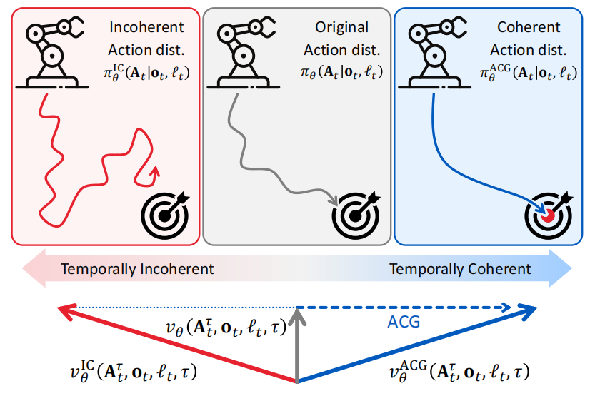

# ACG: Action Coherence Guidance for Flow-based VLA models

**Abstract**

问题：在 diffusion / flow-matching based 模仿学习中，其高度的生成能力使这些方法对人类演示中的<u>噪声敏感</u>：包括动作突变、停顿和抖动，这些都会降低**动作连贯性** $\Longrightarrow$ 在部署期间存在<u>不稳定</u>和<u>轨迹偏移</u>现象

解决：提出 Action Coherence Guidance (ACG) $\Longrightarrow$ 无需训练的测试时引导动作生成一致性的算法

评估：RoboCasa / DexMimicGen / 真机 SO-101 $\Longrightarrow$ 动作生成一致性 / 成功率提升

**I. INTRODUCTION**

定义：动作连贯性是指连续动作的流畅性和一致性，可通过变异性或突跳来衡量。

出现的原因：diffusion / flow-matching based 方法强大的生成能力往往能记住人类演示数据中存在的缺陷（包括 pause 停顿 jerks 抽搐 jitter 颤动）

后果：（1）在关键时刻不稳定；（2）细微噪声会随着部署时间累计导致机器人路径偏移期望状态

解决目标：参考 diffusion / flow-matching based 方法文献，旨在 training-free 前提下提升动作连贯性的引导

$\Longrightarrow$ 一个具有代表性的例子是**无分类器引导（Classifier-Free Guidance，CFG）**。该方法已在图像与视频生成领域得到广泛应用，同时也在 $\pi_{0.6}^{\ast}$ 中使用。CFG 的核心思想在于，通过引导采样结果远离无条件生成的方向，从而显著强化条件信号的影响力。

作者提出 ACG: 一种简单而有效的 test-time guidance 策略，可增强 flow-matching based 策略中行动一致性。

做法：（1）构建一个去噪向量，引导策略转向非连贯动作。ACG 通过将**自注意力层中的注意力图**替换为**恒等注意力图**来破坏时间通信。这种破坏打破了 tokens 间的协调性，<u>产生时间上不连贯的动作序列</u>。（2）ACG 引导采样方向与这个去噪向量相反，从而促进时间一致性。最终， ACG 生成具有显著增强连贯性的动作序列。

评估任务：pressing buttons / insertion / 真实世界 pick-and-place

**II. RELATED WORK**

*A. VLA Models with Flow Matching Policy*

*B. Guidance for Flow Matching Policy*

引导 guidance 是 diffusion / flow-matching based 生成模型中广泛采用的技术，用于提升样本质量。典型代表是无分类器引导（CFG），该技术通过引导生成远离无条件向量场，从而增强**文本一致性**。

受 CFG 启发，近期存在探索机器人控制中的引导策略的研究，通过移除目标条件 goal-condition 生成负面引导，从而在 goal-condition 模仿学习中提升性能。然而，在 VLA 模型中，用语言条件替代 CFG 常导致行为不稳定，因为动作分布可能因语言指令的细微差异而产生显著变化。

> 这个现象在 $\pi_{0.6}^{\ast}$ 中也提到了：$\beta$ 过大会把动作推到分布边缘，导致过于激进 / 不稳定。

在视觉生成领域，语言条件对模型的引导同样存在挑战。具体而言， CFG 往往过度依赖文本条件，导致生成的样本缺乏真实感且多样性不足。为解决这一问题，近期研究探索了扰动引导技术，该技术通过使用模型的**有意降质版本**（而非无条件模型）来引导预训练扩散模型提升生成质量。这种降质可通过<u>单元丢弃</u>或<u>扰动注意力图</u>来实现。

*C. Action Coherent Policy*

使用高斯核对动作序列进行平滑处理可生成更平滑的动作，但代价是会扭曲预训练动作分布。

对于一次可以生成 $k$ 个动作的 Action Chunk ，通过将有效任务时间范围缩短 $k$ 倍，动作分块技术可减少<u>累积误差</u>并<u>促进轨迹更平滑</u>。虽然 Action Chunk 技术能<u>增强跨时间步</u>的连贯性，但无法消除每个 Chunk 内部仍存在的不连贯性。每个 Chunk 内部仍可能**出现抖动或不稳定动作**，这常导致关键动作（如抓取或拾取物体）出现严重失误 $\Longrightarrow$ 通过降低生成 Action Chunk 内部的不连贯性来改进动作分块技术。

最近工作存在<u>提升动作连贯性的引导策略</u>的探索，这源于 flow-matching 策略中时间聚合带来的推理开销问题。这些方法通过引导生成过程，使其与前序动作块保持更高的一致性。然而，尽管确保每个<u>动作块内部</u>的连贯性对精细操作任务至关重要，但这一领域仍缺乏深入研究。

> “时间聚合” **在推理阶段，将整个时间区间 $[0,1]$ 上多个时间点的向量场输出进行累积（积分）**。每一个时间步都要一次完整的神经网络前向，网络输入包含 $x_k$ 和 $t_k$ ，最终输出是**所有时间步结果的累积**。因为时间 condition 的网络无法并行前向推理，也就是 $x_{k+1}$ 依赖于 $x_{k}$ 因此时间维度上不可并行且 GPU 利用率在小 batch / 长轨迹时非常低。

本研究首次实现了：将扰动引导引入机器人控制领域，同时明确解决了动作块内部的动作连贯性问题。

**III. PRELIMINARIES**

*A. Flow Matching Policy*

对于数据集 $D=\left\{(\ell_1,\mathbf{o}_1,\mathbf{a}_1),(\ell_2,\mathbf{o}_2,\mathbf{a}_2),\ldots,(\ell_T,\mathbf{o}_T,\mathbf{a}_T)\right\}$ 

训练目标是建模动作分布 $p(\mathbf{A}_t\mid\mathbf{o}_t,\ell_t)$ 其中 $\mathbf{A}_t$ 是动作块 $A_t =
[\mathbf{a}_t, \mathbf{a}_{t+1}, \cdots, \mathbf{a}_{t+k−1}]$

【训练过程】原始 / 干净的动作块 $\mathbf{A}_t$ 线性插值以时间为自变量的噪声 $\tau\in [0,1]$ 且 $\epsilon\sim\mathrm{N}(0,1)$

$\Longrightarrow$ $\mathbf{A}_{t}^{\tau}=\tau\mathbf{A}_{t}+(1-\tau)\epsilon$ 设置一个向量预测场 $v(\mathbf{A}_{t}^{\tau},o_t,l_t,\tau)$ 用于匹配条件去噪向量场 $u(\mathbf{A}_{t}\mid \mathbf{A}_{t})$

$u(\mathbf{A}_{t}\mid \mathbf{A}_{t})=\frac{d\mathbf{A}_{t}}{d\tau}=\mathbf{A}_{t}-\epsilon$ $\Longrightarrow$ 损失函数：$\mathcal{L}(\theta)=\mathbb{E}_{(\ell_t,\mathbf{o}_t,\mathbf{A}_t),\tau}\left[\left\|v_\theta(\mathbf{A}_t^\tau,\mathbf{o}_t,\ell_t,\tau)-(\mathbf{A}_t-\epsilon)\right\|^2\right]$

【推理过程】在推理过程中，flow-matching 策略通过从随机噪声开始，积分学习到的向量场生成动作块。

$\mathbf{A}_t^{\tau+\delta}=\mathbf{A}_t^\tau+\delta v_\theta(\mathbf{A}_t^\tau,\mathbf{o}_t,\ell_t,\tau)$ 其中 $\delta$ 表示积分步长，在论文中 $\delta=\frac{1}{16}$ 表示 16 个积分步长完成生成

*B. Classifier-Free Guidance for Flow Matching Policy*

与 $\pi_{0.6}^{\ast}$ 类似，这里也对理论上的 CFG 公式进行推导，最后得到：

$$
\pi^{\mathrm{CFG}(\lambda)}(\mathbf{A}_t|\mathbf{o}_t,\ell_t)\propto\pi_\theta(\mathbf{A}_t|\mathbf{o}_t,\ell_t)\left(\frac{\pi_\theta(\mathbf{A}_t|\mathbf{o}_t,\ell_t)}{\pi_\theta(\mathbf{A}_t|\mathbf{o}_t,\emptyset)}\right)^\lambda = \pi_\theta(\mathbf{A}_t|\mathbf{o}_t,\ell_t)^{\lambda+1}\cdot \pi_\theta(\mathbf{A}_t|\mathbf{o}_t,\emptyset)^{\lambda}
$$

 其中 $\empty$ 表示无条件情况下动作分布，对应 $\ell_{t}$ 有条件，也就是在 Goal-Condition Behavior Cloning 设定下，语言 $\ell_{t}$ 即条件 $\Longrightarrow$ VLA 看成是条件生成模型。

该公式表明，$\lambda > 0$ 情况下 CFG <u>放大了条件分布的贡献，同时使采样过程偏离无条件分布</u>。CFG 通过将去噪方向从无条件向量场推向条件向量场，从而增强了条件生成能力。

在 CFG 的实现上，还是围绕向量预测场 $v(\mathbf{A}_{t}^{\tau},o_t,l_t,\tau)$ 再此基础上增加内容：

$$
v_{\theta}^{\mathrm{CFG}(\lambda)}(\mathbf{A}_{t}^{\tau},\mathbf{o}_{t},\ell_{t},\tau) =(1+\lambda)v_\theta(\mathbf{A}_t^\tau,\mathbf{o}_t,\ell_t,\tau) -\lambda v_\theta(\mathbf{A}_t^\tau,\mathbf{o}_t,\emptyset,\tau)
$$

**IV. METHOD**

*A. Guiding Policy with Incoherent Action Generation*

作者的思路是：引导 policy 偏离**刻意构建的不连贯向量场**。这里就产生两个问题：（1）如何 “刻意构建” ？（2）怎么认为这个刻意构建的向量场是能产生不连贯动作呢？

$\Longrightarrow$ 模仿 CFG 的思路，CFG 是将 policy 从<u>无条件动作生成分布</u>中拉远，那么 ACG 模拟 CFG ，就是将 policy 从<u>能产生不连贯的动作生成分布</u>中拉远，结合公式推导，就是：

$$
\pi^{\mathrm{ACG}(\lambda)}(\mathbf{A}_t|\mathbf{o}_t,\ell_t)\propto\pi_\theta(\mathbf{A}_t|\mathbf{o}_t,\ell_t)\left(\frac{\pi_\theta(\mathbf{A}_t|\mathbf{o}_t,\ell_t)}{\pi_\theta^{\mathrm{IC}}(\mathbf{A}_t|\mathbf{o}_t,\ell_t)}\right)^\lambda
$$

 $\Longrightarrow$ $\pi_\theta^{\mathrm{IC}}(\mathbf{A}_t|\mathbf{o}_t,\ell_t)$ 表示去噪向量引起的非连贯动作分布

同样就可以套 CFG 的预测向量构建：

$$
v_{\theta}^{\mathrm{ACG}(\lambda)}(\mathbf{A}_{t}^{\tau},\mathbf{o}_{t},\ell_{t},\tau) =\left(1+\lambda\right)v_\theta(\mathbf{A}_t^\tau,\mathbf{o}_t,\ell_t,\tau) -\lambda v_\theta^{\mathrm{IC}}(\mathbf{A}_t^\tau,\mathbf{o}_t,\ell_t,\tau)
$$

动作块随后通过前向欧拉积分生成，其方式与 CFG 相同：

$$
\mathbf{A}_t^{\tau+\delta}=\mathbf{A}_t^\tau+\delta v_\theta^{\mathrm{ACG}(\lambda)}(\mathbf{A}_t^\tau,\mathbf{o}_t,\ell_t,\tau)
$$

> 这一部分只是描述了训练目标和推理计算的过程，基本上是从 CGF 套过来的。

*B. Constructing Incoherent Action Generation Vector*

Flow-matching 策略采用全基于 Transformer 的架构，通过自注意力机制确保生成的 tokens 之间保持连贯性，使 tokens 能够相互交流。在该策略中，每个 tokens 代表 timesteps 上特定时间步的某个动作。

$$
\operatorname{Attn}(Q,K,V)=\underbrace{\operatorname{softmax}\left(\frac{QK^\top}{\sqrt{d}}\right)}_{\text{Attention Map}}V
$$

接下来这句话很重要："... where the attention map controls temporal coherence, how strongly each action attends to others" 在每个 token 就是某个 timestep 下的 action, 那么用 attention map 来描述出一个 chunk 内部不同 token 之间的关联性，随后沿着 $V$ 来最终促进 chunk 内动作连贯性。

$\Longrightarrow$ 作者认为：在 attention 计算中只有 attention map 是能做到 tokens 之间的访问的，那么能让动作产生连贯性的数值调整也将基于 attention map ，那么把每个 attention 中的 attention map 替换成单位张量 $I$ 那么每个 tokens 只能访问自己了，通过这样设置来考察整个 flow-matching based model 的动作生成不连贯性程度。

$$
\mathrm{Attn}_{\mathrm{IC}}(Q,K,V)=\underbrace{\mathbf{I}}_{\text{Identity Attention Map}}V=V
$$

$\Longrightarrow$ 生成具有降低时间连贯性的动作片段，并作为连贯动作生成反向方向的有用参考

> 到这里才完成了上面两个问题的回答。
>
> 如何 “刻意构建” ？把每个 attention 中的 attention map 替换成单位张量 $I$ 
>
> 怎么认为这个刻意构建的向量场是能产生不连贯动作呢？作者认为：用 attention map （tokens 之间的访问程度）来描述出一个 chunk 内部不同 token 之间的关联性

**V. EXPERIMENTS**

*A. Experimental Setup*

仿真 benchmark: RoboCasa / DexMimicGen

真机任务：“Three Strawberries” 评分标准为放置的草莓数量：1颗（33.3%）、2颗（66.7%）或3颗（100%）。

“Tic-Tac-Toe” 操作性能均等分配于拾取（50%）与放置（50%）环节

所有实验均重复 3 次以报告标准差，其中仿真实验进行 24 次试验，真实世界实验进行 10 次试验（即总计 72 次和 30 次试验）。

base model: GR00T-N1, 仿真：每个任务 100 条，多任务 / 跨具身协同 SFT；真机：40-50 条

ACG 算法中将总层数为 8 的自注意力机制中**第 4 至 6 层**替换为非连贯层，采用 $\lambda=3.0$ 的引导比例。

---

baselines:

- *Vanilla GR00T-N1*: 直接从 flow-matching policy 中采样 policy 不做任何平滑机制
- *Ensemble*: 从策略中生成多个具有不同初始噪声的动作轨迹并进行平均。报告结果时采用 2 和 5 的集成规模。
- *Smoothing*: 采用高斯滤波器 $(\sigma =0.1)$ 对<u>最终动作预测</u>或<u>自注意力层前的中间动作特征</u>进行时间平滑处理。
- *Classifier-Free Guidance (CFG)*: 使用空文本对 vanilla 模型进行微调，从条件模型中获得无条件模型，并生成动作
- *White Noise Guidance (WNG)*: 作为构建非连贯去噪向量场的替代方案，在自注意力层前向中间动作特征注入白噪声 $(\sigma =1.0)$ ，从而破坏时间步长间的时间一致性。

*B. Benchmark Results*

$\Longrightarrow$ 动作平滑方法相较于原始基线仅带来有限提升，这表明动作平滑性对操作确实至关重要。但由于这些方法直接对模型特征或输出进行平滑处理，可能导致精细动作细节模糊，最终仅获得边际性改进。

$\Longrightarrow$ WNG 的性能仅次于 ACG ，排名第二。这说明使用原始去噪向量场的扰动变体来引导 flow-matching 模型，可能具有显著效果。但是存在平衡：细微扰动不会对连贯性造成影响，而过大的扰动会影响预训练结构。

> 这部分回答了作者在这章节开头提的问题：ACG 是如何影响动作连贯性提升的？这里对比了很多 baselines ，主要是通过不同 baselines 为什么效果不佳来反向印证 ACG 是更好的。

*C. Action Coherence Analysis*

定义若干指标：

1. Action Total Variation (ATV, $rad/s$) : 所有轨迹的所有动作施加中的平均变化。

   ATV 量化了 flow-matching 策略预测的动作序列的时间一致性。

   $$
   \mathrm{ATV}=\frac{1}{M(T-1)}\sum_{t=1}^{T-1}\sum_{j=1}^M|a_{t+1}^j-a_t^j|
   $$

2. JerkRMS ($rad/s^3$) : 电机关节角的三阶导数，表示角加速度的变化率

   JerkRMS 通过测量该 jerk 的均方根值来评估最终运动的平滑度。
   
   $$
   \mathrm{JerkRMS}=\sqrt{\frac{1}{T-3}\sum_{t=1}^{T-3}\|\ddot{\mathrm{s}}_t\|_2^2}
   $$

为确保公平比较，仅计算单个草莓朝向阶段（即前 64 个时间步）的指标，因为后续轨迹会根据任务成功或失败而分叉。

$\Longrightarrow$ *Ensemble* 方法显著提高了时间连贯性；然而由于平均化过程模糊了不同的动作路径，*Ensemble* 方法在草莓之间常常犹豫不决。

$\Longrightarrow$ 与 Vanilla GR00T-N1 相比， CFG <u>并未提升动作连贯性</u>。这些结果凸显了在操纵任务中，提升动作连贯性与强化目标条件之间的正交性。作者认为动作连贯性对操纵表现的重要性高于目标条件。

$\Longrightarrow$ 通过对这种不连贯的 flow-matching 变体进行外推， ACG 实现了最连贯的动作序列，同时保持与 *Ensemble* 方法相当的 ATV 分数。与 *Ensemble* 方法常产生不准确动作序列不同， ACG 生成的运动序列准确且时间一致，从而获得更高的成功率。

> 这一部分回答了作者在这章节开头提的问题：ACG 生成了连贯的动作吗？那么作者使用两个定量指标 ATV 和 JerkRMS 来评测 ACG 和其他方法对比，用数据来说明 ACG 确实生成了连贯动作；同时还在论文文案中描述其他方法的不足进一步证实。最后附上路径图也定行地描述了 ACG 确实生成了连贯动作。

*D. Ablation Study*

$\Longrightarrow$ Guidance Scale 超参数调整：

$\Longrightarrow$ 调整 attention map 的层数

$\Longrightarrow$ 与 Self-GAD 的对比

Self-GAD 是一种通过 test-time 引导提升 cross-chunk 连贯性的并行工作。策略预测 16 个动作但仅执行前 8 个。虽然后视范围提高了反应性，但其实际将决策范围扩大了一倍，这会放大累积误差并降低基准性能。

虽然 ACG 和Self-GAD都优于基线方法，但 ACG 的准确率更高。这说明，虽然<u>减少块间错误和增强块内一致性</u>都能提升性能，但后者对操作任务更为关键。此外，将 ACG 与 Self-GAD 结合使用效果最佳，表明提出的块内方法与块间方法相辅相成，可整合以获得额外增益。

> 这一部分主题是消融实验，测试 ACG 方法中的哪些超参数对性能的影响如何。各个实验指标也和原文印证了。另外就是 Self-GAD ，这个就是想测试 chunk 内 / 外的优化哪个更重要，感觉不算消融，但是很有价值

*c) Generalization to Flow-based Action Generation Models*

> 这一部分回答 ACG 算法是通用的还是专门给 GR001-N1 优化的，结果也是显然。

**VI. CONCLUSION**

ACG 在 training-free 下性能提升 $\Longrightarrow$ 计算成本的增加 $\Longrightarrow$ **生成引导向量需要对非连贯向量场进行第二次前向传播** $\Longrightarrow$ 通过<u>复用中间层特征</u>，这一成本可降低至 2 倍以下。

实现上，后续注意力层对非相干性的贡献最大 $\Longrightarrow$ 可以缓存早期层的输出结果。同时共享了前半部分的层结构，这将计算开销降低至约 1.5 倍。

但值得注意的是，对于深度网络而言，仅扰动后半部分层是否足够，仍是一个有待解决的开放性问题。