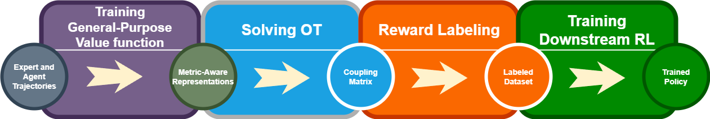
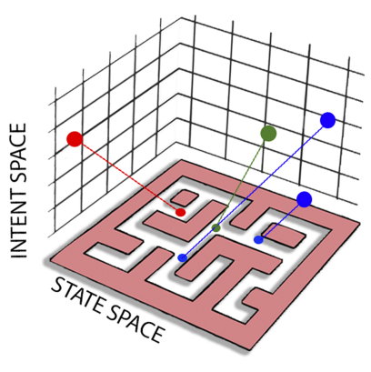
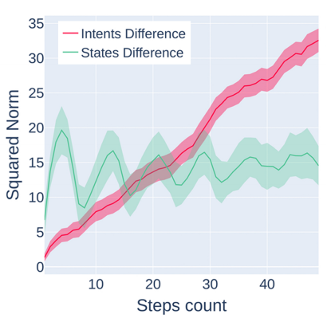
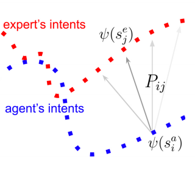
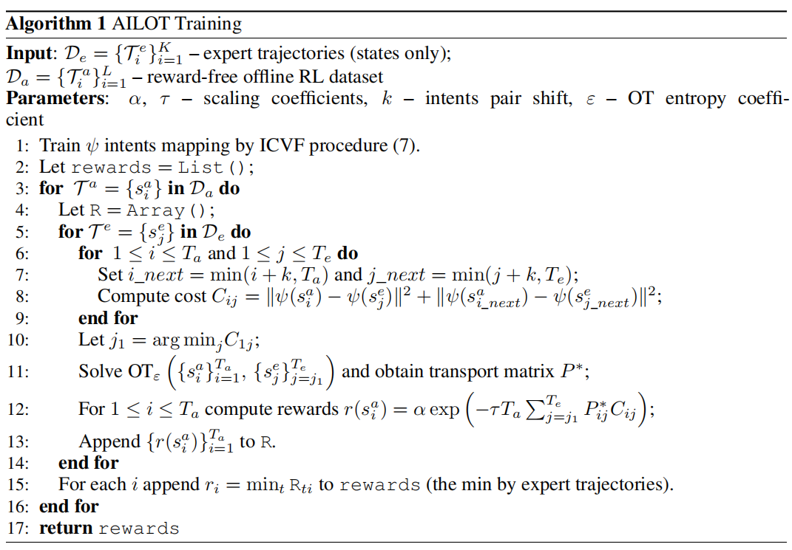
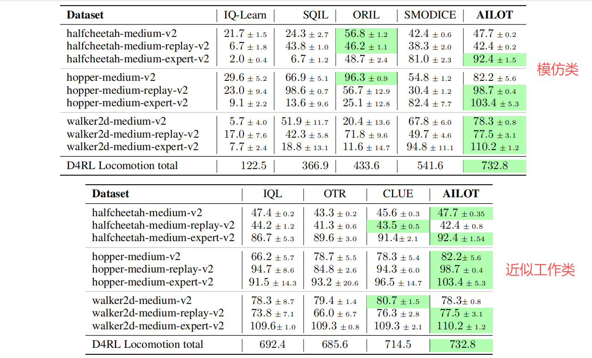
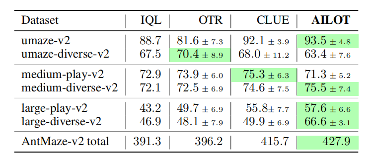
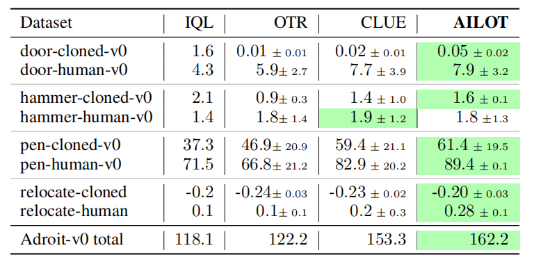
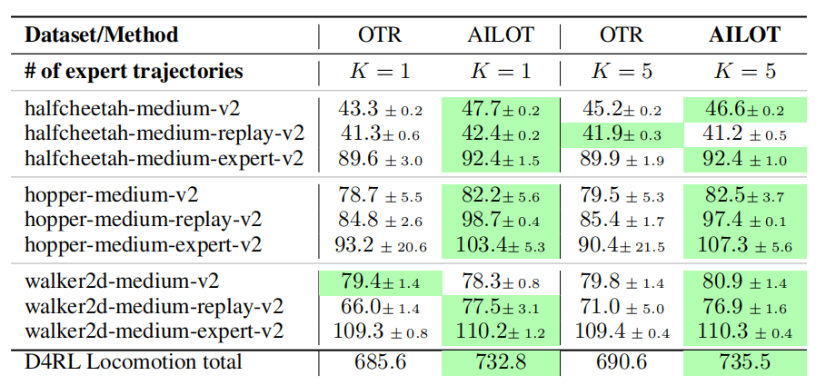
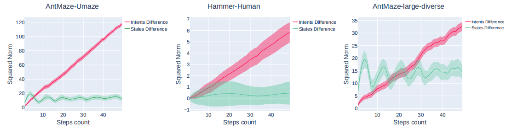

# Align Your Intents: Offline Imitation Learning Via Optimal Transport

**ABSTRACT**

Offline RL 仍存在一定的不实用性，因为在缺乏能明确知晓**奖励**的场景下难以在事后提炼**数据集内在本质**。

本文证明，即使缺乏明确的奖励或动作标签，模仿型智能体仍能仅通过观察 expert 行为来习得所需行为。

====> 提出 AILOT: Aligned Imitation Learning via Optimal Transport $\Longrightarrow$ 采用一种**特殊的状态表征**形式，即<u>意图表征</u>，该表征整合了数据中的空间距离信息 $\Longrightarrow$ 基于此类表征，通过 expert 轨迹与 agent 轨迹之间的最优传输 optimal transport 距离来定义内在 intrinsic 奖励函数。

====> 实验：D4RL $\Longrightarrow$ 效果 SOTA + 在稀疏奖励任务上能有效 relabel 轨迹，并结合其他 Offline RL 算法完成任务

**1 INTRODUCTION**

【**离线型学习范式 —— 离线强化学习 / 模仿学习：现状**】时间节点：2024 ~ 2025

大规模 sequential data $\Longrightarrow$ 可用于 Offline RL 学习 decision-making $\Longrightarrow$ 绝大部分都是 unlabeled $\Longrightarrow$ 使用 weak-labeled 数据存在以下问题：分布偏移 / 标签缺失时收敛缓慢 / 缺乏（更细致的）已知奖励或 task-specific 目标

模仿学习：

$\Longrightarrow$ BC: 易在状态中累积来自专家分布之外的不同分布的错误

$\Longrightarrow$ IRL + action pseudo-labeling: 引入的额外开销，在实际应用中很少被采用

$\Longrightarrow$ **DI**stribution **C**orrection **E**stimation (DICE) —— 尝试匹配模仿者与 expert policy 之间的**状态占用度** occupancy 指标：要求 agent 与 expert 的支持集之间存在<u>非零重叠</u> + 使用 KL 散度忽略了<u>底层的空间几何结构</u>

$\Longrightarrow$ *Computational Optimal Transport*: 最优传输理论旨在通过建立少量高质量 expert 示范与学习 agent 轨迹之间的最优耦合，减少人工奖励工程的必要性 ====> 前期工作例如 OTR 只在低维度实现，高维度没有被实现

---

**2 RELATED WORKS**

【**研究目标**】

**通过在共享的感知潜在空间中的距离指标，强制 expert 与 agent 之间对 “想象目标” 的富信息表征进行最优对齐，从而从 expert 处提取指导信息。**

作者提出将<u>初始状态空间</u>映射至<u>意图空间</u>，其中存在**一个高层次的语义想象目标**，agent 需通过 reach 该目标来模仿 expert ，进而通过最优传输将 agent 意图与 expert 意图对齐。

- 一种新型的内在密集奖励重标注算法，该算法能够 “理解” 环境中展示的动力学特征，**任何**离线强化学习方法均可在此基础上应用。
- 在大多数 Offline RL 基准测试中，使用提出的奖励标注算法训练得到的模型表现优于 SOTA 模型。即使在不知道<u>专家动作标签和真实奖励</u>的情况下，仍能取得这一成果。
- 与既往研究进行了广泛比较。研究表明，即使智能体的数据是随机策略的混合，方法仍能实现定制化模仿。

【**创新点和优势**】

与前人 OTR 工作比较：通过寻找一个具有代表性的距离保持等距映射到共享的潜在空间，并在该度量感知空间中通过最优传输强制对齐来扩展 OTR 工作 $\Longrightarrow$ 在 OTR 中进行最优运输匹配时，对成本函数（如余弦值或欧氏距离，且在 OTR 在实验部分用的是余弦值）极为敏感，最终结果可能产生显著差异 $\Longrightarrow$ 选择合适的距离函数需要对环境有深入理解并进行广泛搜索，这限制了 OTR 仅适用于简单 state-based 任务。

与前人 CLUE 工作比较：提出了一种并行推导内在奖励的创新方案。该研究采用 CVAE 模型，通过训练 expert 与 agent 的转换数据，计算 expert embedding 向量与 agent trajectory 之间的欧氏距离。 $\Longrightarrow$ **在多模态 expert 数据集中，专家嵌入向量可能无法压缩为单一维度，需通过聚类处理不同技能特征。** $\Longrightarrow$ 本方案无需依赖状态-动作配对标注数据，从而省去了动作标注环节。

本方法的优势在于其能够在空间维度实现分布对齐，这种能力能够捕捉数据集中的**时序结构依赖关系**，而这是先前研究完全忽略的 $\Longrightarrow$ 许多方法聚焦于 KL 散度（对距离度量不敏感），这种时序结构会促使时间相近的状态在空间上产生邻近性。

该方法能与 Offline RL 算法无缝集成，为选择最合适的训练方案提供了灵活性。

---

**3 PRELIMINARIES**

**3.1 PROBLEM FORMULATION: Offline RL 问题定义**

在 Offline RL 标准问题定义下，假定可访问 agent **无奖励标注数据集** $\mathcal{D}_a=\{(s_i,a_i,s_i^{\prime})\}_{i=1}^n$ 和 expert 的**无动作状态转移** $\mathcal{D}_{e}=\{(s_{i},s_{i}^{\prime})\}_{i=1}^{m}$ 。对 expert 数据集的定义是：能够获得高额累计回报。

任务目标是制定一项能高度模仿 expert 行为的 policy ，从而实现累积回报的最大化。

**3.2 REWARD RELABELLING THROUGH OPTIMAL TRANSPORT: 基于最优传输的奖励重标注**

定义完问题后，与 OTR 同样地使用 Wasserstein 距离衡量 agent-expert 轨迹的差异：

$$
W(\tau^a,\tau^e)=\min_{P\in\mathbb{R}^{T\times T}}\sum_{i=1}^T\sum_{j=1}^Tc(s_i^a,s_j^e)P_{ij}
$$

这里轨迹的定义是**纯状态的序列**，而不是 classic RL 中的 episode 中混合状态和动作的数据容器。

agent 轨迹：$\tau^a=\{s_1^a,s_2^a,\cdots,s_T^a\}\subset\mathcal{D}_a$ // expert 轨迹：$\tau^e=\{s_1^e,s_2^e,\cdots,s_T^e\}\subset\mathcal{D}_e$

公式中的 $P_{ij}$ 是联合概率分布，分别沿着 expert / agent 状态积分可以得到 expert / agent **各自的**概率分布：

$$
\begin{aligned}
\sum_{i=1}^TP_{ij}=p^e(s_j);\quad\sum_{j=1}^TP_{ij}=p^a(s_i).
\end{aligned}
$$

$\Longrightarrow$ 这里其实跟 OTR 文章中表达的一致：就是所有 $x$ 点的位置的内容，都必须搬到 $y$ 点上，不能凭空产生新的 $y$ 位置 $\Longrightarrow$ 分别沿着不同维度进行积分可以得到各自的单独分布。

与 OTR 一样，当 $P_{ij} = P^{\ast}_{ij}$ 的时候，那么已经具有在 cost 函数上最优传输的能力了，使用 $P^{\ast}_{ij}$ 计算奖励函数：

$$
r_i=-\sum_{j=1}^Tc(s_i^a,s_j^e)P_{ij}^*(\tau_a,\tau_e)
$$

> 目前来看和 OTR 没有很大的区别，因此行文此处作者强调了：本研究创新性地采用**等距映射方式**提取 expert 意图，而非通过数据集计算<u>初始状态</u>间的最优传输路径。该方法能<u>基于状态间的时间距离</u>更精准地模拟相似状态的分布特征。
>
> 注：论文中提到的 “初始状态” 指的都是原始数据集的状态。

**3.3 PRETRAINING OF DISTANCE PRESERVING REPRESENTATION: 距离保持特性的表征方法训练**

前人 *successor features* (SFs) 和 Forward-Backward (FB) 表征学习工作中，存在关键一步就是**学习一个<u>通用的</u>、<u>无损的</u>状态映射** $\psi:\mathcal{S}\to\mathbb{R}^d$ $\Longrightarrow$ 作者同样学习后继特征，同时对时间结构施加额外约束

寻找最优时间目标条件价值函数 $V^{\ast}$ ，该函数描述为了达到特定目标 $g$ 从状态 $s$ 到 $s^{+}$ 所需的<u>最小步数</u> $\Longrightarrow$ 可视为目标条件强化学习 Goal-Condition RL ，其目标为最大化 $r(s,g)=-\mathbb{1}(s\neq g)$ 奖励函数下的 policy 的累计奖励 $\Longrightarrow$ 用 RL 优化这个目标即可得到价值函数 $V^{\ast}$ 

ICVF 工作将意图 $z$ 替换掉目标 $g$ 从而将先前对最优目标条件价值函数的定义进行推广 —— 价值函数就被改述成：为了达到特定意图 $z$ 从状态 $s$ 到 $s^{+}$ 所需的<u>最小步数</u> 

$$
V^*(s,s_+,z)=\mathbb{E}_{s_{t+1}\sim P_z(\cdot|s_t)}\left[\sum_{t\geq0}-\mathbb{1}(s_t\neq s_+)|s_0=s\right]
$$

其中意图 $z$ 通过转移函数 $P_z$ 完全确定了**状态占据 occupancy 动力学特性**。

> 这句话的意思是从 $s_{t}$ 走到 $s_{t+1}$ ，或者说 $s_{t}$ / $s_{t+1}$ 之间的关联性在于转移函数 $P_z$ 而 $P_z$ 是由意图 $z$ 确定的。

在实践中，$V^*(s,s_+,z)$ 需要用三个网络来确定 $\phi:\mathcal{S}\to\mathbb{R}^d$ $\psi:\mathcal{S}\to\mathbb{R}^d$ 和 $T:\mathbb{R}^d\to\mathbb{R}^{d\times d}$ 这里 $T=T(z)$ 也就是用网络来拟合意图 $z$ 确定的转移函数 $P_z$ ，即输入 $z$ 向量输出一个 $d\times d$ 的矩阵。

$$
V(s,s_+,z)=\underbrace{\phi(s)^T}_{\mathbb{R}^{d}}\underbrace{T(z)}_{\mathbb{R}^{d\times d}}\underbrace{\psi(s_+)}_{\mathbb{R}^{d}}
$$

网络构建完毕后，接下来就是讨论训练问题，本质是价值函数，因此具有时序差分的损失特性，基于此来构建：

$$
\mathcal{L}_\tau^2\Big(\underbrace{-\mathbb{1}(s\neq s_+)+\gamma\bar{V}(s^{\prime},s_+,z)-V(s,s_+,z)}_{\text{这么一大团在下面看成 }x\text{ 和 }A}\Big)
$$

其中 $\mathcal{L}_{\tau}^{2}(x)=|\tau-\underbrace{\mathbb{1}}_{\text{Indicator 指示函数}}(A<0)|x^{2}$ 是 expectile loss ；且 $A=r_{z}(s)+\gamma\bar{V}(s^{\prime},s_{+},z)-\bar{V}(s,s_{+},z)$ 表示基于意图 $z$ 确定的状态的优势；$\bar{V}$ 就是目标网络。

这种表示方法在给定意图 $z$ 所有可能选择的引导条件下，估计状态 $s$ 到 $s^{+}$ 之间的平均路径长度。预训练过程使得下游能够提取已学习的、对其他任务有用的表征 $\phi,\psi$ 。

> 
>
> 图示展示的就是把初始状态空间（无损失地）映射到浅层意图空间上，后续操作都基于浅层意图操作。

在实践中，将状态 $s$ 的意图 $z$ 定义成 $z(s)=\psi(s)$。而奖励函数则是 $r_{z}(s)=-\mathbb{1}(s\neq s_{z})$ 设计。$s_z$ 表示在同样 trajectory 下随机采样的状态。那么在这样的设置下，意图 $z$ 被隐式地表达了，显式的只有 $s$ 和 $s_{+}$：

$$
V(s,s_+,z)=\underbrace{\phi(s)^T}_{\mathbb{R}^{d}}\underbrace{T(z)}_{\mathbb{R}^{d\times d}}\underbrace{\psi(s_+)}_{\mathbb{R}^{d}}=\underbrace{\phi(s)^T}_{\mathbb{R}^{d}}\underbrace{T(\psi(s))}_{\mathbb{R}^{d\times d}}\underbrace{\psi(s_+)}_{\mathbb{R}^{d}}=V(s,s_{+})
$$

作者认为：训练好的 $\psi$ 映射本身可作为环境状态间时间距离的可靠估计，因此在接下来的实验中直接使用：

$$
d(s_{t+k},s_{t})=\|\psi(s_{t+k})-\psi(s_{t})\|^{2}:=f(k)
$$

大致上是状态 $s_{t+k}$ / $s_t$ 之间 $k$ 步数的**线性函数**，该映射将<u>初始状态空间中时间相似的状态</u>映射到<u>意图空间中空间最近的状态</u>。

> 
>
> 作者在这里展示了使用 初始状态空间 和 表征意图空间 计算平方范数与步数 $k$ 之间的关系图。可以发现：随着步数 $k$ 的增大，使用表征意图空间计算的平方范数与步数 $k$ 近似成线性关系；而使用初始状态空间则成很强烈的非线性关系。这说明作者设计的状态映射可以很好地捕获时序关系。

因此，在该空间中应用最优传输工具可使其对环境初始状态空间中的噪声或不准确性具有鲁棒性。从预训练的通用价值函数中提取意图，能够从轨迹中捕捉实际行为。

**4 METHOD**

对于两条轨迹 $\{s_i^a\}_{i=1}^{T_a}$ 和 $\{s_j^e\}_{j=1}^{T_e}$ 最优转移矩阵通过求解熵正则化 OT 问题获得：

$$
P^*=\underset{P\in\Pi[T_a,T_e]}{\arg\min}\left\{\sum_{ij}P_{ij}C_{ij}+\varepsilon\sum_{ij}P_{ij}\log P_{ij}\right\}
$$

其中 $C_{ij}=c(s_{i}^{a},s_{\min(i+k,T_{a})}^{a},s_{j}^{e},s_{\min(j+k,T_{e})}^{e})$ 是**某个 cost 函数**且 $k>0$ ；

另外 $P$ 遵循边缘分布且 $\forall i,j{:}\sum_{j=1}^{T_{e}}P_{ij}=1/T_{a},\quad\sum_{i=1}^{T_{a}}P_{ij}=1/T_{e}$ 假设两条轨迹上的分布是均匀的

在找到最优 $P^{\ast}$ 矩阵后，定义如下奖励函数：

$$
r(s_i^a)=\alpha\exp\left(-\tau T_a\sum_{j=j_1}^{T_e}P_{ij}^*C_{ij}\right)
$$

其中：$j_1=\arg\min_{j}C_{1j}=\arg\min_{j}c(s_{1}^{a},s_{\min(1+k,T_{a})}^{a},s_{j}^{e},s_{\min(j+k,T_{e})}^{e})$ 

带有标量超参数 $\alpha$ 和 $\tau$ 的指数函数作为额外的缩放因子，用于降低总成本较高的状态的影响。负号确保在最大化奖励总和的过程中，实际上是在最小化最优传输 OT 距离。

对 agent 的每条轨迹与 expert 演示（可能包含一条或多条轨迹）之间的最优 $P^{\ast}$ 矩阵进行估计。为增强一致性，选择性地关注专家轨迹 $j_1, \cdots, T_e$ 部分，重点关注根据成本矩阵 $C$ 与 agent **起始位置最近的初始状态**。

> 因为作者在后面提到这个成本函数是基于无损状态表征 $\psi$ 计算的，因此使用 $j_1$ 可以获得时序性一致且内容相似性最小的状态，并以此做初始状态。

当 expert 提供多条轨迹时，从不同轨迹中选取最大奖励。

---

到目前位置，作者分别描述了 $\psi$ 建模和 OT 最优建模，彼此之间还没产生联系，而这个联系由 cost 函数建立：

$$
C_{ij}=\|\psi(s_i^a)-\psi(s_j^e)\|^2+\|\psi(s_{\min(i+k,T_a)}^a)-\psi(s_{\min(j+k,T_e)}^e)\|^2
$$

Cost 函数中的第二项对于轨迹的有序比较是必要的。在模仿学习中，始终比较 expert 与 agent 状态对的分布。这是因为不仅希望处于相同状态，还希望以与专家相似的**时序方式**行动。

行为提取的动机源于以下观察：状态空间中的**时间步长差异**会产生错误值，无法捕捉数据集状态之间的时序依赖关系，因此环境几何结构未能被正确表征，导致最优传输在高维问题中难以扩展。

**5 EXPERIMENTS**

**5.1 IMPLEMENTATION DETAILS**

算法：AILOT + IQL 同时还用 Diffusion-QL 做对比

实现：JAX 体系中的 Equinox library 实现，OTT-JAX library 实现了求解 $P^{\ast}$ 的 Sinkhorn algorithm

**5.2 RUNTIME**

单卡 3090 完成 relabel 只需 10min, 结合 Offline RL 算法只需 25min.

寻找最优矩阵 $P^{\ast}$ 及对应内部奖励需要<u>数百次 Sinkhorn 求解器迭代</u>，该求解器运行速度较快。由于最优传输是<u>在固定的意图潜在空间</u>中计算的，因此无论任务状态维度如何变化，计算开销在广泛任务范围内保持恒定。

**5.3 BASELINES**

**IQL** / **OTR** / **CLUE** / **IQ-Learn** / **Diffusion-QL** / **SQIL** / **ORIL** / **SMODICE**

**5.4 RESULTS & EXPERIMENTS**

**Offline Imitation Learning.** 在离线设置下比较了 AILOT 在 IL 任务上的表现。D4RL MuJoco 运动数据集被用作离线数据的主要来源，**其中原始奖励信号和动作标签被丢弃**，而为每个任务选择的 expert 轨迹则是<u>实现最大回报的最高 episodes</u> 。

**5.5 ABLATION STUDY**

**Varying the number of expert trajectories.** 随着 expert 演示轨迹的增加，使用 AILOT + Offline RL 算法训出来的效果如何？

- OTR / AILOT 两种算法的性能随着 expert 演示轨迹的增加只有轻微 slightly 提升。
- AILOT 的标准化得分仍优于 OTR ，这证明在几何感知空间中对意图进行对齐，相较于 OTR 采用的原始状态间成对距离的类似奖励机制，能更有效地提升内在奖励标注的准确性。

**Intents distance dependence on the steps count.** 通过学习具有时间保持特性的价值函数（即相似时序状态被映射到意图空间中的时间闭合点），底层空间变得更加结构化。由于最优传输考虑了空间的几何特性，寻找对齐的任务变得更为简单。

- 近线性依赖关系的实证证据
- 原始状态间的成对距离 $\hat{\mathbb{E}}_{t}\|s_{t+k}-s_{t}\|^{2}$ ，即先前 OT 方法采用的度量，不具备此类特性，直接将其作为代价函数使用并不理想，因为这会忽略**全局时间几何特征**。

**6 DISCUSSION**

- AILOT 包括对<u>大量未标记轨迹的充分访问假设</u>，这些轨迹需具备<u>可接受的质量</u>。作者聚焦于 expert 行为，这类行为通常见于离线强化学习文献：采用流行合成环境，其中包含若干可理解的 expert 动作，因而形成若干足够直观的意图，这些意图可从提供的数据集中提取。
- 由于意图的多模态性，专家可能具有<u>多个目标或执行模糊动作</u>，这会导致模仿效率下降，因为专家的意图可能不再对智能体透明。
- 开展跨领域模仿研究。根据本研究观察到的结果， AILOT 应能推广到处理 expert 与 agent 之间的转换问题，即使存在与不同领域相关的较大不匹配。

---

【问题（1）如何理解对距离不敏感的 KL 散度会促使时间相近的状态在空间上产生邻近性？】

从数学上看，KL 散度定义为 $\mathrm{KL}(p\parallel q)=\int p(s)\log\frac{p(s)}{q(s)}\mathrm{d}s$ 它只依赖于 **同一点** $s$ 上的概率比值，而**完全没有任何项涉及 $s$ 与 $s^{\prime}$ 之间的时间距离**。换句话说，如果把概率质量从一个状态 $s_1$ 时间延迟到到一个在时序上非常遥远的状态 $s_2$ ，只要最终在每个位置上的概率值匹配，KL 是 “看不见” 这种移动成本的。真实环境中的状态演化通常满足某种 “路径长度” 或 “步数距离” 的结构，而 KL 完全无法表达“从 $s_t$ 走到 $s_{t+k}$ 至少需要 $k$ 步”这样的几何约束。

【问题（2）如何理解**等距映射方式**？】

论文先通过 ICVF 预训练得到一个表示 $\psi(s)$，使其满足近似关系

$$
\bigl\|\psi(s_{t+k}) - \psi(s_t)\bigr\|^2 \;\propto\; c\cdot k, c>0
$$

也就是说，**意图表示空间中的欧式距离 / 平方范数 近似刻画了时间上的最短路径长度**。在 intent space 中，同一条轨迹上相隔 $k$ 步的状态，其 embedding 距离范数几乎线性随 $k$ 增长，而原始状态空间中这一性质完全不成立。因此， $\psi(s)$ 并非保持 “空间几何形状” ，而是保持**轨迹的 “内在时间几何形状”**。

【问题（3）为什么 $\psi$ 函数可以作为等时间距离映射？】

$\psi(s)$ 的欧几里得距离单调、近似线性地刻画了状态之间的最短时间可达距离。$\psi(s)$ 是在 “最短路径步数” 这个监督信号下学出来的，其实就是作者设计的奖励函数 $r_{z}(s)=-\mathbb{1}(s\neq s_{z})$ 下引导的，同时考虑作者提出的优化目标：

$$
V^*(s,s^+,z)=\mathbb{E}\left[\sum_{t\geq0}-\mathbf{1}(s_t\neq s^+)\mid s_0=s\right]
$$

它意味着每走一步，都会累积一个 $-1$ ，到达目标状态 $s^+$ 后，损失停止。也就是说，**这是一个对“时间距离”的直接刻画**。