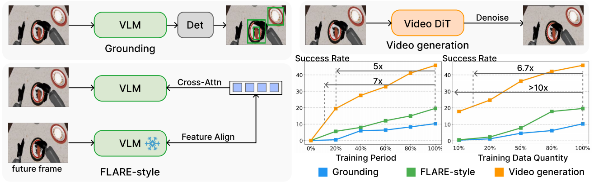
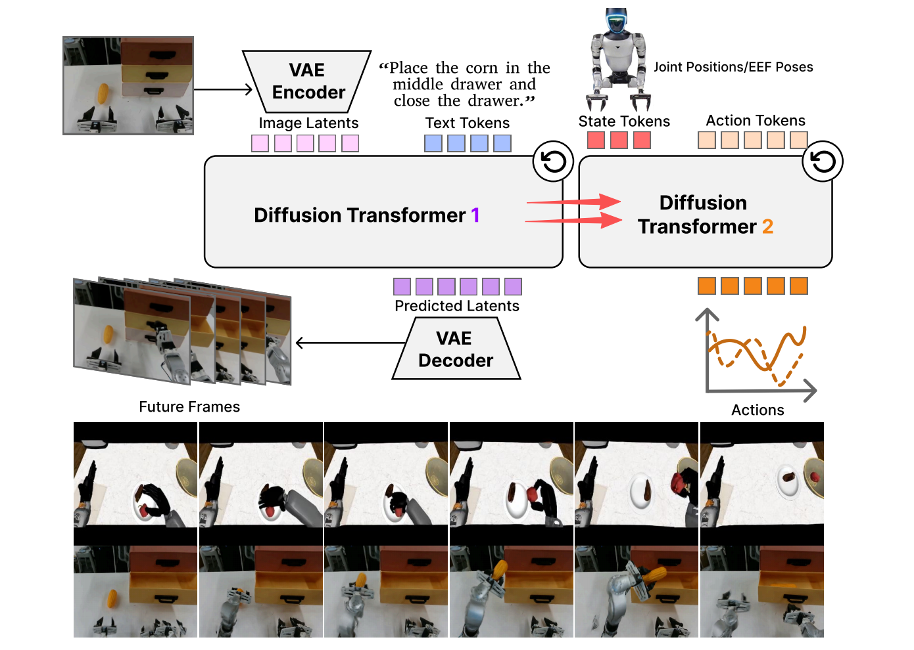
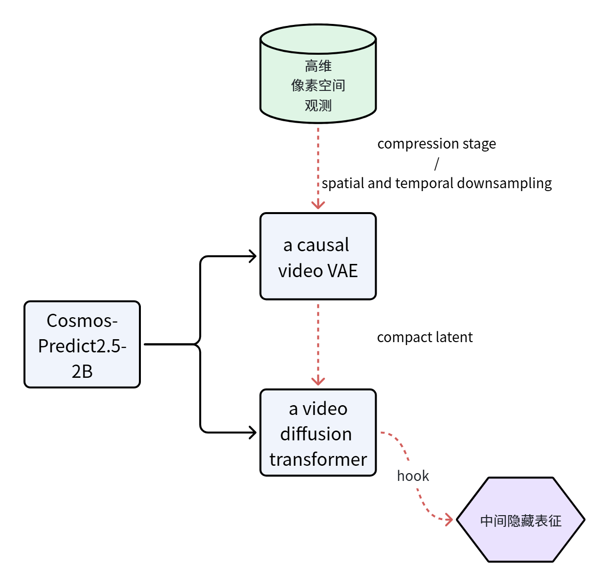
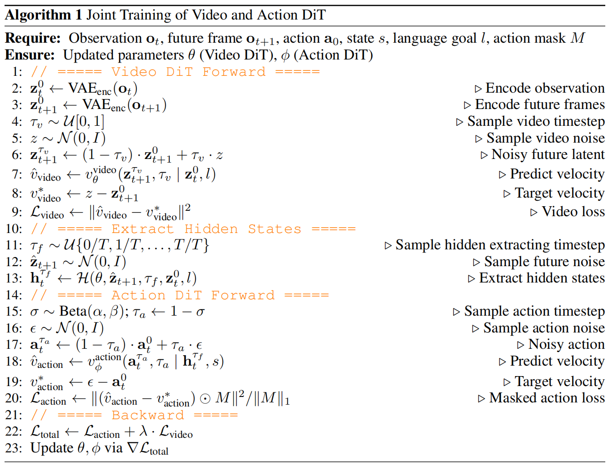
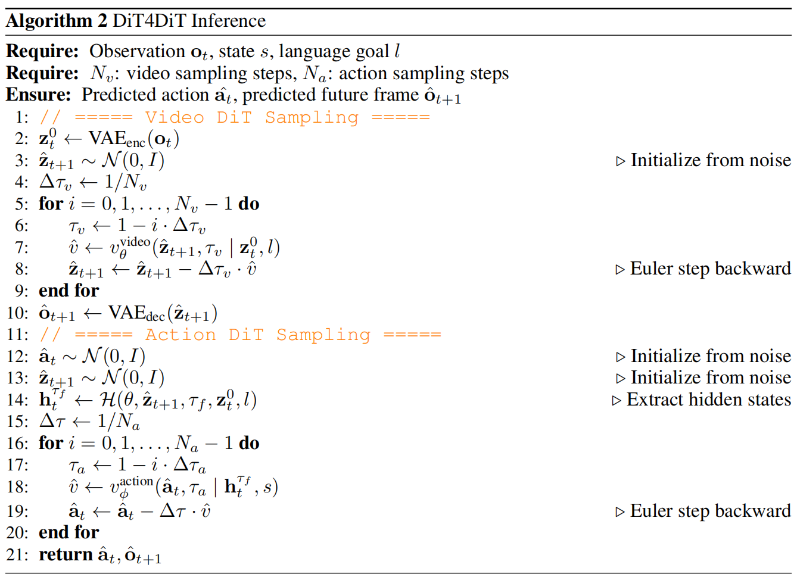
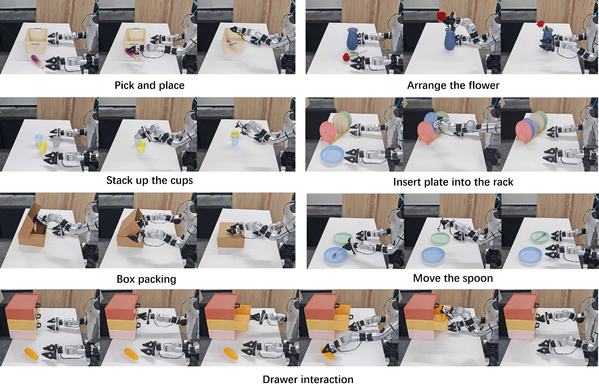
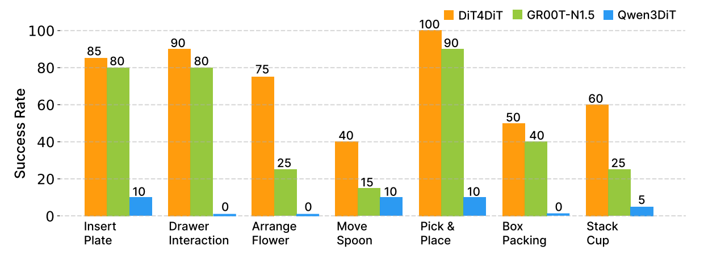
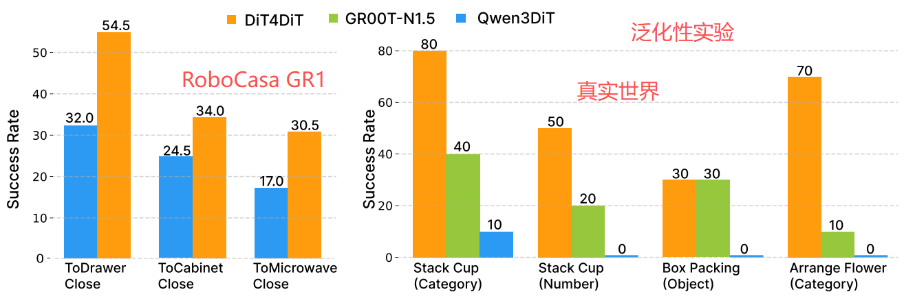

# Dit4Dit: Jointly Modeling Video Dynamics And Actions For Generalizable Robot Control

**背景**

现有 VLAs 其表征仍主要源自 VLMs 静态 "图像-文本" 预训练 $\longrightarrow$ 更重要的时空结构和物理动力学则从<u>相对有限的动作数据</u>中学习

随着高保真 Diffusion Transformer 的问世 $\longrightarrow$ 生成式视频模型能够合成<u>时间连贯</u>且<u>物理上合理</u>的未来视频帧 $\longrightarrow$ 具有编码丰富的时空结构和隐式物理规律能力 $\longrightarrow$ 尝试：让生成式视频模型作为机器人操作任务基础模型的 backbone

现有的生成时视频模型已探究**将视觉动力学特性与动作控制信号共同投射至共享的潜在空间** $\longrightarrow$ 利用视频模型**合成**额外训练数据 (forward simulation) / 通过提取潜在表征来训练用于动作预测的**逆动力学模型** (inverse dynamics) $\longrightarrow$ 现有做法：多阶段 / 非端到端 / 间接控制动作生成

> [*Cosmos Policy*] 通过微调预训练视频扩散模型，可进一步简化适应过程：该模型直接输出机器人动作及未来状态预测，并将其编码为原生视频扩散流程中的连续潜在帧。
>
> [*mimic-video*] 将预训练视频骨干网络与独立的 flow-matching 动作解码器相结合，并基于 <u>intermediate flow time 中间流时间点</u>的部分去噪视频潜在变量对策略进行条件化处理。

---

---

**问题**

生成式视频模型在 robotics manipulation 任务上的潜能有多大？是否可以作为 robot control 的稳定先验 backbone？视频生成任务本身能否作为鲁棒的 action policy 的有效训练代理目标？如何提取视频模型所学习到的时空表征并与动作生成相结合?

---

---

**解决 & 实现**

> **（0）设计实验验证 "对机器人控制任务而言，视频生成任务是否是一种有效的代理性任务" 假设。**

[*baselines*]

1. object-level grounding 方法，通过检测头 (detection head) 为预训练 VLM 增加一项辅助任务，使 VLM 能够理解 VLA 中物体的 "位置" 和 "属性"。

2. implicit world modeling 隐式世界模型建模方法，FLARE 通过 <u>learnable queries 可学习查询</u>张量对 VLM 的特征进行注意力建模，并将这些可学习查询与未来观测的潜在嵌入进行对齐。在实际操作中放弃在 FLARE 中进行的可学习查询的 diffusion 过程，以实现<u>类 FLARE 预训练</u>过程。

   > FLARE 的核心可以概括为一个围绕 "未来表征预测" 的联合学习框架。
   >
   > (1) 它依赖预训练 VLM 将<u>当前观测</u>和<u>未来观测</u>分别编码为**紧凑的语义嵌入**，从而将原始高维像素空间映射到一个更具任务相关性的 latent 表征空间。在此基础上，FLARE 在扩散式动作生成模型（如 Diffusion Transformer）内部引入一组可学习的 "future tokens"，使模型在执行动作 denoising 过程的同时，显式地预测未来时刻的观测嵌入。通过这种设计，模型不再只是被动地拟合当前状态到动作的映射，而是被驱动去 "隐式地想象" 未来可能达到的状态。
   >
   > (2) 为了让这种未来预测具有明确的优化目标，FLARE 引入了一个 latent alignment 机制：将模型内部预测得到的未来表示，与真实未来观测经过 VLM 编码后的 embedding 进行**对齐**，通常通过 cosine similarity 来度量两者的一致性。这一步本质上是在 latent 空间中施加监督信号，使模型逐渐学会从当前状态和候选动作中提取出对未来结果具有判别性的表征，从而具备一定的 "世界建模" 能力，但这种建模是<u>隐式的、压缩的</u>，而<u>非像素级的</u>重建。
   >
   > (3) FLARE 将上述未来表征对齐目标与标准的动作学习目标（如 flow matching / diffusion-based action regression）进行联合训练，形成一个多目标优化框架。在这个框架中，一方面模型通过生成动作来拟合专家演示数据，另一方面又通过预测未来 latent 来提升对长期后果的建模能力。两者共享同一套网络参数并在训练过程中相互作用，从而在不显著增加模型复杂度的前提下，使策略具备一定的前瞻性和泛化能力。

3. 同时使用 `Qwen3-2B` 和 `Cosmos-Predict2.5-2B` 进行公平性对比，消除**模型参数**对预训练性能的影响。

4. VLM 和 Video backbone 网络采用自监督方式在目标数据集上进行训练，但标注任务使用预标注边界框，并在 action expert 模型的微调过程中保持冻结状态。

[*benchmark*]

​		RoboCasa 仿真器 24 项 GR1 人形机器人桌面操作任务

[*Results*]

- 视频生成代理任务使模型能够更快地收敛至高性能策略，最高可达 7 倍速率

  在训练过程早期捕获关键操作线索（在训练早期成功率上涨特别高）

- 具有稳定扩展性：相较于 semantic-centric 的方法，其数据效率显著更高，最高可达 10 倍

  随着数据量的增加，性能提升效果保持稳定

[*conclusion*]

​		实验证实了<u>视频生成任务</u>不仅是一项高效的训练任务，同时也是<u>可推广到机器人控制领域的可行扩展代理任务</u>。

---

> **（1）Dit4Dit: 一款端到端的 "视频-动作" 模型，这款模型使用了统一的 cascaded 级联框架耦合了视频 Diffusion Transformer 和动作 Diffusion Transformer.**
>
> **（2）DiT4DiT 并未依赖重建的未来帧，而是从视频生成过程中提取中间去噪特征，并将其作为动作预测的时间条件。**

[*problem state*]

​		$\mathbf{o}_{t+1}\sim p_v(\cdot\mid\mathbf{o}_t,l),\quad\mathbf{o}_t\in\mathbb{R}^{T_{cond}\times3\times H\times W}$ 其中 $p_v$ 是视频生成的概率分布，$T_{cond}$ 表示用于 condition 的帧长度

​		$\mathbf{a}_t\sim p_a(\cdot\mid\mathbf{o}_t,\mathcal{H}(\mathbf{o}_{t+1}^{\tau_v})),\mathrm{where~}\mathbf{o}_{t+1}^{\tau_v}\xrightarrow{\tau_v\to0}\mathbf{o}_{t+1}, \mathbf{o}_{t+1}\in\mathbb{R}^{T_v\times3\times H\times W}$ 其中 $p_a$ 是动作生成的概率分布；$\mathbf{o}_{t+1}^{\tau_v}$ flow 步骤中未来帧的**中间状态**；$\mathcal{H}$ 指从**生成过程中提取隐藏状态的过程**，$T_{v}$ 表示用于生成未来帧长度

​		总的建模：$\mathbf{o}_{t+1},\mathbf{a}_t\sim p_{va}(\cdot\mid\mathbf{o}_t,l)$

[*Video DiT*]

> 

$$
\mathbf{h}_t^{\tau_f}=\underbrace{\mathcal{H}\left[v_\theta^{\mathrm{video}}\right]}_{\text{前向计算中抽取中间隐藏层状态}}\left(\mathbf{z}_{t+1}^{\tau_f},\tau_f\mid\mathbf{z}_t^0,l\right),\quad\mathrm{where~}\mathbf{z}_{t+1}^{\tau_f}\underbrace{\xrightarrow{\tau_f\to0}}_{朝向清晰未来帧的概率流动}\mathbf{z}_{t+1}^0
$$

[*Action DiT*]

该组件作为独立的 flow-matching 模型运行，由多个 transformer blocks 堆叠构成，每个模块均采用 AdaLN 技术注入 flow timesteps 信息，并通过交叉注意力层关注视频骨干网络提取的视觉特征 $\mathbf{h}_t^{\tau_f}$ 。

输入序列由<u>本体感觉状态嵌入向量</u>、<u>编码噪声动作轨迹</u>以及<u>一组可学习的 "未来 tokens"</u> 组成，其中未来 tokens 作为运动规划任务的压缩查询使用。通过交叉注意力机制，action head 将时空视觉上下文与机器人状态进行融合，将噪声输入精炼为连贯轨迹。

网络最终通过线性投影预测动作序列的速度矢量场，使得最终轨迹可通过推理过程中的迭代数值积分进行合成。

> 在 DiT4DiT 中，future tokens 并不是用于预测未来状态的监督变量，而是一组可学习的 latent queries 查询向量，通过 cross-attention 从视频生成模型的时空特征中提取对动作去噪最有用的信息，其训练完全由 action diffusion loss 间接驱动，属于典型的 query-based implicit planning mechanism.
>
> future tokens $\longrightarrow$ 参与 attention $\longrightarrow$ 影响 action prediction $\longrightarrow$ 影响 loss $\longrightarrow$ 被反向更新

> **（3）提出一种具有解耦 timesteps 时间步长和 noise scales 噪声尺度的 dual flow-matching 双流匹配目标，用于视频预测、隐藏状态提取和动作推理，从而实现两个模块的协同联合训练。**

平衡生成建模与特征提取的差异化需求 $\longrightarrow$ 联合优化的核心挑战 $\longrightarrow$ **非对称三时间步方案** $\longrightarrow$ 视觉 backbone 的扩散过程与动作模块的扩散过程**解耦**：

- **Video DiT 前向计算过程第一次抽样 timesteps**: 标准 diffusion 训练过程，从 $[0,1]$ 均匀分步中采样 timesteps
- **Video DiT 前向抽取去噪隐藏层状态第二次抽样 timesteps**: 以固定时间步长 $\tau^f$ 将上下文帧通过去噪主干网络传递 $\longrightarrow$ 作为条件信号，选择主干网络的特定 "扩散操作点" ：早期扩散阶段侧重全局结构，后期扩散阶段则关注细粒度细节 $\longrightarrow$ 稳定了潜在表征，从而获得在训练和推理过程中均能为下游动作预测提供持续有效信息的特征
- **Action DiT 前向计算过程第三次抽样 timesteps**: 从 Beta 分布，偏向性连续时间采样策略中抽样 $\longrightarrow$ 更多训练资源分配至 flow 轨迹的关键阶段 $\longrightarrow$ 动作解码器能够独立学习将将纯噪声映射为精确动作的最优逆动力学模型

$$
\begin{aligned}
\mathcal{L}_{t}^{\mathrm{total}} & =\underbrace{\mathbb{E}_{\tau_a,\epsilon}\left[\left\|v_\phi^\mathrm{action}\left(\mathbf{a}_t^{\tau_a},\tau_a\mid\mathbf{h}_t^{\tau_f},s\right)-\left(\epsilon-\mathbf{a}_t^0\right)\right\|^2\right]\right]}_{\text{Action Flow Mauching Loss}} +\lambda\underbrace{\mathbb{E}_{\tau_v,z}\left[\left\|v_\theta^\mathrm{video}\left(\mathbf{z}_{t+1}^{\tau_v},\tau_v\mid\mathbf{z}_t^0,l\right)-(z-\mathbf{z}_{t+1}^0)\right\|^2\right]}_{\text{Video Flow Malching Loss}}
\end{aligned}
$$

> **（4）推理过程：执行一种解耦采样程序，可合成未来视觉动态、推断精确的机器人控制指令，或同时完成这两项任务。**

[*Video DiT Sampling*]

当前观测值 $o_t$ 通过冻结 VAE 编码器被压缩为潜在表示 $\mathbf{z}_t^0$ 。视频模型从标准高斯噪声分布 $\hat{\mathbf{z}}_{t+1}\sim\mathcal{N}(\check{0},I)$ 出发，在 $N_v$ 个离散步骤中迭代更新潜在表示。在每个 flow timesteps $\tau_v$ ，网络根据初始观测值 $\mathbf{z}_t^0$ 和语言目标 $l$ 预测速度场 $\hat{v}$ 。通过欧拉步长规则更新潜在表示直至达到理想未来状态，随后通过 VAE 解码器将其投影回像素空间，最终生成预测未来帧 $\hat{o}_{t+1}$ 。

[*Action DiT Sampling*]

采样新的噪声潜在变量，并在固定特征提取时间步 $\tau_f$ 严格评估视频主干网络进行单次前向传播 $\longrightarrow$ 通过钩子机制 $\mathcal{H}$ 截取中间激活值，生成稳定且确定性的隐藏表示 $\mathbf{h}_t^{\tau_f}$ $\longrightarrow$ 将动作轨迹从噪声 $\hat{\mathbf{a}}_t\sim\mathcal{N}(0,I)$ 初始化 + $\mathbf{h}_t^{\tau_f}$ 和机器人本体感觉状态 $s$ $\longrightarrow$ $N_a$ 个数值积分步骤 $\longrightarrow$ 预测动作速度场 $\longrightarrow$ 最终获得精确的预测动作 $a^t$ 。

---

---

**实验 & 结论**

（1）实验：LIBERO / RoboCasa GR1 / 真实世界任务 / 泛化性验证

- RoboCasa GR1 基于 RoboCasa 仿真框架构建，采用配备双 7 自由度机械臂、双 6 自由度傅里叶灵巧手及 3 自由度腰部的傅里叶GR1人形机器人，形成 $7\times 2 + 6\times 2 + 3 = 29$ 维动作空间。在视觉观测方面，完全依赖于机器人的第一人称视角摄像头。

  标准数据集包含大量远程操作演示数据，为 24 项任务中的每一项精确提供了 <u>1000 条人工采集</u>的轨迹数据。

  验证实验评估过程中，每项任务均通过 50 次模拟运行进行测试，最大 episode 时长为 720 个环境步长。各任务在模拟运行中的平均成功率以及所有 24 项任务的总体平均成功率。

  <u>泛化性仿真实验</u>评估中将训练数据集限定为仅涉及单一物体类别的三个任务：*BottleToDrawerClose* 瓶体至抽屉闭合、*BottleToCabinetClose* 瓶体至橱柜闭合以及 *BottleToMicrowaveClose* 瓶体至微波炉闭合。在泛化性仿真实验评估阶段，彻底移除了瓶子这一物体类别，并对四种未见过的物体（罐子、杯子、牛奶和葡萄酒）进行了零样本策略测试。

  泛化性真实世界评估中，设计三种泛化：（1）**类别级泛化**：显著改变交互对象的材质、形状及视觉外观（例如，将标准塑料杯替换为金属/玻璃材质版本，并同时更换花瓶与花卉）（2）**物体变换**：目标项目被一个全新的、分布外对象完全替换；（3）**数量变换**：该策略可处理与训练期间观察到的不同数量的对象，评估其对干扰项及新场景杂乱的抗干扰能力。

- 真实世界任务：Unitree G1 人形机器人。该机器人系统具有连续 16 DoF 的动作空间，由两个 7 自由度机械臂及 ALOHA2 抓取器驱动，并完全依赖机器人自身的 ego-view 摄像头进行视觉观测。

  

  针对每项任务，收集了精确包含 200 个人类演示场景的数据集。

  在评估阶段，通过 20 次独立的真实场景部署对任务性能进行测量，以成功率作为主要评估指标。

---

（2）Baselines: $\pi_{0.5}$ / CogVLA / GR00T series / Qwen3DiT

- Qwen3DiT: 将 Qwen3-VL 2B 基础模型与 DiT4DiT 中使用的相同动作 DiT 相结合

- 在仿真实验中，从零开始完整训练了 DiT4DiT 和 Qwen3DiT 模型，而不是使用预训练模型权重 $\Longrightarrow$ 对二者固有架构效率与学习能力的严格公平比较；其余外部基准模型则采用其官方开源预训练权重进行评估。

- 在实际实验中，采用两阶段训练流程。

  首先使用包含 241450 条轨迹的仿真 GR1 训练数据集的子集对 DiT4DiT 进行预训练，以获取基础时空先验知识；随后在远程操控的真实世界 G1 演示数据上进行微调。

  将本方法与 GR00T-N1.5 及 Qwen3DiT 进行对比。为确保严格的消融实验设计，Qwen3DiT 采用了与 DiT4DiT 完全相同的预训练和微调流程。相比之下，GR00T-N1.5 模型直接采用官方预训练权重初始化，在进行目标真实世界任务微调前已具备更庞大的先验数据规模优势。具体而言，本研究的预训练数据量仅相当于官方 GR00T-N1.5 模型所用训练数据规模的约 $15\%$ 。

---

（3）效果：SOTA, 优秀真实世界表现，强 zero-shot 能力

- [*LIBERO 分析*] 这种 long-horizon 性能说明，通过 Video DiT 骨干网络对时空动态进行显式建模，策略模型能够更深入地理解物理状态转换机制，这对于执行复杂多阶段操作任务至关重要。
- DiT4DiT 相较于 Qwen3DiT 展现出显著的 $14.6\%$ 绝对性能提升。这一突破性进展有力验证了这篇文章的核心假设：通过将 <u>VLM 模型的静态 "图像-文本" 先验</u>替换为<u>生成式视频模型的隐式时空动态特征</u>，可为复杂 inverse dynamics 学习提供更优的条件信号。
- 由于缺乏大规模真实世界轨迹数据，VLMs 难以将视觉语义映射为连续的三维物理动作。相比之下，DiT4DiT 模型能从仿真预训练阶段成功提取出具有物理感知能力的稳定表征，从而实现与物理机器人之间的高效迁移。
- 通过截取自然编码未来动态转换的中间去噪特征，**三时间步机制**为动作策略赋予了卓越的时间一致性，从而确保在长物理时间范围内实现稳定执行。
- DiT4DiT 相较于 Qwen3DiT 展现出更强的 unseen 物体操作的能力。

---

（4）消融实验

- 【目标】动作条件反射的最佳视觉表征 $\Longrightarrow$ 【思路】评估从 Video DiT 中不同 Transformer 模块提取隐藏状态的影响 $\Longrightarrow$ 

  早期层，如第 2-8 层，提取的特征表现较差，这可能是因为其主要编码缺乏可操作语义的低级视觉纹理。

  中期层，如第 18 层达到峰值，表明中层至深层模块实现了最佳平衡，能够捕捉控制所需的丰富时空物理特征及高级场景理解能力。

  终端层，过度专注于即时视频去噪和像素级重建目标，导致抽象的控制相关表征被舍弃。

- 【目标】用于动作策略的、提取<u>视觉隐藏特征的迭代去噪步骤数量</u>的影响 $\Longrightarrow$ 【思路】对不同去噪步骤进行消融 $\Longrightarrow$

  广义鲁棒动作先验在迭代步骤增多时会逐渐丧失信息量：仅需单次去噪步骤即可获得最佳性能，且成功率随步骤数量增加呈单调递减趋势 $\longrightarrow$ 过度迭代去噪会迫使隐藏状态过度关注特定重构未来在像素层面的细节特征 $\Longrightarrow$ 

  【分析】这种极端敏感性直接源于联合训练范式：由于视频与动作生成过程同步更新，动作损失函数对潜在空间进行了强正则化处理，使得系统在初始阶段就能立即提取可操作语义 / hidden space 被"强行塑造成"**一开始就要包含可用于 action 的信息**，这导致后续任何去噪迭代步骤都极易出现过度承诺现象。

  > 可见，在 world modeling 中，最优 conditioning 不是：fully predicted future / reconstructed trajectory, 而是 "early-stage latent belief about future".
  >

---

---

**局限性**

- 在复杂双臂操作任务中，机器人自身机械臂或大型物体可能暂时遮挡摄像头视线，导致视觉特征的时间连续性受损。

  探索整合辅助感官输入（如腕部摄像头或触觉反馈），将这些模态与视频DiT主干网络融合，以在严重遮挡条件下保持稳健的状态估计能力。

- 将预训练数据大规模扩展至不同机器人形态（如运动学参数、抓取器类型及摄像头参数差异）。

  通过海量跨机器人形态数据集扩展 DiT4DiT，有望构建高度泛化的机器人基础模型。
