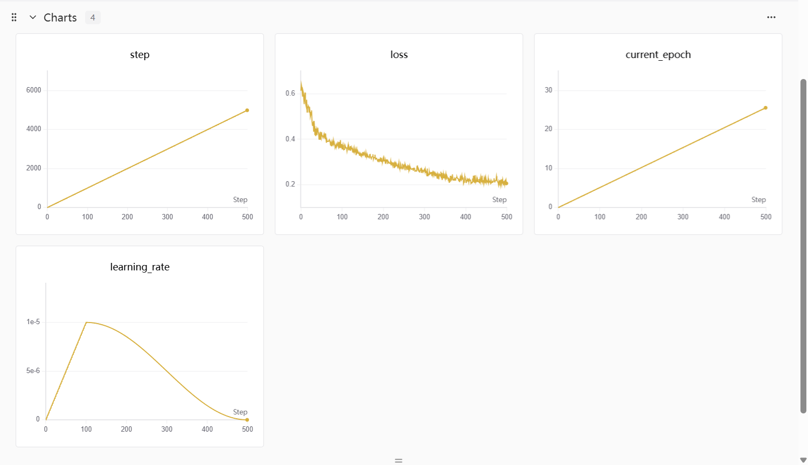
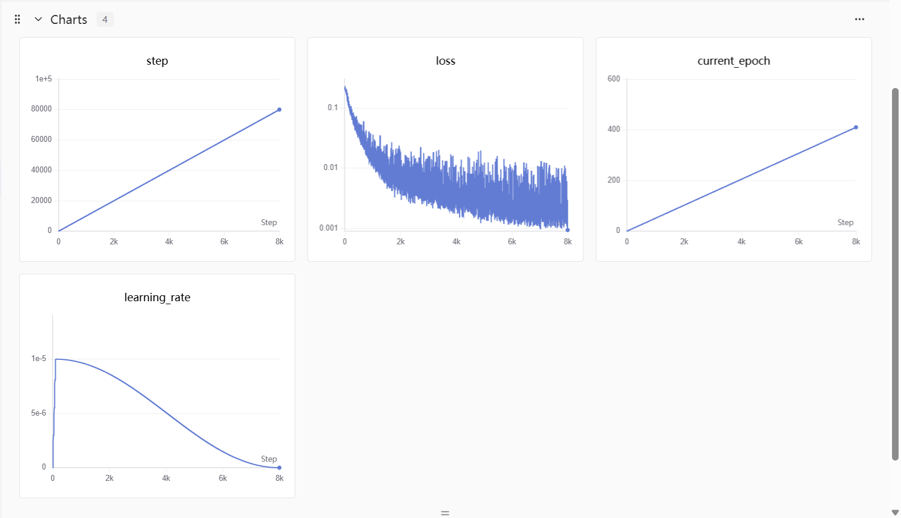
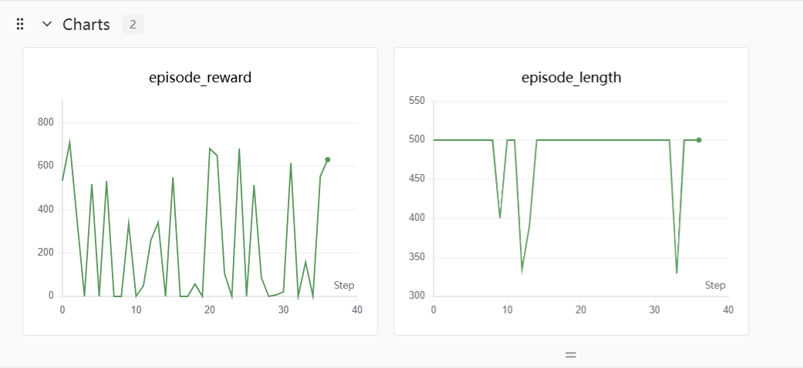

# Evo-1 ALOHA-sim insertion 任务 微调表现

看完 Evo-1 VLA 这篇工作，觉得很 nice 想自己试一试客制任务微调，但是看完这个 VLA 时候自己数据集才刚开始采，所以先跑 aloha-gym 仿真任务试一试。

Evo-1 这个 GitHub repo 的配置和各种 package 安装本身不会太困难，同时 github 官方写的也比较详细，因为作者都是大陆国内的，所以对一些不好安装的 packpage 也做了处理，比如优先使用 Swanlab 这个框架来做训练过程记录。数据集是 LeRobotDataset v2.1 数据集格式，目前来看比较通用这个数据集格式。按照 github 官方文档完成数据集路径 / 内容字段 / accelerate 交互式的配置。

在之前看的论文提到 Evo-1 本身没有大规模机器人数据预训练，因此整个训练过程分成两个阶段，一个阶段是从头开始训练 action expert 和集成模块，然后后端模型和多模态动作空间对齐，这个 stage 的训练过程用了 5000 步，损失数值大致降到了 0.2 左右，但是看起来还可以再加大一点儿 step 继续训；第二个阶段是 VLM 骨干和后端模型的联合优化，这个 stage 训练用了 8w 步，损失数值大致降到了 0.003 左右，在终端交互看到数据集训了 300 epoch ...

同样评估也能按照 github 的方式走，根据仿真任务的 api 接口改写推理代码。

从仿真渲染效果来看，成功的 episode 在双臂抓取左右两侧位置变化的物体上没问题，但是在插入上存在问题：双臂只能勉强插进去，或者二者物件比较紧密的靠近。我猜测是否是视角的问题，因为这个 benchmark 和演示数据集只有了**顶部垂直向下的视角**，在双臂物件插入阶段 VLA 视觉感知可能弱一些。