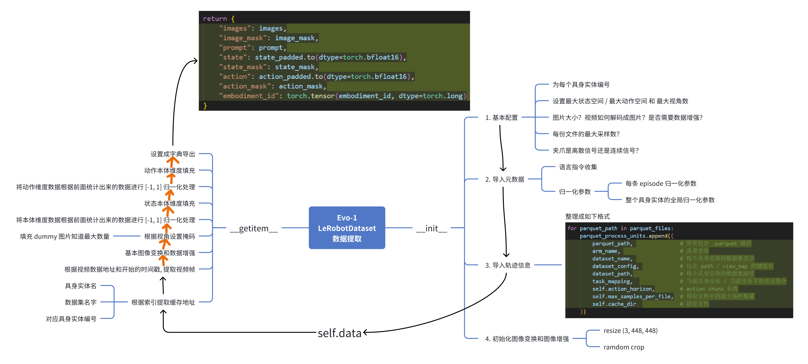

# Evo-1 数据流程图解：LeRobotDataset

这张图整理 [Evo-1](Evo-1-paper.md) 中 `LeRobotDataset` 从初始化到单样本读取的流程，重点看原始轨迹怎样变成模型接收的图像、指令、状态和动作。

可以沿着 `__init__ → self.data → __getitem__ → 返回字典` 这条线阅读：

1. **右侧：初始化。** 读取配置、指令和归一化参数，把轨迹路径等信息存入 `self.data`，并准备图像变换。
2. **左侧：读取样本。** 按索引取得轨迹信息，解码图像、处理相机掩码，再对状态和动作做归一化与维度补齐。
3. **左上角：输出。** 返回包含图像、指令、状态、动作、对应掩码和具身标识的字典，供模型使用。

