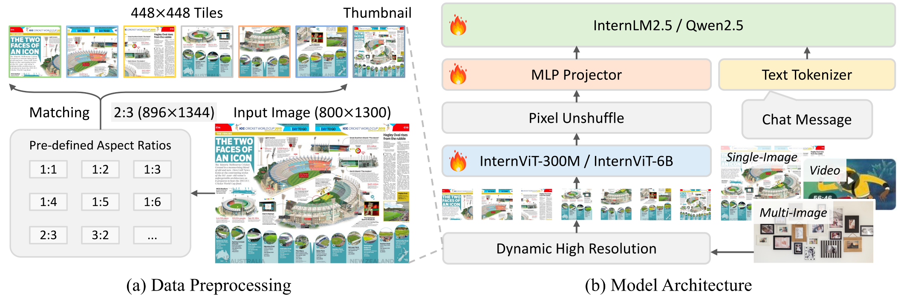
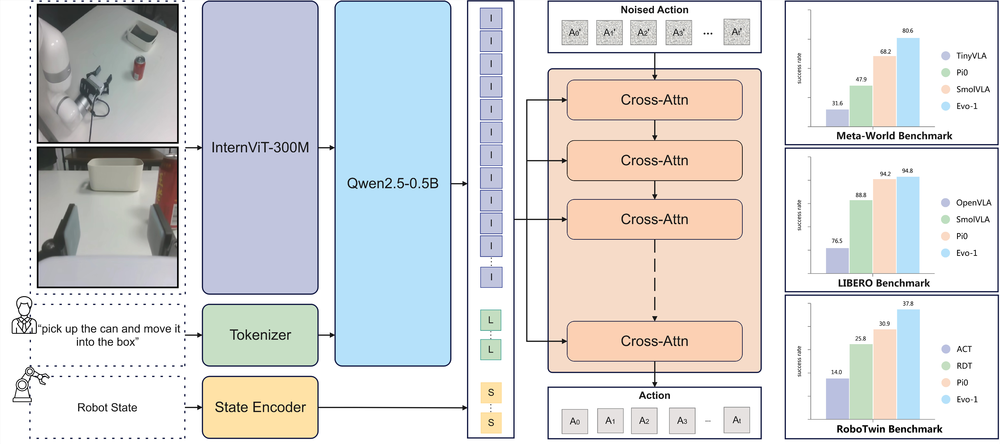
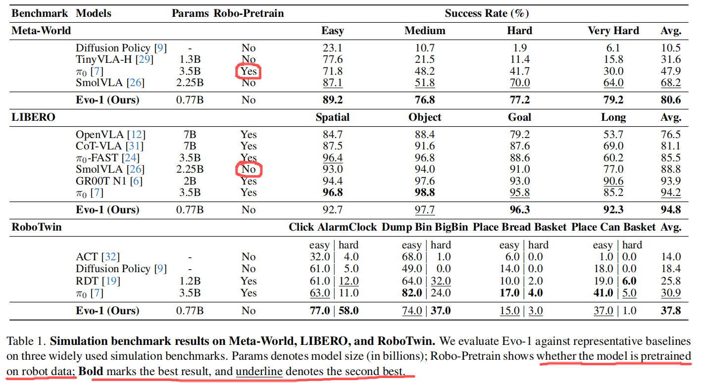
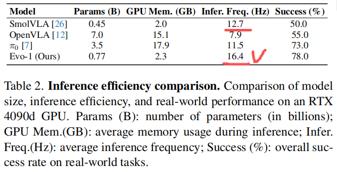
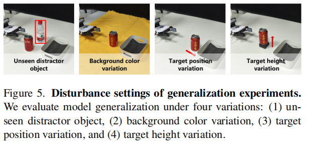
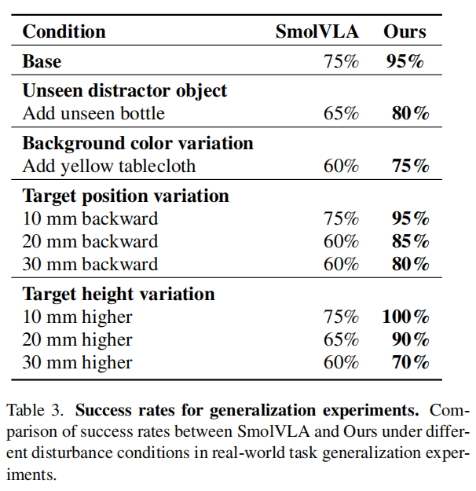
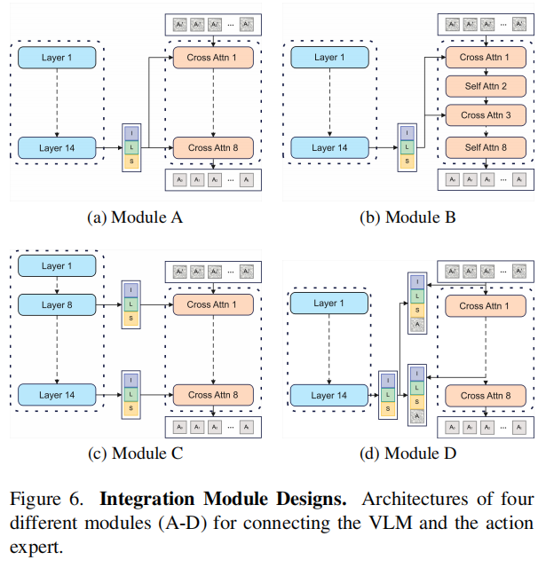
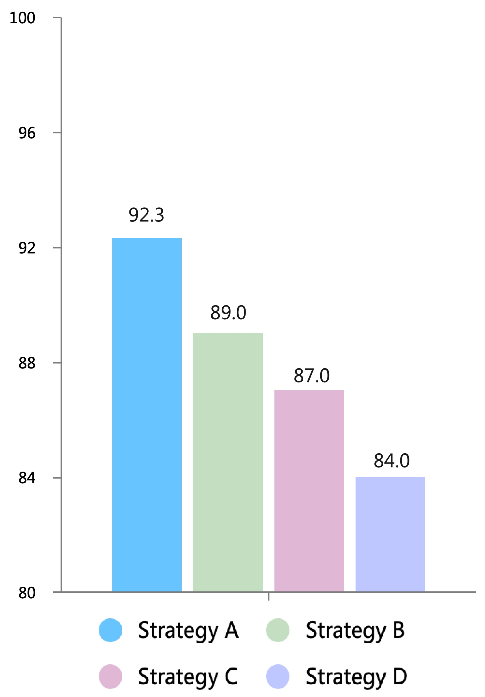
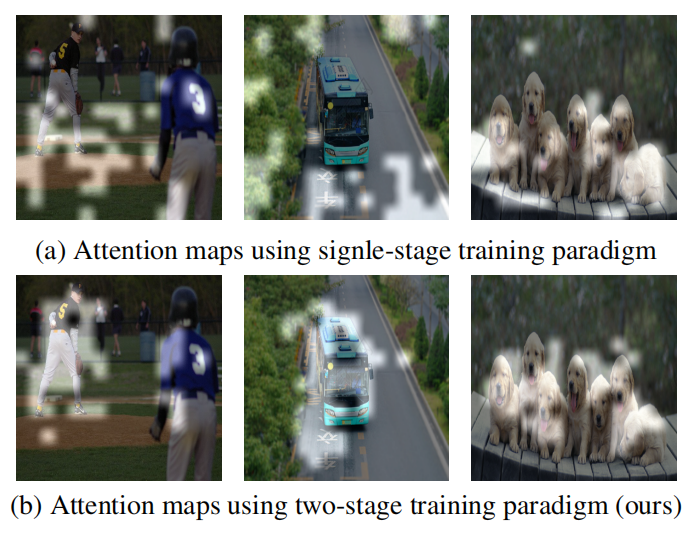
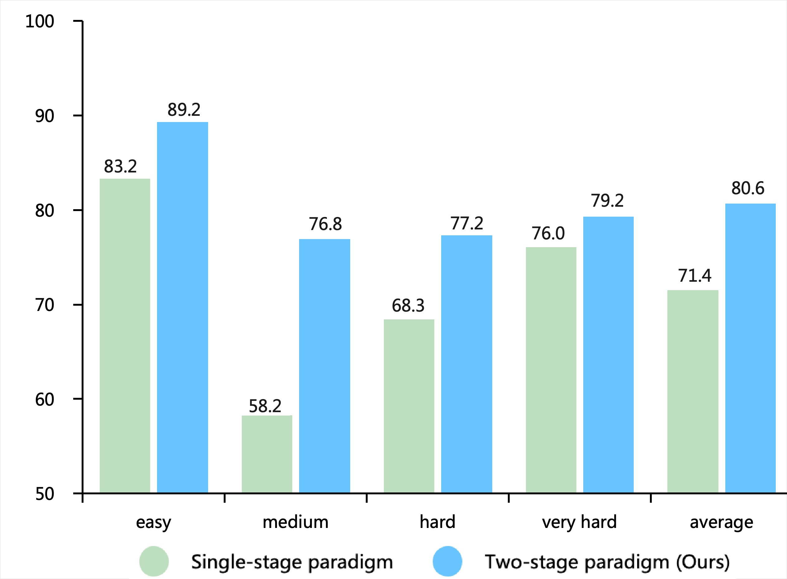

# Evo-1: Lightweight Vision-Language-Action Model with Preserved Semantic Alignment

## Abstract

问题（1）VLA 参数多 + 依赖机器人数据预训练 $\longrightarrow$ 训练成本高 + 现实推理能力受限（2）常规训练范式导致 VLM backbone 的感知能力降级了，存在过拟合现象并削弱了下游任务的泛化能力。

提出 Evo-1 $\longrightarrow$ 轻量级 VLA 降低训练成本并提升推理效率 + 在<u>没有机器人数据预训练</u>的情况下表现良好

- <u>原生</u> VLM 提取视觉语言特征 + 交叉调制 diffusion transformer 用于动作生成 + 优化过的集成模块对齐视觉语言和本体数据
- **两阶段**训练过程，将感知和动作**渐进对齐**，保留 VLM 的感知能力

0.77B 模型：仿真 MetaWorld / RoboTwin 评估，现实世界 $78\%$ 成功率

## 1. Introduction

作者提出现存 VLA 的三个现象（1）巨量参数导致训练 / 推理 GPU 显存占用与计算消耗大 + 部署低频（2）端到端训练削弱视觉表征空间（3）大量的机器人数据 OXE / DROID 来**预训练**。

====> 轻量级模型设计：Intern-VL3 + 交叉调制 DiT + 优化过的集成模块对齐 **VL 表征**和**本体**状态

> Intern-VL3 的原始模型架构如下：
>
> 

====> 避免视觉表征空间的进一步削弱：两阶段训练范式，缓解 VLM 语义失真同时渐进对齐感知和控制

====> 大量 robot data 预训练：作者提到，通过保留继承的语义空间，该模型**无需机器人数据预训练**即可展现出强大的泛化能力和优异的性能表现。

## 2. Related Work

### Large-Scale Vision-Language-Action Models

### Lightweight and Efficient Vision-Language-Action Models

- TinyVLA：提出了低于十亿参数量级的 VLA ，该框架将轻量级 VL backbone 网络与 diffusion-based 的策略解码器相结合
- SmolVLA：采用 SmolVLM-2 作为主干网络，结合紧凑型 flow-matching 动作专家，同时运用 layer skipping / token reduction 和 asynchronous inference 等等技术。

====> 在复杂操作场景中，轻量级 VLA 整体任务表现和系统鲁棒性仍然较弱。

## 3. Method

### 3.1. Overview of Evo-1 Architecture

> 
>
> 输入的 RGB 图像和语言指令首先被一组紧凑的 VLM backbones （Intern ViT-300M + Qwen2.5-0.5B）编码，双模态融合后的 “视觉-语言” 表征和机器人本体数据在优化过的集成模块上作进一步对齐，最后经由交叉调制的 Diffusion Transformers 进行处理生成 action chunk 。

多视角观测 $\{ I_t^i \}_{i=1}^{N}$ + 语言指令 $L_t$ + 机器人本体状态 $s_t$ $\longrightarrow$ 可学习参数为 $\theta$ 的 Evo-1 前向计算 $\longrightarrow$ 动作 $a_t$
$$
\begin{equation}
a_t = f_{\text{Evo-1}}\!\left(\{ I_t^i \}_{i=1}^{N}, L_t, s_t; \theta \right),
\end{equation}
$$

## 3.2. Model Design

### 3.2.1. Vision-Language Backbone

视觉编码器采用 InternViT-300M 模型，该模型是通过**层级负余弦相似度损失**从 InternViT-6B 中提炼出的轻量级 Transformer 。每个 RGB 观测数据集 $\{ I_t^i \}_{i=1}^{N}$ 会被调整为 $448\times448$ 尺寸，并通过**像素重排下采样**操作，将视觉 token 数量减少 4 倍。

> 层级负余弦相似度：让**学生模型**每一层的表示向**教师模型**靠拢，但匹配的指标是 “特征方向一致” ，即最大化余弦相似度。

> 像素重排：当一个图像 / 特征图的形状是：$X \in \mathbb{R}^{C \times H \times W}$ ，那么重排后的形状是：
> $$
> \text{PixelUnshuffle}(X)\in R^{(C\cdot r^2)\times (H/r)\times (W/r)} 
> $$
> 而 ViT 的视觉 token 数量是：$N = \frac{H}{p} \cdot \frac{W}{p}$ ，因此像素重排前后会导致视觉 token 数量降低 4 倍。token 数量由 patch 数决定，而 patch embedding 对**空间维度**进行划分，通道 $C\cdot r^{2}$ 会被投影到 $d$ 维，不影响 token 数。Transformer 的复杂度是：$O(N^2)$ 因此视觉 token 数减少 4 倍，注意力计算减少 **4² = 16 倍** 。

语言编码器：Qwen2.5-0.5B

在 “视觉-语言” 融合任务中，InternVL3-1B 模型通过替换指定的占位符标记 ``，将 patch-wise 图像嵌入整合到 token 序列中。生成的融合序列经共享 Transformer 解码器处理后，可在统一嵌入空间中实现视觉与语言上下文的联合推理。
$$
\begin{equation}
z_t = f_{\text{VLM}}\!\left(\{ I_t^i \}_{i=1}^{N}, L_t\right),
\end{equation}
$$
VLM 输出的 $z_t$ 表示融合的多模态表征，该表征同时编码视觉与语言信息，作为集成模块的输入。

为使预训练的 VLM 更好地适应具身视觉运动任务，仅保留语言分支的前 14 层 $\longrightarrow$ 参考 SmolVLA 中间层在视觉与语言特征间具有更强的跨模态对齐能力，因此更适用于视觉运动控制。

### 3.2.2. Cross-modulated Diffusion Transformer

Evo-1 采用条件去噪模块作为 action-expert ，通过 “视觉-语言” 主干网络生成的融合多模态嵌入来预测连续控制动作。

该模型沿用 flow-matching 范式，学习一个随时间变化的向量场，逐步将**初始噪声动作**转化为**真实目标动作**。具体而言， action-expert 采用 DiT 实现，该架构<u>仅依赖堆叠交叉注意力层</u>，与先前 $\pi_0$ 和 SmolVLA 采用的交替自注意力与交叉注意力结构形成对比。每个噪声动作序列 $A^{τ} _t$ 通过真实动作 $A_t$ 与随机采样噪声向量 $\epsilon$ 的**线性插值**生成：$A_t^{\tau} = \tau A_t + (1{-}\tau)\epsilon$ 。插值权重 $\tau$ 从贝塔分布中采样，并被限制在 $[0.02,0.98]$ 范围内以确保训练过程中的数值稳定性。

训练过程中， action-expert 通过优化学习时序速度场 $v_{\theta}$ ，使其在多模态上下文 $z_t$ 和机器人状态 $s_t$ 的引导下，将插值动作 $A^{τ} _t$ 逐步逼近真实动作 $A_t$ 。该目标函数采用 flow-matching 进行建模。
$$
\begin{equation}
\mathcal{L}^{\tau}(\theta) =
\mathbb{E}_{p(A_t|z_t,s_t),\,q(A_t^{\tau}|A_t)}\!\left[
\left\|
\mathbf{v}_{\theta}(A_t^{\tau}, z_t, s_t)
- \mathbf{u}(A_t^{\tau} \mid A_t)
\right\|^2
\right]
\end{equation}
$$
推理过程：$\hat{A}_t = f_{\text{AE}}(z_t, s_t, A_t^\tau)$ 来生成 action chunk $\hat{A}_t = [\hat{a}_t, \hat{a}_{t+1}, \dots, \hat{a}_{t+H-1}]$ 

### 3.2.3. Integration Module

为完整保留感知嵌入与机器人本体感知状态的信息，选择将 $z_t$ 与机器人状态 $s_t$ 直接拼接，而非投射至共享嵌入空间。这种拼接特征作为 action-expert 网络中 Transformer 模块的键值输入，为动作生成提供了全局且信息完整的上下文支持。

## 3.3. Two-Stage Training Procedure

### Stage 1: Action Expert Alignment

冻结 VLM 骨干，在随机数值初始化网络权重下训练 action expert 和集成模块 $\longrightarrow$ 通过逐步调整模型与多模态嵌入空间的对齐，避免将噪声梯度反向传播至预训练主干网络 $\longrightarrow$ 模型能在 VLM 特征与 action expert 之间建立协调一致的对齐关系

### Stage 2: Full-scale Fine-Tuning

解冻 VLM backbone 网络，并对整个架构进行全面微调。这一阶段实现了预训练 “视觉-语言” 主干网络与 action-expert 的联合优化，确保更深层次的整合，从而更好地适应各类操作任务。

### Preserving Multimodal Semantics

为验证训练策略的优势，对比了基于 Evo-1 进行两阶段训练 InternVL3-1B 与 OpenVLA 中使用的 Prismatic-7B VLM 生成的图文注意力映射图。

经过机器人操作数据训练后，InternVL3-1B 的嵌入向量仍保持清晰的结构特征和语义连贯的注意力区域，而 Prismatic-7B 则出现显著的语义漂移和对齐效果下降。这一结果表明，训练流程有效保留了原始语义空间，使模型在适应下游控制任务时仍能保持强大的视觉语言理解能力。

## 4. Experiments

### 4.1. Simulation Experiments

#### 4.1.1. Meta-World Benchmark

【实验设置】在实验中，采用 Meta-World 官方的轨迹生成脚本构建数据集，每个任务包含 50 个演示样本，通过十次独立测试评估各任务表现，并汇总五次独立运行的平均结果。

【baseline】Diffusion Policy / TinyVLA / $\pi_{0}$ / SmolVLA ，==指标从原论文或复现报告中获得==

【实验结论】（1）Evo-1 在 Meta-World 基准测试中表现最佳，成为现有 VLA 中的 SOTA （2）Evo-1在四个难度等级（简单、中等、困难和非常困难）中始终优于所有 baseline 。

#### 4.1.2. LIBERO Benchmark

【实验设置】十次独立测试评估各任务表现，并汇总五次独立运行的平均结果。

【baseline】OpenVLA / CoT-VLA / $\pi_0$-FAST / SmolVLA / GROOT N1 / $\pi_0$ ，==指标从原论文或复现报告中获得==

【实验结论】Evo-1 的平均成功率高达 $94.8\%$ ，不仅超越了 $\pi_0$ 的 $94.2\%$ 和 SmolVLA 的 $88.8\%$ 等基准模型，更在四大任务类别（空间、物体、目标、长任务）中保持稳定优异表现。尤其在长任务领域的 $92.3\%$ ，其稳健性表现尤为突出，而多数现有视觉语言模型在此类任务中均出现显著性能下滑。

#### 4.1.3. RoboTwin Benchmark

【实验设置】在评估过程中，每项 policy 都会在两种难度设置下进行 100 次测试，从而全面评估其在不同操作场景中的鲁棒性和泛化能力。

【baseline】ACT / Diffusion Policy / RDT / $\pi_0$ ，==指标从原 RoboTwin 论文中获得==

【实验结论】在 RoboTwin 测试套件中，Evo-1 展现出最佳整体表现，平均成功率高达 $37.8\%$ ，超越了此前 SOTA 模型 $\pi_0$ $30.9\%$ 的纪录。

### 4.2. Real-World Experiments

xArm6 机械臂 + 并行夹爪

| 任务                   | 内容                                                         | 动作本质       | 泛化程度                     |
| ---------------------- | ------------------------------------------------------------ | -------------- | ---------------------------- |
| **Pick and Place Can** | 这项任务需要从**不同初始位置**抓取饮料罐，并将其放入桌面上的白色盒子中。 | pick-place     | pick 位置泛化                |
| **Pour Foam from Cup** | 本任务要求从**不同初始位置**提起泡沫杯并旋转，将泡沫倒入白色盒子中。 | pick-rotation  | pick 位置泛化                |
| **Hand Delivery**      | 这项任务需要从**不同位置**抓取饮料罐，并将其轻轻放入**不同位置的人手**中。 | pick-place     | pick 位置泛化 palce 位置泛化 |
| **Can Stacking**       | 这项任务要求抓取一个饮料罐，并将其稳定地堆叠在另一个罐子上。两个罐子完全相同，**随机放置**在桌面上。 | pick-place * 2 | pick 位置泛化 palce 位置泛化 |

针对每个任务，**收集 100 条遥操作演示**来构建训练数据集。Evo-1 采用两阶段训练流程从零开始训练，未进行任何机器人数据预训练。在评估阶段，每个任务在不同物体配置下进行 20 次测试，以评估其稳定性和可靠性。

Evo-1 在四项实际任务中平均成功率达到 $78\%$ ，显著优于 SmolVLA $50\%$ / OpenVLAOFT $55\%$ / $\pi_0$ $73\%$ 。

参数量比 SmolVLA 大，但是推理频率比 SmolVLA 还快。

### 4.3. Generalization Experiments

### 4.4. Ablation Study

#### 4.4.1. Integration Module Analysis

模块 A $\longrightarrow$ 中层交叉注意力机制。该设计从第 14 层 VLM 中提取融合的多模态特征 $z_t$，将其与机器人状态 $s_t$ 拼接，作为所有 DiT 层的 key / value 输入，其中噪声注入动作 $A_{τ}^{t}$ 作为交叉注意力的 query 。

模块 B $\longrightarrow$ 中层交错交叉 + 自注意力机制。该设计在 DiT 内部交错排列交叉注意力层与自注意力层。每个交叉注意力模块先对拼接的 VLM 特征和状态 $s_t$ 进行注意力捕捉，随后通过自注意力模块优化内部交互。

模块 C $\longrightarrow$ 分层交叉注意力机制。该设计将选定的中深层 VLM 特征注入 DiT ，各对应层使用其配对的 VLM 特征和状态 $s_t$ 作为 key / value 输入，同时以 $A_{τ}^{t}$ 作为 query ，实现层级感知-动作对齐。

模块 D $\longrightarrow$ 联合 key / value 交叉注意力机制。该设计将 VLM 特征、机器人状态 $s_t$ 和噪声注入动作拼接，为每个 DiT 层形成联合 key / value 输入，同时以 $A_{τ}^{t}$ 作为 query 实现统一的多模态条件生成。

#### 4.4.2. Training Paradigm Comparison

baseline：单阶段 $\longrightarrow$ 直接联合训练 VLM 、集成模块和动作专家，且不采用任何冻结策略

## 5. Conclusion