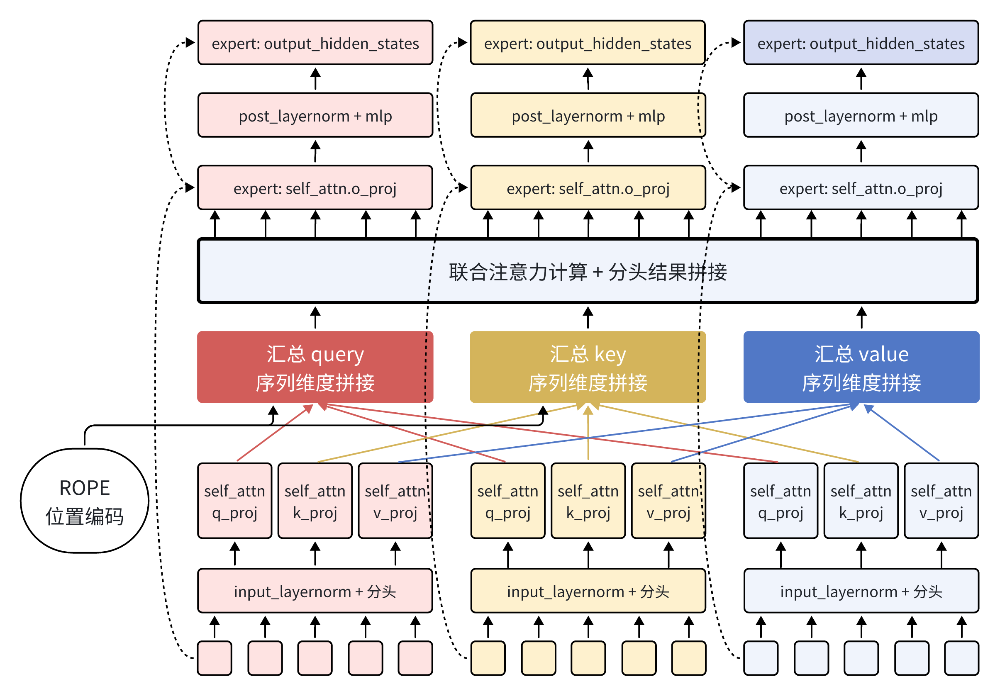
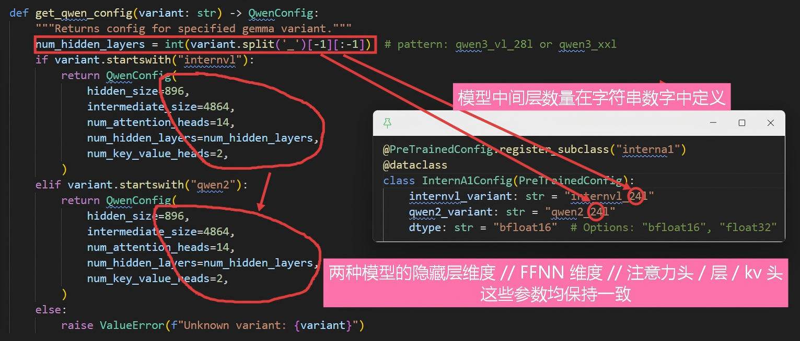
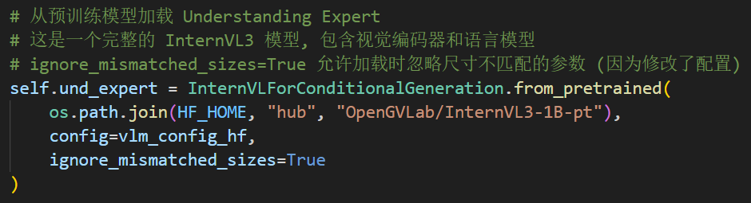
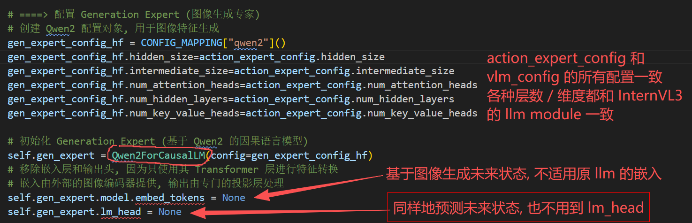
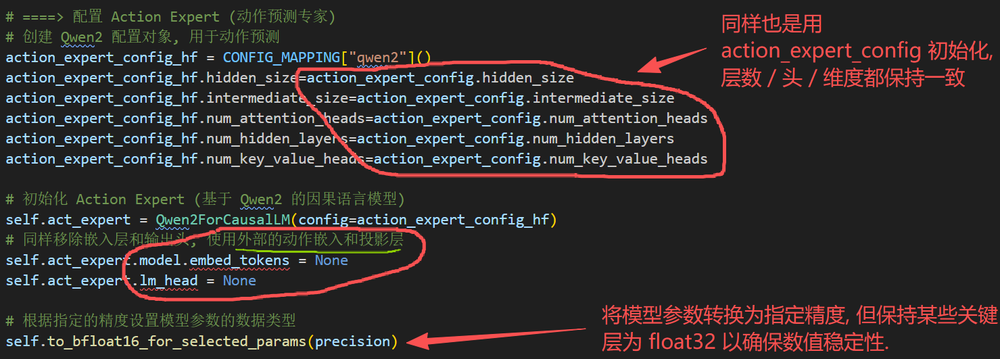
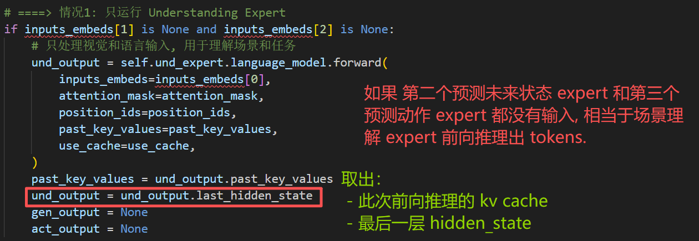
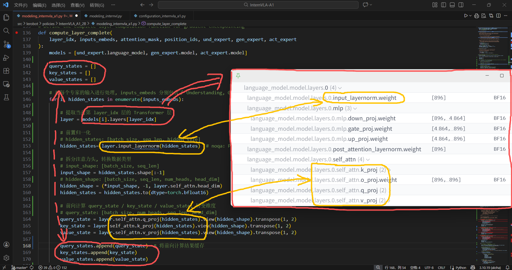
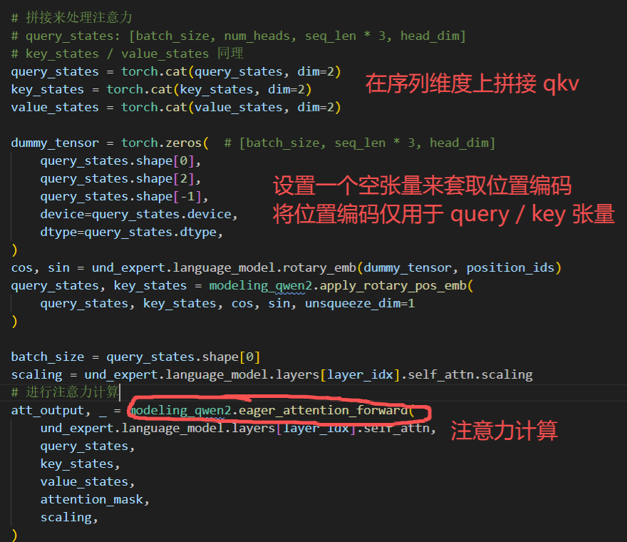

# InternVLA-A1-(2B) 联合注意力 code



**前言**

> 所有配置参数以 GitHub 上开源呈现为主。

> "Specifically, InternVLA-A1 (2B) utilizes InternVL3-1B as the understanding expert. Its generative and action experts are derived from the transformer blocks of Qwen2.5 — the underlying LLM of InternVL3."

**====> 模型参数配置**

`InternVLForConditionalGeneration.from_pretrained()` 加载预训练权重：模型参数从 Hugging Face Hub 下载的文件 `OpenGVLab/InternVL3-1B-pt` 中加载；结构由预训练模型的配置文件决定，虽然此处传入了 `config=vlm_config_hf` ，但通常需匹配预训练权重。

`Qwen2ForCausalLM(config=gen_expert_config_hf)` **随机初始化**：模型根据提供的 `config=gen_expert_config_hf` 构建结构，但所有参数（权重、偏置）都是**随机生成的数值**。作为一个全新的网络结构，需要在后续的训练步骤中从头开始学习。










**====> 模型前向计算**

`embed_image()` 和 `embed_language_tokens()` 方法最终都是将各种模态信息拆解成 `[批维度, 序列维度, 隐藏层维度]` 统一，以便后续联合 Transformers 进行处理.




推理时，运行 `gen_expert` 模型会接收来自 `und_expert` 专家前向计算的 KV 缓存，在 `.forward()` 方法内部会合并 `und_expert` 和自身前向计算的 KV 缓存。在后续推理时，`attention_mask` 会兼并 `und_expert` 的掩码，同时 `position_ids` 也是从 `und_expert` 产生的结果上继续累加。


**====> 联合注意力核心**






```python
# 根据 seq_len * 3 长度分段提取不同注意力结果, 输入至不同的 expert's output / mlp 层.
outputs_embeds = []
start_pos = 0

for i, hidden_states in enumerate(inputs_embeds):

    # 取出当前专家的 Transformer 层
    # 找到起始位置和结束位置并对注意力结果进行截断
    # 将截断后的注意力结果通过当前专家的输出投影层
    # 最后进行残差计算
    # out_emb: [batch_size, seq_len, hidden_size]
    layer = models[i].layers[layer_idx]
    end_pos = start_pos + hidden_states.shape[1]
    if att_output.dtype != layer.self_attn.o_proj.weight.dtype:
        att_output = att_output.to(layer.self_attn.o_proj.weight.dtype)
    out_emb = layer.self_attn.o_proj(att_output[:, start_pos:end_pos])
    out_emb = out_emb + hidden_states

    # 进行 post-attention + mlp 计算
    # 最后再次进行残差计算
    after_first_residual = out_emb.clone()
    out_emb = layer.post_attention_layernorm(out_emb)
    # Convert to bfloat16 if the next layer (mlp) uses bfloat16
    if layer.mlp.up_proj.weight.dtype == torch.bfloat16:
        out_emb = out_emb.to(dtype=torch.bfloat16)
    out_emb = layer.mlp(out_emb)
    out_emb = out_emb + after_first_residual

    # 将结果添加到输出列表, 并更新起始位置开始下一个专家的处理
    outputs_embeds.append(out_emb)
    start_pos = end_pos
```
