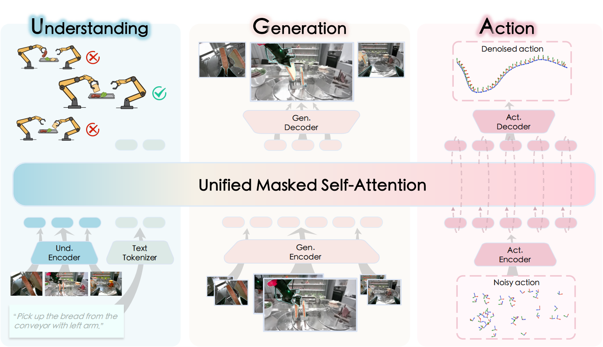
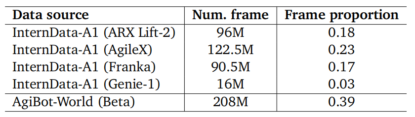
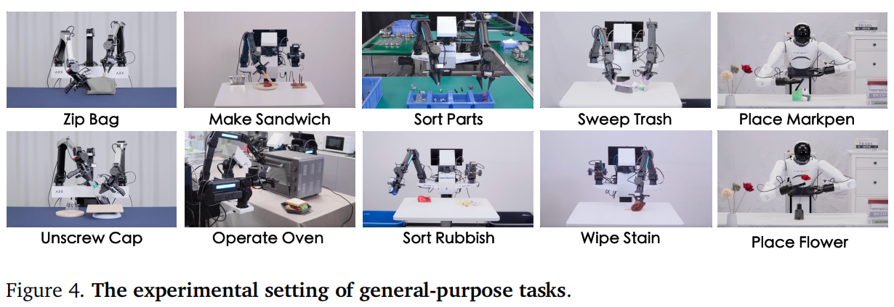
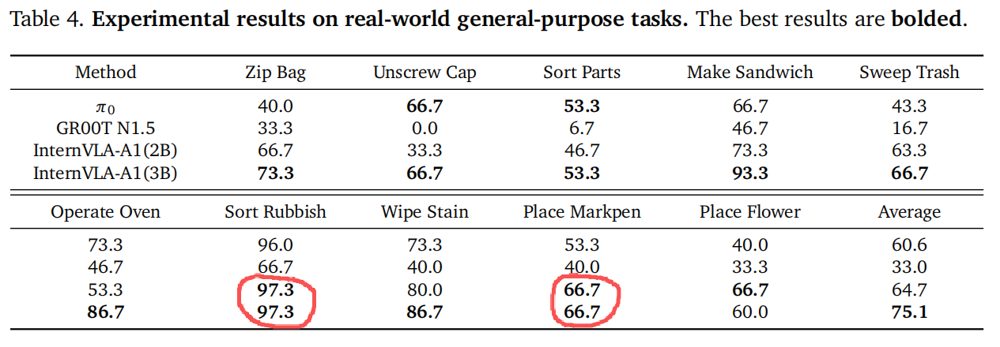
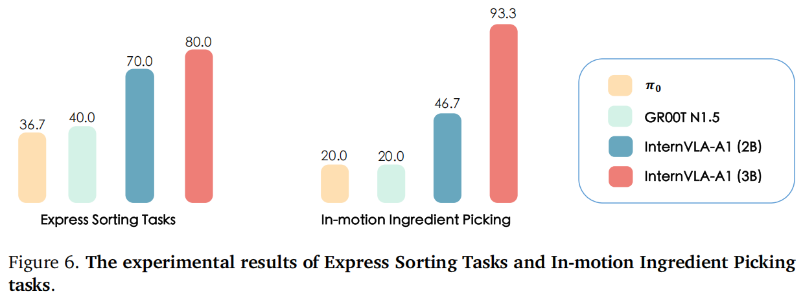
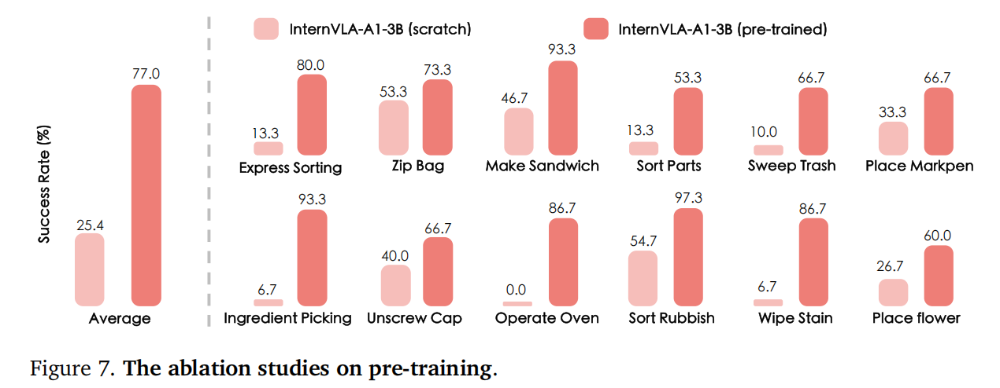
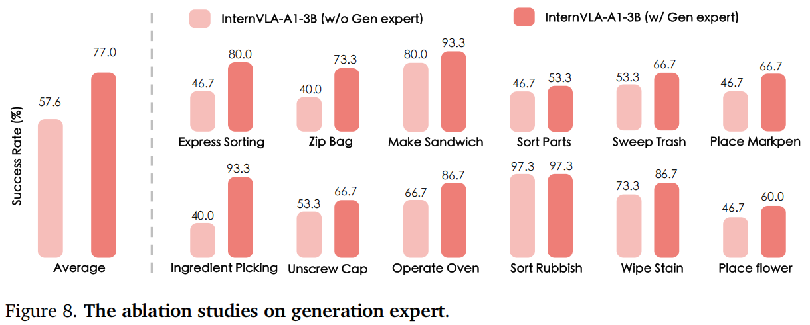

# InternVLA-A1: Unifying Understanding, Generation and Action for Robotic Manipulation

**Abstract**

【现状】MLLMs-based VLAs 缺少推导 / 理解现实世界动力学的能力 $\Longrightarrow$ 以视频预测为核心的 World Models-based VLAs

【问题】WM-based VLAs 缺乏语义 grounding 且在处理预测误差时表现出脆弱性

【目标】协同语义理解与动态预测能力

【解决】

- InternVLA-A1, 基于 InternVL3 和 Qwen3-VL 开发的统一的 MoE 架构：三个 expert 分别用于场景理解 / 视觉前瞻性生成 / 动作生成
- 涵盖 InternData-A1 和 Agibot-World 的混合合成-真实数据集，包含超过 5.33 亿帧
- InternVLA-A1 模型具体化 2B / 3B 参数数量模型

【评估任务】12 个真实世界任务 / 仿真 benchmarks

【效果】超越 $\pi_0$ 和 GR00T N1.5

---

**1. Introduction**

MLLMs-based VLAs 对场景变化的适应性仍显不足 $\Longrightarrow$ 工业传送带的动态场景

- 物理世界的认知缺陷 $\Longrightarrow$ 集成 MLLMs 或者 World Models

  $\pi_0$ / GR00T-N1: 类似文本 tokens 形式不适合建模物理规律

  ​		针对反应性 “感知-动作” 映射进行优化，而**非推理** motion 运动与 contact 接触状态下状态的演变

  VPP / Genie Envisioner: 类似视频预测的范式生成前瞻性预测

  ​		弱语义 grounding + 对预测误差敏感

- 适应性操作能力的缺失 $\Longrightarrow$ 大规模 / 多样的 robotics datasets

  scaling up 真实机器人数据集时，当前通用策略高度依赖此类真实机器人数据

  ​		覆盖各种长尾场景细微变体既 costly <u>成本高昂</u>又 inenfficient <u>效率低下</u>，容易导致收益递减，而不同具身实体间的高度异质性进一步增加了联合训练的复杂性。

  InternData-A1: 大规模高精度仿真数据可有效支持 VLAs 模型的预训练		

  ​		仿真器中丰富的场景与对象库丰富了样本多样性，而 domain randomization 领域随机化通过模拟场景变化以提升策略在环境变化中的鲁棒性

  ​		仿真器问题: inevitable sim-to-real gap / contact-rich dynamics

---

【*InternVLA-A1*】将 MLLMs 的语义推理能力与世界模型式想象模块的预测能力相结合 $\Longrightarrow$ 减小语义与物理动力学 gap / 强化前瞻性动作生成

【*Data Pyramid*】整合了三类互补数据源：大规模开源机器人数据用于场景理解与物理先验知识 + 可扩展可控的仿真合成数据用于多样化场景覆盖 + 少量专用真实机器人数据用于 calibration 校准现实世界中的动作执行 $\Longrightarrow$ 覆盖各种长尾分布配置 / 使用真实机器人数据锚定策略，可避免仅依赖模拟学习的缺陷 / 减少 sim2real gap

**2. Related work**

**Vision-Language-Action models**

**Video prediction and World models**

- 主题：基于动作条件下的真实世界动力学模拟以促进机器人控制

- 最新工作特点：通过<u>动作预测</u>生成未来状态或视频，旨在利用从大规模视频预训练中学习到的丰富表征

  Seer: 一种基于<u>预测视觉状态</u>生成动作的端到端逆向动力学模型

  Genie Envisioner: 通过采用多视角视频扩散模型增强空间理解能力

- 不足之处：视频生成质量及缺乏 MLLMs 固有的语义推理能力

**Robotic manipulation data**

- Real-world datasets: 内在固有的异质性
- Simulated data: Robocasa $\Longrightarrow$ 遥操作 / GraspVLA $\Longrightarrow$ 自动化数据管线 + 仅限于抓取任务 / InternData-A1

**3. InternVLA-A1: Unified Understanding-Generation-Action Framework**

**3.1. Architecture Overview**

**3.2. Unified Understanding-Generation-Action Transformer**

**3.3. Optimization Objectives**

InternVLA-A1 采用 MoT + decoder-only transformer 架构，将场景理解、视觉预测和动作执行无缝集成于单一框架中

1. ***understanding expert***: 多模态输入 $\Longrightarrow$ 环境上下文

   采用 InternVL3 或 Qwen3-VL

   【建模】视觉 tokens $o_t$ 和文本 tokens $l$ 随后被拼接形成前缀 tokens: $h_{\text{und}}=f_{\text{und}}(l,o_t)$

   【代码】代码中 *understanding expert* 实际输出前缀 tokens 以 KV 缓存值存在

2. ***generation expert***: 环境上下文表征 $\Longrightarrow$ 未来状态

   生成未来状态需要保留精细的空间结构和像素级保真度

   VAE-based tokenizer $\Longrightarrow$ 将视觉数据压缩至一个**针对高质量重建优化**的潜在空间 $\Longrightarrow$ 采用 CosmosCI8×8 连续 VAE 分词器将输入图像编码为连续的潜在特征，为后续生成过程提供密集且结构丰富的表征

   【建模】时间步 $t-m$ 到 $t$ 时刻的视觉观测 $o_i,i\in\{t-m,t\}$ 使用 Cosmos 编码成潜空间表征 $\{z_{t-m}\cdots z_t\}$ 并以环境理解 expert 产生的前缀 tokens $h_{\text{und}}$ 作为上下文生成未来预测 $\hat{z}_{t+m}$

   【预训练损失】$\mathcal{L}_{\mathrm{gen}}=\mathbb{E}_{(o_{t-m},o_{t},o_{t+m},l)\sim\mathcal{D}}\left[\left\|f_{\mathrm{gen}}(z_{t-m},z_{t};h_{\mathrm{und}})-\mathrm{sg}[z_{t+m}]\right\|^2\right]$ 对于标签 $z_{t+m}$ 使用冻结的 cosmos 分词器。

   【代码】使用 Cosmos CI8×8 连续 VAE 图像 tokenizer 处理跨越当前帧 / 历史帧两个时间戳的三视角图像，代码中 *generation expert* 将参数 $m$ 设置成 1, 然后将 $\{t-1, t\}$ 时刻的视觉观测编码成 tokens 序列（包含 cosmos 分词被编码为32×32的潜在特征图 + 通道维度上升至 Transformer 模型的维度 + 采用卷积层下采样），结合来自 *understanding expert* 的 KV 缓存值输出两个时刻的预测张量，然后进行 "在时间维度上平均池化 + 上采样 + 通道维度下降至图像维度" 等操作后，生成未来 $\{t+1\}$ 时刻的图片帧，并在训练时用帧 $t + m$ 的 Cosmos 编码 $z_{t + m}$ 进行监督。

3. ***action expert***: 结合语义上下文和环境动力学 $\Longrightarrow$ Flow-Matching $\Longrightarrow$ 精确的机器人控制指令

   【预训练损失】$\mathcal{L}_{\mathrm{action}}=\mathbb{E}_{\{a_{t:t+k},o_{i},q_{t},l\}\sim\mathcal{D}}\left[\left\|v_{\theta}(l,\{o_{i}\}_{i=t-m}^{t},q_{t},a_{t:t+k}^{\tau})-(a_{t:t+k}-\epsilon)\right\|^{2}\right]$ 跟 $\pi_{0.5}$ 类似，时间步 timesteps 从 Beta 分布中抽样，但是噪声从正态分布中抽样。 

4. ***Attention Mechanism***: 使用 cumulative segment mask 累积段掩码强制执行严格的信息流：后续块中的 tokens 可 attend 所有前序块，而前序块无法向前关注。*understanding expert* 包含的 “视觉 + 语言” tokens 为全双向结构。*generation expert* 同样为全双向结构，仅接收来自 $t − 1$ 帧和 $t$ 的 Cosmos 潜在 tokens 。*action expert* 被拆分为状态 token 和动作 tokens ：状态标记仅关注自身及前序块，动作标记则关注状态及彼此。

**3.4. Implementation Details**

InternVLA-A1-2B 虽然总参数更少，但其延迟并不低于 InternVLA-A1-3B，这是因为 InternVLA-A1-2B 中的 InternVLA-A1-3B Qwen3-VL 主干网络需要更高的输入分辨率 $(448 \times 448)$，而 InternVLA-A1-2B 中的 Qwen3-VL 主干网络仅使用 $(224 \times 224)$ 的输入分辨率。

**Training Hyperparameters.**

- 大规模预训练

  异构机器人数据集 / AdamW 优化器 + 恒定学习率训练 700k 步

- 后训练

  低学习率 + warm-up 和 decay

- 用于平衡两种损失函数的超参数 $\lambda$ 设定为 $0.01$ 。

- 历史帧与当前帧、未来帧与当前帧之间的 $m$ 间隔均设为 15 帧。

**Load-balanced Parallel Training.**

【问题】若在每个工作节点上直接实例化完整数据集混合，可能引发内存不足故障并加剧 I/O 争用。

【解决】负载均衡并行训练（Load-balanced Parallel Training, LPT）是一种分布式数据加载策略，通过将数据集分配给工作节点以实现可扩展性与统计学上表现良好的采样。

$\{D_i\}_{i=1}^n$ 表示**数据集的集合**（整个数据集被事先划分了），其中 $n$ 表示**数据集总子集数量**；$s_i$ 表示**当前子集的样本帧总数量**【直接一点这样定义】。

LPT 生成一个分配策略 $\pi:\{1,\ldots,n\}\to\{1,\ldots,K\}$ 含义就是数据集中的<u>每个子集</u>要分配到<u>哪个 worker 中</u>？

使用这样的决策方法：$\pi(i)=\mathrm{argmin}_{k\in\{1,...,K\}}\sum_{j:\pi(j)=k}s_{j}$ ，含义就是：在分配第 $i$ 个子集之前，计算此时所有 workers 的各自处理的总样本帧数量是多少，选择处理最少样本帧的 workers 分配第 $i$ 个子集。

【优势】（1）降低每个 worker 的内存压力，因为每个 worker 仅持有数据集的子集；（2）缓解因 worker 以不同速率遍历高度异质性数据集而产生的 implicit re-weighting effects 隐性权重重置效应。

**4. Data Corpus**

**4.1. Hierarchical data pyramid**

**4.2. Simulated synthetic data**

【结论】InternData-A1首次证明，当预训练 VLA 模型时，纯合成数据能够达到与大规模真实世界数据集相当的性能，其结果与最强大的闭源真实世界 $\pi$ 数据集相当 $\Longrightarrow$ “选择 InternData-A1 作为预训练语料库的基础，因其样本多样性卓越且在预训练VLA模型中已证实有效。”

**4.3. Open-source robot demonstration**

open-source AgiBot-World dataset

**4.4. Specialized real-world data**

通过遥操作在目标环境中采集的这些高质量 / 以任务为中心的 episodes

**4.5. Pre-training data recipe**

**5. Experiments**

**5.1. Evaluation Configuration**

【具身实体】Genie-1 / ARX Lift-2 / ARX AC One, 同样的部署环境

【任务】

【测评方法】

在物体放置和场景初始化均在限定范围内，每项任务 30 次部署的平均成功率，包括抓取成功率。结果取所有部署的平均值。

**5.2. Evaluation on the General-purpose Tasks**

**5.3. Evaluation on the Specialized Tasks**

Express Sorting Task: 在快递分拣任务中，机器人需先判断包裹标签是否朝上。若标签朝下，则启动四步操作流程：右臂沿传送带移动方向执行 “追踪” 抓取，随后翻转包裹，左臂随即进行 “等待” 抓取。最后将包裹抬起，使标签朝向头部摄像头。

In-motion Ingredient Picking: 在动态配料拣选任务中，两台机器人协同作业，抓取组装牛肉三明治所需的食材，该三明治由两片面包、一块牛排和一片生菜组成。

**5.4. Evaluation on Simulation Benchmark**

**5.5. Ablation Studies**

**Effectiveness of Pre-training.** 

【问题】是否需要预训练？直接使用 task-specific 数据训可以吗？

【做法】大规模数据集预训练 + task-specific 后训练 vs. 直接从头开始 task-specific 训练

【结论】严重掉点 $\Longrightarrow$ 预训练作为关键的归纳先验，有效稳定了优化过程，并使模型能够继承基础操作技能。

**Effectiveness of Generation Expert.**

【问题】是否需要预测未来帧？

【做法】完整 InternVLA-A1 vs. 去掉 gen_expert 的 InternVLA-A1

【结论】存在明显掉点 $\Longrightarrow$ 加入 gen_expert 合理性

**Impact of Pre-training Datasets**.

【问题】哪部分数据集更重要？

【做法】预训练数据集：**real-world Agibot-World** vs. **synthetic InternData-A1** vs. **a mixed strategy combining both**

【结论】InternData-A1 在仿真基准测试中表现突出 $\Longrightarrow$ sim2sim / heterogeneous embodiments

**6. Conclusion and Limitations**

**Limitations.**

- 当前 understanding experts 缺乏与多模态 VQA 数据集的联合训练，导致通用语义推理和复杂指令遵循能力下降
- 为确保前瞻性视觉预测模块的高效推理，降低了图像预测的保真度，这限制了生成未来帧的粒度