# Masked Depth Modeling for Spatial Perception

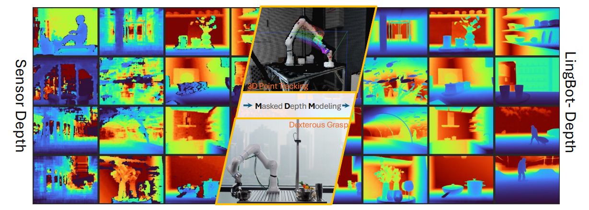

**Abstract**

使用 RGB-D 深度相机来捕获像素对齐 pixel-align 的深度尺度是常见做法，但是这通常面临硬件限制和成像条件苛刻带来的障碍，尤其在存在<u>镜面或无纹理表面</u>时更为明显。

提出论点：深度传感器的**测量误差 / 不精确性**可视为一种 “掩码” 信号，其本质反映了底层**几何结构的不确定性**。

提出工作：`LingBot-Depth`

1. 深度补全模型：使用 mask depth modeling 方法来使用视觉上下文来<u>精调 refine 深度图</u>；
2. 集成自动化数据管理流程以支持规模化训练。

效果：

- 在<u>深度感知</u>和<u>像素覆盖度</u>上优于 top-tier 顶级 RGB-D 相机
- 下游任务表现说明 `LingBot-Depth` <u>提供跨 RGB 与深度模态的对齐潜在表征</u>！

开源：代码 / checkpoints / 3M 数据集包括 2M 真实世界数据集以及 1M 仿真环境数据集

---

**1 Introduction**

实现 3D 感知目标的最佳方法仍存在争议，现有方法通常可分为三大范式：

- 经典的多视角视觉几何与近期 learning-based 的探索方法
- 数据驱动的单目深度估计: *monocular depth estimation*
- 基于主动传感器的深度测量（如激光雷达 LiDAR / 飞行时间 ToF / 结构光 Structured Light）

有效感知的要求可归纳为三个关键标准：

1. 绝对度量尺度；
2. 像素对齐的密集几何结构；
3. 无需计算密集的后处理 post-processing 即可实现实时采集。

RGB-D 相机能满足上面三个关键标准 $\Longrightarrow$ 受到固有的硬件限制，尤其是**立体匹配算法**对外观模糊性 appearance ambiguities 的易感性 $\Longrightarrow$ 低纹理表面、镜面反射及复杂光照条件 $\Longrightarrow$ 表现为严重数据损坏和缺失值，直接违反了对密集、像素对齐几何结构的要求。

---

【工作思路】

原本做法：传感器故障视为可忽略的**噪声** $\Longrightarrow$ 转变成：有效的**学习信号**以利用 $\Longrightarrow$ 将原始深度图中缺失区域 “孔洞” 的解释为 “自然掩码“ ，这个与 Masked Auto Encoders (MAE) 的**随机添加掩码**存在差异。

由于这些 ”自然掩码“ 源自几何与外观的模糊性（如镜面反射），其重建难度显著高于随机丢弃。为解决此问题，将<u>完整未掩码</u>的 RGB 图像作为条件输入。模型被迫通过分析<u>完整 RGB 上下文</u>与<u>剩余有效深度 token</u> 之间的相关性，推断缺失的深度值。

这个模型本质是深度补全 depth completion 模型，那么在 (1) 常规情况下，仅屏蔽无效（传感器损坏）的标记，使模型能够将**稀疏的有效深度读数**与**视觉线索**融合，以重建完整、密集的深度预测；另外在 (2) 极端环境下，在所有深度 tokens 均被屏蔽的极端情况下，该模型仅作为**纯单目深度估计器**运行，迫使自注意力层仅利用 RGB 上下文来推断几何结构。

【工作启发】

self-supervised masked modeling: *Masked autoencoders are scalable vision learners*.

joint embedding architectures: *Self-supervised learning from images with a joint-embedding predictive architecture*.

【数据管线】

- 合成分支：自持有的 3D 数字资产 ====> 1M 样本

- 真实分支：采用模块化 3D 打印装置，兼容多种消费级 RGB-D 相机，包括主动立体视觉系统（Intel RealSense / Orbbec Gemini）和被动立体视觉系统（ZED）====> 2M 样本

  > 主动立体视觉系统：是指**系统主动向场景投射可控的光学信号或结构化模式**（如红外散斑、条纹光、调制光场），并结合双目或多目相机观测投射结果，通过几何或编码解析来计算深度。这里的 “主动” 并非指相机运动，而是指**感知链路中引入了人为设计的、可控的信息源**。典型例子包括：带红外散斑投射器的双目深度相机、结构光立体系统、某些 Time-of-Flight + stereo 的混合方案。由于人为增强了纹理与可观测性，主动立体在**低纹理、纯色或弱光环境下具有显著优势**，但其有效工作范围、抗强光干扰能力以及多设备互相干扰问题，往往受到投射器功率和调制方式的限制。
  >
  > 被动立体视觉系统：是指**完全依赖环境中已有的自然光照**，通过两台（或多台）相机从不同视角同步采集图像，并基于视差几何（epipolar geometry）进行立体匹配，从而恢复场景的深度结构。该系统不对场景施加任何额外干预，其信息来源仅为物体在自然光照条件下形成的外观差异。因此，被动立体的性能高度依赖于**纹理丰富度、光照条件以及遮挡关系**：在弱纹理、重复纹理或低照度场景中，立体匹配往往不稳定甚至失败。

- 包含其他公开 RGB-D 数据集

每个样本包含 ”同步 RGB 图像 + 原始传感器深度 + 立体对 stereo pairs“ ，通过基于 FoundationStereo 框架定制的立体匹配网络，并利用<u>合成数据</u>进行训练，这些立体对 stereo pairs 实现了<u>伪深度监督</u>。

【实验验证】

1. 在深度补全和单目深度估计指标上均表现出色
2. 与 DepthAnythingV2 相比，它为 FoundationStereo 提供了更强的单目深度先验
3. 在视频深度估计任务中展现出卓越的 zero-shot 泛化能力，无需显式时序监督即可生成时间一致性几何结构
4. 【应用】将预训练模型作为即插即用的深度估计器用于三维跟踪，在现实场景中可提升运动理解能力并提高计算效率
5. 【应用】通过训练灵巧抓取策略实现实用机器人功能，利用通过 MDM 学习到的鲁棒深度预测和潜在表征，以实现开放世界抓取。

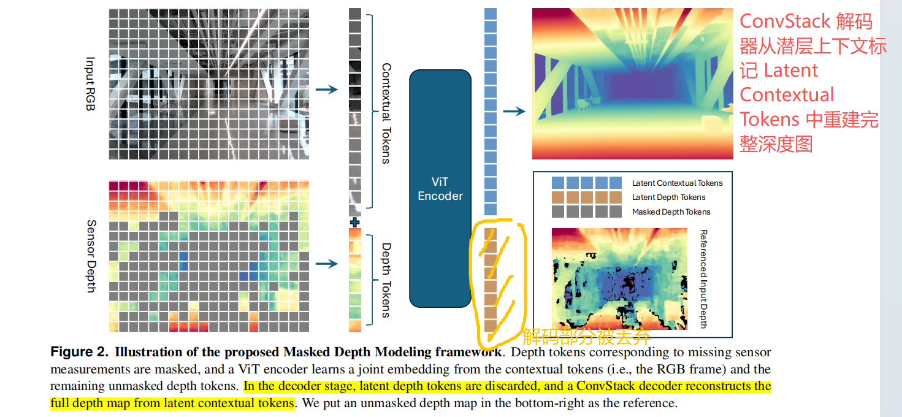

**2 Masked Depth Modeling**

**2.1 Separated Patch Embedding for RGB-D Inputs**

*Patch Embedding Layers.*

==【思路】==

每种模态均被独立投影为一系列 patch tokens，生成的 RGB tokens 与深度 tokens 在空间上对齐于同一二维网格 $\Longrightarrow$ ViT 编码器中的**自注意力层**能够学习联合表征，将 RGB 图像的外观上下文与深度测量的几何线索相结合 $\Longrightarrow$ 可利用丰富视觉上下文中的互补 complementary 信息，以及 near–far relationships 近远关系、共面性和空间连续性等基本几何先验

==【具体做法】==

设置 patch size 为 **14**，与 DINOv2 一致；RGB 帧和深度帧都被假设成可被 `patchsize=14` 整除的分辨率 $(H, W)$，那么整个模态帧最后都能被拆分成 $N=\frac{HW}{14^2}$ 的 tokens 数量。第 $i$ 个 RGB token: $c_i\in R^{n}$, 以及深度 token: $d_i\in R^n$.

*Positional Embeddings.*

==【思路】==

与标准 ViT 视觉输入相比，RGB-D tokens 序列需要编码两种位置信息：(1) 每个 tokens 的二维空间位置，以及 (2) 模态身份 / 模态识别，用于区分同一空间位置的 RGB tokens 与深度 tokens 。

==【做法】==

- 可共享的二维空间位置嵌入方法，同时适用于 RGB 和深度 tokens $\Longrightarrow$ 捕捉它们在图像平面上的空间位置

- 能够区分每个 tokens 来源于 RGB 或深度输入源的模态嵌入 $\Longrightarrow$ RGB tokens 的模态嵌入值设为 1 ，深度 tokens 的模态嵌入值设为 2 。

在进入 attention block 之前分别将位置嵌入加到 RGB 和深度 tokens 中

**2.2 Joint Embedding of RGB and Unmasked Depth for Masked Depth Prediction**

*Masking from Missing Depth Measurements.*

- 许多 RGB-D 样本条件良好，且缺失深度值<u>极少或不存在</u> $\Longrightarrow$ 仍具有重要价值，不应被舍弃 $\Longrightarrow$ 提供了丰富的配对外观-几何观测数据 $\Longrightarrow$ 尽可能多地纳入 RGB-D 样本，以支持 ViT 大规模训练。
- 单个 patch 可能包含有效与无效深度值的混合 $\Longrightarrow$ 基于各 patch 内的有效性统计，确保深度 tokens 具有统一且明确定义的掩码规则 $\Longrightarrow$ (1) 当某个 patch 深度数值完全缺失时，该 patch 将始终被屏蔽；(2) 对于同时包含有效和无效深度值的 patch 为其分配更高的掩码概率，例如在训练中设定为 $0.75$ ；(3) 若这两种情况的掩码 tokens 数量不足以达到目标掩码比例，则会随机抽取更多完全有效的深度 tokens 来补全掩码集。

深度图的整体 mask 率范围为 $60\%\sim 90\%$

*RGB-D Tokens for Vision Transformers.*

- ViT-Large encoder with 24 self-attention blocks
- 保留一个 `[cls]` token 以跨模态捕获全局上下文
- 仅保留最终编码器层的输出标记用于后续处理，而非与传统方法一样还提取中间层

采用了一种名为 ConvStack 的卷积解码器架构，该架构更适用于密集几何重建。

编码器输出后，**潜在深度 tokens **被丢弃，而<u>潜在上下文 tokens</u> 则作为空间分布的表征保留。

为注入全局场景上下文，`[cls]`  token **被广播并逐元素添加**到每个<u>潜在上下文 tokens</u> 上，从而为它们注入任务级别的语义信息。

*ConvStack Decoder.*

从尺寸为 $(h, w)$ 的低分辨率特征图开始，颈部通过核尺寸 kernel size 和步长 stride 都是 2 的堆叠残差块和转置卷积逐步**上采样**特征，每阶段空间**分辨率翻倍**，直至达到 $(16h, 16w)$ 。例如，如果输入是 $(14\times 14)$ 的小图，最终会恢复成 $(224\times 224)$ 的精细深度图。

在每个尺度上，通过图像坐标环形映射生成的 UV 位置编码被注入，以保持空间布局和纵横比。由此产生的多尺度特征金字塔被共享至所有任务头，既实现了特征的高效复用，又允许每个任务头解码其自身的密集输出。

> ViT Encoder 的 tokens 已经通过 positional embedding 知道 tokens 和 patch 的位置对应关系。
>
> 但一旦进入 ConvStack Decoder: **token 被 reshape 成 feature map 再经过多次转置卷积 / 上采样等操作**。由于卷积本身是平移等变的，不知道绝对位置，因此网络无法区分出具体位置空间位置了。
>
> 假设某一层的特征维度是 $H\times W$ ，对每个像素位置 $(i,j)$ 构造归一化坐标: $u=\frac{j}{W-1}, v=\frac{i}{H-1}$, 通常 $u/v$ 范围都是 $[0,1]$. 接下来构造 UV 位置编码:
> $$
> \mathrm{UV}_{pos}(i,j) = [\sin(2\pi u),\cos(2\pi u), \sin(2\pi v),\cos(2\pi v)]
> $$
> 得到一个 4 维连续 / 平滑 / 周期的位置编码。
>
> 将 UV 编码 **concat 或 add** 到 feature map: $F^{\prime}=\mathrm{Concat}(F,\mathrm{UV})\quad\mathrm{or}\quad F^{\prime}=F+W_{uv}\mathrm{UV}$.

最终深度预测结果通过**双线性上采样**处理，使其与原始输入分辨率相匹配。

*Attention Visualization.*

可视化最终编码器层的深度到 RGB 注意力图

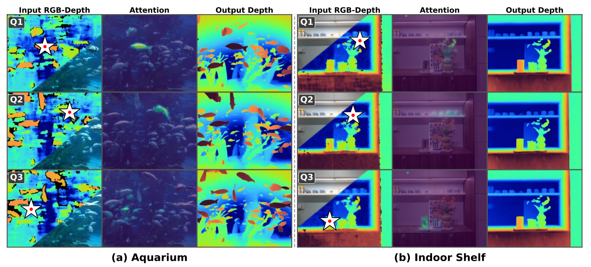

1. Input RGB-Depth 图像中指定的区域都能在 Attention 中比较敏感地找到；
2. Input RGB-Depth 图像中指定的不同区域具有不的深度，也能在 Attention 中比较敏感地找到；

**2.3 Training Details**

【视觉 backbone】24-layer ViT-Large encoder (ViT-L/14) $\Longrightarrow$ 官方 DINOv2 预训练权重初始化

【重建 decoder】没有预训练权重，参数随机初始化

【学习率】预训练 backbone 小学习率 $1e^{-5}$ 微调，剩余参数 $1e^{-4}$ 微调。在前 2000 次迭代中，编码器学习率从零线性 warm up 至 $1e^{-5}$ ，而解码器学习率直接从目标值开始。升温阶段结束后，步长衰减调度器会在每 25000 次迭代时将两个学习率各降低 $50\%$ 。

【损失函数】L1 损失

【优化器】常见的 AdamW 参数设置，0.05 weight decay

【梯度裁剪】1.0

【数据类型】BFloat 16

【训练过程】训练共进行 250000 次迭代，全局批量大小为 1024 ，通过 128 个GPU实现，每个 GPU 的批量大小为 8 。总耗时 7.5 天。

【图像数据增广】数据增强技术包含随机尺寸裁剪与水平翻转，以及一系列合成图像退化处理 —— 具体包括色彩抖动 / JPEG 压缩伪影 / 运动模糊 / 散粒噪声 —— 旨在提升模型在真实视觉条件下的鲁棒性。

**3 Data Curation Pipelines**

`LingBot-Depth-S` 仿真合成数据集 // `LingBot-Depth-R` 真实世界数据集

整合现有开源 RGB-D 数据集作为补充训练数据 $\Longrightarrow$ 通过高斯噪声人为破坏深度图 $\Longrightarrow$ 在训练过程中应用掩码策略 $\Longrightarrow$ 使用原始深度图作为重建目标，通过有效像素掩码排除缺失测量值。

**3.1 Synthetic Data Pipeline**

【思路】

显式地仿真真实世界**主动式 RGB-D 相机**的成像过程，生成具有自然缺陷的真实深度观测数据

【具体做法】

采用自持有 3D 资源，在 Blender 中同步渲染 RGB 图像 / 完美深度图 / 带有散斑图案的灰度立体图像对

$\Longrightarrow$ RGB 图像从立体图像对的**左摄像头**渲染，确保 RGB 外观与立体匹配产生的深度测量值在像素级保持对齐

$\Longrightarrow$ 使用广泛采用的**半全局匹配**（Semi-Global Matching, SGM）算法处理渲染的立体图像，生成模拟真实场景采集伪影的类传感器深度图

$\Longrightarrow$ 在 Blender 中配置了一对虚拟摄像机，并从 $0.05$ 至 $0.2$ 米的均匀分布中随机采样立体基线。摄像机焦距独立采样自16至28毫米的均匀分布，从而实现多样化的成像几何结构。

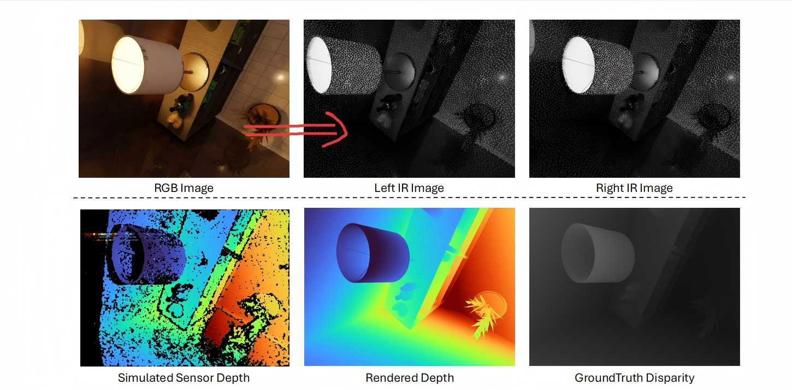

作者的合成数据集的优势在于：数据集规模比前人已有的高出几个数量级；高质量 3D 场景。

**3.2 Scalable RGB-D Capture Systems**

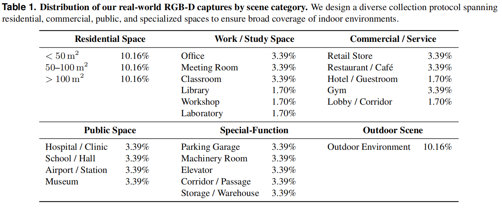

从采集的数据集分布来看，基本满足当前 embodied 的验证环境，从数据分布可以得到预训练出来的 model 可以作为 robot policy 的一种 backbone 继续去（预）训练。

由于真实拍摄图像缺乏无缺失 missing-free 深度图 $\Longrightarrow$ 采用 FoundationStereo 方法计算左右红外配对的立体视差，从而生成伪深度标签 $\Longrightarrow$ 执行左右配对校验，并剔除深度图中不一致的像素值

**3.3 Training Data Summary**

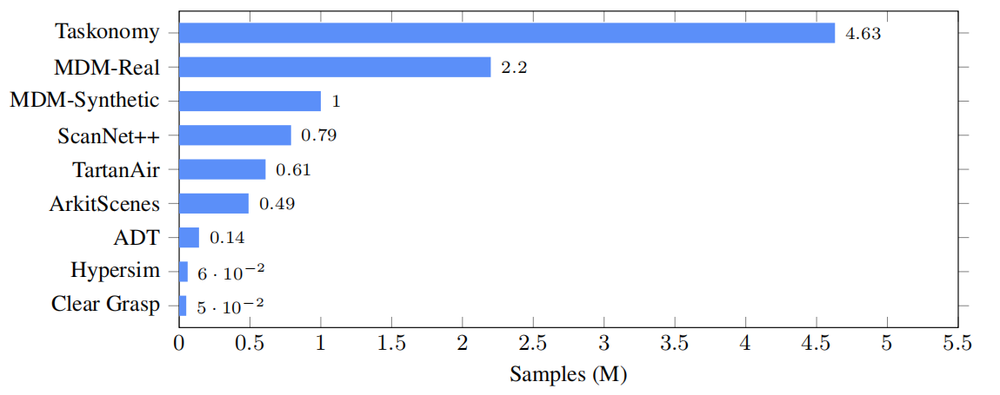

开源合成数据集不存在缺失的深度测量值 $\Longrightarrow$ 通过随机生成补丁化 tokens 来满足 $60\%-90\%$ 的预期掩码比例范围，且无需额外处理。对于现实世界中的开源数据集，其掩码策略同样以随机掩码采样为主，因为这些数据集的深度图相较于我们整理的数据更为完整。

**4 Experiments**

**4.1 Depth Completion: 预训练 MDM 模型在深度补全任务上的表现**

任务一：*Block-wise Depth Masking.*

通过**从真实深度数据中随机屏蔽不同大小的空间区域 / 区块** + **采用受 Kinect 噪声模型启发的加性高斯噪声和类似散粒噪声的扰动**，生成不完整的深度图，模拟消费级深度相机中常见的深度数据缺失现象

任务二：*Protocol 2: Sparse SfM Depth Inputs.*

根据 OMNI-DC 的方法，采用 ETH-SfM 数据集上的稀疏 SfM 观测数据，以评估 MDM 预训练模型的性能。

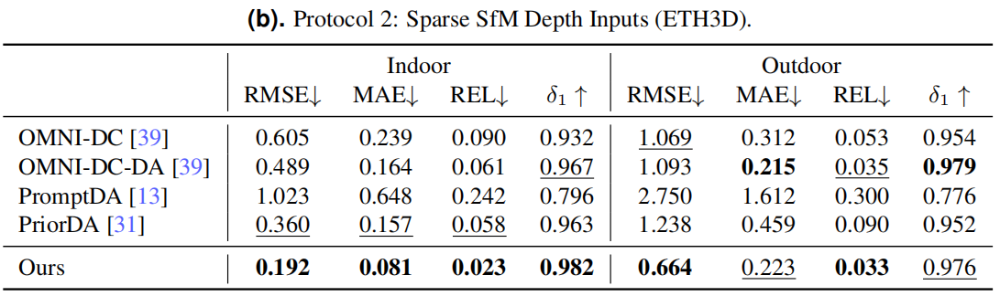

**4.2 Monocular Depth Estimation**

**4.3 FoundationStereo with MDM Pretraining**

**5 Extensions and Applications**

基于 LingBot-Depth 构建的扩展与应用，采用 Orbbec Gemini-335 摄像头作为 RGB-D 输入

**5.1 Video Depth Completion**

LingBot-Depth 模型可在多种具有挑战性的场景中显著降低 RGB-D 相机的时空不一致性。

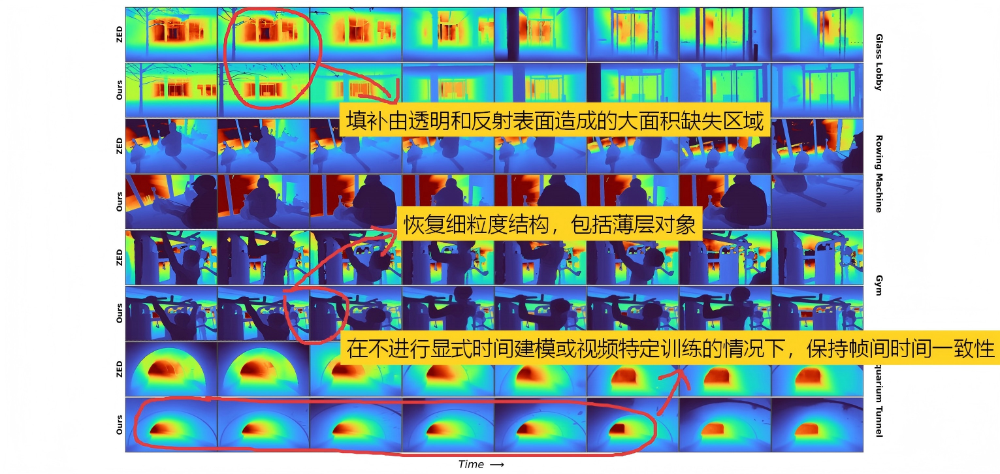

**5.2 Online 3D Point Tracking**

**5.3 Grasp Pose Generation in Real-World Robotics**

【硬件】

Rokae XMate-SR5 机械臂 / X Hand-1 灵巧手 / Orbbec Gemini 335 RGB-D 相机

【任务】

评估抓取性能在四种具有挑战性的物体上的表现，任务的难点在于包括透明和反光物品，这些物品通常无法被原始深度传感器检测到。

【流程】

对于 RGB-D 观测数据，首先将深度信息转换为点云，随后采用扩散策略预测 $N\times 22$ 的<u>灵巧手部姿态</u>。

该策略基于 DINOv2 (ViT-L/14) 提取的 RGB 特征和 Point Transformer 生成的点云特征，遵循类似 DP3 的架构。

模型在 HOI4D 数据集上进行训练，通过三维关键点对应关系将人手与物体的交互重新定向至灵巧手部构型。

【结论】

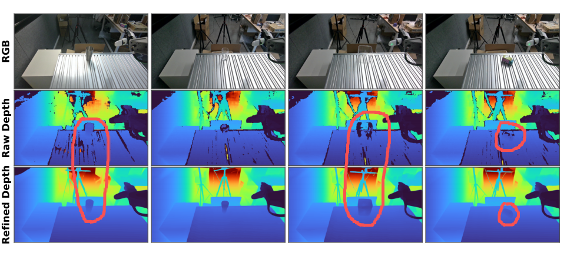

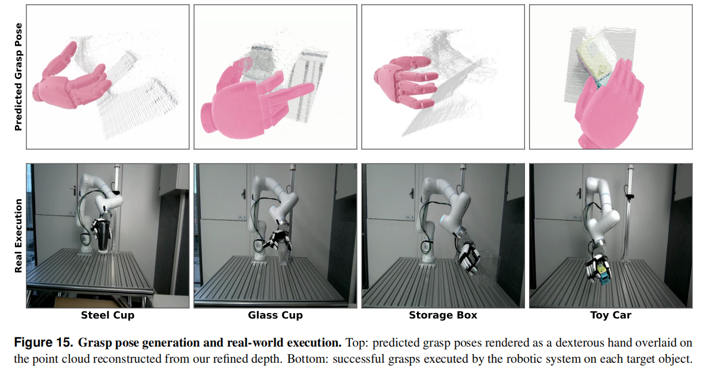

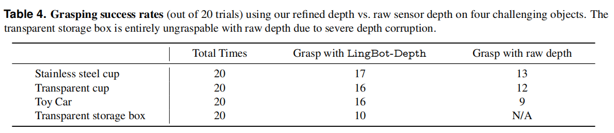

由于深度数据严重失真，透明存储盒完全无法通过原始深度进行抓取，表现出成功率 N/A ；而模型通过生成几何上合理的深度估计，成功率达到 $50\%$ ，尽管在高度透明表面偶尔会出现误差。

