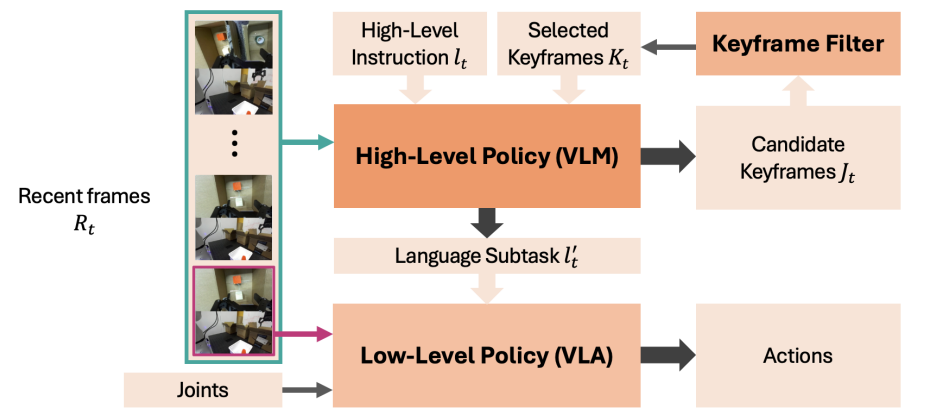
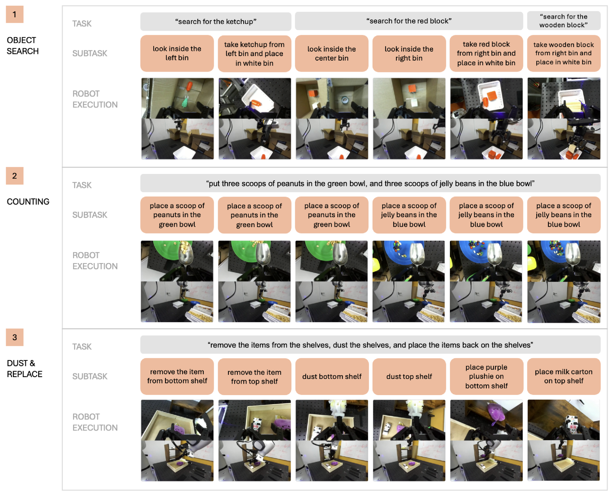
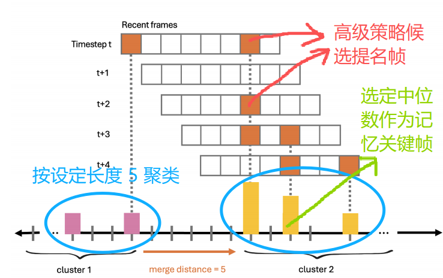
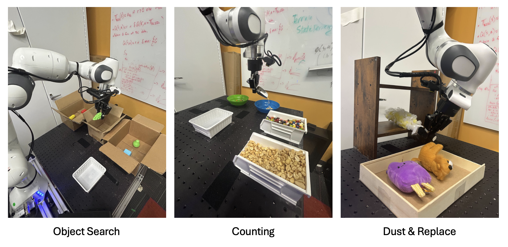
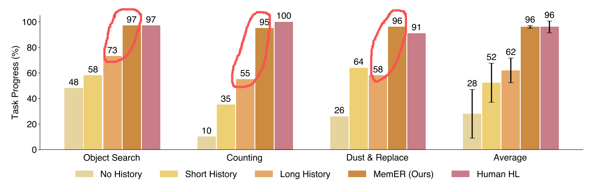
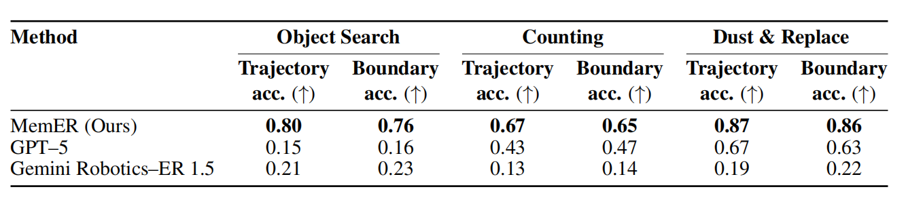
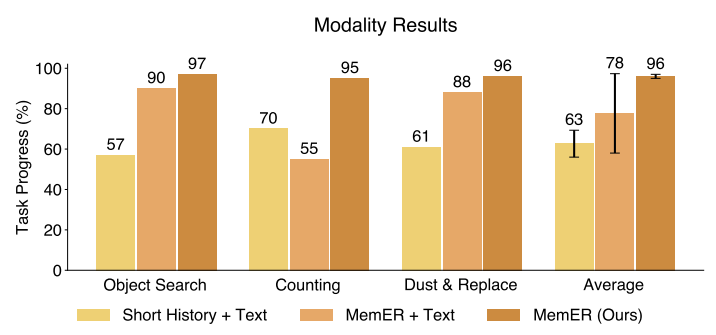

# MemER: Scaling Up Memory For Robot Control Via Experience Retrieval

**ABSTRACT & 1 INTRODUCTION**

【背景】

​		"The ability to **form** and **retrieve** memories is a crucial step towards robots solving complex, multi-step tasks."

​		人类依赖记忆执行任务 $\longrightarrow$ 本文目标：赋予 robotics 这种 memory 的能力便于执行 long-horizon 的能力

【现状】

$\Longrightarrow$ 将长期历史观测轨迹直接作为 condition: (1) 计算量大导致训练部署困难。 // (2) "brittle under covariate shift" 该策略在其自身状态分布下存在误泛化现象，导致部署期间因<u>演示策略</u>（产生演示数据集的策略）与<u>学习策略</u>（训模型得到的策略）所访问状态间的**协变量偏移累积效应**而造成性能下降 $\longrightarrow$ 会随着历史观测长度的增加而变得更加严重。具体做法：

（1）使用辅助损失扩展观测上下文 $\longrightarrow$ Learning long-context diffusion policies via past-token prediction

（2）微调预训练模型，借助原生 memory 能力实现动作预测 $\longrightarrow$ Sam2act: Integrating visual foundation model with a memory architecture for robotic manipulation

> 这些方法最多仅包含 $N=10$ 个最近的上下文帧，本文可选择**纳入跨越整个事件**的任务相关帧，此类帧可能包含超过 1000 帧。

作者认为：策略必须学会从完整的历史上下文中**筛选**并**存储**任务相关的信息，以防止在需要<u>长距离依赖关系</u>的任务上出现<u>内存占用激增</u>的情况。

  - 从长期历史观测无差别抽样出关键帧作为 condition: 可能引入无关或冗余信息
  - 从长期历史中压缩，具体做法：在像素空间压缩相似观测 $\longrightarrow$ 对静态相机有优势，但是无法兼顾腕部动态相机。
  - 从长期历史中显示提取可视化的记忆信息，具体做法：将所有历史观测数据压缩为末端执行器与场景中移动物体运动的二维视觉轨迹 $\longrightarrow$ 可扩展性差，对复杂 / 灵巧操作可能造成更难可视化的信息。

【提出】MemER: 分层策略框架

- high-level policy [Qwen2.5-VL-7B-Instruct] 经过训练，能够根据其经验选择并追踪先前相关的关键帧；
- high-level policy [Qwen2.5-VL-7B-Instruct] 在生成 <u>low-level policy 执行的文本指令，或者 subtask 内容</u>时，采用从其固定近期上下文中选定的关键帧和最新帧；
- high-level policy [Qwen2.5-VL-7B-Instruct] VLM 具有强先验知识，基于此：仅需 50 次带有<u>子任务注释</u>的远程操作机器人演示，即可使这些 VLMs 适应完成特定的记忆型任务。
- low-level policy [$\pi_{0.5}$] 生成动作块序列

【实验】3 个真实世界长程操作任务，时限：分钟级别

【结论】优于先前方法

> 如何理解 **brittle under covariate shift** ？
>
> 受到模仿学习行为克隆影响，训练的数据只覆盖 expert trajectory，但部署时 learner policy 有可能访问到新的状态分布，因此产生 covariate shift，并导致错误逐步累积，最终性能下降。covariate shift = 输入分布变化

**2 RELATED WORK**

**Memory for Long-Context Robot Policies.**

**Foundation Models in Robotics.**

**Video Keyframe Selection.**

问题：如何使用历史关键帧来更好地理解视频 / video-QA？

常规方法：通过**独立的 Multimodal Language Model** 调用来评估帧重要性，例如使用**一个模型**来评估每一帧的重要性 / 使用**一个轻量级**模型评估每一帧重要性后进行<u>非 uniform 采样</u> $\longrightarrow$ 作者工作使用**单一模型**进行<u>非 uniform 采样</u>。

**3 MEMER**

**3.1 PRELIMINARIES**

**Language-Conditioned Control Policies.**

​		chunk-wise 条件分布 $\pi(\boldsymbol{A}_{\boldsymbol{t}}|o_{t})$, $\boldsymbol{A}_t=[a_t,a_{t+1},\ldots a_{t+H-1}]$.

**Memory-Based Tasks.** 定义：由于环境中的部分可观测性，机器人策略必须利用过去信息才能成功完成的一组任务。

​		常规 $\pi(\boldsymbol{A}_{\boldsymbol{t}}|o_{t})$ 做不了，需要 $\pi(\boldsymbol{A}_{\boldsymbol{t}}|o_{0:t})$

**Hierarchical Policies.**

​		$\pi(\boldsymbol{A}_t|o_t)=\pi_l(\boldsymbol{A}_t|[\boldsymbol{I_t ,l_t^{\prime}},\boldsymbol{q}_t])\pi_h(l_t^{\prime}|\boldsymbol{I}_t,l_t)$

​		$\pi_h$ 的实现方式：使用独立的 VLM 或者与 low-level 共享权重。

**Data Collection for Hierarchical Policies.**

​		$(\boldsymbol{I}_t,\boldsymbol{q}_t,\boldsymbol{l}_t,\boldsymbol{l}_t^{\prime},\boldsymbol{a}_t)$ 一条总体语言指令 $\boldsymbol{l}_t$ 下包含若干有限个 sub-task 语言指令 $\boldsymbol{l}_t^{\prime}$。

在数据采集系统中，操作员执行预设子任务后按下按键即可进入下一阶段。

通过在 low-level VLA policy 训练集基础上补充 10-15 个**干预演示案例** $\longrightarrow$ 提升实际部署时的鲁棒性

**3.2 HIGH-LEVEL POLICY**

采用微调后的 VLM 作为 high-level policy，用于在闭环控制过程中**提名候选关键帧**并**预测 low-level policy 的子任务**。随后对候选关键帧进行**冗余过滤**，并将其添加至选定关键帧组中，high-level policy 在<u>预测下一个子任务</u>和<u>候选关键帧</u>时持续依赖该关键帧组。

【输入】当前时刻 $t$ 的前 $N$ 时刻的多视角图像 + 高级语言指令 $l_t$ + 选定关键帧 $K_t$

【输出】喂给 low-level policy 的子任务语言指令 + 候选关键帧组 $J_t$

【后处理】使用 "a simple 1D single-linkage clustering algorithm" 简单 1 维单链聚类算法，从候选关键帧组 $J_t$ 中选择关键帧 $K_{t+1}$

**Building Visual Memory.** $\longrightarrow$ 提出 "Keyframe Filter" 关键帧滤波器

​		构建视觉记忆的过程是在将候选关键帧组 $J_t$ 转化成关键帧 $K_{t+1}$ 的过程中。关键帧滤波器在时序索引上滤波，且该过程任务无关。

​		在时间步 $t$ 时，高层策略已生成 $J_{0:t} = (J_i)_{i=0}^{t}$，即截至时间步 $t$ 提名的候选集序列 $\longrightarrow$ 提取该序列中<u>每个提名帧的时间索引</u>，并将其合并为一个时间有序列表 $G_{0:t}$，同时保留了重复索引 $\longrightarrow$ 通过将彼此间隔不超过 $d$ 的关键帧索引进行分组，为 $G_{0:t}$ 中的所有候选索引创建簇 $C_i$ $\longrightarrow$ 每个簇 $C_i$ 选择中位数代表每个簇的关键帧 $\longrightarrow$ 最终成为关键帧 $K_t$

**3.3 PRACTICAL IMPLEMENTATION OF MEMER**

**Training the Low-Level Policy.**

​		在使用 DROID 数据集上微调的 $\pi_{0.5}$ 数据集进一步用自己数据微调

​		仅需 50 个长程演示轨迹及 10-15 个针对三项任务的干预案例即可

**Training the High-Level Policy.**

​		在所有三项任务中均采用单一 high-level policy 进行微调 $\longrightarrow$ 增强对象泛化能力

​		微调过程中冻结视觉编码器和投影层的权重

**Annotating Keyframes for the High-Level Policy.**

​		采用半自动标注流程为每个任务标注关键帧

		1. 识别连续子任务间的过渡点，并提取边界帧作为候选关键帧。
  		2. 人工标注员会审阅少量示范案例，为每个子任务制定简明标注规则 —— 根据哪种选项最能有效呈现视觉信息状态，确定该子任务段应选取首帧、末帧或无帧。
  		3. 该规则一旦确立，将按子任务类型固定，并自动应用于对应任务的所有演示，每个子任务段最多生成一个关键帧。

**Model Merging.**

​		经过精细的 VLM 微调后，由于训练数据仅包含最优专家演示， high-level policy 在应对 low-level policy 冻结和重试行为时往往会丧失部分鲁棒性。若将通用预训练模型的权重与该模型在特定任务数据上微调后的权重进行线性插值，既能保持预训练模型的鲁棒性和泛化能力，又可实现对新任务的适应性调整。
$$
\theta=(1-\alpha)\cdot\theta_{\mathrm{pre}}+\alpha\cdot\theta_{\mathrm{ft}}
$$
去微调过后的 $\alpha=0.8$ 权重的参数和剩下 $0.2$ 比重的原预训练模型参数直接 merge

**Closed-Loop Deployment.**
$$
\pi(\boldsymbol{A_t}|o_{0:t})=\underbrace{\pi_l(\boldsymbol{A_t}|\boldsymbol{I_t},\boldsymbol{q_t},l_t^{\prime})}_{\text{2Hz}}\cdot\underbrace{\pi_h(l_t^{\prime},\boldsymbol{J_t}|\boldsymbol{I_{t-N+1:t}},\boldsymbol{K_t})}_{\text{1Hz}}
$$
在各自的服务器上运行这两种策略

选择异步运行策略 $\longrightarrow$ 高层策略预测下一个子任务时，低层策略会根据最新预测结果进行调整 $\longrightarrow$ 提升部署过程中响应速度和稳定性

**4 EXPERIMENTS**

**任务集**

1. **Object Search**

   【任务】实验中，随机将三至五个物体放置在三个不透明的容器中。随后，机器人会依次接收三个待检索物体的指令，且每次发出新指令前，必须先尝试检索前一个物体。机器人能记住已检查过的容器及其内容物，跳过重复搜索，并仅在必要时探索其他容器。若已检查过目标容器内部，则应直接进入该容器。

   【指标】通过两个标准对三个对象中的每个对象的任务完成情况进行评估：成功检索和最优路径（避免不必要的探索），最高得分为 6 分（每个对象 2 分）。

2. **Counting Scoops**

   【任务】在本任务中，机器人需要将两种不同原料的精确数量分装到两个不同的碗中。机器人需持续记录每种原料已获取的分装量。该计数任务曾在先前研究中出现，通过增加原料数量、调整分装量指令以及改变分装次数，使其需要进行更长时间跨度的推理。该任务具有挑战性，因为每种原料对应的主帧几乎无法区分，导致漏检或重复的主帧会使高级策略误判其进度。

   【指标】任务完成度通过每种成分请求量与实际获取量之差的绝对值进行衡量，因此指标值越低越好。

3. **Dust & Replace**

   【任务】在这个任务中，机器人需要完成以下操作：从双层货架上取下物品、拿起吸尘器、对两个货架进行除尘，最后将物品放回原位。在除尘过程中，我们会将吸尘器放回一个位置，使得根据最近的操作记录难以判断哪个货架已经完成除尘。这项任务颇具挑战性，因为机器人需要同时记住两类信息：物品的原始位置，以及哪个货架（如果有的话）已经完成除尘。

   【指标】任务完成度通过以下二元指标评估：每个物品在货架上正确更换的二元成功指标，以及每个货架完成除尘的二元成功指标，最高得分为 4 分。

**4.1 MAIN RESULTS**

**====> [能力对比] 与无记忆相比，具有记忆的方法带来了何种效果？**

No History: 直接用当前帧；Short History: 过去 8 帧；Long History: 过去 $8\times 4=32$  帧；Human HL: 标准。

说明直接把过去的历史帧嵌入 VLM 并没有起到线性增益 $\longrightarrow$ 没有 scaling up 能力 $\longrightarrow$ 关键在于对历史记忆的提取

**====> [high-level policy 的意义] 与即插即用的 VLM 的相比，可微调的开源 VLM 能带来那些收益？**

直接把 API 替换掉微调 model 会导致完全失效 $\longrightarrow$ API 响应存在延迟 $\longrightarrow$ 在 hold out 数据集上离线测评

轨迹准确率 $\longrightarrow$ 已知低级策略在该时刻执行的真实子任务指令 $\longrightarrow$ 在轨迹中每个时间步正确预测子任务的频率

边界准确率 $\longrightarrow$ 子任务间转换点为中心的固定窗口内轨迹准确率 $\longrightarrow$ 通过判断何时切换到下一个子任务

**====> 视觉记忆的意义？与记忆其他模态（文本模态）相比，视觉记忆能带来哪些优势？**

"Short History + Text" $\longrightarrow$ 最近的 $N=8$ 帧以及预测的文本子任务作为记忆

"MemER + Text" $\longrightarrow$ 交替使用预测的关键帧和文本子任务作为记忆

纯粹使用语言形式的子任务记忆未能捕获成功完成该任务所需的所有信息。

交替视觉记忆和文本记忆的方法，将会导致过度关注存储于记忆中的文本，而上述原因可能导致该文本存在错误，进而忽略视觉记忆中存储的重要信息

**5 DISCUSSION AND FUTURE WORK**

1. 持续积累具有信息量的关键帧，但当前缺乏在关键帧数量过多时进行**剔除的机制** —— 这一问题可能出现在需要数小时记忆的任务中。使高级策略能够推理哪些关键帧不仅应添加，还应删除以构建可修改的长期记忆。
2. 采用改进的模型缓存技术和优化的分词技术，可进一步降低推理延迟，从而实现更频繁的控制。
3. 多模态感知：触觉 / 声音；
4. 多构型 / 多具身 / 跨场景 / 移动 $\longrightarrow$ **空间记忆**
