# MemoryVLA: Perceptual-Cognitive Memory In Vision-Language-Action Model For Robotic Manipulation

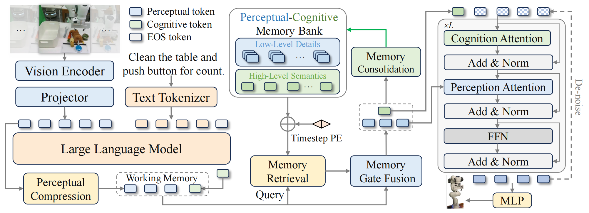

**Abstract & 1 INTRODUCTION**

【背景】

- 操作任务固有非马尔可夫属性，常规 VLAs 缺乏对长程 / 时序依赖任务的上下文考量。

  非马尔可夫属性：早期动作产生的结果对当前决策 / 动作产生有影响。

- 现实操作任务中，在执行前后几乎无视觉差异，难以判断该动作是否已完成 $\Longleftarrow$ memory-based benchmark 设计原理 

- 人类依赖<font color=red>活跃（原文是 working）记忆</font>（通过短暂神经冲动）来<font color=blue>缓存短暂存在的表征</font>以实现即时控制，而海马体系统则<font color=blue>保留字面意义上的情景细节及过往经验的语义核心</font>以供<font color=red>长期记忆</font>。

  大脑机理：执行过程中，working memory 活跃记忆从情景记忆中提取决策相关的情境信息，并将其与当前表征整合，通过小脑 cerebellar 控制引导动作，同时<font color=red>将新经验巩固到情景记忆</font>中。

【提出】

Memory VLA: 面向长程操作任务的 Cognition-Memory-Action "认知—记忆—动作" 框架

- 预训练 VLM 编码观测形成 *perceptual* 和 *cognitive token* $\Longrightarrow$ 场景观测输入给视觉编码器得到 perceptual token + 预训练 LLM backbone 中的强先验知识相结合得到的 cognitive token $\Longrightarrow$ working memory 活跃记忆 $\Longrightarrow$ 类似于与短期记忆相关的视觉皮层和前额叶皮层的神经活动。

- *Perceptual-Cognitive Memory Bank* $\Longrightarrow$ 设计理念源于海马体启发 $\Longrightarrow$ 存储 <u>从这些 tokens 中整合出的</u> <font color=red>低级细节</font> 和 <font color=red>高级语义</font>

  > Q: 如何从这些 tokens 中分离出这两个含义差异很大的信息的？

- working memory 活跃记忆从 *Perceptual-Cognitive Memory Bank* 中检索<font color=red>决策相关条目</font>，并伴随时序位置编码，这些通过<font color=green>门控机制</font>与当前 tokens 自适应融合，同时更新 *Perceptual-Cognitive Memory Bank* 。

  当容量达到上限时，系统会将时间上相邻且语义相似的条目进行整合，以紧凑方式保留关键信息。

  > Q: 更详细的细节？如何检索？如何设计门控机制？

- 以记忆作为条件的 diffusion action expert 输出时序关联的动作序列

【实验】

150+ 仿真任务 // 3 台机器人的实机实验

【结论】

比 CogACT 和 $\pi_0$ 效果好，多个实验达到 SOTA

**2 RELATED WORKS**

**Vision-Language-Action Models** 

**Temporal Modeling in Robotics**

- Octo / RoboVLMs / Interleave-VLA: 采用 VLM 范式对机器人视频数据进行建模，以实现图像与文本交错的格式呈现 $\Longrightarrow$ 在概念上优雅，但是复杂计算成本
- RoboFlamingo: 将 "视觉-语言" 表征压缩为潜在 token，并通过 LSTM 进行传播 $\Longrightarrow$ 潜在表征以相对粗略的方式获取，而精细的感知历史信息则被大部分舍弃
- TraceVLA: 采用不同路径，将历史状态描绘为当前帧上的轨迹 $\Longrightarrow$ 舍弃了丰富的语义细节
- UniVLA: 将历史行为整合到输入提示中，首次尝试进行时序建模

**3 METHOD**

**3.1 OVERVIEW OF MEMORYVLA**

**Problem Formulation**

给定图像 $I\in\mathbb{R}^{H\times W\times3}$ 语言指令 $L$ ，VLA 直接映射出动作: $\mathcal{A}=(a_1,\ldots,a_T)=\pi(I,L)$ chunk 形式输出，$a_t=[\Delta x,\Delta y,\Delta z,\Delta\theta_x,\Delta\theta_y,\Delta\theta_z,g]^\top$

**Overview**

**3.2 VISION-LANGUAGE COGNITION MODULE**

perceptual tokens: 并行的 DINOv2 + SigLIP 骨干网络对<u>第三人称视角</u> $I$ 进行特征提取，通过 SE bottleneck (*Squeeze and Excitation, 2018 CVPR*) 实现感知压缩模块，随后将这些 tokens 压缩为紧凑的 perceptual tokens 集合 $p\in R^{N_p\times d_p}$ ，其中 $N_p=256$ 。

> 还没看代码，根据论文文献推知 perceptual tokens 应该是 `(batchsize, num_perceptual_tokens=256, d_perceptual_tokens=...)` 

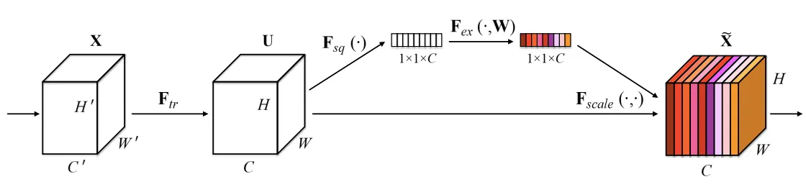

SE-Net 通过**通道注意力**让网络学会自适应地重新校准通道特征。包含：（1）Squeeze, 对每个通道做全局平均池化，将空间维度 $(H\times W)$ 压缩为 $1\times 1$ ；（2）Excitation, 用两个全连接层学习通道间的非线性关系，生成通道权重；（3）Scale, 用学习到的权重 $s$ 对原始特征 $X$ 进行逐通道加权。但是具体<font color=red>如何把 SE bottleneck 网络融合进这种**类似序列的张量**中？这个需要看代码才能更详细地知道</font>。

---

cognitive tokens: 原始视觉 tokens 通过线性层投影至语言嵌入空间，并与 tokenized 指令进行拼接后输入 LLaMA-7B 模型<font color=brown>（Prismatic VLM 的语言 backbone 就是 LLaMA）</font>，`EOS` token 位置的对应输出被取为 cognitive token $c \in R^{1 \times d_c}$ ，以紧凑形式表示高级认知语义。

---

perceptual tokens $p$ 和 cognitive tokens $c$ 一起形成了 working memory.
$$
M_{\mathrm{wk}}=\{p\in\mathbb{R}^{N_p\times d_p},c\in\mathbb{R}^{1\times d_c=N_c\times d_c}\} \quad\text{单个 timestep}
$$
但是 working memory 只反映了<font color=red>当前时间步长的短期记忆，视觉语言信息的聚合，且缺乏时间依赖性</font>

**3.3 PERCEPTUAL-COGNITIVE MEMORY MODULE**

解决长期记忆问题，提出 Perceptual–Cognitive Memory Bank (PCMB):
$$
M_{\mathrm{pcmb}}=\{m^{x}\mid x\in\{\mathrm{per},\mathrm{cog}\}\} \\ 
m^{x}=\{m_{i}^{x}\in\mathbb{R}^{N_{x}\times d_{x}}\}_{i=1}^{L},\quad x\in\{\mathrm{per},\mathrm{cog}\}
$$
$m_i^{p}$ $\Longrightarrow$ 精细的视觉细节；$m_{i}^{c}$ $\Longrightarrow$ 高层次的语义摘要。该数据库每个流最多可维护 $L$ 个条目。

**Memory Retrieval ====> 根据当前 working memory 从 PCMB 中检索出最相关的 memory**

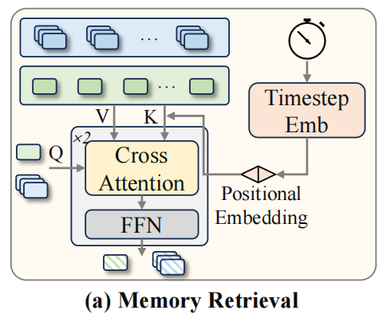

每个 timestep 的包括 perceptual tokens 和 cognitive tokens 的短期记忆 $m_i^x$ 被使用时间步对应的正弦位置编码相加，作为 Key
$$
K^x=[m_1^x+\underbrace{\mathrm{TE}(t_1)}_{\text{PCMB中当前位置对应的timestep}};\ldots;m_L^x+\mathrm{TE}(t_L)]\in R^{LN_x\times d_x},x\in\{\mathrm{per},\mathrm{cog}\}
$$
同时保留原始不加时间步位置编码的序列作为 Value:
$$
V^x=[m_1^x;\ldots;m_L^x]
$$
进行注意力计算：
$$
\hat{H}^x=\mathrm{softmax}\left(\frac{q^x(K^x)^\top}{\sqrt{d_x}}\right)V^x,\quad q^x\in\{p,c\},\quad x\in\{\mathrm{per,~cog}\}
$$
该注意力操作后接一个 FFNN 以完成一个 Transformer 层，应用 2 个此类层可得到最终检索的嵌入向量 $H_p$ 和 $H_c$ 。

**Memory Gate Fusion ====> 当前 working memory 和最相关的 memory 进行门控融合**

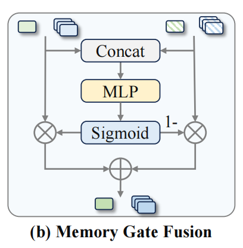
$$
g^x=\sigma\left(\mathrm{MLP}(\mathrm{concat}[x,H^x])\right)\quad x\in\{\mathrm{per,~cog}\}
$$

> $g^{x}$ 本质上可以理解成一个评分，因为通过 $\sigma$ sigmoid 激活函数，计算得到的取值范围是 $[0, 1]$

然后进行线性加权 memory-augmented representation ：
$$
\tilde{x}=g^x\odot H^x+(1-g^x)\odot x
$$
生成的记忆增强 memory-augmented 特征 $\hat{p}$ 和 $\hat{c}$ 被传递至记忆巩固阶段

**Memory Consolidation**

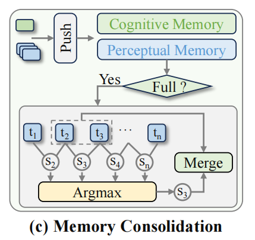

当存储条目数量超过 $L$ 时，系统会<font color=red>在每个 perceptual stream 和 cognitive stream 中</font>计算**相邻条目之间的余弦相似度**。
$$
i_x^*=\arg\max_{i=1,...,L-1}\cos(\tilde{x}_i,\tilde{x}_{i+1})
$$
随后选取各流中相似度最高的条目对，通过向量平均法进行合并，从而降低冗余度。
$$
m_{i_x^*}^x\leftarrow\frac{1}{2}\left(\tilde{x}_{i_x^*}+\tilde{x}_{i_x^*+1}\right),\quad x\in\{\mathrm{per},\mathrm{cog}\}
$$
**3.4 MEMORY-CONDITIONED ACTION EXPERT ====> 将记忆融入动作生成当中**

采用 Diffusion Transformer，并结合 DDIM ，通过 10 步去噪实现高效精准的轨迹生成。该架构通过逐步去噪含有噪声的动作 tokens 序列，最终生成精确的连续动作。

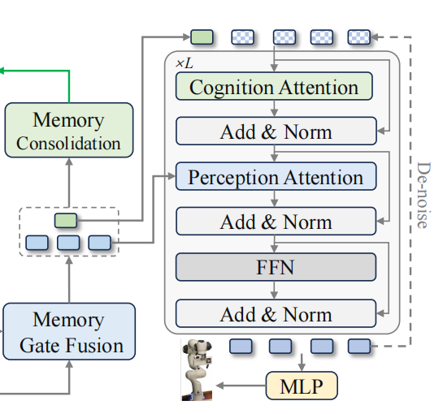

1. 将噪声动作 tokens 注入去噪时间步的正弦编码，并与认知表征 $\hat{c}$ 进行拼接
2. "Cognition-Attention" 层通过高层次语义引导对过程进行调控<font color=blue>（认知表征 $\hat{c}$ 是单独的 token 因此和添加噪声的 action tokens 进行拼接）</font>，而 "Perception-Attention" 层则补充来自感知特征 $\hat{p}$ 的精细视觉细节<font color=blue>（感知特征 $\hat{p}$ 是序列 tokens 因此和添加噪声的 action tokens 进行互注意力计算）</font>
3. 通过 FFNN 对组合表示进行优化，以获得该步骤的去噪动作。

模型采用预测动作与目标动作之间的 MSE 进行训练，最终的去噪向量通过 MLP 生成连续的 7 自由度机器人动作。

**4 EXPERIMENTS**

**4.1 EXPERIMENTAL SETUPS**

**Simulation and Real-world Benchmarks.**

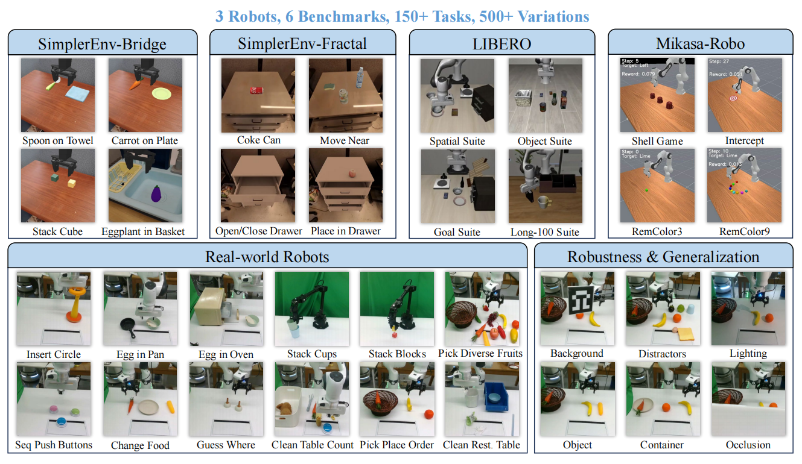

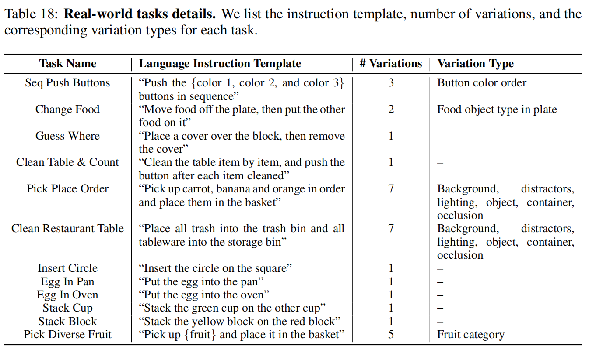

**Implementation Details ====> 重点在于如何训练**

参考附录文档中关于 **SimplerEnv-Bridge** 的手段：

"Each episode is unpacked into consecutive frames tagged with its episode ID." 每个 episode 是一条完整的演示数据；一条 episode 中的每帧 frame 包含一张第三视角的 RGB 图像 / 动作 / 语言指令 / episode ID; 而 episode ID 用于追踪时序连续性。

```
Episode 001: [frame_0, frame_1, frame_2, ..., frame_T]
                ↓        ↓        ↓           ↓
            (ep_id=1)(ep_id=1)(ep_id=1)  (ep_id=1)
Episode 002: [frame_0, frame_1, frame_2, ..., frame_T]
                ↓        ↓        ↓           ↓
            (ep_id=2)(ep_id=2)(ep_id=2)  (ep_id=2)
```

---

"During training, batches are filled sequentially with frames from a single episode whenever possible." 同一 episode 内的 frame 有连续的时间关系，而正好 Memory VLA 需要学习 episode 内的长期依赖，因此一个 batch 就是一条序列中的一部分。

```
Batch 1:
┌─────────────────────────────────────────┐
│ ep_001_f0 │ ep_001_f1 │ ep_001_f2 │ ... │ ep_001_f15 │
└─────────────────────────────────────────┘
     ↑           ↑           ↑              ↑
   全部来自同一个 episode (ep_001)
```

----
"Before an episode ends before the batch is complete, the remaining slots are filled with frames from the following episode." 优先保证单 episode 内连续性，episode 边界处允许跨 episode 填充，但会记录边界位置，避免混淆时序。

```
假设 batch_size = 16，episode 001 只剩 10 个 frame：
Batch 1:
┌────────────────────────────────────────────────────────────┐
│ ep_001_f5 │ ... │ ep_001_f14 │ ep_002_f0 │ ... │ ep_002_f5 │
└────────────────────────────────────────────────────────────┘
     ↑                              ↑
  episode 001 剩余部分        episode 002 开头部分
```

---

"A new batch then continues from the position where the previous one stopped, ensuring that in-episode temporal order is always preserved." 

```
数据流：
ep_001: [f14, f15, f16, ..., f28, f29, f30, f31, ..., f45]
              ↓                    ↓
         Batch 1 从这里开始    Batch 2 从这里继续
              ↓                    ↓
Batch 1: [f14, f15, ..., f29]   (16 frames)
Batch 2: [f30, f31, ..., f45]   (继续，不重复，不跳跃)
```

---

真实世界中，常规任务每个任务包含 50 至 150 个 demos 样本，而长时序任务每个任务需使用 200 至 300 个 demos 样本。常规任务的内存长度设定为 16 ，长时序任务则为 256 。

**4.2 SIMULATED EVALUATION ON SIMPLERENV ====> 在 SimplerEnv 仿真环境上表现如何**

**Training and Evaluation Setup**

**Evaluation Results on SimplerEnv-Bridge**

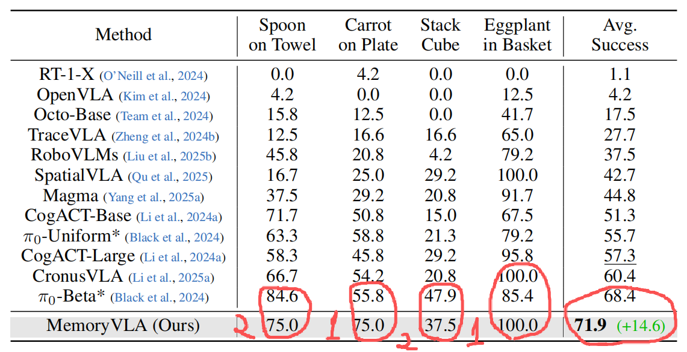

**Evaluation Results on SimplerEnv-Fractal**

**4.3 SIMULATED EVALUATION ON LIBERO ====> 在 LIBERO 仿真环境上表现如何**

**Training and Evaluation Setup**

**Evaluation Results on LIBERO**

**4.4 SIMULATED EVALUATION ON MIKASA-ROBO ====> 在 MIKASA-ROBO 仿真环境上表现如何**

**Training and Evaluation Setup**

**Evaluation Results on Mikasa-Robo**

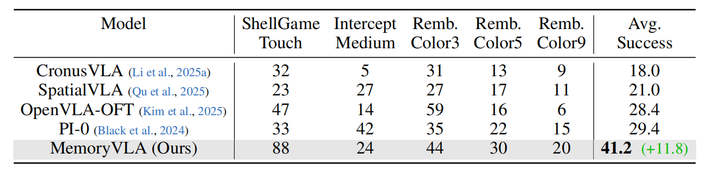

**4.5 REAL-WORLD EVALUATION**

**Training and Evaluation Setup**

Franka + WidowX // 固定在正前方视角的 Intel RealSense D435 RGB 相机 // 640×480 下采样到 224×224 // ROS

General: 50-150 条演示数据 / 任务，随机化的初始状态

Long-horizon: 200-300 条演示数据 / 任务，随机初始化状态 ====> 分步评分

**Evaluation Results on Real-world ====> 在真实环境上表现如何**

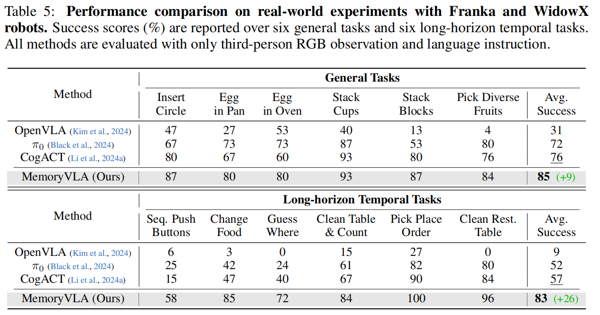

**4.6 ABLATION STUDIES**

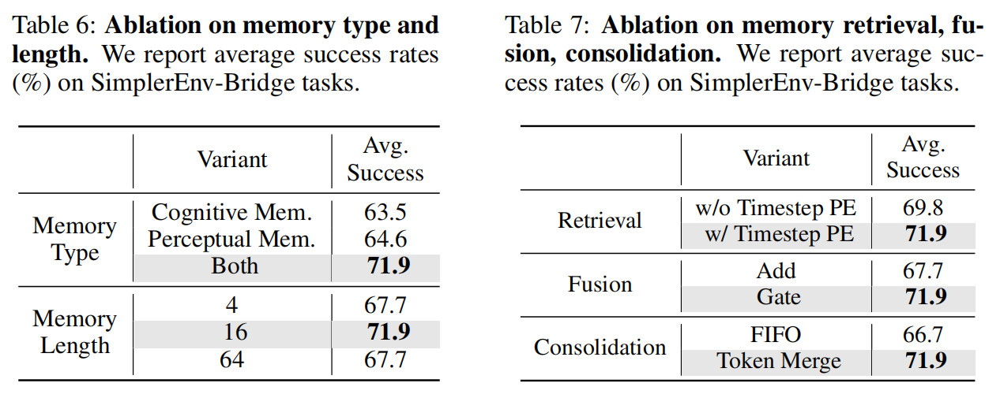
