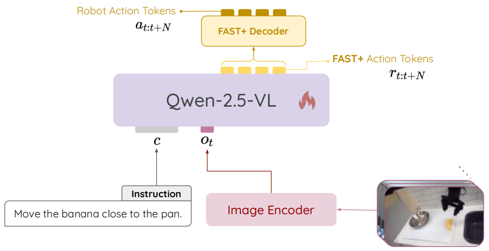
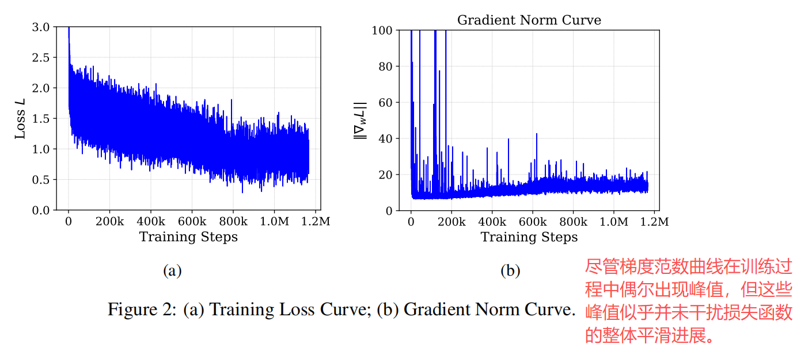
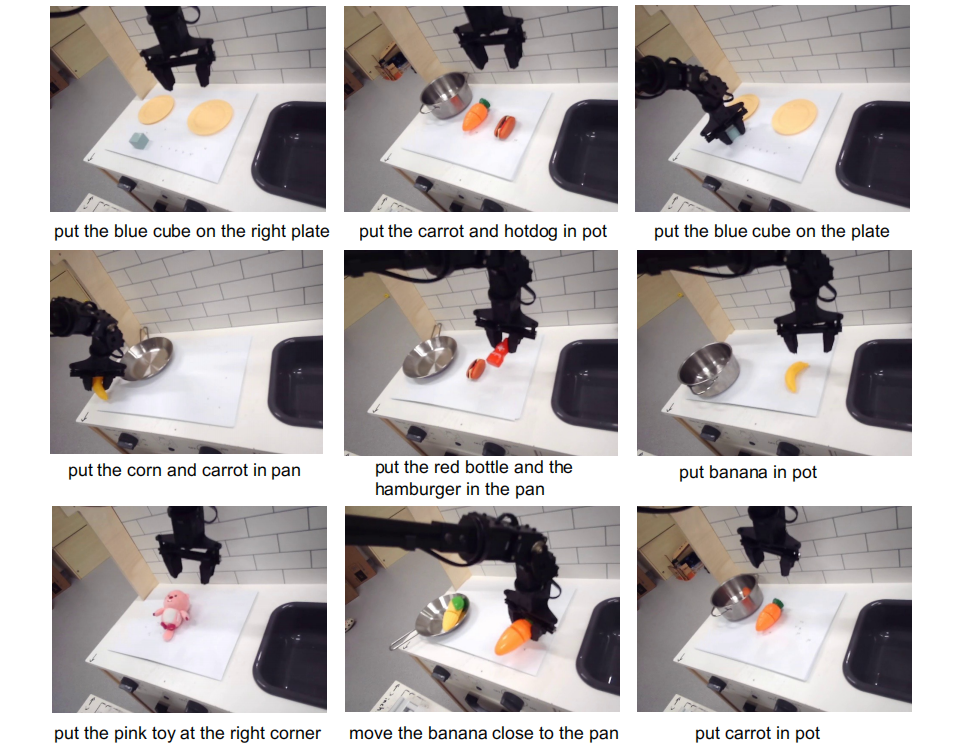
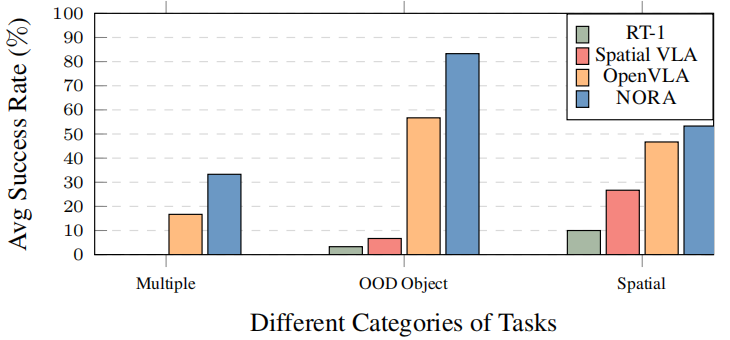
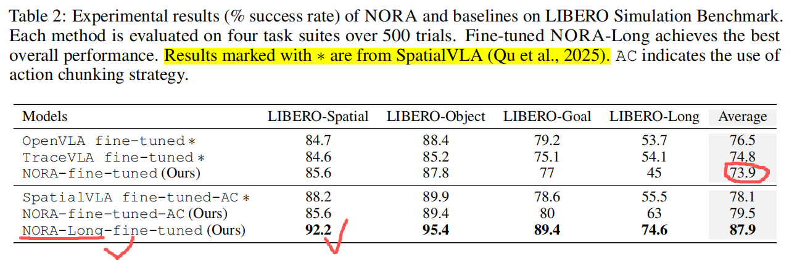
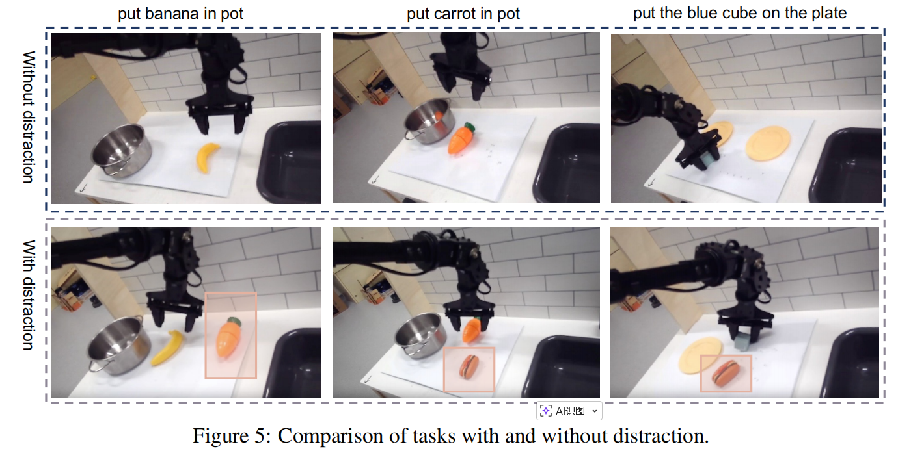
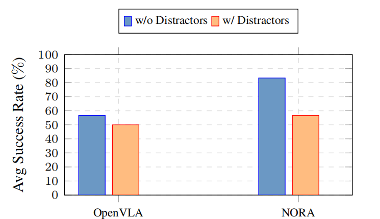

# NORA: A SMALL OPEN-SOURCED GENERALIST VISION LANGUAGE ACTION MODEL FOR EMBODIED TASKS

**ABSTRACT**

challenge: (1) **视觉编码**容易导致抓取任务失败 (2) VLA 的**大体量参数**导致比较高的计算负担，限制了速度和效率

提出 Nora: 3B 参数，基于 Qwen-2.5-VL-3B 骨干模型配合 FAST+ tokenizer 实现动作序列生成，在 970k 真实机器人演示数据中预训练得到

**1 INTRODUCTION**

现有的 VLAs 通常规模庞大：OpenVLA / TraceVLA / ECOT / EMMA-X 

通过结合视觉和语言理解的 CoT 机制来增强机器人系统的 reasoning 能力，从而提高任务执行的准确性 $\longrightarrow$ CoT 方法在任务执行过程中需要<font color=red>先处理中间推理步骤</font><font color=green>再生成新的动作</font> $\longrightarrow$ 以显著增加的计算开销为代价

提出 NORA: **N**eural **O**rchestrator for **R**obotic **A**utonomy <u>基于 OXE 大规模数据集</u>预训练得到的 3B 模型

**NORA** = *Qwen-2.5-VL-3b* 骨干模型 + *FAST+* 分词器 $\longrightarrow$ 在不需要 aciton grid 和空间 embedding 的情况下优于 SpatialVLA $\longrightarrow$ 证明这样的组合具有良好的空间理解能力

通过系统性实验分析了不同动作预测策略的影响，其中包含 single-step 预测与 chunk-size 预测的详细对比，从而验证了本方案在提升动作生成效率方面的有效性。

实验：LIBERO + 真机，比大参数 VLAs 性能更加

**2 PRELIMINARIES**

**2.1 VISION-LANGUAGE MODELS (VLMS)**

从预训练 VLM 中微调的 VLAs 显著受益于这些 VLM 所经历的互联网规模图像与文本预训练 $\longrightarrow$ 这种预训练赋予了 VLA 对视觉语义的深刻理解，使其能够将语言扎根于视觉世界，并将这种理解转化为有意义的机器人动作 $\longrightarrow$ VLM 是 VLA 良好骨干。 

Qwen2.5-VL $\longrightarrow$ 一个显著特点是它在训练过程中使用了**原生图像分辨率**，目的是增强模型对真实世界尺度和空间关系的感知 $\longrightarrow$ 更精确地理解物体的尺寸和位置，从而在**物体检测和定位**等任务中提升性能

**2.2 VISION-LANGUAGE-ACTION MODELS (VLAS)**

VLA 主要分为 2 类：连续动作模型采用扩散过程生成连续动作空间中的平滑轨迹；离散 token 模型将机器人动作表示为离散 token 序列。

**2.3 ACTION TOKENIZATION**

在机器人系统中，动作通常以跨越多个自由度的连续控制信号形式呈现，例如在 $(x,y,z)$ 方向的平移运动以及 roll / pitch / yaw 方向的旋转运动。为确保与基于 Transformer 的架构兼容，业界普遍采用**分箱方法**对这些连续动作进行离散化处理。该方法通过<u>基于分位数的策略</u>，<font color=red>**将机器人动作的每个维度映射到 256 个离散分箱中**</font>，既能有效抵御异常值干扰，又可保持足够的动作细节粒度。

为了进一步提高预训练效率，采用了一种快速分词方法，该方法**在每个时间步长上**对**动作维度**应用<font color=red>**离散余弦变换**</font>（Discrete Cosine Transform, DCT）。这使得联合动作组件<u>去相关化</u>，并能够使用字节对编码（Byte-Pair Encoding, BPE）将其压缩成<u>更短、更高效</u>的序列。由此产生的表示减少了词汇表大小并加速了收敛，同时使动作数据的结构与语言模型友好的分词统计保持一致。在推理过程中，NORA 使用了约 8.3GB 的 GPU 内存。

**3 NORA**



**3.1 ARCHITECTURE**

模型 $$M$$ 的输入由自然语言任务指令 $$c$$ 和时间 $$t$$ 时刻的视觉观测帧组成，视觉观测包含 $$n$$ 帧图像：$$o_t = [I^t_1, \ldots, I^t_n]$$ ，它们被拼接形成整体输入：$$X_t = [o_t, c]$$ 。

这部分代码在 `nora/inference/nora.py` 中的 `Nora.inference()` 方法中体现：

```python
    # --- Prepare Inputs ---
    # Ensure image is PIL Image for processor compatibility
    if not isinstance(image, PIL.Image.Image):
        image = PIL.Image.fromarray(image)
    # Construct messages in the expected chat format.
    # Note that nora expects image of size 224 by 224
    messages = [
        {
            "role": "user",
            "content": [
                {
                    "type": "image",
                    "image": image,
                    "resized_height": 224,
                    "resized_width": 224,
                },
                {"type": "text", "text": instruction},
            ],
        }
    ]
    # Apply chat template to get the text input for the model
    text = self.processor.apply_chat_template(
        messages, tokenize=False, add_generation_prompt=True
    )
    # Process vision information (depends on your process_vision_info function)
    image_inputs, video_inputs = process_vision_info(messages)
    # Prepare inputs for the model using the main processor
    inputs = self.processor(
        text=[text], images=image_inputs, videos=video_inputs, padding=True,
        return_tensors="pt",
    )
    # Move inputs to GPU
    inputs = {k: v.to(self.device) for k, v in inputs.items()}
```

---

NORA 利用一个预训练的视觉语言模型 $M$ 来<font color=red>**自回归地**</font>预测一个 action chunk ，该动作块编码了从时间 $$(t)$$ 到 $$(t+N)$$ 的未来动作，记作 $$a_{t:t+N} = [a_t, \ldots, a_{t+N}]$$ 。动作块 $$a_{t:t+N}$$ 被表示为一个离散 token 序列：$$R = [r_t, \ldots, r_{t+N}]$$ 这些 token 在训练阶段通过 ***FAST+* 机器人 tokenizer** 编码得到。

VLM $$M$$ 通过自回归方式生成该动作块对应的 token 序列 $$R = [r_t, \ldots, r_{t+N}]$$，条件为输入 $$X_t$$：
$$
R = r_{t:t+N} \sim M_\theta(r \mid c, o_t)=M_\theta(r \mid X_t) \tag{1}
$$
在代码中直接调 Transformer 库的推理函数就产生了：

```python
# --- Generate Output ---        
generated_ids = self.model.generate(**inputs)
```

---

解码得到最终动作序列：

$$
a_{t:t+N} \leftarrow \text{FAST+}_{\text{decode}}(r_{t:t+N}) \tag{2}
$$
这个在代码中直接调用 FAST 分词器把离散 action token 解码成连续动作：

找到离散 action token 开始的地方 $\longrightarrow$ 映射回 FAST 分词器使用的 token 范围 $\longrightarrow$ 解码成动作 $\longrightarrow$ 根据配置信息进行反归一化处理 $\longrightarrow$ 输出最终动作

```python
# --- Extract and Decode Action ---
# Find the indices of tokens within the action token range
start_idx = (self._ACTION_TOKEN_MIN <= generated_ids[0]) & \
	(generated_ids[0] <= self._ACTION_TOKEN_MAX)
start_idx = torch.where(start_idx)[0]

if len(start_idx) > 0:
    start_index = start_idx[0].item()
else:
    start_index = None  # or -1 to indicate not found

# Extract the first action token ID
# Decode the action token using the fast tokenizer
# The token ID needs to be map back to the range expected by the fast tokenizer decoder
output_action = self.fast_tokenizer.decode(
	[generated_ids[0][start_idx] - self._ACTION_TOKEN_MIN]
)

if unnormalizer is not None: 
    ## If a Lerobot Unnormalizer is provided, use it to unnormalize the action
    #
    unnormalized_action = unnormalizer({'action':output_action})
    return unnormalized_action['action']

# --- Denormalize Action ---
# Assuming output_action is a numpy array of shape (1, time_horizon, action_dim)
# and the values are in the range [-1, 1]
# The formula is: unnormalized = 0.5 * (normalized + 1) * (high - low) + low

'''We use the norm stats computed from OpenVLA https://arxiv.org/abs/2406.09246'''

action_norm_stats = self.get_action_stats(unnorm_key)
mask = action_norm_stats.get("mask", np.ones_like(action_norm_stats["q01"], dtype=bool))
action_high, action_low = np.array(action_norm_stats["q99"]), np.array(action_norm_stats["q01"])

unnorm_actions = (
    0.5 * (output_action + 1) * (action_high - action_low) + action_low
)
return np.array(unnorm_actions[0])
```

---

在基本建模上：

- 将 VLM tokenizer 的词表扩展了 <font color=red>**2048 个由 FAST+ tokenizer 引入的新 token**</font>

  这个体现在  `nora/inference/nora.py` 中的 `Nora` 类开头部分 `_ACTION_TOKEN_MIN = 151665` 和 `_ACTION_TOKEN_MAX = 153712` 两个常量体现，二者大减小就是 2047 ，包括自身就是 2048 个 token 了。

- 将视觉观测 $$o_t$$ 设置为**单帧图像输入**

  这个在代码中的图像和文本映射到同一个 prompt 模板中体现，在模板中只有一张图像的槽位。

- 选择的动作块大小为 **1** <font color=green>相当于一个动作，考虑到动作向量本身的维度比如 7 那就相当于在每个时刻 $t$ 模型自回归出 7 个 action tokens </font>。

  这个体现在  `nora/inference/nora.py` 中的 `Nora` 这个类构造函数中对 FAST 分词器的参数设置上：

  ```python
  self.fast_tokenizer.action_dim = 7 # Set default if not in config
  print("Setting action_dim  to 7.")
  
  self.fast_tokenizer.time_horizon = 1 # Set default if not in config
  print("Setting time horizon to 1.")
  ```

使用标准的语言建模目标（next-token prediction loss）来训练整个 NORA 模型。

**3.2 PRE-TRAINING**



预训练数据集：OXE + Bridge v2 / DROID 的子集

数据集预处理：将视觉图片 resize 到 $(224, 224)$ 中

预训练过程：8 卡 H100 GPU 的单节点服务器对 NORA 模型进行了约三周的训练，总训练时长约为 4000 个 H100 GPU 小时。采用 256 的批量大小，通过 AdamW 优化器完成了 <font color=red>110 万</font>次梯度更新。在前 5 万步训练中采用线性热身策略，将学习率峰值设置为 $5\times 10^{-5}$，随后采用余弦衰减法逐步降至零。为提升训练效率并减少内存占用，采用了 FlashAttention 注意力机制，并以 bf16 浮点精度进行训练。

**3.3 NORA-LONG**

NORA 改进版本 NORA-LONG，其 chunk_size 大小设定为 5 个动作。NORA-LONG 与 NORA 架构完全相同，但能从给定状态预测包含 5 个动作的序列。在与 NORA 相同的预训练数据集上，对 NORA-LONG 进行了 <font color=red>90 万步</font>的预训练。

**4 EXPERIMENTS**

**4.1 EVALUATION SETUP AND METRICS**

测试场景 $\longrightarrow$ 真机：WidowX 机器人平台 / 仿真：LIBERO 套件

Nora 均以第三人称摄像头视频流和自然语言指令作为输入，通过<font color=red>预测末端执行器的速度</font>动作来控制机器人，共进行 500 次试验。在对应的真机和仿真数据集上对 NORA 进行 150 epoch 的微调，批量大小为 128 ，学习率为$5\times 10^{−5}$。



为了评估策略模型的泛化能力，设计了一系列具有挑战性的评估任务，这些任务涉及 OOD 对象、空间关系以及多个 pick-place 任务。**<font color=green>所有策略都在相同的现实场景中进行评估，确保相机角度、光照条件和背景的一致性。</font>**每个任务进行了 10 次试验。

使用成功率做指标。

**4.2 BASELINES**

OpenVLA / SpatialVLA / TraceVLA / RT-1 

**4.3 EXPERIMENTAL OUTCOMES**

**Improved policy generation under real-world settings.**



- NORA 在 *OOD/zero-shot 物体抓取* 任务中取得比较高的成功率；

- NORA 在空间推理能力上表现也挺好 $\longrightarrow$ SpatialVLA 针对空间推理，但是机器人抓取动作表现差

- NORA 在多目标抓取任务中的表现优于基线方法，但相较于前两种任务类型，其性能优势明显收窄。

  在诸如 “将红色瓶子和汉堡放入锅中” 和 “将胡萝卜和热狗放入锅中” 这类任务中，NORA 的成功率低于 $50\%$，显示出<u>在需要处理多个物体的任务中</u>仍有显著提升空间。

---

**Improved performance in simulated environment.**



NORA-Long 版比原始 NORA 更强一点

---

**Distractions in the environment.**





为更真实地模拟实际环境，选取了三项基础 pick-place 任务。OpenVLA 和 NORA 在这些任务种均表现优异。

随后，在环境中<u>引入额外物体</u>作为干扰因素。<font color=red>当存在干扰时，两种策略均出现显著性能下降，凸显其脆弱性。</font>

---

**Action chunking performs worse on WidowX.**

验证 action chunk 技术在机器人系统中的有效性，从三个任务类别中各选取一个任务来评估 NORA-LONG 。

实验中<u>先按顺序执行全部 5 个预测动作，未进行重新规划</u>。但观察发现，WidowX 机器人常因**动作累积**导致过度大幅度移动而**频繁撞墙**。类似地，SpatialVLA 在同时执行全部预测动作时，也表现出类似的**撞墙行为**。

接下来，通过仅执行<u>每个预测动作块中的第一个动作</u>来评估 NORA-LONG 。这种方法解决了机器人撞到环境的问题，在 “把胡萝卜放进锅里” 任务中取得了 $80\%$ 的成功率。然而，在多目标抓取任务中，NORA-LONG 总是在成功放置第一个物体后停止移动，导致多目标抓取任务的最终成功率降至 $0\%$ 。

在空间分类任务中进行评估。观察到 NORA-LONG 在 “把粉色玩具放在右角” 任务中实现了 $70\%$ 的成功率，其表现与 NORA 相当。

NORA-LONG 对抓取点的估算方式有所不同，始终倾向于从侧面 —— 特别是 2 点钟方向 —— 抓取物体，而NORA 则更习惯于从正上方抓取。虽然侧面抓取对大物体影响不大，但对小物体的抓取难度会显著增加。在另一项空间任务 “把香蕉移到锅边” 中进一步测试，发现 NORA-LONG 因抓取点估算不准确导致香蕉抓取困难，最终成功率仅 $40\%$ 。由此可见，<font color=red>NORA-LONG 的鲁棒性不如 NORA ，这主要体现在它难以完成多目标抓取放置任务，且抓取点估算能力较弱，导致小物体抓取存在明显短板</font>。

---

**Action chunking improves performance in simulation.**

在 LIBERO 仿真环境下，使用 NORA-LONG 微调的效果比 NORA 好。

**4.4 CASE STUDY**

**5 RELATED WORKS**

