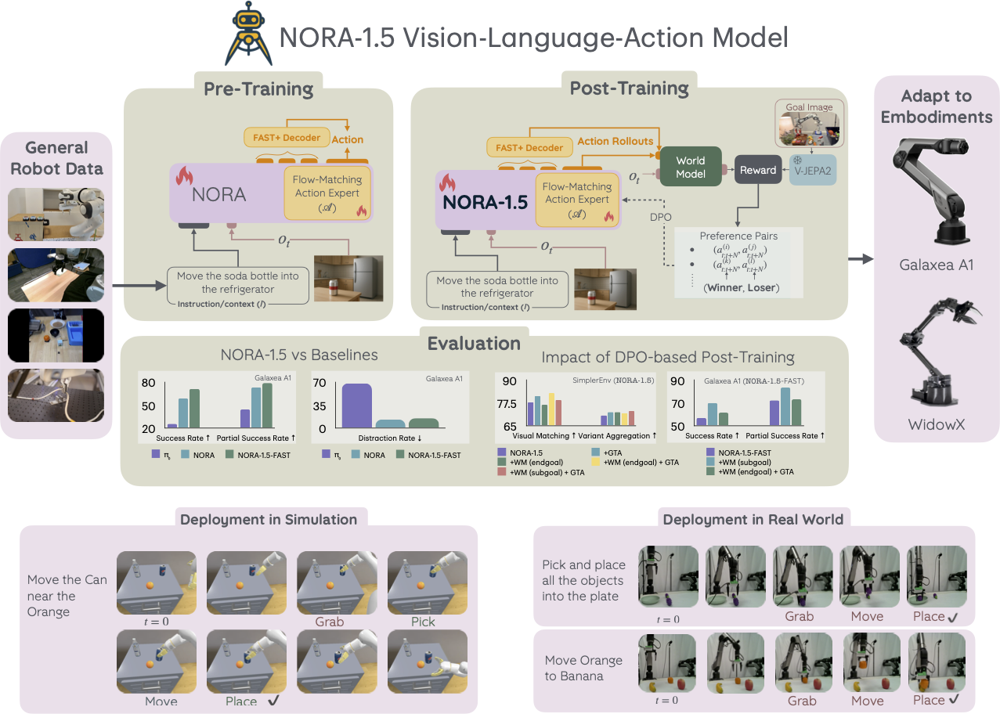
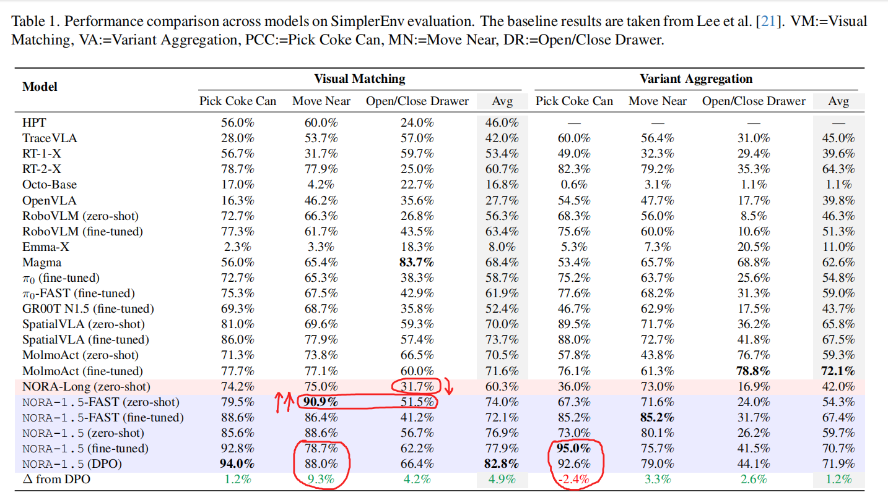
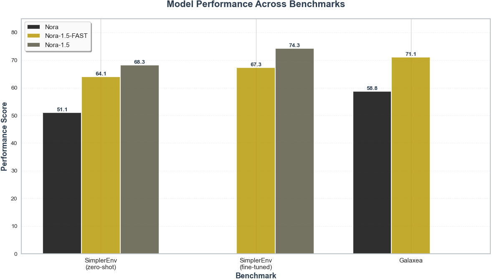
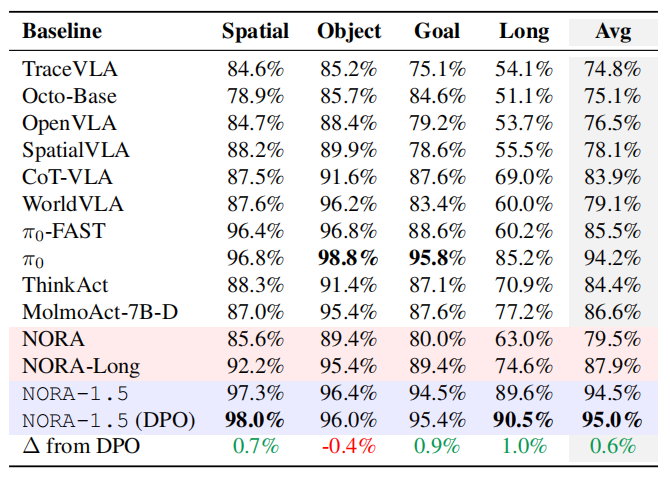
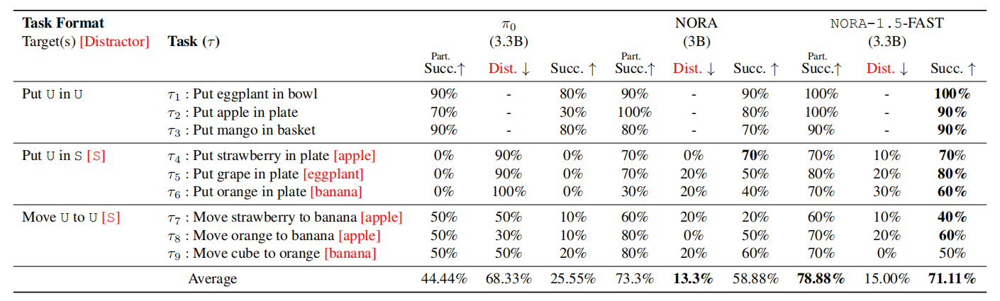
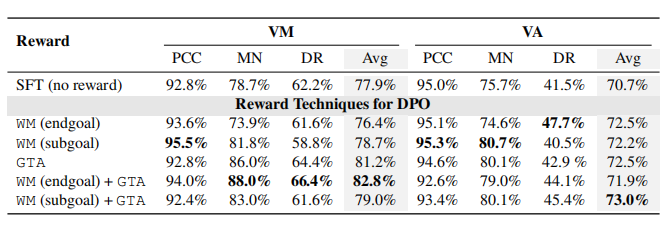
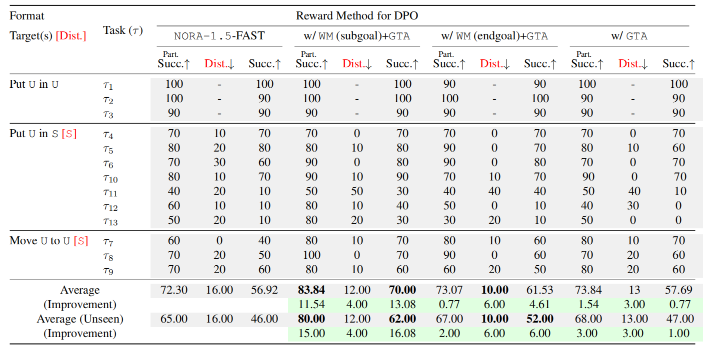
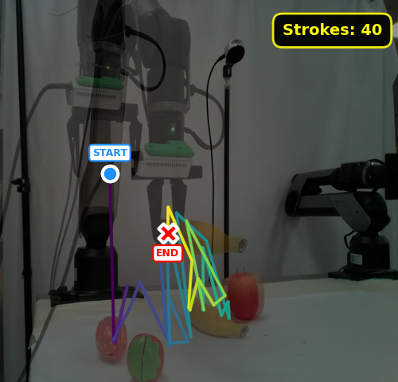
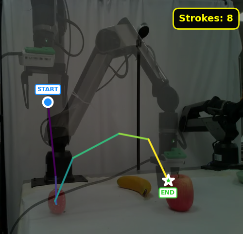

# NORA-1.5 论文阅读

**Abstract**

NORA-1.5: NORA 预训练 backbone + flow-matching based action expert $\longrightarrow$ 优于原始 NORA / 其他 SOTA

设计一组奖励模型用于 VLA 后训练 $\longrightarrow$ （1）使用**以动作为条件的世界模型**来评估当前动作是否能达到期望目标（2）提出一种**真实值偏离的启发式方法**，用于区分优劣行为 $\longrightarrow$ 构建偏好数据集，引导 NORA-1.5 使用 **DPO** 在目标具身实体上泛化适应 $\longrightarrow$ 仿真 / 现实都表现良好

**1. Introduction**

DPO 流程：奖励模型 + VLA policy rollouts $\longrightarrow$ rank $\longrightarrow$ optimization

受到 $\pi$ 启发 $\longrightarrow$ 使用层级注意力连接自回归 NORA 和 flow-matching based action expert $\longrightarrow$ 在推理速度为首要考虑情况下性能较优 $\longrightarrow$ 分析：（1）flow-matching 能用到自回归 VLA 更多的表征信息，同时 flow-matching 能给 VLA 带来更具信息量的梯度（2）在少数据场景下易导致训练不充分。

由于机器人中的奖励建模通常需要评估动作序列实现预期结果的效果，世界模型提供了一种自然机制：它们直接预测未来帧或基于动作条件的潜在嵌入 $\longrightarrow$ 通过在世界模型参与下，**合成 VLA policy 候选动作序列**，并评估其达成目标的能力来估算奖励 $\longrightarrow$ 1.3B 参数量的世界模型 V-JEPA2-AC 作为奖励估计器

进一步提出组合性奖励模型 $\longrightarrow$ 基于世界模型 V-JEPA2-AC 作为奖励估计器 + 启发式奖励模型 $\longrightarrow$ 基于目标的世界模型能够捕捉多种可行的运动轨迹，基于距离的启发式方法有助于抵消噪声并提供稳定的参考基准 $\longrightarrow$ 可持续提升下游任务。

---

作者认为 NORA-1.5 结合 world-model based 奖励模型和启发式奖励模型的好处是：

1. 从 VLA 采样的**合成数据**可由学习评估器进行批量评估 $\longrightarrow$ 后训练吞吐量与可用计算资源成正比
2. 由于 DPO 通过成对偏好而非精确似然或校准密度进行优化 $\longrightarrow$ 自然兼容缺乏可处理或良好校准似然的 flow-matching based 或 diffusion-based 的动作头 $\longrightarrow$ 基于偏好的目标避免了当前 VLA 架构中的一个关键优化瓶颈
3. 受过训练的评估器提供了一个统一的评分函数，**能够协调异构语料库** $\longrightarrow$ 当应用于诸如 OXE 这样的大规模 / 预训练级别的语料库时，评估器可以<u>一致地</u>对源自数十个具身实体、传感器和任务规范的轨迹进行排序 $\longrightarrow$ OXE 中丰富的动作结构（数据集）转化为一个庞大的 DPO 偏好数据集。

====> 总之就是在 world-model 驱动下，可以 scaling

**2. Preliminaries**

**2.1. NORA**

参考之前的博客：[NORA 论文阅读 代码分析](https://jaxonzhu-documents.readthedocs.io/en/latest/NORA-1-paper.html)

**2.2. V-JEPA-2-AC**

V- JEPA-2-AC 基于预训练的 V-JEPA-2 $\longrightarrow$ 联合嵌入架构模型 $\longrightarrow$ 使用 V-JEPA-2 作为视觉编码器，并在其上增加了一个额外的预测网络，用于根据当前**帧**和**动作序列**预测**未来帧的嵌入** $\longrightarrow$ 作为动作条件世界模型，用于后训练 VLA 模型。

**3. NORA-1.5**

**3.1. Architecture**

NORA-1.5 结构：使用分开的 action-expert $A$ 直接基于 NORA backbone $VL$ 编码的语言指令 $I$ 和视觉观测 $o_t$ 回归 $N$ 长度的动作序列 $a_{t:t+N}$ $\longrightarrow$ $N=5$ 与 NORA-LONG 一致

$$
\begin{align}
    K_{VL, t}, V_{VL, t} &= VL_\theta(o_t, I) \\
    a_{t:t+N} &= A_\theta(K_{VL, t}, V_{VL, t})
\end{align}
$$
$K_{VL, t}$ / $V_{VL, t}$ $\longrightarrow$ NORA backbone $VL$ 中 transformer 层中的键值对

**Input Encoding with NORA**

给定真值 $a_{t:t+N}$ $\longrightarrow$ 构架纯噪声 $a_{0}\sim N(0,1)$ $\longrightarrow$ 抽样 flow-matching 时间步 $\tau$ $\longrightarrow$ 混合：$a_{t:t+N}^\tau = (1-\tau)a_{t:t+N}+\tau a_0$

当前 $\tau$ 时刻 action expert 预测：$A(a_{t:t+N}^\tau, K_{VL, t}, V_{VL, t})$ ；目标：$a_0 - a_{t:t+N}$ 

构建损失：
$$
\begin{align}
\mathcal{L}_{\text{FM}} = \mathbb{E}_{v,a_{t:t+N}^\tau}  \parallel A(a_{t:t+N}^\tau, K_{VL, t}, V_{VL, t}) - v \parallel^2
\end{align}
$$
action expert 的网络结构和 NORA 类似，前向计算过程：
$$
\begin{align}
    x^{(l+1)} = Transformer^{(l)}(& Q=W_Q^{(l)}x^{(l)}, \underbrace{K=K_{VL}^{(l)} \oplus W_K^{(l)}x^{(l)}}_{\text{from NORA VLA}}, \underbrace{V=V_{VL}^{(l)} \oplus W^{(l)}_Vx^{(l)}}_{\text{from NORA VLA}})
\end{align}
$$
**3.2. Reward Modeling for Post-training VLAs**

训练奖励模型需要数据，其中每个动作均根据其对成功完成目标的亲和性（affinity）进行评估。

传统 RL 方法需要依赖<u>高精度、高速度且针对具体场景</u>的仿真器，或<u>依赖庞大的真实机器人基础设施</u>，而这两者不仅成本高昂，往往难以大规模实施。

> 作为更简单的替代方案，可能会通过**测量模型生成动作与对应真实动作之间的距离**来定义奖励；然而，这类<u>启发式方法</u>会继承基础演示数据的局限性。在存在<u>多个有效轨迹</u>的任务中，基于距离的奖励机制可能导致学习者偏向单一示范路径，从而形成<u>局部最优解并抑制对其他成功行为的探索</u>。由于**这些奖励机制在策略偏离演示流形时无法提供指导**，可能导致失败后的恢复效果不佳，并在评估过程中遇到<u>分布外状态时</u>导致策略崩溃。

当前世界模型与视频生成模型 $\longrightarrow$ 能够通过预测行为后果并评估是否达成预期子目标 $\longrightarrow$ 隐式奖励评估器 $\longrightarrow$ VLA policy scalable 后训练 $\longrightarrow$ 无需依赖完全工程化的模拟器

奖励模型包含两个组成部分：

**第一部分**: *WM-guided goal-based reward* $\longrightarrow$ 动作序列 $\longrightarrow$ 未来目标（子目标 sub-goal / 最终目标 final-goal） $\longrightarrow$ 合适的计算方式 $\longrightarrow$ 奖励信号

**第二部分**: action-based reward $\longrightarrow$ 动作序列 vs 真值序列

预测性 Transformer $P_\theta$ 接收当前由 V-JEPA2 $J$ 编码的观测 $o_t$ 和动作序列 $a_{t:t+N}$ 输出 $N$ 时刻后的观测 $\hat{o}_{t}$ 
$$
\begin{align}
    & J(o_{t+N}) = W_\theta(o_t, a_{t:t+N}) := P_\theta(J(o_t), a_{t:t+N}) \\
    & R_g(a_{t:t+N}, o_t) := - ||J(o_g) - W_\theta(o_t, a_{t:t+N})||_1, g\in \{\text{endgoal}, \text{subgoal-}t\}, \\
    & R_a(a_{t:t+N}) := - || a^*_{t:t+N} - a_{t:t+N}||_1, \\
    & R_\text{tot}(a_{t:t+N}, o_t) := R_g(a_{t:t+N}, o_t) + 0.5 R_a(a_{t:t+N}) \label{eq:tot-re}
\end{align}
$$
这种组合可缓解世界模型引导的目标导向奖励的**噪声**问题，该奖励源自基于有限数据训练的动作条件世界模型，可能**无法良好泛化至所有场景**。另一方面，基于动作的奖励可能过于受限，因为真实轨迹可能不唯一，在此类情况下，**目标驱动奖励**可能表现良好。

在推理的时候，给定一个固定的任务描述和观察值 $s_t$ ，模型会为不同的候选动作 $\{a^{(1)}_{t:t+N},\dots,a^{(N)}_{t:t+N}\}$ 分配比较分数，从而使 VLA 能够区分这些动作的相对质量，从而在 DPO 过程中鼓励更深入的步骤级探索。

最终基于奖励模型录制数据集 $D_\text{goal}$ 和以 $(\texttt{winner}, \texttt{loser})$ 为形式的 $D_\text{act}$ 两份数据集。

**3.3. Training**
$$
\begin{align}
        \small
        L_{\text{DPO-FM}} = & -\mathbb{E}_{\tau\sim \mathcal{U}(0, 1), (a^W_{t:t+N}, a^L_{t:t+N}, o_t, I) \sim D_.} \nonumber \\
        \log \sigma \Big( &-\beta  \Big[
        \underbrace{\|A(a^W_{t:t+N}, o_t, I, \tau; \theta) - v^W_\tau\|_2^2}_{\text{Winning loss}} - \underbrace{\| A(a^L_{t:t+N}, o_t, I, \tau; \theta) - v^L_\tau \|_2^2}_{\text{Losing loss}} \nonumber \\
        &-  \underbrace{\|A(a^W_{t:t+N}, o_t, I, \tau; \theta_{\text{r}}) - v^W_\tau\|_2^2}_{\text{Winning reference loss}} + \underbrace{\|A(a^L_{t:t+N}, o_t, I, \tau; \theta_{\text{r}}) - v^L_\tau \|_2^2}_{\text{Losing reference loss}}
    \Big]
\Big).
    \end{align}
$$
action expert 参数经过随机初始化后，与 NORA VLA 参数联合训练，采用组合式 flow-matching 损失函数对 action expert 输出进行优化，并通过交叉熵损失函数对 NORA 的 FAST+ 输出 token 进行评估。

同时，将 VLA 解码器头部的 FAST+ 动作输出 token 解码成连续 action 向量与 flow-matching 预测的 action 对齐。基于 DPO 的后训练应用于 SFT 模型，即在目标具身实体的监督数据上对 VLA 进行微调之后。

**4. Experiments**

**4.1. Baselines**

SpatialVLA / RT-1 / MolmoAct / Emma-X / NORA / OpenVLA / $\pi_0$

**4.2. Benchmarks and Evaluation Settings**

- LIBERO: 在移除无效操作 no-op actions 后，通过整合四个子集的数据进行微调。
- SimplerEnv: 通过优化参数来缩小模拟与现实的差距，评估了四种任务（捡起可乐罐、移动物体、打开抽屉、关闭抽屉），采用两种协议：视觉匹配和变体聚合，总计超过 1000 个场景，结果取两次运行的平均值。
- 未出现在预训练数据集中的 Galaxea A1机器人：通过远程操作完成 1000 次抓取和放置任务，涉及九个独特任务（例如 “将苹果放在盘子上” ），每个任务中物体放置随机。评估分为三个类别（**已见任务**、**未见物体 + 已见干扰物任务**和**未见指令 + 已见干扰物任务**），每个任务重复 10 次试验，使用固定起始位置，与基线一致。

模拟基准报告二元成功率（任务完成得1分，否则得0分），而真实机器人评估则报告成功率和部分成功率，以捕捉更精细的性能差异，即<u>如果机器人成功抓取正确物体，则奖励其1分</u>。

**4.3. Performance of** `NORA-1.5`

**SimplerEnv** 结果：

在 `"Open/Close Drawer"` 任务中 zero-shot 表现较差，这可能源于其对拖拽和推动动作的适应性有限，而这类动作在预训练数据集中的出现频率相对较低，相较于抓取和放置动作 $\longrightarrow$ 这一结论基于对 Open X Embodiment 预训练数据集任务描述的关键词检索。

====> 基于 flow-matching 的 action-expert 与 auto-regressive 预训练 VLA 形成了良性互动。

- 基于 flow-matching 的 action-expert 能充分利用 VLA 的丰富表征资源 —— 包括编码后的观察数据、操作指令和整体规划方案 —— 这些是生成连贯动作的关键要素。
- auto-regressive 预训练 VLA 通过 action-expert 传递的梯度反馈机制获得优化，从而提升学习效率，例如改进 action-expert 生成动作的整体抽象规划方案。这种设计让VLA能够预先规划完整的动作轨迹，为后续的动作生成提供基础框架。

**LIBERO** 结果：成绩都差不多。

**Performance with Limited Real-life Robot Training Data**: 

flow-matching based 的动作生成表现不如 auto-regressive decoding $\longrightarrow$ 与 SimplerEnv 和 LIBERO 中的观察结果不同 $\longrightarrow$ 可能的原因：真实机器人数据集 vs. SimplerEnv $\sim$ $50K$ vs. $400M$ $\longrightarrow$ action expert 缺乏广泛的 flow-matching 预训练，需要更多数据才能有效适应

**4.4. Impact of DPO-based Post-training**

这部分做奖励消融实验：纯 action reward / World-Model guided reward 和二者线性加权

**SimplerEnv**: 

World-Model guided reward 被证实存在例外情况 $\longrightarrow$ 机器人在 SimplerEnv “Move Near” 任务中的视觉匹配与变体聚合性能均出现下降 $\longrightarrow$ 单纯的目标导向引导未能考虑到任务的隐性安全约束 $\longrightarrow$ “Move Near” 在 SimplerEnv 中的成功标准，机器人在完成任务时需**避免障碍物**

**LIBERO**: 收益比较低，因为微调过程就已经达到很高的效果了

**Galaxea A1 Robotic Arm**: 在未见任务上表现更出色 $\longrightarrow$ （1）增强抓取动作的可操作性与可靠性（2）提升模型对目标对象的聚焦能力

带有 DPO 的 NORA-1.5 平均只需 7.0 个 action chunk 即可抓取目标；没有 DPO 的 NORA-1.5 需要 9.7 个 action chunk $\longrightarrow$ 后者难以执行平稳高效的抓取 $\longrightarrow$ 在后训练时通过 DPO 得到了缓解 $\longrightarrow$ 进一步地 DPO 有助于减少机器人意外抓取干扰物的可能性

**4.5. Ablations**

- 世界模型信号的噪声性：由于建模的不稳定性积累，<u>最终目标图像的引导</u>比<u>中间子目标图像的引导</u>更具噪声。
- 直接以动作真值作为奖励的优势：使模型学会遵循最直接的路径以达成目标，从而获得更优的结果；但是在 special case 下引入偏置

Ground-Truth-Action 奖励机制对真实机器人提供的益处有限。在 “将 U 放入 S ” 类别的大多数任务中，包括所有新引入的高难度任务，其表现都逊于基准模型 $\longrightarrow$ 在现实环境中，多条轨迹都能成功完成相同任务。

强制模型持续遵循单一标注轨迹，可能会在机器人执行未知场景时引入不必要的行为干扰。通过将子目标/目标信息与 GTA 结合构建训练数据集 $\longrightarrow$ 提供了额外的上下文信号，帮助机器人选择合适的轨迹来完成任务。
