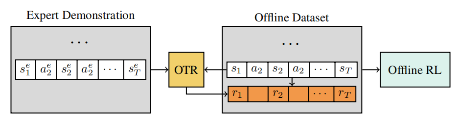
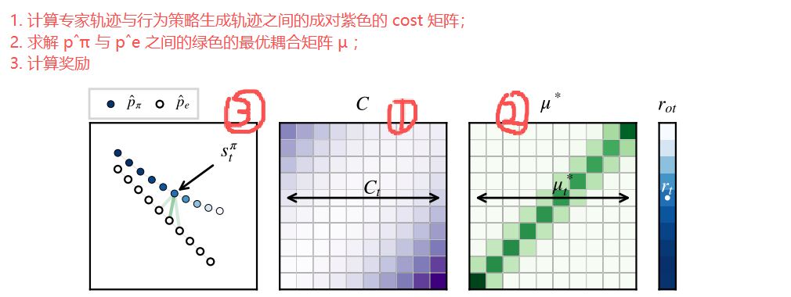
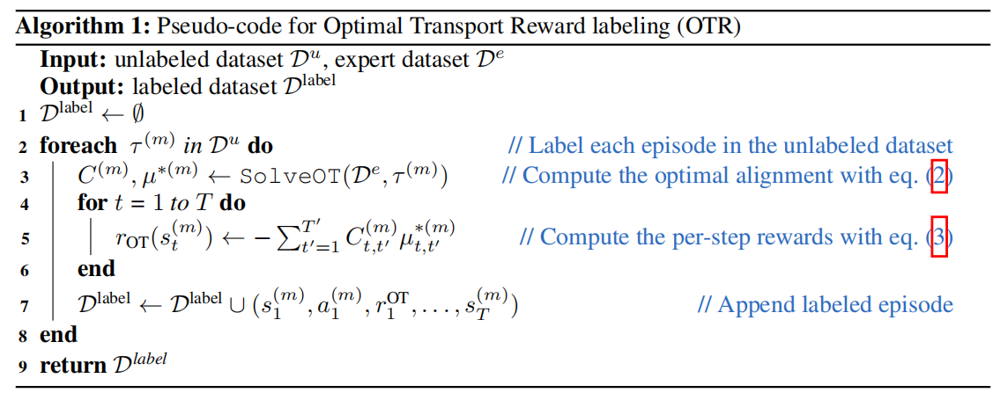
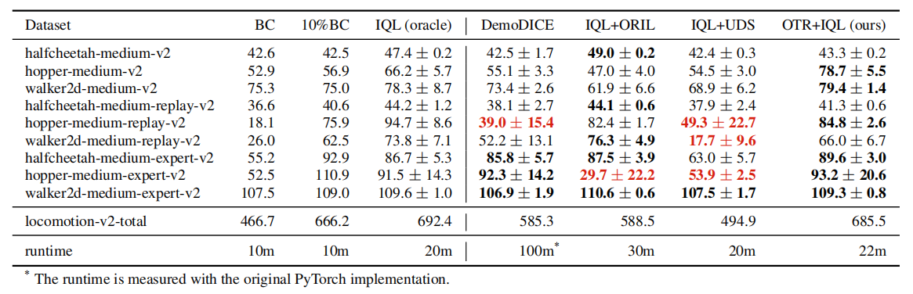
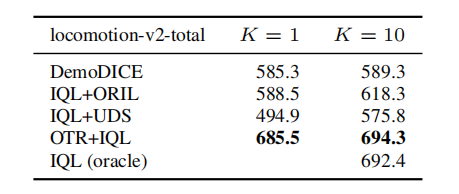
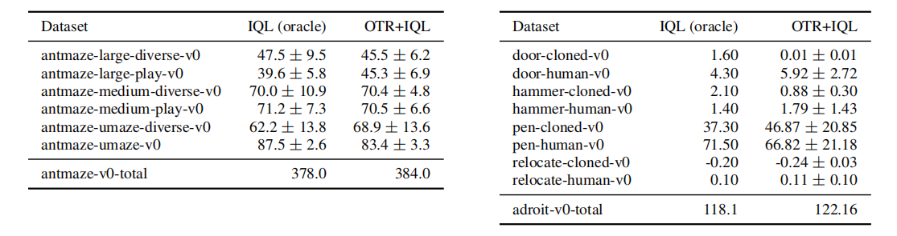
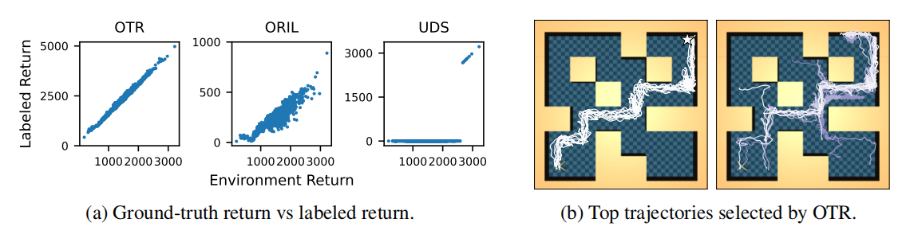

# Optimal Transport For Offline Imitation Learning

**ABSTRACT**

【问题】Offline RL 要求数据集必须带有<u>奖励标注</u>，这在奖励工程设计困难或获取奖励标注耗时费力的情况下会带来实际挑战。

【解决】提出 OTR: 一种为离线轨迹分配奖励的算法，仅需少量高质量演示即可实现。

【具体做法】采用 optimal transport 最优运输算法计算数据集中<u>未标记轨迹</u>与<u>专家演示</u>之间的最优对齐，从而获得**可解释为奖励的相似性度量**，该度量随后可被 Offline RL 用于策略学习。

【benchmark】D4RL

【结论】**单条演示轨迹**下 OTR 的性能可稳定适配真实奖励训练下 Offline RL 的对比结果。

---

**1 INTRODUCTION**

Offline RL 需要预先设定奖励函数来标注记录的经验数据，这使得在难以通过人工规则明确奖励的应用场景中，直接采用 Offline RL 变得不切实际。即便能够根据**人类偏好**对轨迹进行标注，这种生成奖励信号的流程也可能成本高昂 $\Longrightarrow$ 如何让离线强化学习有效利用未标注数据，仍是具有重要实际价值的开放性课题（2022~2023年）。

LfD: Learning from Demonstration $\Longrightarrow$ Imitation Learning (IL): 无显式奖励函数的前提下学习专家轨迹中的行为 $\Longrightarrow$ 分成两个流派（1）Behavior Cloning (BC): 通过建立监督学习问题直接复原演示者的行为；（2）Inverse Reinforcement Learning (IRL): 学习一个旨在捕捉演示者意图的中间奖励函数，但是方法本身对 online learning 过程相对较强。

作者提出 OTR: 采用最优传输算法，将数据集中<u>未标注轨迹</u>与<u>专家演示</u>进行最优比对。未标注轨迹状态与专家轨迹状态的相似度作为奖励标签，这些奖励可被**任何**离线强化学习算法利用，通过<u>少量专家演示</u>和<u>海量离线数据集</u>来学习策略。

**2 OFFLINE REINFORCEMENT LEARNING AND IMITATION LEARNING**

**Offline Reinforcement Learning**

Offline RL 研究通常假定可访问观测到并收集得到的离线状态转移数据集 $\mathcal{D}=\{(s_{t}^{i},a_{t}^{i},r_{t}^{i},s_{t+1}^{i})\}_{i=1}^{N}$

意义就是对于<u>已记录的经验但在线数据收集成本高昂</u>的应用场景尤为适用

Offline RL 一般假设状态转移有奖励标注 $\Longrightarrow$ 实际标奖励很复杂 / 困难 $\Longrightarrow$ 前人工作：ORIL —— 基于正样本未标记（Positive-Unlabeling, PU）方法学习得到奖励函数，并使用奖励函数标注离线数据集。

**Imitation Learning**

基于 IRL 的方法仅需少量专家演示即可学习出优质策略 $\Longrightarrow$ 如 **GAIL** 算法，在训练过程中可能需要大量**在线样本**，导致<u>样本效率低下</u> $\Longrightarrow$ GAIL 等算法采用的训练范式与生成对抗网络类似，通过将 IRL 问题转化为<u>极小极大优化问题</u>来学习隐式最小化 $f$ 散度的判别器 $\Longrightarrow$ 对抗性模仿学习方法的优化难度极高，需要精细调超参数。

另一种 IRL 流派 $\Longrightarrow$ 基于最优传输 optimal transport (OT) 方法 $\Longrightarrow$ 最小化 expert 与 agent “状态-动作” 分布之间的 Wasserstein 距离来实现优化

> *Wasserstein Adversarial Imitation Learning*. $\Longrightarrow$ 通过其对偶公式最小化 Wasserstein 距离 $\Longrightarrow$ 导致潜在的优化问题。
>
> *Primal Wasserstein Imitation Learning*. $\Longrightarrow$ 通过原始公式最小化 Wasserstein 距离 $\Longrightarrow$ 避免了对偶公式中可能存在的优化问题。
>
> *Imitation Learning from Pixel Observations for Continuous Control*. $\Longrightarrow$ 针对 PWIL 中使用的原始 Wasserstein 公式提出一系列改进方案 $\Longrightarrow$ 在样本效率和渐近性能方面均展现出显著的实证效果 $\Longrightarrow$ 需要大量在线样本才能学习到良好的策略。

**3 OFFLINE IMITATION LEARNING WITH OPTIMAL TRANSPORT**

【问题建模】

MDP: $(\mathcal{S},\mathcal{A},p,r,\gamma,p_0,T)$  $T$ 表示一条 episode 的长度

$\pi$: 状态到动作分布的函数，生成轨迹 $(s_{1},a_{1},s_{2},a_{2},\ldots,s_{T})=:\tau$

RL 目标：寻找能够最大化 episodic 回报的策略 $\pi^{\ast}$

【准备】

- 从专家级策略 $\pi_{e}$ 生成的演示轨迹数据集 $\mathcal{D}^e=\{\tau_e^{(n)}\}_{n=1}^N$ 
- 从任何策略 $\pi_{\beta}$ 生成的大规模无奖励标注的数据集 $\mathcal{D}^u=\{\tau_\beta^{(m)}\}_{m=1}^M$

【方法】

开发一种离线策略 $\pi$ 能整合专家演示 $\mathcal{D}^e$ 与未标注轨迹 $\mathcal{D}^u$ 的信息，且无需与环境进行任何交互。

**REWARD LABELING VIA WASSERSTEIN DISTANCE ====> 使用沃瑟斯坦距离标注奖励**

对于两个离散测度 $\mu_{x}=\frac{1}{T}\sum_{t=1}^T\delta_{x_t}$ 和 $\mu_{y}=\frac{1}{T^{\prime}}\sum_{t=1}^{T^{\prime}}\delta_{y_{t}}$，这两个离散测度可以理解成两堆等权重的点集合: $x_1,\ldots,x_T$ 和 $y_1,\ldots,y_{T^{\prime}}$，其之间的 Wasserstein 距离表达式：

$$
\mathcal{W}^2(\mu_x,\mu_y)=\min_{\mu\in M}\sum_{t=1}^T\sum_{t^{\prime}=1}^{T^{\prime}}c(x_t,y_{t^{\prime}})\mu_{t,t^{\prime}}
$$

其中 $M=\{\mu\in\mathbb{R}^{T\times T^{\prime}}:\mu\mathbf{1}=\frac{1}{T}\mathbf{1},\mu^{T}\mathbf{1}=\frac{1}{T^{\prime}}\mathbf{1}\}$ 是耦合矩阵集合，$c$ 是成本函数且 $\delta_{x}$ 是 $x$ 的狄拉克测度。通俗理解就是从每个 $x_t$ 向每个 $y_{t^{\prime}}$ 搬多少 “质量” ，
 使得<u>总搬运代价</u>最小。因此，可以把 $\mu$ 看成一个**二维表格 / 矩阵**，里面记录了 “从 $x_t$ 搬到 $y_{t^{\prime}}$ 的质量有多少” 这样的数据。接着 $M$ 内部的约束条件 $\mu\mathbf{1}=\frac{1}{T}\mathbf{1},\mu^{T}\mathbf{1}=\frac{1}{T^{\prime}}\mathbf{1}$ 是在说明 $x_t$ 的<u>全部质量必须被分配出去</u>且每个 $y_{t^{\prime}}$ <u>最终接收的质量是固定的</u>。另外一个**成本函数** $c(x_t,y_{t^{\prime}})$ 表示 “把每个 $x_t$ 搬到每个 $y_{t^{\prime}}$ 有多<u>贵</u>” 的函数量。

当耦合矩阵 $\mu$ 达到最优 $\mu=\mu^{\ast}$ 时，将实现 $\mu_{x}$ 与 $\mu_y$ 中样本间的对齐。通俗理解就是经过各种计算得出的优化结果，当 $\mu=\mu^{\ast}$ 时候，可以自动地在**最小总搬运代价**下将每个 $x_t$ 搬运多少质量到每个 $y_{t^{\prime}}$ 中。

> 【例子】设想一个一维世界，就是一条数轴。在这条数轴上有两组点。第一组是 $x$ ：只有两个点，分别在位置 0 和 10；第二组是 $y$ ：也只有两个点，分别在位置 3 和 7。为了简单起见，每个点的重要性是一样的，可以理解为每个点都携带 0.5 单位的 “质量” 。**如果要把 $x$ 这两个点整体 “变成” $y$ 这两个点，最省力的方式是什么？**这里的 “省力” ，指的是移动距离乘以移动的质量，即做功。
>
> 位置在 0 的点，显然更适合往 3 这个方向移动；位置在 10 的点，更适合往 7 移动。这样做的总移动距离是：从 0 到 3，移动 3；从 10 到 7，移动 3。因为每个点只占一半的质量，所以总成本是 $0.5 \times 3 + 0.5 \times 3 = 3$ 。这就是 Wasserstein 距离在这个例子中的值。

---

基于沃瑟斯坦距离迁移到研究问题：

假设目标分布是专家级策略 $\pi_{e}$ 遍历的等权重状态分布 $\hat{p}_{e}=\frac{1}{T^{\prime}}\sum_{t=1}^{T^{\prime}}\delta_{s_{t}^{e}}$

假设源分布是任何策略 $\pi_{\beta}$ 遍历的等权重状态分布 $\hat{p}_{\beta}=\frac{1}{T}\sum_{t=1}^{T}\delta_{s_{t}^{\beta}}$

====> 两个遍历的状态分布之间的沃瑟斯坦距离是：

$$
\mathcal{W}^2(\hat{p}_\pi,\hat{p}_e)=\min_{\mu\in M}\sum_{t=1}^T\sum_{t^{\prime}=1}^{T^{\prime}}c(s_t^\pi,s_{t^{\prime}}^e)\mu_{t,t^{\prime}}
$$

====> 可以使用这个沃瑟斯坦距离来描述专家策略和任何策略之间的（分布距离）

====> 当耦合矩阵 $\mu$ 达到最优 $\mu=\mu^{\ast}$ 时，那么沃瑟斯坦距离能提供奖励信号！

$$
r_{\mathrm{ot}}(s_t^\pi)=-\sum_{t^{\prime}=1}^{T^{\prime}}c(s_t^\pi,s_{t^{\prime}}^e)\mu_{t,t^{\prime}}^*
$$

====> 直观理解：将 $s_t^\pi$ 搬运到所有 $s_{t^{\prime}}^e$ 位置时，对每个 $s_{t^{\prime}}^e$ 位置需要分配多少质量？ $\Longrightarrow$ 如果 $s_t^\pi$ 搬运到所有 $s_{t^{\prime}}^e$ 位置需要的花费较大（正值），那么它标注的奖励值就越低（负值），说明当前策略 $\pi$ 产生的这个状态 $s_t^\pi$ 与专家级策略 $\pi_{e}$ 遍历的状态差异较大 $\Longrightarrow$ 使用负奖励进行惩罚！

> 后续论文提到，对于 cost 函数处理，使用 cosine 距离作为计算。

**3.2 IMITATION LEARNING USING REWARD LABELS FROM OPTIMAL TRANSPORT**

- 对于每条未标注的估计 $\Longrightarrow$ 求解最优问题，得到 cost 阵 / $\mu^{\ast}$ 阵 $\Longrightarrow$ 这条轨迹的每一步进行标注

- 如何求解 cost 阵 / $\mu^{\ast}$ 阵？相当于求解一个线性规划 (Linear Program, LP) 问题，**使用标准 LP 求解器可能代价过高**。实践中，作者采用 Sinkhorn 算法求<u>解熵正则化 OT 问题</u>。在 OTT- JAX 中，作者利用 Sinkhorn 求解器进行该计算。

**4 EXPERIMENTS**

OTR 只是 reward learning 方法 $\Longrightarrow$ 适配任何 Offline RL 算法 $\Longrightarrow$ 以 IQL 为例

**4.1 SETUP**

针对每个训练环境，采用 `medium-v2` / `medium-replay-v2` / `medium-expert-v2` 三个数据集来构建专家演示集和未标注数据集。

====> 专家演示集：根据 episodic 回报从 D4RL 数据集中选取最优 episode 

====> 未标注数据集：移除了数据集中的原始奖励信息。随后通过 OTR ，基于未标注 episode 与选定专家演示集之间的最优耦合关系对数据集进行标注。最后执行 Offline RL 算法。当存在多 episodes 专家演示时，分别针对每一 episode 独立计算最优传输，并采用能获得最佳 episodic 回报的专家轨迹奖励。

> 对奖励做了 reward scaling $\Longrightarrow$ Offline RL 算法对 reward 的范围敏感

**Implementation** 作者声称：“我们的实现方案具有高效计算特性，仅需 *约 1 分钟* 即可完成包含 100 万次 transitions（或 1000 个时长为 1000 的 episodes ）的数据集标注。对于更大规模的问题， OTR 可通过并行处理数据集中的 episodes 进一步扩展。我们对 OTR 的实现及 baselines 模型的重新实现均保持高效计算。尽管如此， IQL 的训练时间仍约为 20 分钟，因此 OTR 对现有 Offline RL 算法的奖励标注仅增加了相对较小的开销。”

作者在论文的脚注做了说明：使用的是一块 NVIDIA 3080 的 GPU, 那么结合后面附录的神经网络层数可以猜测这个是 state-based 的数据集，没有设计到 image-based / vision-language based 的数据集标注效率讨论 $\Longrightarrow$ 多模态 + scaling 场景下的奖励标注是一个可以继续调查的点。

还存在一个细节，作者在论文脚注上对实现做了更详细的叙述：算法使用 JAX based 的框架进行计算 $\Longrightarrow$ 使用 `vmap` 做并行处理 $\Longrightarrow$ 函数处理需要保证输入 episode 的长度均一致 $\Longrightarrow$ 使用 padding 把所有 episodes 的长度设置成 1000  $\Longrightarrow$ 作者声称不会影响标注结果，且提升了效率。

**Baselines** 真值奖励训练的 IQL / DemoDICE / ORIL+IQL / UDS+IQL

**4.2 RESULTS**

【分析】作者在实验部分提出的第一个问题是：OTR 能否恢复 Offline RL 算法的性能，这些 Offline RL 算法能够访问<u>经过精心设计的奖励函数</u>，即<u>由环境提供的</u>真实奖励？ $\Longrightarrow$ 这部分实验是对比 OTR 算法和 ground-truth 奖励值是否一致 $\Longrightarrow$ 关键：在 Offline RL 算法一致的前提下，二者的表现应该近似一致 $\Longrightarrow$ 图标显示（1）OTR + IQL 性能于 ground-truth + IQL 接近（2）各个任务一致性水平强（3）大部分优于其他 Offline RL 算法 $\Longrightarrow$ 从（1）可以证明 OTR 能恢复出和 ground-truth 内涵一致的奖励函数。

【分析】作者在实验部分提出的第三个问题是：OTR 在专家演示轨迹数量变化时的表现如何？ $\Longrightarrow$ 这部分实验是对比不同数量 expert episodes 参与标注后结合 IQL 的表现 $\Longrightarrow$ 关键：不同轨迹数量参与奖励标注，可能更强 / 水平近似 / 更弱 $\Longrightarrow$ OTR 的性能接近 IQL-Oracle 的水平，即使 $K=1$ 时也是如此，并且在 $K=10$ 时与 IQL-Oracle 的性能相当。 $\Longrightarrow$ 证明OTR 在专家演示轨迹数量**增多**时效果会**更好**。

【分析】作者在实验部分提出的第二个问题是：OTR 能否处理行为未知且质量参差不齐的未标注数据集？ $\Longrightarrow$ 这部分实验是对比不同数据集种类 unlabeled episodes 参与标注后结合 IQL 的表现 $\Longrightarrow$ 关键：不同数据集种类参与奖励标注，可能更强 / 水平近似 / 更弱 $\Longrightarrow$ 在使用 $K=1$ 单条演示轨迹下 OTR 的性能接近 IQL-Oracle 的水平 $\Longrightarrow$ 证明 OTR 混合多种类数据集下也能表现合理。

【分析】作者在实验部分提出的第四个问题是：OTR 和其他标注奖励的方法相比效果如何？ $\Longrightarrow$ 这部分实验是对比不同奖励标注方法的表现进行对比 $\Longrightarrow$ 展示 ground-truth vs. labeled return 和实际路线轨迹图 $\Longrightarrow$ 关键：期望良好的奖励标注，在能复原 ground-truth 的情况下，应该是成线性等比例上涨的；且在仿真轨迹中的表现应该是和演示数据集的分布近似一致 $\Longrightarrow$ OTR 能成线性正向增长，且比 ORIL 具有更低的方差，而 UDS 显著失败；仿真轨迹中的表现与 expert 轨迹更集中 $\Longrightarrow$ 证明 OTR 相比于其他几种奖励标注方法更具有优势。

> **作者实证评估表明， OTR + IQL 仅需一次专家演示，即可恢复离线强化学习的性能，且奖励值与真实值高度吻合。相较于先前研究，即使演示次数更多，其表现仍更优。定性对比显示， OTR 的奖励估计更精准，且与人工设计的奖励函数具有强相关性。**

**5 DISCUSSION**

作者声称：

- OTR 会在 expert 缺失情况下表现弱。
- 采用的 Wasserstein 距离公式可通过扩展应用 Gromov-Wasserstein 距离来实现 cross-domain 模仿学习，从而对齐来自不同空间的专家演示与离线轨迹。

