# $\pi_{0.5}$ 论文解读：开放世界泛化

论文原题：$\pi_{0.5}$: a Vision-Language-Action Model with Open-World Generalization

这篇图片笔记围绕一个问题展开：$\pi_{0.5}$ 如何利用不同来源的数据，在未见过的家庭环境中完成任务？重点是多源数据协同训练、高层子任务预测与低层动作生成。

按主题阅读：[研究动机](#pi05-background) · [训练流程](#pi05-training) · [泛化实验](#pi05-evaluation) · [模型细节](#pi05-details)。

(pi05-background)=
## 研究动机与基础概念

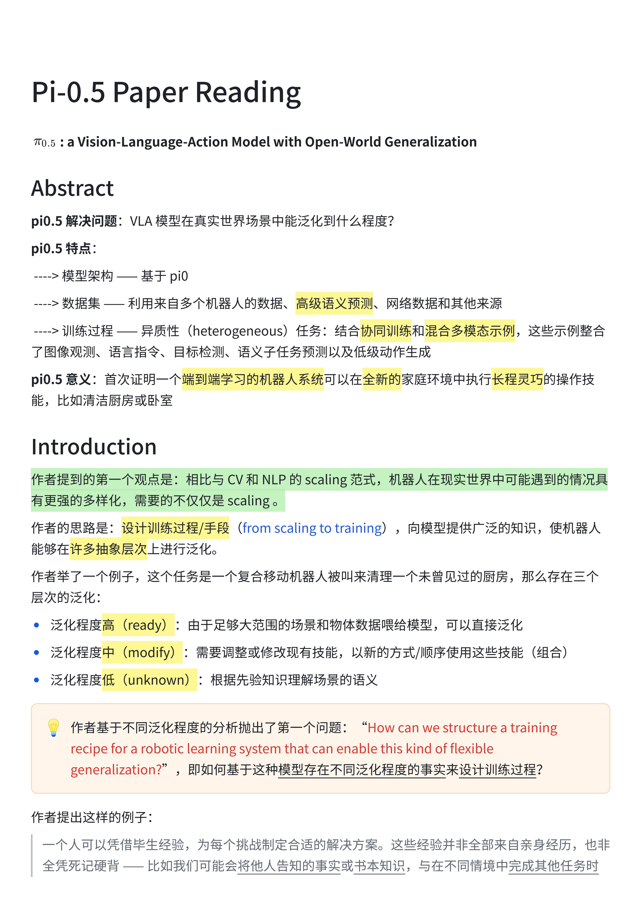

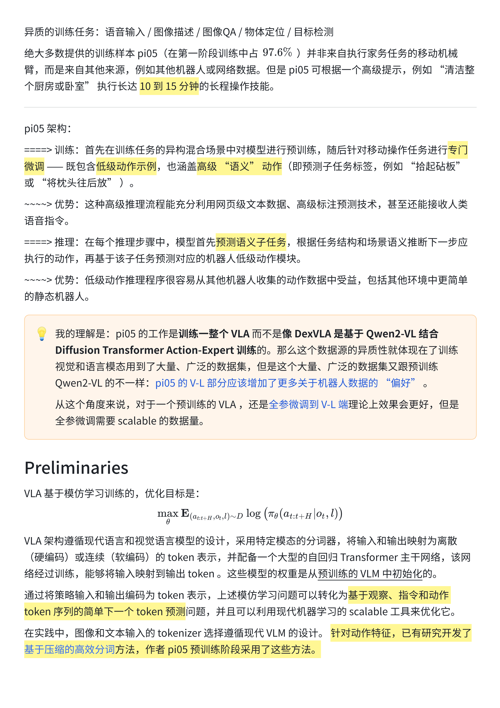

(pi05-training)=
## 模型与两阶段训练

这里整理 FAST 离散动作预训练与流匹配后训练的衔接，以及机器人数据、子任务标注和网络数据如何参与训练。

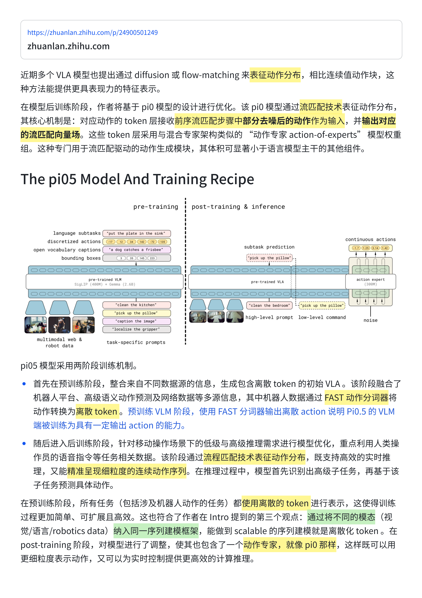

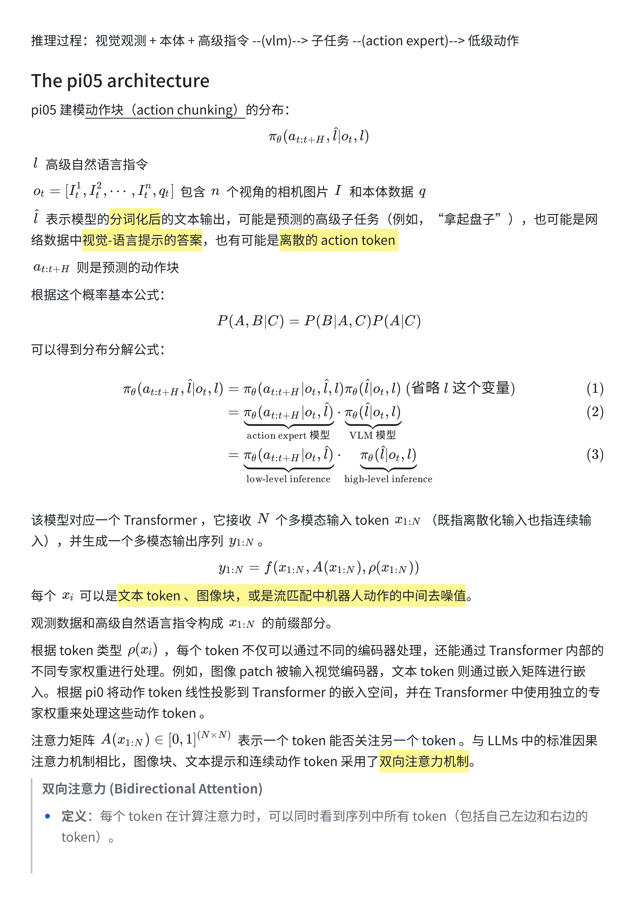

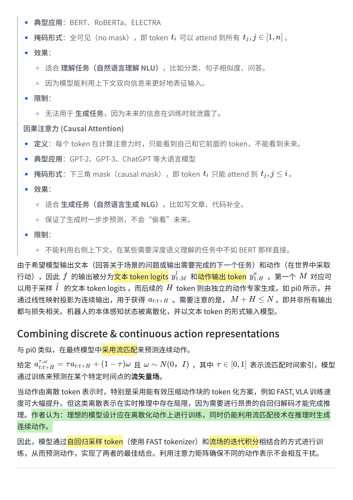

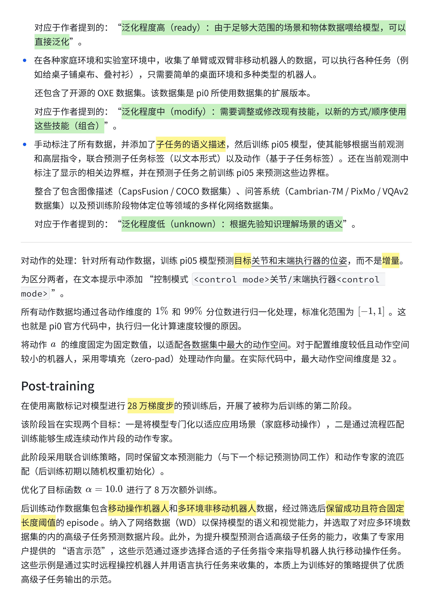

(pi05-evaluation)=
## 泛化实验与数据消融

从机器人平台和评估问题开始，查看新家庭环境中的任务表现，以及训练环境数量、数据来源和高层推理对结果的影响。

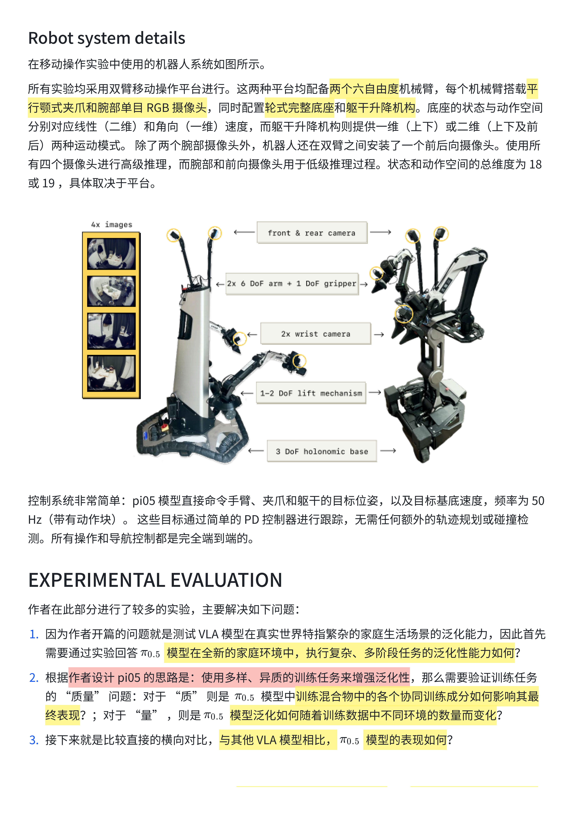

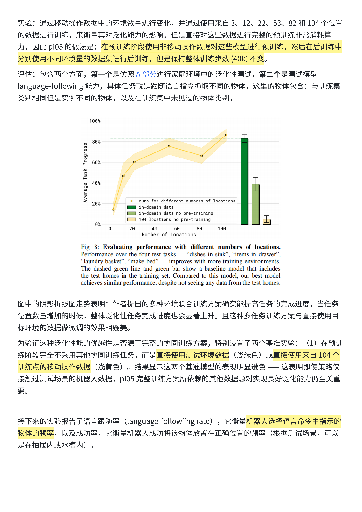

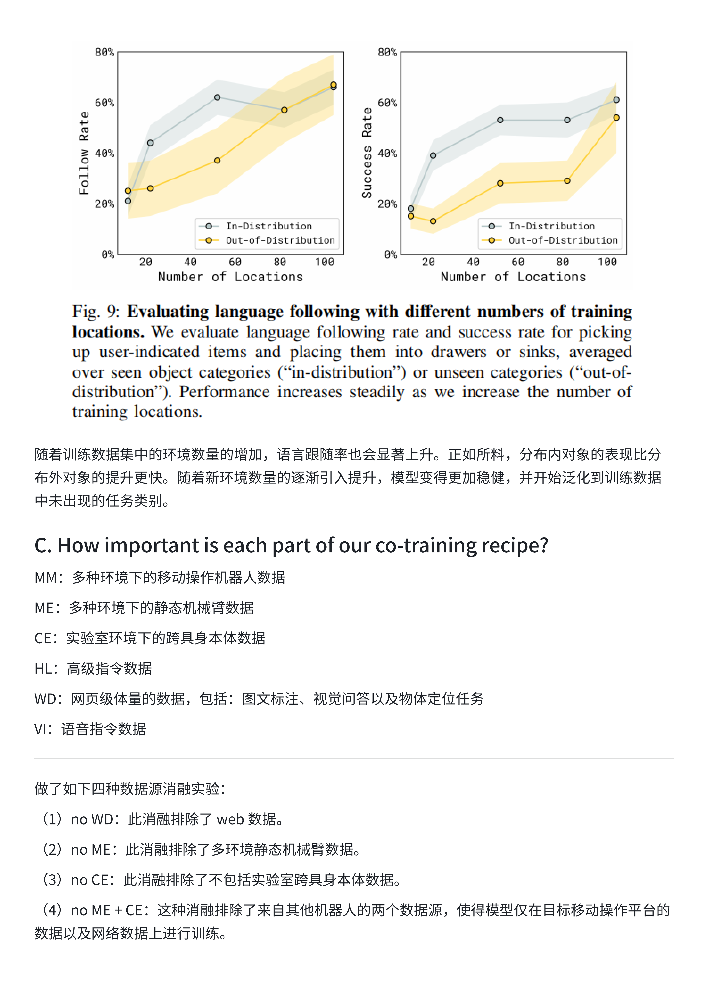

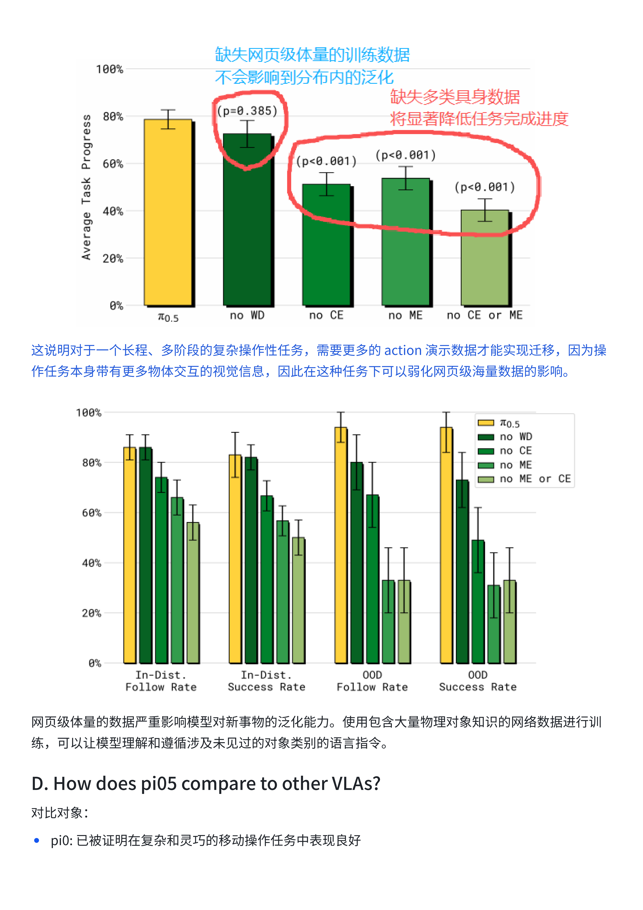

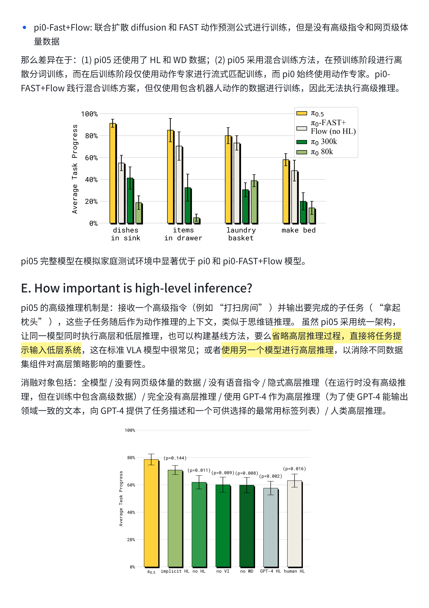

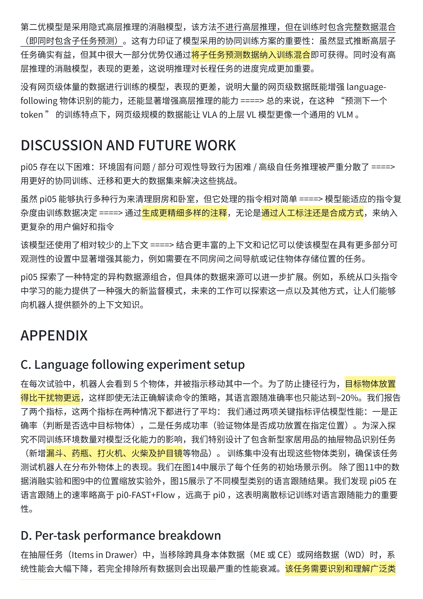

(pi05-details)=
## 消融分析补充与模型细节

接着讨论各任务对数据和高层推理的依赖，再看动作专家、注意力掩码与流匹配时间步采样的实现细节。

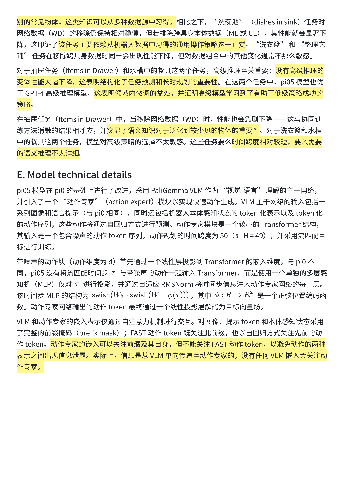

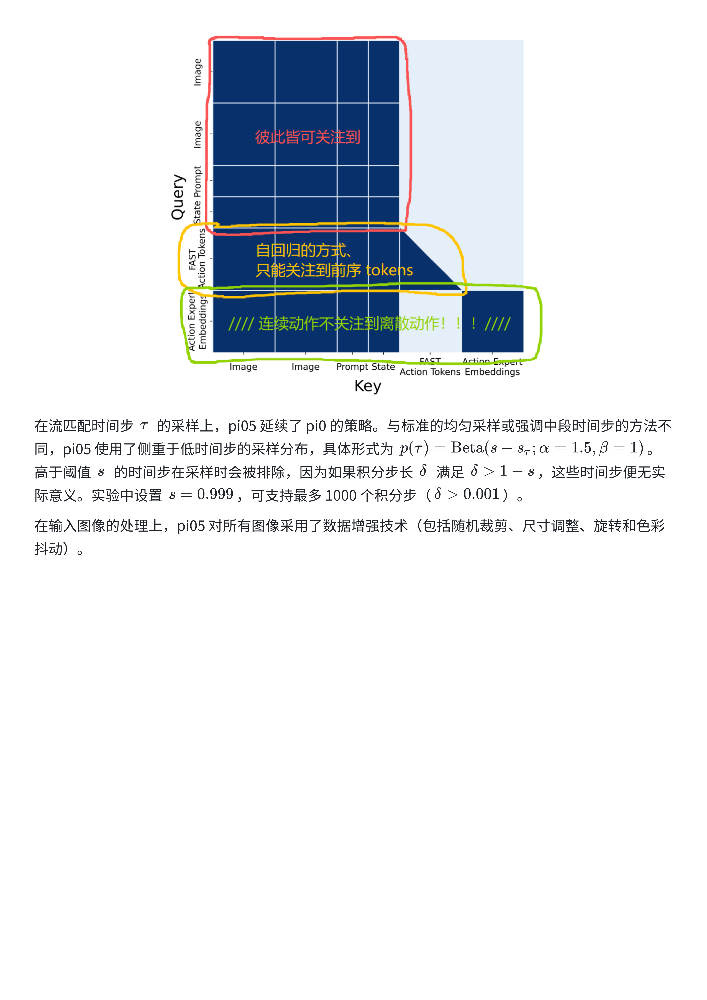
