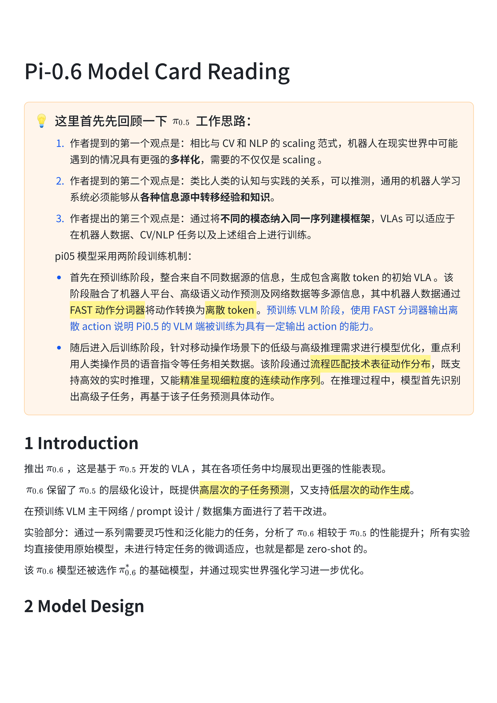
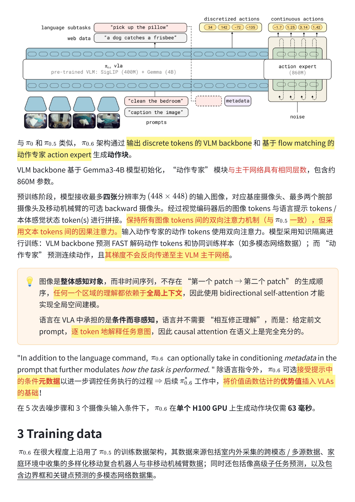
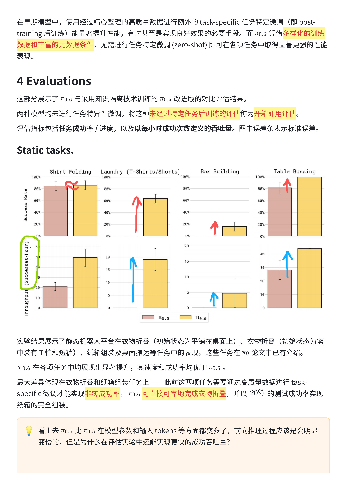
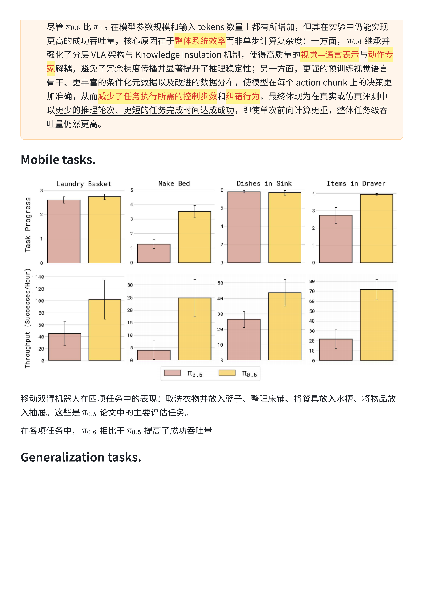
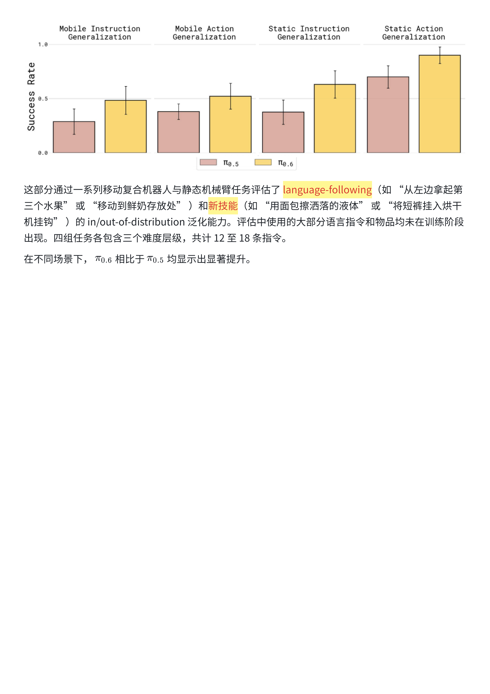

# $\pi_{0.6}$ 模型卡解读：模型设计与能力评估

文档原题：$\pi_{0.6}$: Model Card

这篇图片笔记整理 $\pi_{0.6}$ 相较 [$\pi_{0.5}$](Pi-05.md) 在模型设计、提示和训练数据上的变化，以及无需任务专门微调时的能力评估。RECAP 后训练方法另见 [$\pi_{0.6}^{\ast}$ 论文解读](Pi-06-star.md)。

按主题阅读：[模型设计与数据](#pi06-design) · [任务表现与泛化](#pi06-evaluation)。

(pi06-design)=
## 模型设计与训练数据

重点看 VLM 主干与动作专家如何分工，以及注意力设置、知识隔离和条件元数据在模型中的位置。

(pi06-evaluation)=
## 任务表现与泛化评估

评估覆盖静态操作、移动操作和指令／动作泛化。读图时可以同时关注成功率、任务进度与每小时成功次数，区分任务完成能力和执行效率。

