# RLINF-VLA: RLinf-VLA 阅读 思考

**Abstract**

VLA $\longrightarrow$ SFT $\longrightarrow$ 累积误差导致分布偏移时泛化性差

RL $\longrightarrow$ 在交互中提升性能 $\longrightarrow$ 现有研究碎片化 + 缺乏统一平台来实现模型架构与算法设计的公平系统性对比

作者引入 RLinf-VLA $\longrightarrow$ 统一的、高效的大规模 VLA 强化学习训练框架

- 极高频的**资源分配设计**用以解决 VLA+RL 训练中的 “GPU 渲染（rollout）+ 训练 + 推理” 的过程。
- 针对 <u>GPU 并行</u>的仿真器，RLinf-VLA 采用**混合细粒度流水线分配方案**，训练时可实现 $1.61-1.88$ 倍加速
- 支持多种仿真器和多种 RL 算法

效果：仿真高成功率 / 现实部署比 SFT 展示出更强的泛化性

讨论：一套将 RL 应用于 VLA 后训练的最佳实践方案

**1 INTRODUCTION**

SFT 的泛化性差解释：专家行为的微小偏差会随时间推移不断累积，使 policy 陷入未知状态并削弱其鲁棒性

RL 通过其**探索**机制能让 policy 获得比专家轨迹更广泛的数据分布，同时还辅助以各种纠正性手段提升 policy 。

现有 VLA-RL 研究都是**碎片化 / 小规模** $\longrightarrow$ 缺少统一、高效的框架进行大规模实验

（1）考虑到 VLA-RL 需要和环境做多步交互 $\longrightarrow$ 普遍在仿真器中进行 $\longrightarrow$ 仿真**渲染**过程与 VLA **训练**和**推理**部署产生显存竞争 $\longrightarrow$ 现有的 VLA-RL 框架低效；

（2）现有 VLA-RL 研究碎片化 $\longrightarrow$ 模型 / 训练 / 评估多样 $\longrightarrow$ 难以公平性评估 / 总结出普适性结论。

RLinf-VLA $\longrightarrow$ **统一的、高效的**大规模 VLA 强化学习训练框架

====> **统一性**：（1）一致性的接口；（2）集成多种仿真器，支持多种 RL 算法，包含多个 VLA 原始模型；（3）提供三种 GPU 分配模式：**共置模式、分散模式和新型混合模式**。

====> **高效性**：（1）与基准框架相比吞吐量提升了 $2.27$ 倍；（2）在 GPU 并行仿真中，混合细粒度流水线机制显著提升了 RL 训练效率，使计算速度提升 $1.61-1.88$ 倍；（3）<u>轻量级 critic 、损失归一化、动作掩蔽和 rollout 过滤技术</u>，这些方法共同显著提升了训练效率。

RLinf-VLA 研究总结出了一些实践经验：

- PPO：在使用 action chunk 时，action-level 价值估计优于 chunk-level 价值估计，部分重置能显著提升样本效率。
- GRPO ：轨迹长度归一化和动作掩码对稳定训练至关重要。
- 普适性经验：增大 rollout 批次规模有益；LoRA 可能不会直接影响性能，但通常需要重新调整超参数。

**2 PRELIMINARY FOR REINFORCEMENT LEARNING**

> 这一部分介绍的是基本算法知识，这里把后面的 PPO 和 GRPO 合在一个部分了。

**POMDP**

POMDP 目标：最大化轨迹分布中累积折扣奖励的期望

$$
J(\theta)=\mathbb{E}_{\tau\sim\pi_\theta}\left[\sum_{t=0}^T\gamma^tr(s_t,a_t)\right]
$$

作者做了一些定义：

- $R_t$ 从 $t$ 时间步开始到结束的 $\gamma$ 折扣的累计奖励：$R_t = \sum_{k=0}^{\infty} \gamma^k r(s_{t+k}, a_{t+k})$

- $V_{\pi}(s)$ 从 $t$ 时间步开始到结束采用 $\pi$ 策略在状态 $s$ 下获得的回报的期望：$V_\pi(s) = \mathbb{E}_\pi[R_t \mid s_t = s]$

- $Q_{\pi}(s,a)$ 从 $t$ 时间步开始到结束采用 $\pi$ 策略在状态 $s$ 且执行动作 $a$ 下获得的回报的期望：$Q_\pi(s) = \mathbb{E}_\pi[R_t \mid s_t = s, a_t=a]$

- $A_{\pi}(s,a)$ 量化了在状态 $s$ 下采取行动 $a$ 相较于该状态 $s$ 期望价值的提升程度。
  
$$
\begin{align}
    A_\pi(s, a) = Q_\pi(s, a) - V_\pi(s).
\end{align}
$$

**PPO & GRPO**

PPO 使用 GAE 来估计优势函数：

$$
\begin{align}
\hat{A}_{t} = \sum_{k=0}^{T-t-1} (\gamma\lambda)^{k} \big( r_{t+k} + \gamma V(s_{t+k+1}) - V(s_{t+k}) \big),
\end{align}
$$

**PPO** 的优化目标：

$$
\begin{equation}
J^{\text{PPO}}(\theta) = \mathbb{E}_t \Big[ 
\min \big( \rho_t(\theta) \hat{A}_t, \; \mathrm{clip}(\rho_t(\theta), 1-\epsilon, 1+\epsilon) \hat{A}_t \big) 
\Big],
\end{equation}
$$

其中

$$
\begin{align}
\rho_{t}(\theta) = \frac{\pi_\theta(a_{t}\mid o_{t})}{\pi_{\theta_{\text{old}}}(a_{t}\mid o_{t})}
\end{align}
$$

表示重要性采样比率。// 而在 **GRPO** 中重要性采样比率定义如下：

$$
\begin{align}
\rho_{t}^{(i)}(\theta) = \frac{\pi_\theta(a_{t}^{(i)}\mid o_{t}^{(i)})}{\pi_{\theta_{\text{old}}}(a_{t}^{(i)}\mid o_{t}^{(i)})}
\end{align}
$$

其中 $i$ 表示第 $i$ 条轨迹，同时优势估计定义如下：

$$
\begin{align}
\hat{A}^{(i)}=\hat{A}_{t}^{(i)} = \frac{\mathcal{R}^{(i)} - \mathrm{mean}(\{\mathcal{R}^{(j)}\}_{j=1}^G)}{\mathrm{std}(\{\mathcal{R}^{(j)}\}_{j=1}^G)},\quad \forall t\in \{0, 1, \ldots, |\tau^{(i)}|\},
\end{align}
$$

GRPO 的目标是：

$$
\begin{equation}
J^{\text{GRPO}}(\theta)
= \mathbb{E}_{o_0 \sim D,\ \{\tau^{(i)}\} \sim \pi_{\theta_{\text{old}}}}
\Bigg[\frac{1}{G}\sum_{i=1}^G\frac{1}{|\tau^{(i)}|}
\sum_{t=1}^{|\tau^{(i)}|} 
\min\Bigl(
\rho_{t}^{(i)}(\theta)\,\hat{A}^{(i)},\;
\mathrm{clip}\bigl(\rho_{t}^{(i)}(\theta),\,1-\epsilon,\,1+\epsilon\bigr)\,\hat{A}^{(i)}
\Bigr)\Bigg],
\end{equation}
$$

**3 FRAMEWORK DESIGN**

**3.1 GPU ALLOCATION STRATEGIES**

在机器人 RL 训练中，占据 GPU 的主要过程：训练 + 生成 action + GPU 仿真器渲染

- CPU 并行的仿真器中，仿真逻辑分布在多个 CPU 工作单元上，而 GPU 主要用于**渲染和策略推理** $\longrightarrow$ 瓶颈：CPU 核心 ====> 需要 GPU 资源分配策略
- GPU 并行的仿真器将渲染、物理仿真和推理直接集成到 GPU 上 $\longrightarrow$ 优势：利用大规模并行性实现显著更高的吞吐量 $\longrightarrow$ 劣势：不同组件争夺 GPU 内存和计算资源 ====> 需要 GPU 资源分配策略

---

1. RLinf-VLA 框架支持三种资源分配模式：集中式 (*colocated*) 、分散式 (*disaggregated*) 和混合式 (*hybrid*) 。
2. 针对 GPU 并行的仿真器，通过细粒度流水线策略进一步提升资源利用率。
3. 用户端：简单修改 YAML 文件即可调整这些模式。

**3.1.1 COLOCATED ALLOCATION**

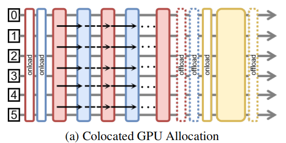

所有组件（训练、生成和仿真）同时共享所有 GPUs ，这最大限度地提高了数据并行性，并确保没有GPU完全闲置 $\longrightarrow$ 当多个组件驻留在同一 GPU 上时，即使只有一个组件在进行计算，它们也可能同时占用内存，导致容量浪费 $\longrightarrow$ 考虑资源限制，进一步提出 offload 方案：闲置组件可暂时移至 CPU 内存，释放 GPU 资源供活动组件使用 $\longrightarrow$ 对于仿真器的 offload 方案：手动保存所有关键环境状态，确保仿真器在 GPU 重新加载后能正确恢复运行 $\longrightarrow$ 虽然 offload 方案可以减少内存争用，但在实践中高频地 onload-offload 其时间开销可能变得相当大。

**3.1.2 DISAGGREGATED ALLOCATION**

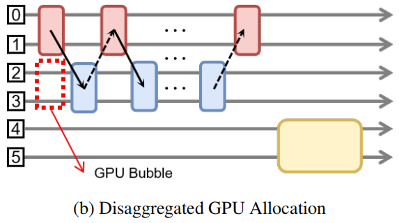

每个组件被分配到一个独立的分区（可能包含多个 GPUs ），且各组件之间互不重叠 $\longrightarrow$ 组件间**先后依赖**关系导致 GPU 利用率不足 $\longrightarrow$ “GPU气泡”：仿真必须等待由模型生成过程产生的动作，导致部分 GPUs 闲置。

**3.1.3 HYBRID ALLOCATION WITH FINE-GRAINED PIPELINING**

在混合分配中，组件可以灵活选择 GPUs $\longrightarrow$ 典型的配置是将<u>生成过程和仿真过程</u>分配到不同的 GPUs 分区，而允许<u>训练过程</u>使用所有 GPUs $\longrightarrow$ 单个 GPU 上的仿真器实例被划分为多个子仿真器 $S^{(1)}, S^{(2)}, \ldots, S^{(k)}$ $\longrightarrow$ 在 0 时间步 $S^{(1)}$ 生成观测 $o_{0}^{(1)}$ $\longrightarrow$ 在 1 时间步观测 $o_{0}^{(1)}$ 进行动作生成 $a_{1}^{(1)}$ ，**于此同时** $S^{(2)}$ 生成观测 $o_{0}^{(2)}$ $\longrightarrow$ 在 2 时间步 $S^{(1)}$ 生成新的观测 $o_{1}^{(1)}$ **于此同时**观测 $o_{0}^{(2)}$ 进行动作生成 $a_{1}^{(2)}$  $\longrightarrow$ $\cdots$

- 并行运行，既减少空闲时间又保证正确性
- 避免了集中式分配带来的频繁 onload-offload 开销
- 消除（应该是减小）分散式分配中出现的 “GPU气泡”

**3.1.4 CONFIGURING GPU ALLOCATION MODES**

暴露简单的接口给用户 $\longrightarrow$ 为每个组件分配 GPUs 编号 / 使能 onload-offload / 大于 1 的参数控制细粒度并行

**3.2 MODEL COMPATIBILITY**

**3.2.1 LORA SUPPORT**

用户可灵活选择是否启用 LoRA `is_lora` $\longrightarrow$ 该模式下 VLA 中的所有**线性模块**默认被指定为目标模块

**3.2.2 MODEL TYPE**

根据 `model_name` 选择 base VLA —— OpenVLA (Maniskill) / OpenVLA-OFT (Maniskill / LIBERO) / $\pi_{0.5}$

**3.2.3 UNIFIED INTERFACE**

**3.3 MULTIPLE SIMULATORS SUPPORT**

Maniskill $\longrightarrow$ 多样的数字资产；LIBERO $\longrightarrow$ 针对 VLA 模型的指令引导任务，测试其泛化和高级推理能力

**3.3.1 UNIFIED INTERFACE**

向量化环境 $\longrightarrow$ ManiSkill GPUs 原生支持并行 / LIBERO’s CPUs 并行包装器

- Gym-style API 函数

  `auto_reset` $\longrightarrow$ 任何终止或被截断的子环境都将自动重置

  `ignore_terminations` $\longrightarrow$ 系统会忽略终止信号，仅保留截断信号，这意味着只有当达到最大 episode length 时，该 episode 才会结束

  `chunk_step` $\longrightarrow$ (1) 当子环境在 chunk 内完成时立即重置 (2) 延迟重置直至整个 chunk 执行完毕

- Utility 函数：可视化工具可轻松生成视频

  `use_fixed_reset_state_ids=True` $\longrightarrow$ 实现 GRPO 的要求组内所有环境共享相同初始状态

**3.3.2 TASKS**

Maniskill $\longrightarrow$ `PutOnPlateInScene25Main-v3` $\longrightarrow$ 25个取放任务，包含不同物体和容器的变体 + 采用 RL4VLA 提出的分布外评估设置

LIBERO $\longrightarrow$ 4 个套件 $\longrightarrow$ LIBERO -130上训练模型 $\longrightarrow$ 包含 130 个专门设计用于评估 RLinf-VLA 在大规模任务环境下学习能力的任务组

**4 ALGORITHM DESIGN**

**4.1 ADVANTAGE AND LOG-PROBABILITY**

**4.1.1 ADVANTAGE WITH ACTION CHUNKS**

要将 action chunk 整合到 RL 中，必须明确如何将优势 advantages 与 chunk 内的 actions 相关联

定义 chunk $c_t = (a_{t,1}, a_{t,2}, \ldots, a_{t,C})$ ，内部单个 $a_{t,i}$ 动作向量产生单个奖励 $r_{t,i}$

====> **chunk-level 奖励**：**一个 chunk 就是一个宏动作** $\longrightarrow$ 奖励就是整个 chunk 所有单个奖励的和 $r_t = \sum_{j=1}^{C} r_{t,j}$ $\longrightarrow$ 优势基于这个 action chunk 上进行估计 $\longrightarrow$ `reward_type='chunk_level'`

====> **action-level 奖励**：**单个 $a_{t,i}$ 动作向量就是一个动作** $\longrightarrow$ 奖励和优势估计都是基于单个 $a_{t,i}$ 动作向量计算 $\longrightarrow$ `reward_type='action_level'`

**4.1.2 LOG-PROBABILITY GRANULARITY**

在对数概率计算上有三种模式，通过 `logprob_type` 选择：

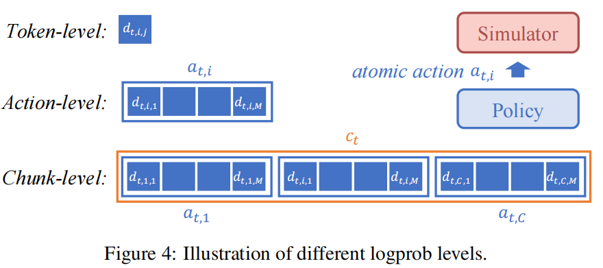

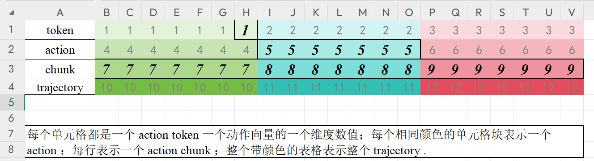

- `token_level`：$\pi(d_{t,i,j}|o_t, d_{t,i,:j-1})$ 拿上一个预测出来的 token 预测下一个 token
- `action_level`：$\pi(a_{t,i}|o_t, a_{t,:i-1}) = \prod_{j=1}^{M} \pi(d_{t,i,j}|o_t, d_{t,i,:j-1})$ 也就是 token-level 在 action-dim 范围内的乘积
- `chunk_level`：$\pi(c_t|o_t) = \prod_{i=1}^C \pi(a_{t,i}|o_t, a_{t,:i-1})$ 也就是 action-level 在 chunk-size 范围内的乘积

**4.1.3 SUPPORTED GRANULARITY COMBINATIONS FOR ADVANTAGE AND LOG-PROBABILITY**

优势类型与所有**粒度不小于自身粒度**的对数概率类型兼容。

当对数概率以更细粒度定义时，会对优势值应用广播机制 ====> 若优势以 chunk 级定义而对数概率以 token 级计算，则该 chunk 级优势会被分配给 chunk 内所有 token 。

**4.2 DESIGN CHOICES**

**4.2.1 PPO**

**==> Partial Reset Support** *Fixed Episode Length* 模式：就是只有当所有子环境都达到最大 episodes 长度时，环境才会被重置。`ignore_terminations=True` $\longrightarrow$ 鼓励 policy 持续地维持成功的状态。*Partial Reset* 模式：任何子环境在终止时都会立即重置，无需等待其他子环境。`auto reset=True` 和 `ignore terminations=False` $\longrightarrow$ 鼓励 policy 完成至少一次成功轨迹 $\longrightarrow$ 可以提升样本效率

**Critic Design** 让 Actor 和 Critic 共享 VLA 的大部分参数。Critic 在 VLA 基本组件的基础上，使用 3 层 MLP 组建 Critic 网络；提取 Transformer 网络最后一个 block 的第一个 action token 的表征 $h_{0}$ 。

**Value for Action Chunks** chunk-level 的话，整个 chunk 就是一个宏动作，用一个浮点数值估计，$S\rightarrow R$；如果是 action-level 的话，chunk 中的每个 action 向量是一个动作，因为 VLA 只基于一个时刻的观测作为输入，那么价值网络输出的就是一个价值向量，$S\rightarrow R^{C}$。`value_type` 与 `reward_type` 要一致。

**4.2.2 GRPO**

**Group Design** GRPO 算法的核心在于如何定义组。在 RLinf-VLA 框架中，只有当 2 个轨迹对应相同任务且初始状态相同时，才会被分配到同一组。

**Valid Action Mask** GRPO 同样支持 *Fixed Episode Length* 模式和 *Partial Reset* 模式，但是考虑到 GRPO 算法本身需要计算每一步的群组优势估计，因此 *Partial Reset* 模式下提前结束的轨迹需要用 mask 填补，以便对齐所有长度，便于做群组计算。

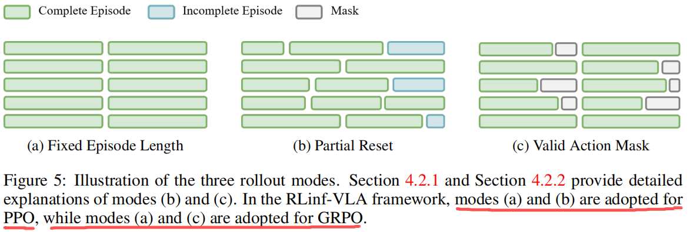

**Loss Normalization by Trajectory Length** VLA 期望在 RL 过程中能在越短的轨迹下完成任务越好。基于轨迹长度计算的损失正则化。为确保成功与失败轨迹在优化过程中贡献度均衡，采用有效动作 mask 设置，通过轨迹长度对策略损失进行归一化处理。

$$
\begin{equation}
J^{\text{GRPO}}(\theta) =
\mathbb{E}_{o_0 \sim D, \{\tau_i\} \sim \pi_{\theta_\text{old}}} \Bigg[
\frac{1}{G} \sum_{i=1}^G \frac{1}{T_i^\text{succ}} \sum_{t=1}^{T_i^\text{succ}} 
\min \Big( \rho_{i,t}(\theta) \hat{A}_i, \; 
\mathrm{clip}(\rho_{i,t}(\theta), 1-\epsilon, 1+\epsilon) \hat{A}_i \Big)
\Bigg].
\end{equation} 
$$

**Success Rate Filter** 过滤掉 “全部成功” 和 “全部失败” 的群组。

**5 EXPERIMENT RESULTS**

**5.1 HIGH-PERFORMANCE**

**5.1.1 MANISKILL**

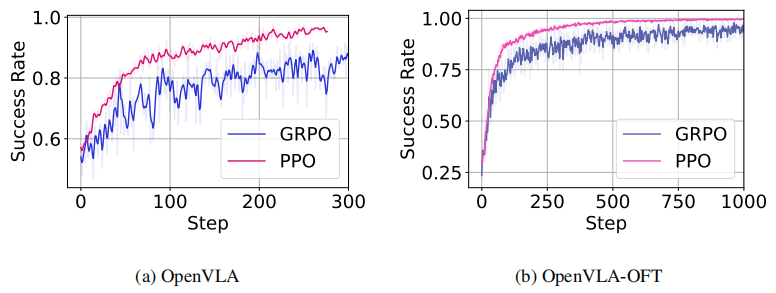

在 ManiSkill 25 任务测试中，**PPO 算法始终优于 GRPO 算法**（最终成功率 + 训练方差），且在 OpenVLA 和 OpenVLA-OFT 两种场景下均展现出更优的稳定性。

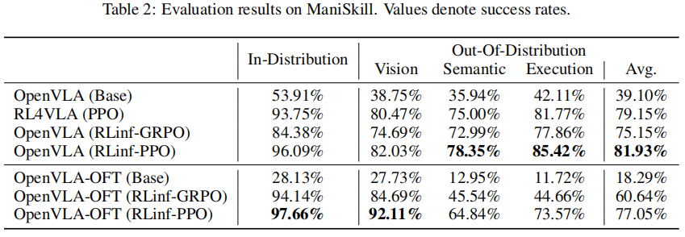

RL4VLA 和 RLinf-VLA 使用同样 PPO ，但是做了框架上的优化，效果会更好点。OpenVLA 和 OpenVLA-OFT 存在比较多的不同，但是尽管 OpenVLA-OFT 的初始性能相对较差，但是在 RL 微调过程中可以获得更大的增益 ====> base model 在 VLA-RL 训练中也十分重要，设计到性能提升和 OOD 泛化

**5.1.2 LIBERO**

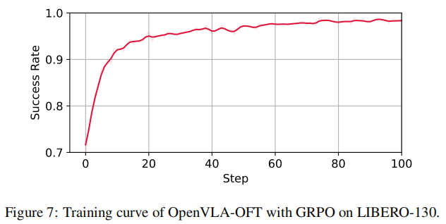

横轴是训练 epoch 但是图上被标注了 "Step" 。

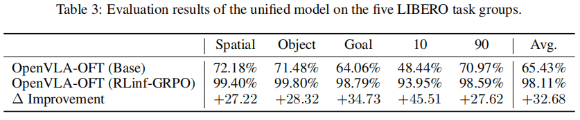

base model 是基于 LIBERO 的 130 个任务的演示轨迹微调得到 $\longrightarrow$ base model 就是 LIBERO 域中 multi-task 的模型 $\longrightarrow$ 然后再在 130 个任务中采样观测做 GRPO $\longrightarrow$ RL 微调的 model 就是 multi-task 的

**5.2 HIGH-EFFICIENCY**

（1）RLinf-VLA 采用的向量化环境实现比 SimpleVLA-RL 中手动编写的多进程环境工作进程更高效。

（2）RLinf-VLA 的实现避免了 SimpleVLA-RL中存在的冗余对数概率重新计算问题。

（3）RLinf-VLA 采用多项系统级优化，包括自适应通信机制，随着 GPU 数量增加，训练效率提升更为显著。

**5.3 ABLATION STUDY**

**5.3.1 TIPS FOR PPO**

在 action chunk 作为动作空间的 PPO 算法中，单个动作的价值估计优于 chunk 级价值估计。

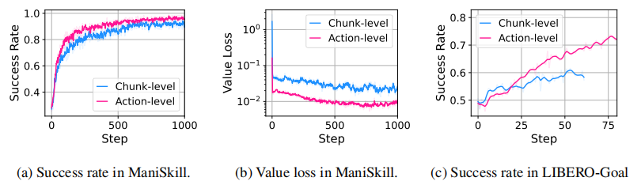

step-level 的价值估计始终能获得更高的成功率和更低的价值损失，这表明其学习效果更佳且策略改进速度更快。这种优势并非特定于某项任务：在 LIBERO -Goal / Maniskill 基准测试中都观察到了类似结果。

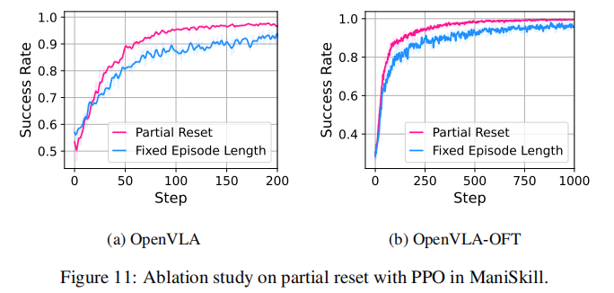

**Partial reset 环境重置 trick 可以提升样本效率**。由于优化目标是 “一次成功” ，Partial Reset 能显著提升成功率。在相同训练轮数下，Partial Reset 模式的成功率始终高于 Fixed Episode Length 模式。无论模型类型如何，这一趋势都表现明显。

**5.3.2 TIPS FOR GRPO**

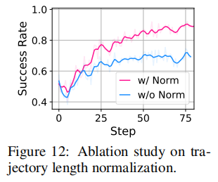

LIBERO-Goal 实验中采用轨迹长度归一化后，相比未归一化设置，性能可显著提升。

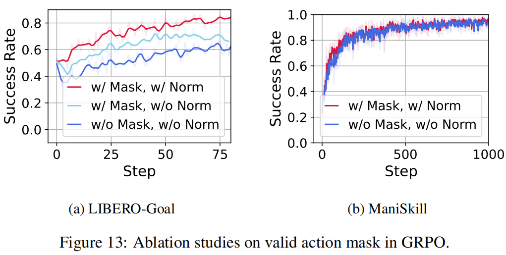

采用有效动作掩码的设置能持续获得更优性能，但是这个手段跟任务有关，Maniskill 就没有这种表现。

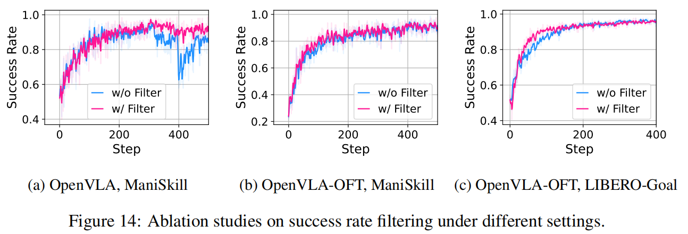

在某些 GRPO 应用场景中，成功率筛选机制能有效提升训练稳定性。这种 trick 可以增加，但是也是与任务和 base model 的关联性比较大。

**5.3.3 HYPERPARAMETERS CHOICE**

从训练周期的评估来看，规模更大的 rollouts 方案始终能取得更高的成功率。使用 LoRA 可能不会直接影响性能，但通常需要不同的超参数。

**5.4 REAL-WORLD DEPLOYMENT**

通过校准相机与机器人之间的相对姿态，确保其与仿真环境保持一致 ==> 除了仿真与现实世界的基础校准外，未采用任何额外的 sim2real 的适配技术。

baseline: *OpenVLA 的 SFT 版本*，训练 OpenVLA 在仿真环境中处理从数百到 64k 条专家轨迹（126 万样本）的数据集。实验发现性能在约 1.6 万条轨迹时趋于平稳，因此采用 1.6 万轨迹的 SFT checkpoint 点作为基准，用于对比强化学习的微调方法。

六个从未见过的物体（胡椒、黄瓜、香蕉、猕猴桃、山竹和海绵），每个物体需放入碗中。每个物体在不同初始配置下进行五次试验。

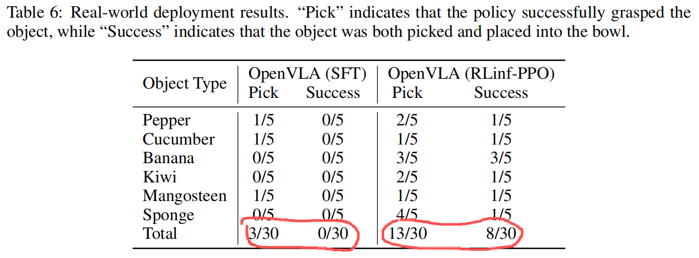

发现 SFT 策略容易出现过度运动和超调现象，这往往导致抓取姿态不准确，最终导致任务失败。相比之下，RL-based 策略虽存在轻微波动，但能持续优化末端执行器的姿态，最终实现更高的抓取成功率。

**6 CONCLUSION**

**7 FUTURE WORK**

