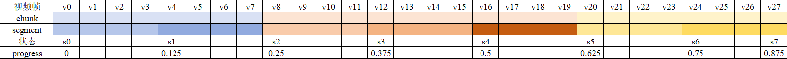
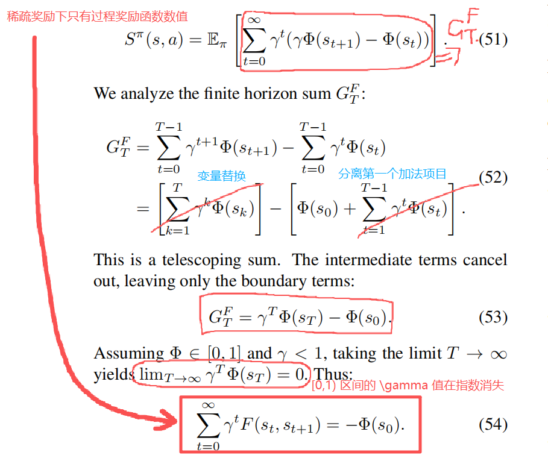
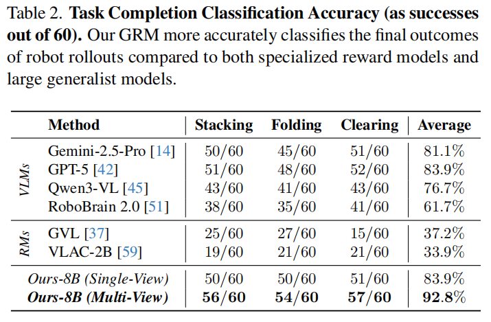
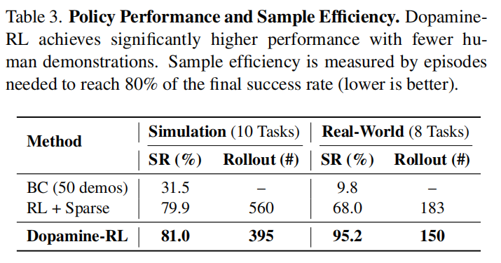
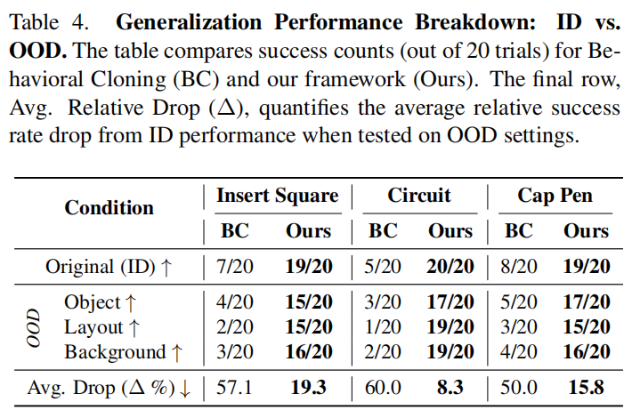

# Robo-Dopamine: General Process Reward Modeling for High-Precision Robotic Manipulation

**Abstract**

将 RL 应用于真实世界的一个困难之处在于奖励函数的构建和设计

基于学习的过程奖励模型 Process Reward Models 存在两个局限：

（1）缺乏步骤级 step-wise 感知理解；依赖于单视角感知，导致对精细操作进度评估不可靠；

（2）其 reward shaping 过程在理论上存在缺陷，常会诱导致 semantic trap 语义陷阱，从而误导策略优化。

作者提出：

- **Dopamine-Reward 奖励建模方法**：通用 / step-wise 过程奖励 / 多视角输入

  ====> 核心：*General Reward Model*, 基于 3400+ 小时的预训练模型，使用到了 *Step-wise Reward Discretization* 步骤级奖励离散化 + *Multi-Perspective Reward Fusion* 多视角奖励融合

- **Dopamine-RL 策略学习框架**：理论严谨的策略不变性 reward-shaping 方法

  ====> Agent 能够在不改变最优策略的前提下，利用密集奖励实现高效自我优化，从根本上避免语义陷阱

实验评估：

- 10 仿真 / 8 现实实验
- GRM: 奖励评估中得到最佳精度 // Dopamine-RL: 提升策略学习效率
- Case study: 当 GRM 通过单次专家轨迹一次性适应新任务后，其生成的奖励模型使 Dopamine-RL 仅需 150 次在线运行，相当于真实机器人交互约 1 小时，就能将策略成功率从接近零提升至 95% ，同时保持跨任务的强大泛化能力。

**1. Introduction**

传统 RL 奖励：Sparse 二元 / 长程和富接触任务较困难；Dense 需要领域专业知识 / scaling 和泛化性较差

基于学习的过程奖励模型 PRM：

1. 面向特定任务设计，泛化性差

   平稳 / 均匀的奖励分布预测，在关键步骤不能给出灵敏的奖励变化量

   仅凭单视角难以在精细操作中使用到腕部视角

   ====> 解决：Dopamine-Reward. 核心 GRM 采用<u>状态级递增</u> state-wise incremental reward 的奖励机制，可为真实机器人、仿真环境及以人类为中心的视频提供**全面覆盖**、**细粒度标签**及**均衡分布**的奖励。

2. 密集奖励设计存在理论缺陷 —— 语义陷阱 semantic trap: 无意间改变最优策略，导致智能体优先考虑中间步骤的高代理奖励而非真实任务目标，从而误导策略优化。

   ====> 解决：Dopamine-RL. 理论完善的策略不变性的奖励调整方法

---

GRM 评估指标：$92.8\%$ 进度精确性 + $0.953$ Value-Order Consistency (VOC) 分数

**2. Related Work**

**Reinforcement Learning for Robotic Skills.** 

作者总结三种工作路线：（1）online / offline 策略优化技术（2）在不同模型架构中的高效应用（3）设计一种在现实 RL 中有效且可扩展的奖励函数

**Learned Process Reward Models.** 

基于结果的奖励模型 ORM: 二元成功分类器 ====> 稀疏 / 富接触任务不合适

基于过程的奖励模型 PRM: "VLM as PRM." ====> 包含（1）根据成对 observations 预测任务进度 <u>"A vision-language-action-critic model for robotic real-world reinforcement learning."</u>（2）根据 language-instruction 预测单帧观测进度分数 <u>"Vision language models are in-context value learners."</u>

**3. Method**

**3.1. Dopamine-Reward Modeling Method**

**3.1.1. General Reward Model (GRM) Construction**

GRM ==> VLM ==> 基于<u>相对时序状态</u>转移构建的大规模数据集

- **Step-wise task progress discretization.** 演示视频分割

  人类标注 $\Longrightarrow$ 从 expert 演示轨迹中找到 $N$ 步关键帧 $\{K_0,K_1,\ldots,K_N\}$ ，每个 $K$ 关键帧都是多视角视觉图片的集合。$K_0$ 演示轨迹初始观测，$K_N$ 最后一帧观测 $\Longrightarrow$ 实际上是把演示视频拆成 $N-1$ 段，**视频拆分的程度时 subtask 级别，也就是每个视频片段都是一个 subtask**.

  如何对演示轨迹进行拆分得到关键帧？(1) 先把长度为 $L$ 的轨迹按照 $C$ 长度的 chunk size 进行拆分；(2) 在每个 chunk 内按照 $N$ 长度进行拆分；(3) 帧必然是整数，所以每次拆分计算都**取整**。最终得到的拆分点数量：

  $$
  m=\left\lfloor\frac{1}{N}\left\lfloor\frac{L}{C}\right\rfloor\right\rfloor
  $$

  把拆分点、初始帧和成功结束帧都考虑进去的话，就能得到一个状态序列：$\mathcal{S}=\{s_0,s_1,\ldots,s_M\}$

  每个关键帧都是多视角的 $\Longrightarrow$ 状态多视角 $\Longrightarrow$ 优化前人工作中 “只用单视角” 问题

  使用关键帧所在时间步的归一化数值 $\Phi(s_i)=i/M$ 作为任务进度。

- **Hop-based relative progress normalization.** 构建任务进度优化目标

  > 如果直接使用归一化数值 $\Phi(s_i)=i/M$ 来训练任务进度的话，会导致 $i$ 较小（接近 0 ）的时候产生极小的数值，会导致训练效果不良.

  直接使用 $\Phi_\delta(s_p,s_q)=\Phi(s_q)-\Phi(s_p)$ 会导致累计误差增大，且没有额外约束限制将导致数值膨胀 / 坍缩。

  提出 “前向-反向任务进度归一化方法”：

  $$
  \mathcal{H}(s_p,s_q)=
  \begin{cases}
  \frac{\Phi(s_q)-\Phi(s_p)}{\Phi(s_M)-\Phi(s_p)} & \mathrm{if }q\geq p\text{ (PROGRESS)} \\
   \\
  \frac{\Phi(s_q)-\Phi(s_p)}{\Phi(s_p)-\Phi(s_0)} & \mathrm{if }q<p\text{ (REGRESS)}. & 
  \end{cases}
  $$

  $\Longrightarrow$ 如果 $q\geq p$ 也就是 “向前看” 那么 $\mathcal{H}(s_p,s_q)$ 在 $[s_p, s_M]$ 上对 $s_q$ 进行归一化 $\longrightarrow$ 该变化通过与目标 $s_M$ 的**剩余距离**进行标准化，如果 $s_q$ 接近于 $s_M$ 那么归一化进度预测值接近于 $1$ .

  $\Longrightarrow$ 如果 $q<p$ 也就是 “向后看” 那么 $\mathcal{H}(s_p,s_q)$ 在 $[s_0, s_p]$ 上对 $s_q$ 进行归一化 $\longrightarrow$ 该变化通过与初始状态 $s_0$ 的**起始距离**进行标准化，如果 $s_q$ 接近于 $s_0$ 那么归一化进度预测值接近于 $-1$ .

  $\Longrightarrow$ 特性：能将任务进度有效地限制在 $[-1,1]$ 区间；

- **Sampling strategy and data balancing.** 数据集采样方法

  将上一步归一化得到的 Hop 数值 $\mathcal{H}(s_p,s_q)$ 离散化得到 $N_{\text{hop}}$ bins 分箱

  对于两帧之间 $s_p$ 和 $s_q$ 的时序差分数值，同样也采用分箱策略：将差分数值分成 $N_{\text{dis}}$ 个分箱

  $\Longrightarrow$ 所有数据集中的<u>状态样本对</u>的<u>所有可能性</u>都在 $N_{\mathrm{hop}}\times N_{\mathrm{dis}}$ 中！

  $\Longrightarrow$ 数据清晰策略：通过设计阈值 $\epsilon$ 来界定哪些帧 pair 是近似的

  $$
  |\Phi(s_q)-\Phi(s_p)|\leq\epsilon
  $$

总结：整个从原始演示视频到标注任务进度的 pipeline 一种可视化展示

---

将数据标注 pipeline 应用到 35M 样本点 / 3400 h 轨迹时长 / 100K 条轨迹

> 经过这样数据 pipeline 的状态提取，实际上得到的用于训练模型的样本点应该远小于 35M 数量的。

任务描述 + 起始状态 + 终止状态 + 任务一对状态 $\Longrightarrow$ GRM $\Longrightarrow$ 任务进度

**3.1.2. Multi-Perspective Progress Fusion from GRM**

上一节 "Hop-based relative progress normalization" 只是得到了两个状态之间的任务进度，且这两个状态可以是同一条轨迹内的任何两个状态，如何将这个建模的指标转变成相邻两个状态直接的任务进度计算？本部分解决这个问题。使用了三种计算方式处理 Hop-based 任务进度预测，并进行融合。

- *Incremental Prediction*

  【分析】根据公式 $\Phi(s_i)=i/M$ 说明 $\Phi$ 是随着下标，也就是状态序列号单调递增的，且 $\Phi(s_M)=M/M=1$ 和 $\Phi(s_0) = 0/M = 0$ 。

  当 $\mathcal{H}^{\ast} \ge 0$ 时，可以反推出是 $(\text{PROGRESS})$ 情况，那么：

  $$
  \mathcal{H}^{\ast} = \frac{\Phi(s_q)-\Phi(s_p)}{\Phi(s_M)-\Phi(s_p)} \Rightarrow \Delta\Phi_{t-1,t}^{\ast} = \mathcal{H}^{\ast}\cdot\big[ \Phi(s_M)-\Phi(s_p) \big] = \mathcal{H}^{\ast}\cdot\big[ 1-\Phi(s_p) \big]
  $$

  同理可得，当 $\mathcal{H}^{\ast} < 0$ 时，可以反推出是 $(\text{REGRESS})$ 情况，那么：

  $$
  \mathcal{H}^{\ast} = \frac{\Phi(s_q)-\Phi(s_p)}{\Phi(s_0)-\Phi(s_p)} \Rightarrow \Delta\Phi_{t-1,t}^{\ast} = \mathcal{H}^{\ast}\cdot\big[ \Phi(s_0)-\Phi(s_p) \big] = -\Phi(s_p)\cdot\mathcal{H}^{\ast}
  $$

  最终就能得到公式的两种情况：

  $$
  \Delta\Phi_{t-1,t}^{\star}=
  \begin{cases}
  [1-\Phi^{\star}(s_{t-1})]\cdot\mathcal{H}^{\star} & \text{if}\quad\mathcal{H}^{\star}\geq0 \\
  \Phi^{\star}(s_{t-1})\cdot\mathcal{H}^{\star} & \text{if}\quad\mathcal{H}^{\star}<0. & 
  \end{cases}
  $$

  因为是增量式，所以直接根据前序状态累加就行了：$\Phi_I^\star(s_t)=\Phi^\star(s_{t-1})+\Delta\Phi_{t-1,t}^\star$

  > 尽管该方法在捕捉局部动态方面表现优异，但其易受长轨迹预测误差累积的影响。为抵消这种漂移，引入了额外的两个全局视角。

- *Forward-Anchored Prediction*

  $$
  \Phi_F^\star(s_t)=\mathcal{H}^\star(s_\mathrm{init},s_t)=\frac{\Phi(s_t)-\Phi(s_{\text{init}})}{\Phi(s_M)-\Phi(s_{\text{init}})}=\frac{\Phi(s_t)-0}{\Phi(s_M)-0}=\frac{\Phi(s_t)}{\Phi(s_M)}=\frac{\Phi(s_t)}{1}=\Phi(s_t)
  $$

  所以 Forward-Anchored Prediction 就是当前归一化值...

- *Backward-Anchored Prediction*
  
  $$
  \mathcal{H}(s_\text{goal},s_t)=\frac{\Phi(s_t)-\Phi(s_\text{goal})}{\Phi(s_\text{goal})-\Phi(s_0)} = \frac{\Phi(s_t)-\Phi(s_M)}{\Phi(s_M)-\Phi(s_0)}=\frac{\Phi(s_t)-1}{1-0}=\Phi(s_t)-1 \\ \Rightarrow \Phi_B^\star(s_t)=1+\mathcal{H}^\star(s_\mathrm{goal},s_t)
  $$

  所以 Backward-Anchored Prediction 就是当前到未来的相对归一化值+1...

最后再将这三个值相加即可：

$$
\Phi^\star(s_t)=\frac{1}{3}\left(\Phi_I^\star(s_t)+\Phi_F^\star(s_t)+\Phi_B^\star(s_t)\right) \\
=\frac{1}{3}\big[ \Phi^\star(s_{t-1})+\Delta\Phi_{t-1,t}^\star+\Phi(s_t)+1+\mathcal{H}^\star(s_\mathrm{goal},s_t) \big]
$$

> 这种融合可产生更精确且抗漂移的信号，这对后续的奖励塑形至关重要。

**3.1.3. Progress Consistency Checking**

多视角融合在 online RL 中的直接应用存在 OOD 幻觉风险 $\Longrightarrow$ 数据覆盖的固有局限，训练集无法涵盖状态空间的每个角落 $\Longrightarrow$ Online RL 策略必然探索未见过的区域 $\Longrightarrow$ 奖励模型可能产生虚假的高信号，从而导致 "Reward Hacking" 现象。

为解决这些问题，提出一种双向一致性检查策略，该策略将一致性作为可靠的替代指标。

这一策略的动机源于观察到：在 OOD 场景或观测中，前向 $\Phi_F^\star$ 和后向 $\Phi_B^\star$ 的预测往往表现出显著差异，而在熟悉状态下则保持一致。

基于此，首先计算出前向-反向的预测均值：$\bar{\Phi}^*(s_t)=(\Phi_F^*(s_t)+\Phi_B^*(s_t))/2$ 

根据均值计算归一化差异性指标：$\Delta_{\mathrm{norm}}(s_t)=\frac{|\Phi_B^*(s_t)-\Phi_F^*(s_t)|}{\bar{\Phi}^*(s_t)+\epsilon}$ ；$\epsilon$ 极小值增强数值稳定性

$\Longrightarrow$ 通过 $\Phi^\star$ 进行归一化处理，可确保在早期阶段（即 $\Phi$ 较小时）对偏差进行更严厉的惩罚，因为此时精确引导至关重要。

$\Longrightarrow$ 使用灵敏度参数 $\alpha$ 的高斯核来最终计算出置信度权重：$w_t=\exp
\begin{pmatrix}
-\alpha\cdot(\Delta_\mathrm{norm}(s_t))^2
\end{pmatrix}$

$\Longrightarrow$ 对上面三个平均值融合的公式做线性变形，同时加入灵敏度参数调试，即可得到：

$$
\Phi^*(s_t)=\Phi^*(s_{t-1})+\frac{w_t}{2}\cdot\left(\bar{\Phi}^*(s_t)-\Phi^*(s_{t-1})+\Delta\Phi_{t-1,t}^\star\right)
$$

该机制充当语义过滤器：当权重 $w_t$ 趋近于零时保留 $\Phi^*(s_{t-1})$，忽略不确定的更新；当一致性较高时（ $w_t$ 趋近于1），则完全信任该估计值。

**3.2. Dopamine-RL Framework**

**3.2.1. One-shot GRM Adaptation** —— *"minimal downstream task effort for rapid progress alignment"*

GRM 已经在广泛的数据集上预训练 $\Longrightarrow$ 只需单条轨迹即可完成泛化适应 $\Longrightarrow$ MSE 损失下微调 GRM

$$
\mathcal{L}_{\mathrm{GRM}}(\omega)=\mathbb{E}_{(s_p,s_q)\sim\mathcal{D}_{\mathrm{human}}}\|\mathcal{H}_\omega^\star-\mathcal{H}_{\mathrm{gt}}\|_2^2
$$

**3.2.2. Policy-Invariant Reward Shaping** —— *"fast convergence with policy-invariant guarantees"*

常规优化做法和 “语义陷阱” semantic trap 的概念出现：

> 因为 $\Phi^{\star}$ 已经能表征出当前的任务进度了，那么使用任务进度做密集奖励函数的很自然想法是：
> 
> $$
> r(s_t,a_t,s_{t+1})=\Phi^\star(s_{t+1})-\Phi^\star(s_{t})
> $$
> 
> 但是这样会存在问题。已知 RL 的优化目标式：$J(\pi)=\mathbb{E}_{\pi}[\sum_{t=0}^{\infty}\gamma^{t}r(s_{t},a_{t},s_{t+1})]$ ，考虑：
> 
> $$
> G_t = \sum_{t=0}^{\infty}\gamma^{t}r(s_{t},a_{t},s_{t+1}) \approx \sum_{t=0}^{T-1}\gamma^{t}\big( \Phi^\star(s_{t+1})-\Phi^\star(s_{t}) \big) = \sum_{t=0}^{T-1}\gamma^{t} \Phi^\star(s_{t+1}) - \sum_{t=0}^{T-1}\gamma^{t} \Phi^\star(s_{t})
> $$
> 
> 对于第一项，直接分离出最后一个加法项目；对于第二项，直接分离出第一个加法项目，可得：
> 
> $$
> \begin{align}
> G_{t} =& \left[\sum_{t=0}^{T-2}\gamma^{t}\Phi^\star(s_{t+1})+\gamma^{T-1}\Phi^\star(s_T)\right]- \left[\Phi^\star(s_0)+\sum_{t=1}^{T-1}\gamma^t\Phi^\star(s_t)\right] \\
> =& \left[\sum_{t=1}^{T-1}\gamma^{t-1}\Phi^\star(s_t)+\gamma^{T-1}\Phi^\star(s_T)\right]- \left[\Phi^\star(s_0)+\sum_{t=1}^{T-1}\gamma^t\Phi^\star(s_t)\right] \\
> =& -\Phi^\star(s_0)+\sum_{t=1}^{T-1}(\gamma^{t-1}-\gamma^t)\Phi^\star(s_t)+\gamma^{T-1}\Phi^\star(s_T) \\
> =& -\Phi^\star(s_0)+(1-\gamma)\sum_{t=1}^{I-1}\gamma^{t-1}\Phi^\star(s_t)+\underbrace{\gamma^{T-1}\Phi^\star(s_T)}_{\text{第三项}}
> \end{align}
> $$
> 
> 但是 $G_t$ 最后一项存在 $\gamma$ 的指数次方，会随着 $T$ 增大而数值消失，因此：
> 
> $$
> G=\lim_{T\to\infty}G_{t}=-\Phi^\star(s_{0})+(1-\gamma)\sum_{t=1}^{\infty}\gamma^{t-1}\Phi^\star(s_{t})
> $$
> 
> 最终就会导致 RL 优化目标被坍缩：
> 
> $$
> \arg\max_\pi J(\pi)\propto\arg\max_\pi\mathbb{E}_\pi\left[\sum_{t=1}^\infty\gamma^{t-1}\Phi^\star(s_t)|s_0\right]
> $$
> 
> 优化目标从<u>最大化进度变化</u>隐性转向<u>最大化进度状态随时间累积的价值</u>。

推导之后得出的结论是：智能体被鼓励**快速达到高进度状态**并**停滞不前**，以在每一步积累奖励，而非完成任务。这一理论结果证实了 “语义陷阱” 的存在。

> 关于 semantic trap 的推导具有说服力，而且从公式来看这并非是这篇论文这样设计任务进度而独有的问题：涉及到 "从状态抽取任务进度" + "使用任务进度差值计算过程奖励" 这样的做法都会存在 semantic trap 问题，无关乎任务进度网络模型的规模和归一化方式，可以上升到一种共性问题上。 

因此作者提出了如下观点：

- **Optimal policy invariance. 最优策略不变性.**

  $\Longrightarrow$ 通过 $r_{\text{GRM}}$ 学习到的最优策略必须与稀疏奖励 $r_{\text{gold}}$（例如：任务完成时为 1 ，否则为 0 ）下的策略一致

  $\Longrightarrow$ $r_{\text{GRM}}$ 在不改变任务目标的前提下引导探索行为

- **Discount consistency. 折扣一致性.**

  $\Longrightarrow$ $r_{\text{GRM}}$ 必须兼容标准指数折扣回报率，以及在马尔可夫奖励假设下采用 $\gamma$ 的 TD 或 Bellman 更新算法

  $\Longrightarrow$ 在 $t$ 时刻下持续了 $s$ 后，指标 $D(t+s)$ 只和 $D(s)$ 有关而和 $D(t)$ 无关

  $\Longrightarrow$ $\frac{D(t+s)}{D(t)}=D(s),\forall t,s \geq0$ $\rightarrow$  $\fbox{D(t+s)=D(t)D(s)}$

  $\Longrightarrow$ 取对数得到 $\phi(t+s)=\phi(t)+\phi(s)$ ，也就是一种线性方程，解是 $\phi(t)=-\lambda t=\ln D(t)$

  $\Longrightarrow$ 最终求解得到 $D(t)=e^{-\lambda t}$ $\rightarrow$ $D(h)=e^{-\lambda h}=\gamma$ 也就是<u>折扣损失现在是时变的</u>

- **Locality.** $\Longrightarrow$ 在任意时间步 $t$ ， $r_{\text{GRM}}$ 均可通过单个转移 $(s_t, a_t, s_{t+1})$ 高效计算得出。

作者提出计算 2 个状态之间的：

- 密集奖励函数（进度差异）：

  $$
  F(s_t,s_{t+1})=\gamma\Phi^{\star}(s_{t+1})-\Phi^{\star}(s_{t}),\quad\gamma=e^{-\lambda h}
  $$

- 结合稀疏奖励：

  $$
  \Phi^{\star}(s_{t+1})\geq1-\delta,\mathrm{~with~}\delta=0.05
  $$

最终就得到了二者结合的奖励：

$$
r_{\mathrm{GRM}}(s_t,a_t,s_{t+1})=r_{\text{env}}+F=r_{\mathrm{gold}}+\gamma\Phi^\star(s_{t+1})-\Phi^\star(s_t)
$$

有了奖励函数后，可以根据 shaped 奖励函数构建 shaped Q 函数，接下来在附录部分进行推导：

经过附录部分的推导后，可以得到：

$$
\sum_{t=0}^{\infty}\gamma^{t}(\gamma\Phi^{*}(s_{t+1})-\Phi^{*}(s_{t}))=\underbrace{-\Phi^{*}(s_{0})}_{\text{Boundary Term}}
$$

当 $t=0$ 替换成 $t=t^{\prime}$ 的时候，则：

$$
Q_{\text{process}}(s_{t^{\prime}},a_{t^\prime})=\sum_{t=t^{\prime}}^{\infty}\gamma^{t}(\gamma\Phi^{*}(s_{t+1})-\Phi^{*}(s_{t}))=\underbrace{-\Phi^{*}(s_{t^{\prime}})}_{\text{Boundary Term}}
$$

同时并入来自稀疏奖励环境的 $Q_{\text{gold}}$ 因此可以得到：$Q_{\text{GRM}} = Q_{\text{process}} + Q_{\text{gold}} = Q_{\mathrm{gold}}^\pi(s,a)-\Phi^\star(s)$

最终就可以得到 GRM 的优化目标：

$$
\arg\max_{a}Q_{\mathrm{GRM}}^{*}(s,a)=\arg\max_{a}Q_{\mathrm{gold}}^{*}(s,a)
$$

这就满足了上面提到的 "Optimal policy invariance. 最优策略不变性." 也就是 GRM 的优化目标本质上和稀疏奖励环境的 golden 优化目标本质相同。

**3.2.3. Universal RL-Algorithm Compatibility**

从上面的公式推导可以看到：$Q_{\text{GRM}}$ 实际上就是原始 $Q$ 函数减掉当前状态的任务进度预测 $\Phi^{\star}(s_t)$

任务进度预测与 Online / Offline 等等算法都没有直接关联，因此可以适用于绝大部分 RL 算法。

在实验中用到了三种 PPO / ReinFlow / Cal-QL 算法

**4. Experiments**

**4.1. Accurate Task Progress Perception**

【问题】与 VLMs 及现有奖励模型相比，GRM 在感知任务进展方面的准确性如何？

【做法】采用两种互补性协议评估任务进展：视频帧秩相关性与任务完成判断。

- **Video Frame Rank-Correlation**

  Value-Order Correlation (VOC) 是《Vision language models are in-context value learners.》论文中提出的一种评价指标，用于衡量**视觉语言模型 (VLM) 对任务进度 / 价值预测的一致性与正确性**。该指标通过比较模型预测的价值顺序与真实时间顺序之间的秩相关性来评估价值预测是否合理。

  具体来说：对于一个专家演示轨迹，其真实时间顺序是从第 $1$ 帧到第 $T$ 帧；专家演示在时间维度上应该呈现单调增加的任务进度 / 价值 $\Longrightarrow$ 一个好的价值模型应该<u>产生的预测值</u>与<u>时间顺序</u>高度一致

  $\Longrightarrow$ VOC 即该预测值顺序与真实时间顺序之间的排序一致性评分

  $\Longrightarrow$ VOC 的取值范围是 −1 到 1，其中：1 表示完全一致，预测值顺序与时间顺序完美对齐；0 表示无相关性；−1 表示完全相反，预测值顺序与真实时间顺序完全相反。

- **Task Completion Judgment**

  评估奖励模型在真实策略执行过程中对任务完成度 / 阶段预测的表现。

  $\Longrightarrow$ **分类得分（Classification Score，记作 ρ）**：奖励模型对真实执行轨迹中的阶段或任务完成情况的预测正确率 / 分类精度。

  $\Longrightarrow$ 该指标评估奖励模型在真实机器人执行中的一致性表现，尤其对失败轨迹和异常情况（如重复失败、回退等）是否能够正确判断进度。

【实验指标】

**4.2. Performance, Efficiency, Generalization**

【问题】Dopamine-RL 在成功率、样本效率以及对 BC 和 RL 的泛化能力方面表现如何？

【做法】评估 Dopamine-RL 框架在 10 项仿真任务和 8 项真实世界任务中的表现

【实验指标】

**4.3. Ablation Studies**

剔除融合机制并仅依赖单一进度评估器会持续降低性能：仅采用 incremental-only / 仅采用 forward-anchored-only 及仅采用 backward-anchored-only 的变体，其绝对性能分别下降 $15.0\%$ / $19.3\%$ 和 $22.5\%$ 。

其中仅采用 incremental-only 变体在长周期误差漂移中尤为脆弱，这印证了整合局部与全局进度视角的重要性。

移除策略不变的奖励塑形会导致性能大幅下降 $43.7\%$ ，智能体会陷入 “好到够用” 的状态陷入停滞，未能完成任务，这证实了 “语义陷阱” 。若仅依赖 zero-shot GRM ，该方法在 OOD 任务的边缘案例中偶尔会产生错误奖励，例如将正奖励分配给不良行为，或将负奖励分配给良好行为。这会阻碍策略收敛，导致成功率下降 $21.8\%$ 。

**E. Future Work**

1. 基于 VLM 的奖励函数部署在 RL 中会存在推理时延，使用量化方法进行优化

2. 致力于将 GRM 模型从离散帧对推理进一步发展为连续视频流推理。

   通过整合历史上下文序列并采用时序建模架构，模型将具备捕捉**动态运动趋势**的能力，例如惯性与轨迹等高动态任务的关键要素。同时这种时序连续性解决了静态帧固有的状态模糊性（例如区分物体的 “抓取” 与 “释放” 动作，或在需要多次重复的循环任务如试管洗涤中追踪累积进度），从而显著提升奖励评估的鲁棒性。

3. 更大规模的泛化性

4. 富接触任务的奖励模型 ====> 更多的多模态

