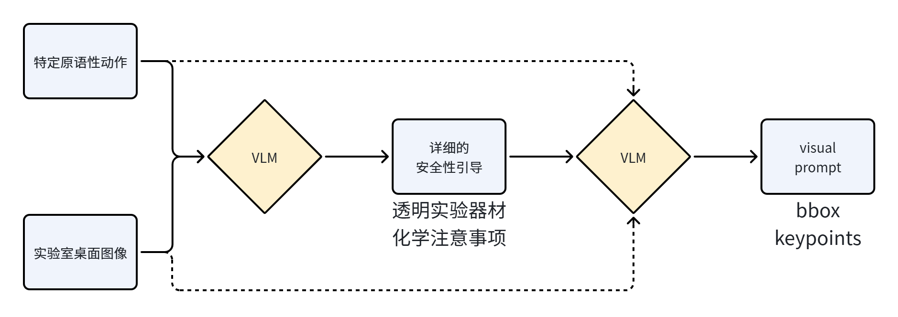
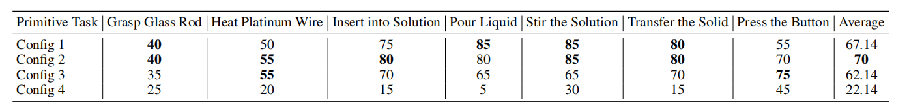
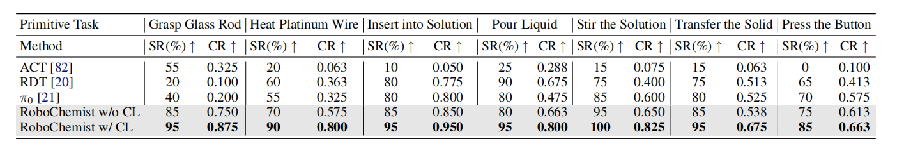
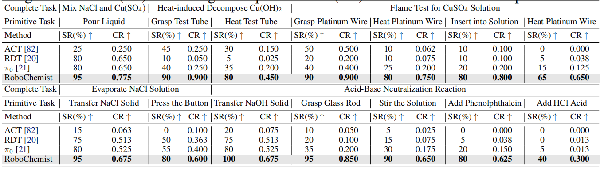
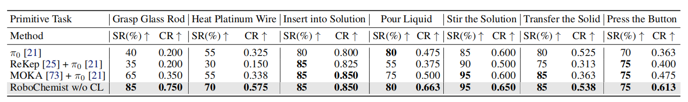
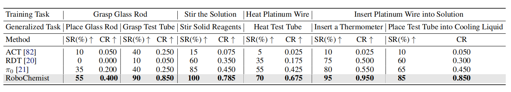

# RoboChemist: Long-Horizon and Safety-Compliant Robotic Chemical Experimentation

**Abstract & Introduction**

【问题】

化学实验涉及对<u>危险</u> / <u>精密</u> / <u>易变形物质</u>的长期操作流程，其成功不仅要求任务完成，还需严格遵守实验规范。

【前期工作】

- VLM based systems (VoxPoser / ReKep):

  依赖深度信息 $\longrightarrow$ 对透明物体表现较弱（参考 Lingbot-Depth）；依赖物体分割算法 $\longrightarrow$ 对可形变物体表现较弱。

- VLAs ($\pi_0$ / RDT):

  缺乏针对复杂任务的语义理解 + 闭环任务反馈

【工作】*RoboChemist*: 集成 VLM 和 VLA 的双循环 dual-loop 框架

- *[reason globally]* VLM 负责（1）planning: 将复杂任务解耦成原语性动作 / 结构化子任务；（2）controller: 为 VLA 模型创建视觉提示 —— 基于 bbox 或者关键点的目标抓取区域 —— 基于 Qwen2.5-VL 指令级视觉提示生成策略；（3）monitor: 评估任务成功与监管合规性 / 闭环反馈纠正。
- *[acting locally]* VLA 接收 VLM prompted 图像 / 本体状态 / 语言指令，产生 action tokens 实施精确 / 目标导向的控制过程

【实验】

原语性操作（pouring / stirring / grasping）与完整的多步骤化学操作（acid-base neutralization / flame tests）

【效果】

与 SOTA 的 VLA baseline 相比，平均成功率提高了 $23.57\%$ ，平均依从率提高了 $0.298$ ，同时在对象和任务上表现出强大的泛化能力。

【结论】

1. 闭环架构的优势在 long-horizon 任务中尤为显著，其 outer-loop 机制支持 condition-based 的重新执行，例如持续倾倒直至溶液变色。
2. 可推广至未见过的试剂 / 容器 / 工作流程，无需针对特定任务进行微调即可实现鲁棒的技能迁移。

**2 Related Work**

**Vision-Language-Action Models.**

**Visual Prompting.**

一种通过将**任务特定的视觉线索**嵌入输入来指导 VLM 的有效策略。

通过分割模型 + Farthest Point Sampling 技术从 RGB 图像中提取物体掩码 // 使用 K-Means 提取关键点

这些流程在关键点生成过程中缺乏对文本提示的直接利用，导致难以严格遵循指令层面的约束条件 —— 这在化学领域尤为重要。相比之下，采用 Qwen2.5-VL 等先进 VLM ，从初始阶段就生成具有指令感知能力的视觉提示。

**Robotic Automation in Chemistry.**

化学领域的机器人自动化技术已取得显著进展，其应用范围涵盖有机合成 organic synthesis / 材料合成 material synthesis / 微孔板操作 microplate handling 以及移动式探索化学家 mobile exploratory chemists. $\Longrightarrow$ 客制化硬件 / 预定义指令 $\Longrightarrow$ 跨场景 / 跨任务泛化性

现有 Organa / ArChemist / liquid handling approaches 方法 $\Longrightarrow$ 提升泛化性但是场景结构单一

Chemistry3D benchmark $\Longrightarrow$ 作为仿真 benchmark 无法满足真实世界需求

**3 Method**

**3.1 Overview**

**3.2 Visual Prompting**

**Motivation.** 化学场景中存在很多相似的仪器 $\longrightarrow$ 传统 VLAs 进接收 text condition 作为任务指令 $\Longrightarrow$ 对化学环境而言仍然 "模糊" $\longrightarrow$ 有效的解决方式是使用 visual prompt

液体倾倒任务：在 2~3 个透明烧杯中迁移液体 $\longrightarrow$ 标准 VLA + 有 / 无视觉提示 $\longrightarrow$ 结果：随着容器数量增加，成功率显著降低

但是现在主要 visual prompt 方法（1）在重建透明对象 / 确保安全可控的执行上存在问题；（2）在标准实验条件下，不考虑文本说明而预先计算抓取候选物的方法通常有效，但可能无法满足化学实验中至关重要的安全性和操作流程要求。

**Proposed Method.** 

**3.3 Closed-Loop System Design**

**Inner Loop Enhancement with Unsuccessful Trials.** 

VLA 推理闭环会在尝试失败 / 累积误差显著后自动终止 $\Longrightarrow$ 在训练数据中引入了特殊场景：当系统在首次尝试失败后，会自动进行二次执行 $\Longrightarrow$ 突破了单纯依赖成功单次任务的局限，显著提升了 VLA 模型的反馈能力

**Outer Loop Establishment with Monitors.**

内层 VLAs 循环缺乏明确的反馈机制，无法区分成功与失败，也无法支持需要持续监控的长期行为 $\Longrightarrow$ 引入了将 VLM 作为监控器的外层循环 $\Longrightarrow$ 每次内层循环结束后，当前场景图像会被输入 VLM ，该系统会评估每个基础任务是否达成预期目标，并在失败时启动恢复机制 $\Longrightarrow$ 外层循环还能提供持续反馈 $\Longrightarrow$ 将多个独立动作组合成连贯的序列，从而模拟出连续性行为。

> 作者在附录中用不同数据的配比来探究混合成功数据对 VLA 模型性能的影响：
>
> （1）400次成功试验，无失败尝试；（2）300 次成功试验及 100 次初次失败后进行第二次尝试的试验；（3）200 次成功试验及 200 次初始失败后进行第二次尝试的试验。（4）400 项试验中，在初次失败后进行第二次尝试。
>
> 
>
> 结论是：balanced 数据集比例最好；全部都是二次探索的数据集其实会降低模型表现。

**4 Experiment**

**4.1 Experiment Setup**

**Hardware Platform.** 

**Data Collection.** 每个原语任务采集 400 条数据 + 在实验场景设置和施加每个原语动作的对象均引入多样性 $\Longrightarrow$ 任务泛化能力；多样性包含：液体颜色 / 容器体积 / 容器种类 / 环境布局

**Baselines.** ACT / RDT / $\pi_0$ 

**Metric.** 成功率 SR 成功试验次数占据整个 20 次试验的比例；合规性 **Compliance Rate**：评估每次试验的更精确性评分：假设存在 $n_1$ 次试验得分为 0，$n_2$ 次试验得分为 0.5，$n_3$ 次试验得分为 1:
$$
CR=\frac{(0\times n_1)+(0.5\times n_2)+(1\times n_3)}{n_1+n_2+n_3}=\frac{(0\times n_1)+(0.5\times n_2)+(1\times n_3)}{20}
$$
**Model Training and Inference.** 微调 $\pi_0$ 30K 步，4 卡 L20；Qwen2.5-VL-72B-Instruct 做视觉提示；使用 GPT-4o 增加指令多样性；微调完毕后模型在单卡 4090 上以 20Hz 推理。

**4.2 Chemical Tasks**

**Primitive Tasks. ** 握住玻璃棒 / 加热铂丝 / 将铂丝插入溶液中 / 倾倒液体 / 用玻璃棒搅拌溶液 / 转移固体 / 并按下按钮

- RoboChemist 在所有任务的 SR 和 CR 指标上均优于所有 baselines 模型。
- 未配备闭环系统的 RoboChemist, 即仅添加 visual prompting 参考图像下，相比 $\pi_0$ 有所提升 $\Longrightarrow$ visual prompting 的有效性。
- 具有外环结构的 RoboChemist 比无外环版本具有更高的成功率 $\Longrightarrow$ 闭环系统在提升基础任务完成效率方面的有效性。

**Complete Tasks.** 混合氯化钠和硫酸铜溶液 $[\mathrm{Cu}(\mathrm{H}_{2}\mathrm{O})_{4}]^{2+}+4\mathrm{Cl}^{-}\to[\mathrm{Cu}\mathrm{Cl}_{4}]^{2-}+4\mathrm{H}_{2}\mathrm{O}$ / 氢氧化铜的热分解  $\mathrm{Cu(OH)}_2\xrightarrow{\Delta}\mathrm{CuO}+\mathrm{H}_2\mathrm{O}$ / 硫酸铜溶液颜色反应 / 氯化钠溶液的蒸发 / 酚酞指示剂的酸碱中和

- 随着实验的进行，其他 baselines 的成功率出现下降；
- RoboChemist 在由 2-3 个基础任务组成的任务中表现稳定，甚至成功完成了涉及多达五个步骤的更复杂任务。

**4.3 Effectiveness of Visual Prompting**

将该方法与 $\pi_0$ 的基线方法及其他基于视觉提示的方法（包括 ReKep 和 MOKA）进行对比。所有实验中，均根据相同的输入指令生成视觉提示，并将生成的图像作为微调 VLA 模型的参考。

**4.4 Generalizability**

**Generalization in Primitive Tasks.** 模型在训练中完成能够抓握玻璃棒 $\Longrightarrow$ 可以迁移到试管、烧杯及其他容器的拾取与放置操作

这些任务在保持核心操作意图的同时，引入了物体几何形状和物理交互的变体。

**Generalization in Complete Tasks.** 尽管仅训练了七项基础任务，但 RoboChemist 凭借其泛化能力和 VLM 中存储的丰富化学知识，能够完成多种复杂任务。

**5 Conclusion**

**6 Limitations**

1. 用于==执行操作的夹持器==并非专门设计用于化学任务，这限制了其处理特定器械的能力；采用更专业的机械手将扩展可执行任务的范围。
2. 该系统目前尚无法自主组装化学实验装置，此类装置需对各类组件进行高精度操作及精细处理。诸如==连接精密玻璃器皿==或==定位敏感设备==等任务，需要比现有机器人系统设计更为复杂的操控能力。
3. RoboChemist 当前的架构不适用于==需要严格定量==和==精确时间控制==的任务。未来工作包括集成更强大的硬件、扩展模型以支持精细的时间和定量控制，并在真实实验室环境中进行测试。
