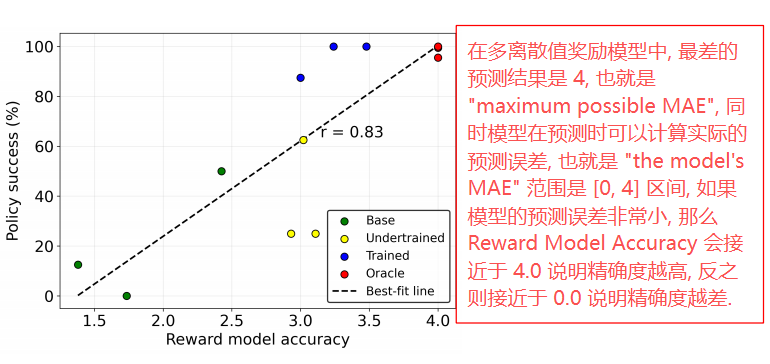
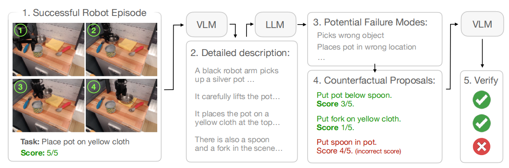
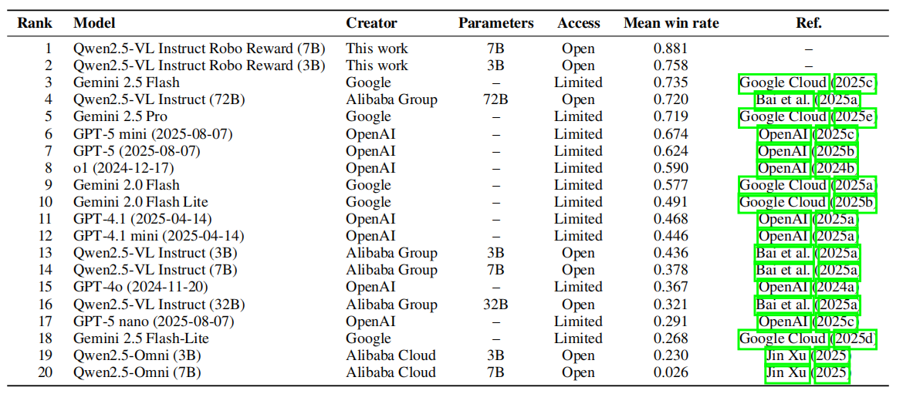
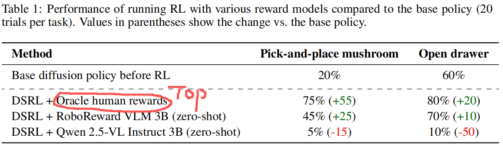

# Robo-Reward: A Dataset And Benchmark For Vision-Language Reward Models In Robotics

**ABSTRACT & INTRODUCTION**

VLMs as automatic reward models 已展现出应用前景（VLM as zero-shot reward models / Code as Reward / RoboCLIP / DSRL），但其在真实机器人任务中的有效性尚不明确 $\Rightarrow$ 实际机器人部署中难以提供足够精确的奖励

【作者思路】

在简单的仿真实验中发现**粗略**进度评分是强化学习的有效奖励形式 $\Longrightarrow$ 证实<u>奖励准确度</u>与强化学习性能相关 $\Longrightarrow$ 在<u>小规模基准测试</u>中进行设计选择 $\Longrightarrow$ <u>扩展至多样化的实际机器人数据集</u>

现存大规模数据集例如 OXE **缺乏失败案例**，但是 reward model 需要成功 / 失败估计来训练评估 $\Longrightarrow$ **开发重标注框架**来显著地增广 / 扩充这些数据集

【作者提出】

- [$\star$$\star$] 提出 **RoboReward**: 一个基于 OpenX-Embodiment (OXE) 和 RoboArena 大规模真实机器人语料库构建的机器人<u>奖励数据集</u>及<u>基准测试 benchmark</u>
- [$\star$] 提出一个基于上述数据集和 VLM 模型训练得到的 reward model
- [$\star$$\star$$\star$] 提出反事实重标注方法，将成功案例转化为针对**同一视频**的校准 calibrated <u>负面案例</u>和<u>近乎失败案例</u>

【结论】

1. 对主流开源和专有 VLMs 的评估表明，没有一个模型能在所有任务中表现卓越

   评估内容包含：离散 / 二元 / 监督范式

   "severely lacking in their ability to provide <u>accurate reward feedback</u> for robots" 

2. 训练 3B 和 7B 参数通用奖励模型，这些模型在 short-horizon 机器人任务的奖励分配上表现优于规模更大的、即插即用的 VLMs

   "two general-purpose robot reward models that outperform <u>all off-the-shelf models</u>"

3. 将 3B 参数奖励 VLM 应用于真实机器人强化学习，发现在策略学习方面较 base 3B 模型有显著提升

**2 RELATED WORK**

**Non-robot reward models.**

大部分关于 reward modeling 的工作都在于 LLM-RL 任务

LLM: RewardBench / RewardBench 2

多模态: VLRewardBench / Multimodal RewardBench

**Real-robot reinforcement learning.**

**Learned reward models for robotics.**

- 基于人类演示视频和机器人轨迹学习奖励函数；

- 基于偏好度的方法通过图像与轨迹比较或评分对 VLM 进行查询；

- 基于单个机器人视频提取得到的 sparse 或 shaped 奖励，采用 VLM 进行上下文价值学习；

  Vision-language models as success detectors.

  Vision-language models are zero-shot reward models for reinforcement learning.

  Vision-language models as a source of rewards.

  Adapt2reward: Adapting video–language models to generalizable robotic rewards via failure prompts.

  Video-language critic: Transferable reward functions for language-conditioned robotics.

  Code as reward: Empowering reinforcement learning with vlms.

---

应用场景：legged locomotion from videos / text-to-video diffusion-based dense rewards / autonomous driving with language-goal rewards / real-to-sim iterative keypoint rewards

OpenGVL leaderboard: 使用 VOC 指标在 expert videos 上评估 VLMs 作为**时序价值估计器**的能力

**3 THE ROLE OF REWARD IN REINFORCEMENT LEARNING**

RL 的 maximum expected reward 目标 $\Longrightarrow$ 奖励函数需要被明确 $\Longrightarrow$ 目标：训练和评估用于 robotics 的通用奖励模型

使用 DSRL 算法来 finetune diffusion policy, 该策略预先在 Robomimic 任务演示数据集上进行过训练，并由仿真环境提供 ground-truth 奖励作为基准.

针对每种奖励类型，通过编程方式为仿真 Robomimic 数据集标注真实 ground-truth 奖励标签，并对 Qwen2.5-VL 模型进行微调，使其能够根据完整 episode 视频预测奖励.

- **<u>奖励类型</u>**：明确为 episodic reward，定义是：<u>完整 episode 而非每个单独 step 分配的奖励值</u>。

  **Binary success**: 如果 episode 成功则 +1 否则为 0.

  **Continuous progress**: 奖励是仿真环境中对应任务进度的连续值，其取值范围为 $[0,1]$ .

  **Discrete progress**: 将进度分数划分为 5 个数值区间，并在 $\{1, \cdots, 5\}$ 范围内提供奖励.

  

  > ====> 这表明，针对下游任务影响 RL 性能的奖励类型中，学习进度型奖励模型比学习二值化奖励模型更为容易；此外，这种进度型奖励数值无论是离散的还是连续的对 RL 性能的影响极小。

  因此作者最终选择离散任务进度奖励，简单 / 易于标注

- **<u>奖励数值类型</u>**：二元 / 多值 / 离散数值 / 连续数值？ $\Longrightarrow$ 本质上是奖励精确度 accuracy 不同 $\Longrightarrow$ 作者基于此进行研究，探究：（1）何种<u>奖励机制</u>可促使 RL 训练<u>快速掌握新任务</u>（2）学习训练得到的奖励模型<u>精确度</u> accuracy 与 <u>online RL 性能</u>之间的相关性如何。

  $\longrightarrow$ 衡量精确性指标: MAE, 预测奖励值和真实奖励值得 L1 损失

  $\longrightarrow$ 在 Robomimic 预留验证集上计算 *Reward Model Accuracy* 并利用这些模型 checkpoint 训练 RL 算法并评估三个任务的成功率

  

  > ====> 在离线预留数据集上评估奖励模型的准确性，是判断下游 RL 应用性能的有效信号，具有可行性。

**4 THE ROBOREWARD DATASET AND BENCHMARK**

通用机器人奖励模型的性能提升 $\Longrightarrow$ 成功轨迹 + 失败轨迹 $\Longrightarrow$ 现有大规模机器人数据集以成功为主，但是对于必须区分精细粒度部分进展与失败的奖励模型训练而言，只有成功轨迹的方案对模型而言并非最优选择。

反事实重标注框架：counterfactual relabeling framework. 

从 HER 算法中受到启发，但是 HER 是<u>从失败数据集中标注出部分成功轨迹片段来增广样本中成功性试探</u>，而作者的是 "inverse HER" 从成功数据集中标注出部分失败的轨迹来增广数据集中失败性试探，来平衡原有数据集中只有成功的现象。

**4.1 DATA SOURCES**

数据集来源：

- Open X-Embodiment: 1M 演示轨迹，跨具身实体和超多任务 $\Longrightarrow$ 从每个数据子集中均匀抽样 episodes 并汇总，得到 1350 episodes 的 OXE 子集，避免每个任务中重复性较高的演示轨迹对训练造成的过拟合 $\Longrightarrow$ 每条轨迹都是成功演示，每条轨迹到的任务进度值都是 $+5$ 
- RoboArena: DROID robot platform $\Longrightarrow$ 重复性 / 同质性强的轨迹少 + 混合了成功和失败的轨迹 $\Longrightarrow$ 使用全部 RoboArena 数据集 $\Longrightarrow$ 利用提供的原始范围为 $[0,100]$ 的主观进展评分并将其映射为离散的 1 至 5 级奖励

**4.2 DATA CLEANING AND COUNTERFACTUAL RELABELING**

数据清洗办法：

1. 提示词重写。规范词汇和语法 + 在保持语义的同时优化表层表达形式。Qwen3 Instruct (4B)

2. 错误样例生成。

   给定演示 $e=(v, t, r)$ 其中 $v$ 为机器人视频 / $t$ 文本指令 / $r$ 专家演示下的成功奖励，数值为 5.

   核心做法：在保持机器人视频 $v$ 不变的情况下，魔改文本指令 $\hat{t}$ 进而引起 episode reward $\hat{r}$ 的变化，进而扩充演示三元组 $e=(v, \hat{t}, \hat{r})$。 

   细节：文本指令的魔改点在场景中操纵可见物体的变化，以及场景中物体之间的关系。

   奖励评分标准：

   (1) 最终状态与文本指令不相关 "no goal-relevant change for the task command" 为 1 分

   (2) 朝着目标虽有微小但不充分的进展 "a small but insufficient change toward the goal" 为 2 分

   (3) 虽处于总体目标区域，却违背了使其无法成功的各项要求 "in the general goal region but violates requirements that make it not a success" 为 3 分

   (4) 在区域和意图上存在，但未能满足精确的公差或要求 "in region and intent but misses a precise tolerance or requirement" 为 4 分

   (5) 最终状态满足所有要求 "The final state satisfies all the requirements" 为 5 分

   ---

   生成过程：

   Step 1: 使用 Qwen2.5-VL Instruct 7B 概述场景 以及 视频中出现的所有物体 及其 最终状态

   Step 2: 根据视频分析结果 Qwen3 Instruct 4B 提出了明确具体的故障模式 / 产生错误的 case，这些模式 / 错误的 case 形成了严格的 $1<2\cdots <5$ 排序。

   Step 3: LLM 为每个故障 case 以及对应的奖励评分提出一条指令

   Step 4: VLM 根据魔改指令 $\hat{t}$ 和视频 $v$ 进行合理性检查，当魔改指令 $\hat{t}$ 是视频 $v$ 可能存在的故障情况，那么返回 `yes` 反之为 `no` 并重新上面的顺序.

   > 意义：一个更丰富的奖励训练数据集，其中成功与失败的 “指令-视频对” text-video pairs 分布均衡，并促使奖励模型高度关注任务指令。

3. 不变下文本扰动。通过使用 Qwen3 生成每个任务描述的多个语义不变覆盖变体 $\{ t^{j} \}$，进一步扩展语义不变覆盖范围，这些变体在保留语义的同时，通过使用同义词等词汇和句法进行调整。

**4.3 TRAINING AND EVALUATION OF GENERAL-PURPOSE ROBOT REWARD MODELS**

【数据集】OXE 使用其原有的数据集，RoboArena 划分训 / 验 / 测试集。64850 训练集 / 2442 验证集 / 3105 测试集。

【模型】微调 Qwen2.5-VL-3 / 7B VLMs，输入文本指令和视频，输出 $\{1,\cdots,5\}$ episode reward 任务进度打分。冻结视觉主干网络，并以 $3×10^{−6}$ 的学习率和 $0.05$ 的权重衰减对融合层和 LLM 层进行微调，通过梯度累积训练，有效批量大小为 $64$ 。针对 3B 和 7B models，选取在保留验证集上使预测与真实 $1-5$ 奖励标签间 MAE 最小化的最佳检查点，从而训练出 VLM reward 模型：RoboReward VLM 3B 和 RoboReward VLM 7B 。

【benchmark】对测试集进行更精细化的人工验证，最终产生 **RoboRewardBench** 

**5 EXPERIMENTS**

**5.1 BENCHMARKING FRONTIER VLMS WITH ROBOREWARDBENCH**

评估指标: (1) MAE, 预测奖励和真实标签的 L1 损失 (2) 平均胜率 mean win rate: 在两两对比中，一个模型的预测“胜过”另一个模型的概率，对所有对手取平均。

> 大体上平均胜率 mean win rate 如何计算？
>
> 针对同一条样本 $(v, t)$ 输入给两个模型 A 和 B ，这两个模型各自预测了奖励 $\hat{r}_{A}$ 和 $\hat{r}_{B}$ 再和 benchmark 的真值奖励 $r_{gt}$ 进行对比，通过 MAE 计算得到损失 $e_{A}$ / $e_{B}$ ，并继续损失对比得出谁获胜
>
> $\Longrightarrow$ 对所有模型的所有 benchmark 样本都进行预测并记录
>
> $\Longrightarrow$ 最终平均胜率 mean win rate 的计算方式是：所有对手模型均匀抽取下检索这个模型打败对手模型的概率，最后再求期望。

结论：

1. **Supervision with RoboReward yields capable, compact reward models.**

   采用 RoboReward 数据集对 VLM 进行监督微调可生成高效 / 紧凑的奖励模型。

   使用 mean win rate 进行评估，优于代表闭源模型的 Gemini / 高参数数量的 QwenVL model

2. **Generalization to unseen sources.**

   在 unseen 的场景和文本对中具有泛化性

3. **Clear separation across model generations within model providers.**

   这个 benchmark 对不同模型基座能力也能有很好的区分

4. **No model is uniformly the best across all subsets of RoboReward.**

   即便是顶尖的视觉语言模型，在特定场景和实施方式下仍表现欠佳。

   > 即使对于前沿 VLMs，现实世界推理依然具有挑战性，而现实世界机器人任务的奖励分配正是现实世界推理的又一例证。

**5.2 TRAINING REAL-ROBOT POLICIES WITH VLM REWARD MODELS**

这部分就是解决微调出来的 VLM Reward Model 到底在 RL 上能力如何？

算法：DSRL // 在 BridgeData V2 数据集上预训练得到 multi-task diffusion policy

奖励函数：episode-reward 

三个对比：<u>自己微调的奖励</u> VLM $\{1-5\}$，<u>Qwen 2.5-VL Instruct 3B</u>  $\{1-5\}$，<u>人类评估</u>：人类标注者在成功时给予 $+1$ 的正向奖励，否则奖励为 $0$ 

环境 & 任务：WidowX robot. "拿起一个填充玩具蘑菇，放在一块布上" / "拉抽屉" 

====> 在 RoboRewardBench 上，基础 VLM 奖励的平均胜率 0.436 较低，实际上会降低 RL 的性能，相较于 base policy 而言，这表明一个糟糕的奖励模型进行 RL 会比没有 RL 的监督学习更差。

====> 人类二元奖励机制相较于 base policy 可提升性能

====> 排名第二是 RoboReward VLM 3B 在 RoboRewardBench 上的平均胜率为 0.758 ，其奖励分配的准确性虽未达到人类水平，但在两项任务上仍优于 base policy 。

