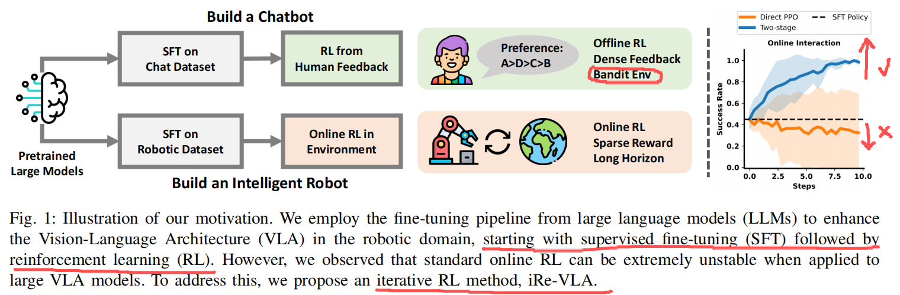
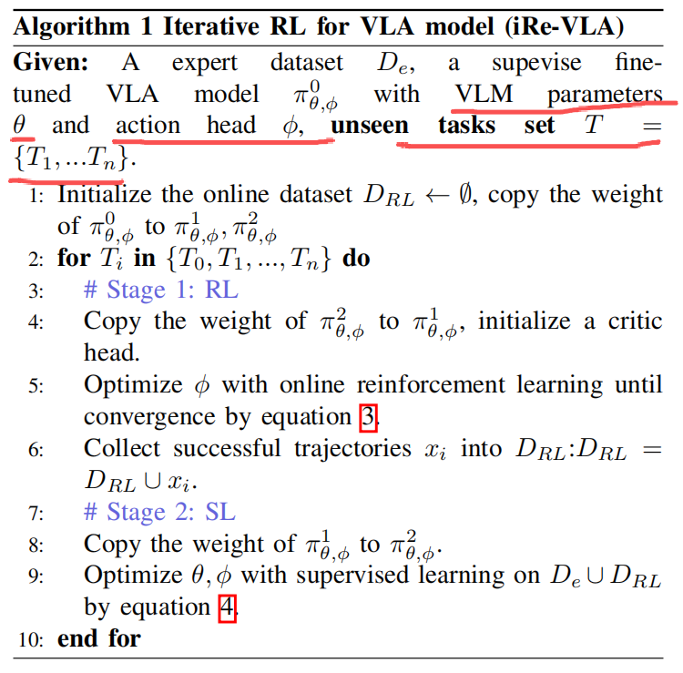
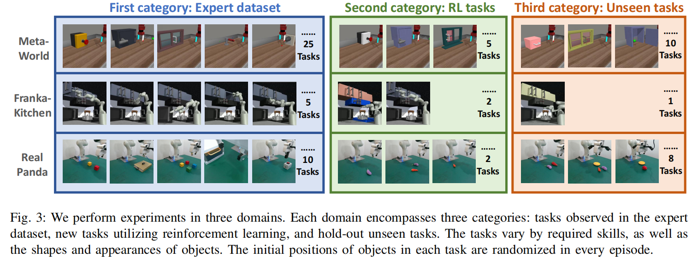
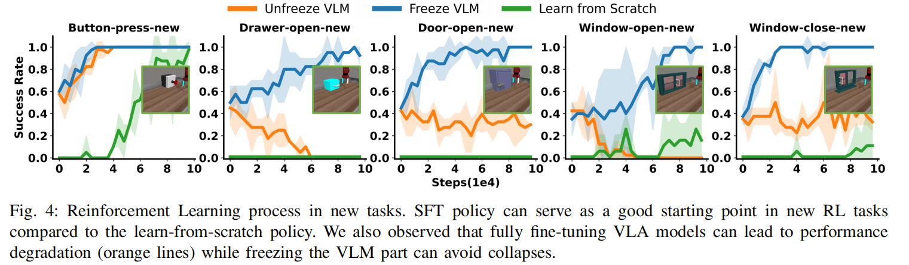
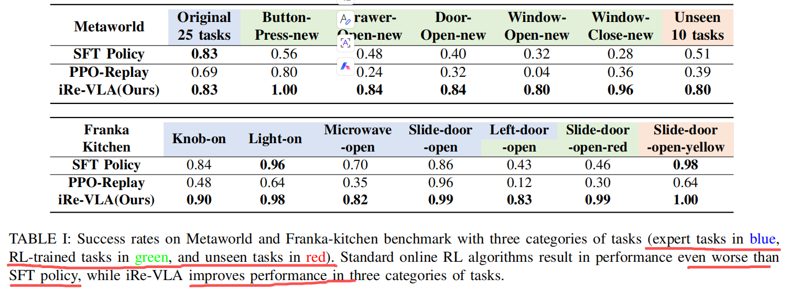
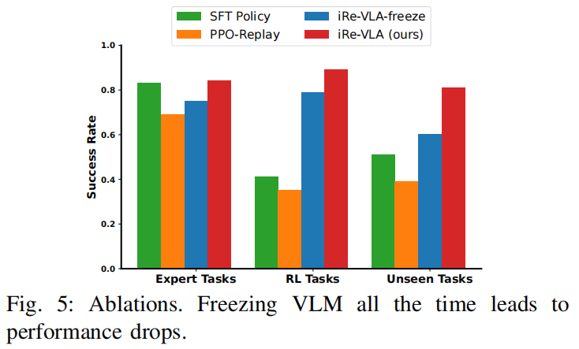
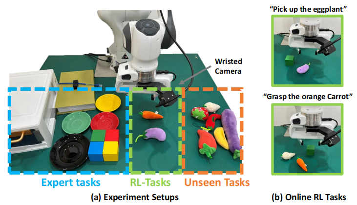
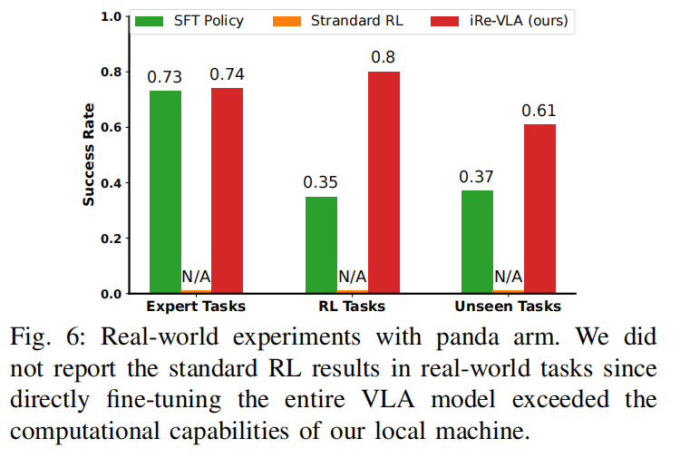

# iRe-VLA: SFT 和 online RL 交替进行 阅读思考

**Abstract**

研究背景：如何在与环境交互过程中提升 VLA 的表现？

研究思路：使用 RL

具体问题：（1）训练过程中的不稳定因素严重影响大模型的性能表现；（2）计算负载也远超大多数本地机器的处理能力。

解决方案：iRE-VLA ====> 通过交替使用强化学习和监督学习，既利用了 RL 的探索优势，又保持了 SFT 稳定性。

实验评估：仿真 benchmark 和真实实验

**I. INTRODUCTION**

SFT 依赖于高质量的专家数据集，但在机器人领域获取这些数据既昂贵又困难。

纯监督学习可能无法完全使 VLA 模型与物理环境对齐，因为存在分布偏移问题。

受 LLMs 中 RLHF 启发 $\longrightarrow$ 把 online RL 融入 VLA 后训练 $\longrightarrow$ 让 VLA 进一步与环境对齐

RL 范式引入 VLA 后训练存在两个问题：（1）任务普遍具有长程性，伴随稀疏奖励性质；（2）Online RL 带来了比较多的训练不稳定因素 $\longrightarrow$ 直接将标准 RL 算法应用于 VLA 模型时，会导致训练过程不稳定并引发性能下降。

提出 iRe-VLA ：在在线强化学习阶段与监督学习阶段之间循环迭代。

- RL 阶段：为确保训练稳定性，**冻结 VLM 参数**，仅训练轻量级 action-head 。
- SFT 阶段：通过成功轨迹对**整个模型**进行微调，从而充分发挥大模型的表达能力。

评估：MetaWorld, Franka Kitchen, 和真实世界的 Panda 操作任务合集。

结论：1. 领域内成功；2. 未见场景也有提升；3. VLA 的泛化性能力在 online rl 上提升了。

**II. RELATED WORKS**

在 RLHF 框架中，首先基于<u>预先收集的人类偏好数据集</u>训练<u>奖励模型</u>，随后在约束模型不大幅偏离原始模型的条件下，通过<u>多臂老虎机环境</u>对 LLMs 进行优化，该方法可视为**离线式强化学习**。

**III. PRELIMINARY**

**Reinforcement Learning**

采用 POMDP 建模任务，其中一个任务可表示为
$$
 M = (S, A, P_T, R, \gamma, O, P_E) 
$$
其中，$$S$$ 和 $$A$$ 分别表示状态空间和动作空间，$$O$$ 表示机器人观测，例如视觉图像。$$P_T : S \times A \times S \rightarrow [0, 1]$$ 表示状态转移概率函数，$$R : S \times A \times S \rightarrow \mathbb{R}$$ 为任务的奖励函数。在机器人任务中，奖励信号通常是稀疏的，因此论文中考虑二值奖励，当机器人成功完成任务时 $$R = 1$$，否则 $$R = 0$$。$$P_E : S \times O \rightarrow [0, 1]$$ 表示观测的初始概率。  

策略 $$\pi_\theta : O \rightarrow A$$ 表示一个基于参数 $$\theta$$ 的动作空间概率分布。

参数 $$\theta$$ 的优化目标是最大化带折扣因子的期望回报：
$$
J(\theta) = \mathbb{E}_{(s_0,o_0,a_0),(s_1,o_1,a_1),... \sim p_\theta} \left[ \sum_t \gamma^t R(s_t, a_t) \right]
$$

**Vision-Language Model**

VLMs 模型大致可以分为两大类：**表征学习模型**（如 CLIP ），以及**生成式模型**（如 Blip-2 和 InstructBlip）。

形式上，生成式 VLMs 从以下条件分布中采样 token 序列 $$x_{1:K}$$：
$$
x_{1:K} \sim p(x_{1:K} \mid I, c)
$$

其中条件为输入图像 $$I$$ 与指令 $$c$$。

**IV. METHOD**

目标：在线交互中提升 VLA 的性能同时维持对机器人而言合适的计算量 $\longrightarrow$ 属于 VLA 后训练 $\longrightarrow$ 从已经在下游任务微调过的 VLA 模型开始

**A. Model Architectures**

使用 BLIP-2 3B 模型作为 VLA 骨干 $\longrightarrow$ BLIP-2 3B 模型只能输出离散文本 token $\longrightarrow$ 以末端位姿和夹爪张角增量为动作空间 + 将 VLM 的最后一个全连接层替换为新初始化的动作头 $\longrightarrow$ 全参微调 3B 以上参数量会导致计算量暴增 + 少量数据全参微调整个数据容易导致过拟合 $\longrightarrow$ 使用 LoRA 显著降低可训练的参数 $\longrightarrow$ VLM 层训练参数 $\theta$ 且 action head 训练参数是 $\phi$

**B. Learning Pipeline**

**Stage {0}: 使用专家数据微调 VLA**

使用 $D_e=\{(o_1,l_1,a_1),(o_2,l_2,a_2),...,(o_i,l_i,a_i)\}$ 微调 $\pi_{\theta,\phi}$ VLA ：
$$
\begin{equation}\label{stage0}
    J^0(\theta,\phi)=\mathbb{E}_{(o,l,a)\sim D_e}\left[\left|\left|\pi_{\theta,\phi}(o,l)-a \right|\right|^2_2\right]
\end{equation}
$$
$\pi^0_{\theta,\phi}$ 的质量于专家演示数据的规模和质量高度相关 $\longrightarrow$ 是 valuable starting point

使用 $\pi^0_{\theta,\phi}$ 来进行 “奇数阶段” 的 RL 

**Stage {奇数}: 冻结 VLM 进行 online rl**

引入了一个与 action head 结构相似的 critic head ，但其输出维度被设定为一维。

在此阶段，将 VLM 参数 $\theta$ 冻结，因此仅对动作头的参数 $\phi$ 进行优化。
$$
\begin{equation}\label{stage1}
    J^1(\phi)=\mathbb{E}_{\big((s_0,o_0,a_0),(s_1,o_1,a_1),...\big)\sim p_{\phi}} \left[ \sum_t \gamma^t R(o^t,a^t) \right]
\end{equation}
$$
完成 online rl 后，机器人会发现新的轨迹 $x_i$ 来解决新任务。随后，将**这些成功轨迹**整合到在线数据集 $D_{RL} $ 中，即 $D_{RL}=D_{RL} \cup x_i$ 。

**Stage {正偶数}: 使用 专家数据 + 在线数据集 微调 VLA**

避免遗忘掉之前的专家数据，因此 SFT 训练目标将被调整：
$$
\begin{equation}\label{stage2}
    J^2(\theta,\phi)=\mathbb{E}_{(o,l,a)\sim D_e \cup D_{RL}}\left[\left|\left|\pi_{\theta,\phi}(o,l)-a \right|\right|^2_2\right]
\end{equation}
$$

**V. EXPERIMENTS**

**A. Experiment Setups**

每个领域包含三类任务：示范数据集中观察到的专家级任务、通过在线强化学习优化的强化学习训练任务，以及未在先前训练中出现的保留任务。最初，使用专家数据集对 VLA 模型进行了监督微调训练。随后，通过 online RL 提升 VLA 模型在第二类新任务上的性能。最后，使用第三类任务来评估已训练 VLA 策略的泛化能力。

- 在 MetaWorld 领域，专家数据集包含 25 个任务，每个任务包含 50 条轨迹。第二和第三类任务引入了**物体形状、颜色和位置**的新变化。
- 在 Franka 厨房领域，专家数据集包含 5 个任务，而第二和第三类任务则包含物体外观和位置的全新变化。
- 针对现实世界任务，通过**远程操作**和**脚本**收集了 2000 条轨迹，涵盖抓取、放置、按钮操作、电缆布线和抽屉开启等动作。现实世界实验中的未见任务包括拾取未知物体。

**B. Why do we adopt two-stage iterative optimization?**

作者的解释是：将 VLA 直接参与 RL 微调会导致性能下降（not mentioned: 因此需要 SFT 微调）。

作者的两阶段 iRe-VLA 框架通过**分布式计算**来应对这些挑战。在奇数阶段 online RL 中，iRe-VLA 冻结上层 VLM ，仅调整轻量级动作头，从而确保本地机器（单卡 NVIDIA 4090）的计算需求可控。第二阶段的优化任务则交由远程服务（4卡 NVIDIA A100）处理，这些服务能够承担更大的计算负荷。

**C. Simulated Manipulation Experiments**

VLA 模型为 RL 任务提供了有效的起点。将 iRe-VLA 方法与标准 PPO 算法进行对比，为了公平期间，在 PPO 中加入同样的专家数据回放策略。

标准 PPO 算法在应用于 RL 任务时往往表现出不稳定性。这种不稳定性不仅会影响 RL 任务的表现，即使采用经验回放技术，也会降低先前已掌握任务的性能。这种性能下降可能源于强化学习梯度存在噪声，这对 VLA 模型预训练表征产生了负面影响。相比之下，提出的两阶段 iRe-VLA 方法能稳定 RL 过程，有效提升已知任务和未知任务的性能表现。

| 文中编号                                        | 涉及点                              | 正确分类                                                     |
| ----------------------------------------------- | ----------------------------------- | ------------------------------------------------------------ |
| (1) **Improved Performance in Original Tasks**  | same task                           | 不是 multi-domain，也不是 multi-task                         |
| (2) **Improved Performance in RL Tasks**        | different tasks in multiple domains | 典型 **multi-domain + multi-task** ，可以处理不同 domain **内**的不同 task。 |
| (3) **Improved Generalization in Unseen Tasks** | mostly new tasks generalization     | 主是 **multi-task** generalization（附带轻微 domain shift like color/shape） |

在 iRe-VLA 方法中，整个 VLM 网络可在第二阶段的监督学习中进行训练。通过冻结 VLM 网络的两个阶段（即 iRe-VLA-freeze）开展了消融实验。这种操作确保了在线迭代数据不会影响 VLM 的潜在状态。

但是，永久冻结 VLM 会导致性能下降。这可能是因为 action head 相较于完整 VLA 模型的表达能力有限。**在线机器人动作数据**能够增强 VLM 上层的表征能力，从而提升 VLA 模型在未见任务中的泛化能力。而若在两个阶段都冻结 VLM ，则**无法改善其表征效果**。

**D. Real-world Manipulation Experiments**

真机实验采用了 SERL 中描述的实验设置，这套软件套件是现实世界 RL 的实用工具。

首先在 2000 个人类专家标注的各类任务数据集上训练 VLA 模型，涵盖抓取、放置、按钮操作、线缆路径规划和抽屉操作等任务类别。通过实验发现，得益于 VLA 模型的泛化能力，训练好的模型在面对未见过的物体时仍能保持较高的成功率。

随后采用 online RL 技术，进一步提升了模型在新场景下的成功率。在构建大 VLA 模型时，通过多项关键设计优化了样本效率并确保计算成本可控。为提升样本效率，采用了 SACfD 算法。首先采用 zero-shot 的 VLA 模型，收集包含 20 条成功轨迹的演示缓冲区。训练过程中，从演示缓冲区和在线缓冲区各抽取 $50\%$ 的轨迹进行训练。为控制计算成本，每个图像观测仅由 VLM 处理一次，其**生成的潜在输出被存储至缓冲区**。随后，在该潜在空间中实现了 SACfD 算法。

> SACfD = SAC + BC（只在 demonstration batch 上加） + prioritized replay + n-step return。它利用 demonstration 稳定 early learning，并允许在线 SAC surpass demonstration，不陷入 BC fixed suboptimal policy。

专家级抓取演示仅限于四种颜色的方块，进一步将 online RL 扩展到茄子、胡萝卜等**不规则形状**的物体。每个新任务的现实世界 RL 训练耗时约一小时，与 SERL 中的时间成本相当。

iRe-VLA 流程将茄子/胡萝卜的抓取成功率从 0.35 提升至 0.80 。此外，原始任务的成功率保持稳定，未见过物体的抓取成功率也从 0.37 提升至 0.61 。

**VI. CONCLUSION AND LIMITATION**

一个潜在局限：它仅能提升已知类型中的技能，而在稀疏奖励的在线强化学习环境中，无法掌握全新技能。