# mimic-video: Video-Action Models for Generalizable Robot Control Beyond VLAs

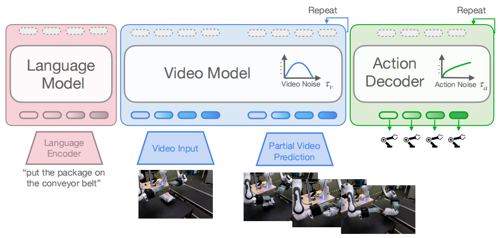

**Abstract & I. INTRODUCTION**

【背景】

主流操作 VLAs 基于 VLMs backbone 网络 $\Longrightarrow$ 大规模 / 时域不连续 / 静态的网络数据进行预训练 $\Longrightarrow$ 提升了语义泛化能力，但是仅通过演示轨迹**隐式推断**复杂的<u>物理动力学特性</u>与<u>时间依赖关系</u> $\Longrightarrow$ 这些特性和关系对机器人操作任务至关重要

【问题】

**如何解决 VLM-based VLAs 带来的、从模型本身过程就出现的内在缺陷？**

**如何使用 Internet-scale video 模态数据 for robotic policy?**

【提出】

**观点 —— 利用一种本质上编码<u>动态过程信息</u>的模态：视频** $\Longrightarrow$ 互联网规模的视频数据提供丰富的世界知识 // 精准捕捉物体之间交互作用的物理规律

**思路 —— 将机器人策略直接基于<u>生成式预训练视频模型</u>的<u>潜在表征</u>进行建模。**

**工作 —— mimic-video: 一种新型 Video-Action-Model (VAM) 视频动作模型**

该模型将预训练的互联网规模<u>视频生成模型</u>与基于 flow-matching 的<u>动作解码器</u>相结合，并根据其丰富的<u>潜在表征先验</u>进行条件化处理：

1. 初始观测数据 + 语言指令 $\longrightarrow$ 视频骨干网络 $\longrightarrow$ 潜在空间内预测未来轨迹

2. 中间视频模型表征 $\longrightarrow$ 下游动作解码器进行条件化处理。

   解码器作为轻量级逆动力学模型 (Inverse Dynamics Model, IDM)，能够从视频空间 "动作计划" 的潜在表征中生成低级机器人动作。

【实验】

一系列多样化的机器人设定，涵盖从标准单臂操作到双手灵巧任务的范围

【结论】

- 在仿真及真实世界机器人操作任务中 SOTA
- 相比于传统 VLM-based VLAs 样本效率提升了近 10 倍，收敛速度提升了近 2 倍

**II. RELATED WORK**

*a) Imitation Learning for Robot Control:*

*b) Vision-Language-Action (VLA) Models:*

*c) Video Models for Policy Learning:*

世界模型 (World Model) 可通过 "想象" 其结果来帮助在 runtime 运行时选择更优的动作序列，或作为已学习的 simulator 用于评估类 DAGGER 方法。

统一世界模型能够 (Unified World Model) 从零开始学习一个模型，该模型可灵活地作为<u>策略模型 / 视频预测模型</u>或<u>正向/逆向动力学模型</u>使用。

**III. CASE STUDY: HOW DOES VIDEO GENERATION QUALITY AFFECT ROBOT POLICY PERFORMANCE?**

**观点 —— 视频模型能够同时建模图像 / 物理动力学 / 视觉动作规划 $\Longrightarrow$ 此类强先验表征可有效将动作解码器降级成动作 "翻译器" $\longrightarrow$ 视觉动作规划映射为低维机器人动作**。

**做法 —— 在视频表征基础上训练动作解码器，并评估其在不同条件下的表现。**

通过对比两种条件下的成功率：（1）使用<u>标准现成视频模型或基于机器人数据微调模型</u>预测的**视频潜在变量**作为解码条件（2）采用<u>从真实未来视频帧中提取的 "先验" 潜在变量</u>作为条件。

**结论 —— 虽然通过微调缩小领域差异能提升预测视频模型的性能，但使用先验潜在变量进行条件化时，无论底层模型是否基于目标分布进行微调，都能获得近乎完美的成功率。**这就说明在使用预训练视频生成模型实现一款 robot policy 时候，不必过分 care 如何让预训练视频模型跟下游机器人的场景 / 环境等<u>数据分布做对齐</u>，直接关注好<u>预训练模型本身的质量</u>即可。

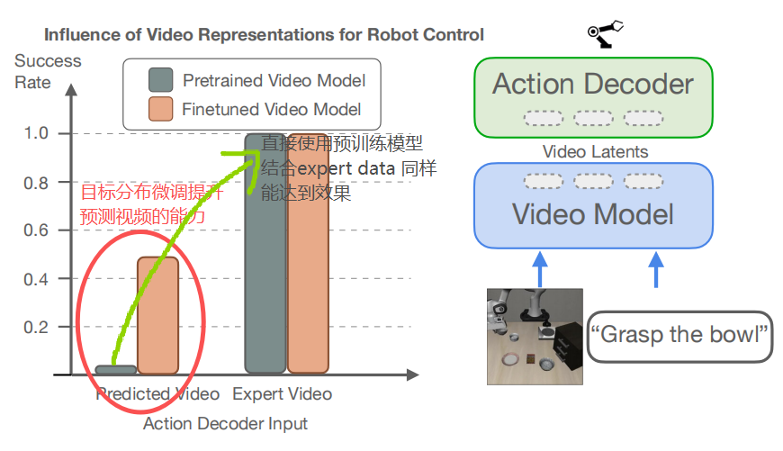

高质量预训练视频模型 as backbone $\Longrightarrow$ 丰富的表征信息 $\Longrightarrow$ 仅需<u>少量低级动作微调数据</u>即可让动作解码器完美解析低级动作方案

**IV. VIDEO-ACTION MODELS**

双条件流匹配（CFM）模型：（1）经过预训练的语言条件视频骨干网络；（2）一个轻量级动作解码器，该解码器通过基于视频模型的潜在表征进行条件化处理，从而作为**逆动力学模型**发挥作用。

*A. Preliminaries: Flow Matching*

*B. Architecture Formulation*

建模：学习一个通用的 robot policy $\pi(\mathbf{A}_t\mid\mathbf{o}_t,l)$, 其中输入 $\mathbf{o}_t=[\underbrace{\mathbf{I}_{t-H_o+1},\ldots,\mathbf{I}_t}_{\text{图像观测}},\underbrace{l}_{\text{文本指令}},\underbrace{\mathbf{q}_t}_{\text{本体数据}}]$ 输出动作块 $\mathbf{A}_{t}=[\mathbf{a}_t,\ldots,\mathbf{a}_{t+H_a-1}]$

video-model: $v_\phi(\mathbf{z}_{\mathrm{past}}^0,\mathbf{z}_{\mathrm{future}}^{\tau_v},l,\tau_v)$ 来建模未来帧分布 $p_\phi(\mathbf{z}_\mathrm{future}^0|\mathbf{z}_{\mathrm{past}}^0, l)$

action-policy: $\pi_\theta(\mathbf{A}_t^{\tau_a},\mathbf{q}_t,\mathbf{h}^{\tau_v},\tau_a,\tau_v)$ 来建模动作分布 $p_\theta(\mathbf{A}_t^0\mid\mathbf{q}_t,\mathbf{h}_t^{\tau_v},\tau_v)$

**中间表征: $\mathbf{h}^{\tau_v}=v_\phi^{(k)}(\mathbf{z}_{\mathrm{past}}^0,\mathbf{z}_{\mathrm{future}}^{\tau_v},l,\tau_v)$ 是进行 flow 过程中，在时刻 $\tau_v$ 下的视频模型第 $k$ 层中间状态张量。**

*C. Video Model*

`Cosmos-Predict2-2B` 作为 base model, 内部核心是一款 Latent Diffusion Transformer 是架构，基于<u>预训练的 3D 分词器</u>对序列视频帧进行操作处理。

该模型的输入由两部分拼接而成：context 的干净潜在 patch embedding（使用 5 帧数据） + 待生成未来帧的 "噪声" 潜在 patches。

前向计算中，每个 Transformer 层交替执行以下操作：(1) 对完整视频序列进行<u>自注意力机制</u>，(2) 对 T5 编码的语言指令进行<u>交叉注意力机制</u>，以及 (3) 采用<u>双层 MLP 结构</u>。

*D. Action Decoder*

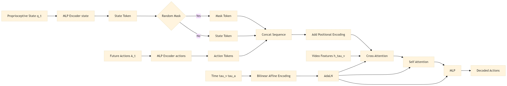

**TRICK**: 在训练过程中**随机地**将表示本体状态的 soft token 替换为一个<u>可学习的 mask token</u>，以防止模型在这种低维观测上过拟合 $\Longrightarrow$ 本质上是一种 **modality-level dropout** 操作，通过随机屏蔽低维本体状态的 soft token ，迫使 DiT action decoder 学习依赖视觉与时序信息，从而<u>避免 shortcut learning</u> 并提升多模态泛化能力。

*E. Action Sampling*

提出 *partial denoising* 部分去噪策略：从中间流状态提取语义特征，而不解析精细像素细节。

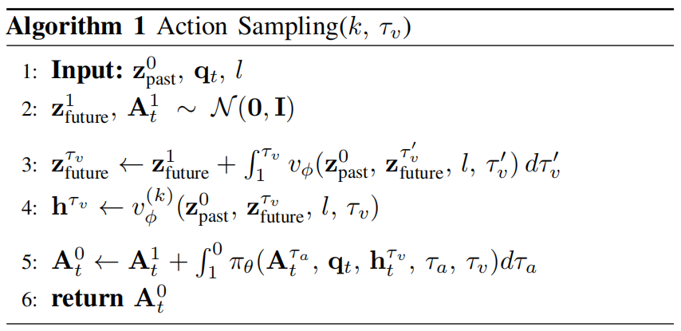

在给定图像观测值 $\mathbf{o}_t$ ，将 video flow field 视频流场从高斯噪声 $\mathcal{N}(\mathbf{0},\mathbf{I})$ 中**积分到**中间流时间 $\tau_v$ $\Longrightarrow$ 产生一个部分去噪的潜在状态 $\mathbf{z}_{\mathrm{future}}^{\tau_v}$ $\Longrightarrow$ **观点 —— 该状态保留了足够的结构化信息以指导策略**。

使用视频生成模型的前 $k$ 层的隐藏层状态 $\longrightarrow$ 通过激活函数 ("pass the resulting activations") 作为条件信息传递给动作解码器 $\longrightarrow$ 动作解码器执行完整的去噪过程

> 推理过程中的 video backbone 的中间流时间 $\tau_v$ 应该取何值？作者回答：理论上这个是超参数，依赖任务特性。
>
> 中间流时间 $\tau_v$ 通常接近 1 高噪声环境下，效果就越好。在 $\tau_v=1$ 的特殊情况下，仅需对计算密集型视频骨干网络进行一次前向传播即可生成动作块，从而在实验中实现实时推理。研究发现 $\tau_v=1$ 是一个良好的默认值，可平衡策略性能与推理速度。

*F. Training*

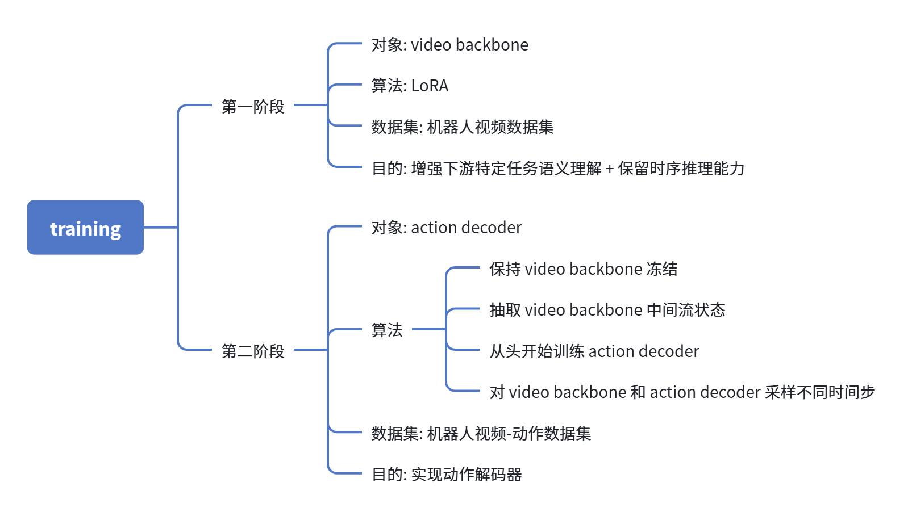

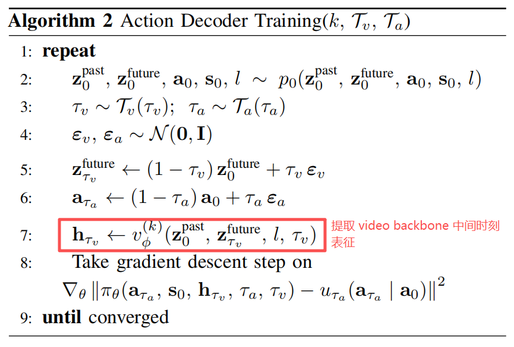

- 视频模型层数：中间层 $k=19$ 能产生最佳策略性能，且随着向**初始层**或**末端层**递进，成功率呈现**显著递减趋势**。
- 视频观测时间范围 $H_o$ ：采用 5 帧的较长观测时间范围比仅基于当前观测值的条件设定更具优势。

**V. EXPERIMENTS**

【实验设置】

**SIMPLER** // **LIBERO**

**Real-World Dexterous Bimanual Manipulation**.

====> 配置：一套配备两具 16 自由度 "模拟手" 的双机械臂装置，安装于 Panda 机械臂上

====> 任务：Package Sorting (pick, handover, place) / Tape Stowing (pick, stow, move box)

====> 训练：视频主干网络是在更广泛的 200 小时**大规模视频数据集**上进行微调 $\longrightarrow$ 动作解码器**仅基于极其有限的任务特定数据**进行训练: Package Sorting 仅使用 1 小时 33 分钟，一共 512 episodes 数据，Tape Stowing 仅使用 2 小时 14 分钟，一共 480 episodes 数据。

【baselines】

- $\pi_{0.5}$-style VLA: `PaliGemma-3B` 作为 backbone，并搭配与 mimic-video 相同的动作解码器。

  动作解码器会交叉注意力机制作用于主干网络中经过实证验证的最佳选择层 $\longrightarrow$ 确保差异来源仅在于预训练模态

  确保公平竞争，`PaliGemma-3B` 使用预训练权重，结合从头开始训练的 action decoder $\longrightarrow$ 与 mimic-video 方法类似

- DiT-Block Policy: DiT 架构并结合 mimic-one 工作的动作表征，该模型采用 ViT-S DINO backbone 架构，每个摄像头视角配备独立编码器，输入至 8 块 8 头 Transformer Diffusion Policy 网络。在多视角设置下，模型参数量约为 1.55 亿。

  > 设计这个 baseline 的目的是：在 "没有视频先验知识" 的情况下，纯模仿学习算法 + Diffusion Transformer 的上限在哪里？

- State-of-the-Art Published Baselines: Octo / ThinkAct / FLOWER / OpenVLA / OpenVLA-OFT

【实验表现和结论】

> **Q1: Can mimic-video effectively control multiple embodiments?** 该方法的跨具身能力表现如何？

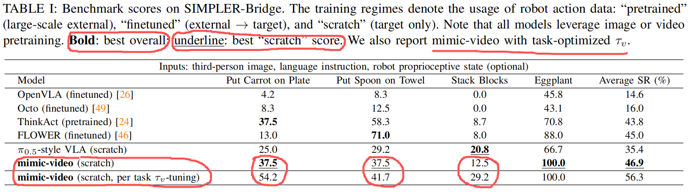

通过采用部分去噪策略，进一步提出了一种创新的 <u>inference-time optimization 运行时策略优化方法</u>：通过调整流参数 $\tau_v$ ，可使固定训练模型<u>针对特定任务进行定制化调整</u>，从而<u>在计算量适度增加的前提下</u>实现性能提升。

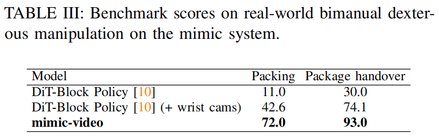

尽管仅基于单一 workspace 摄像头视角进行训练，mimic-video 的表现仍显著优于两种 baseline 方法。

**生成式视频先验的预测能力使 mimic-video 能够有效消除<u>由遮挡引起的视觉不确定性</u>，从而从少量任务特定数据中学习出鲁棒的策略。**

> **Q2: Does conditioning on a generative video backbone yield superior sample efficiency and faster convergence for
> action decoder training, compared to conditioning on a VLM backbone?** 相比于 VLM-based VLA, video-based VLA 的样本效率和训练速度表现如何？

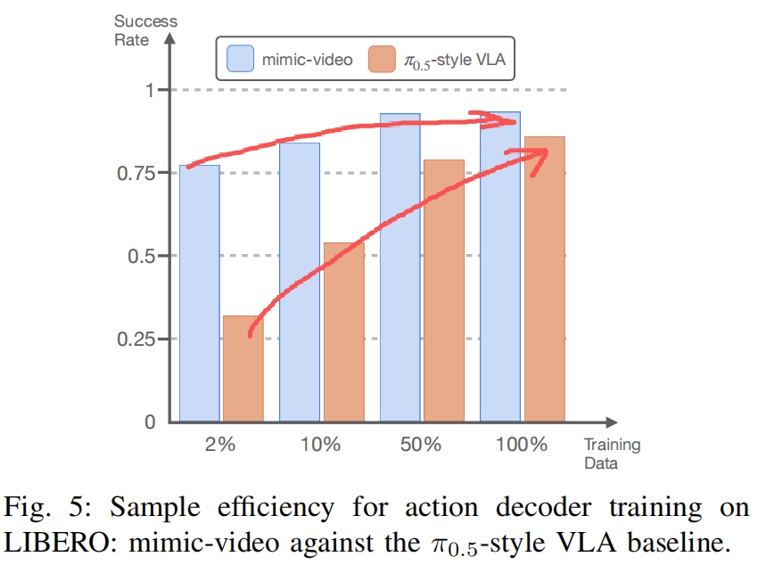

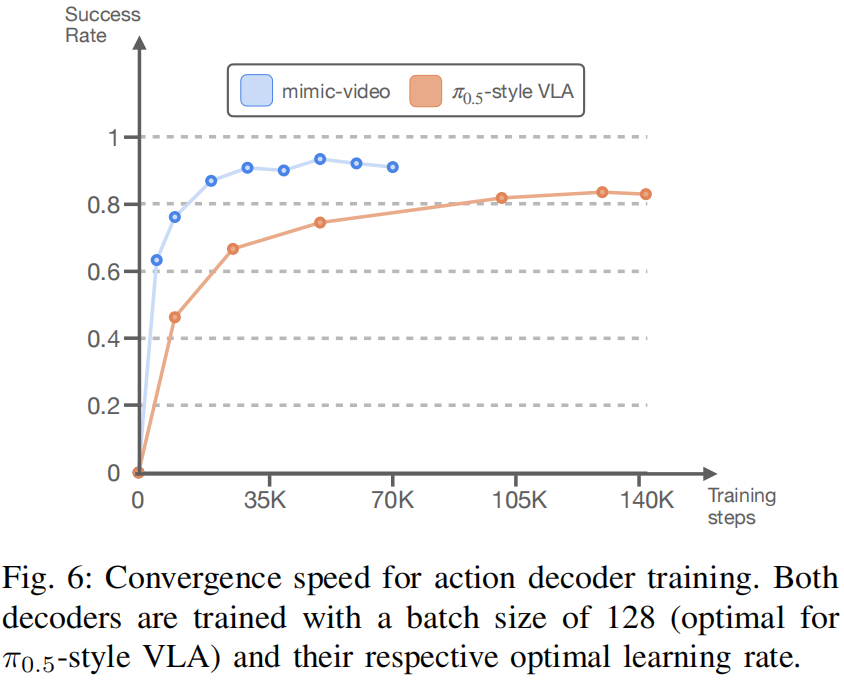

将数据集规模缩减至每个任务仅包含单个事件，即动作数据量减少 $98\%$ ，仍可获得 $77\%$ 的平均成功率，这表明基于 $2\%$ 动作数据训练的模仿视频模型在性能上与 Diffusion Policy 基线模型具有可比性。

> **Q3: Is fine-grained video reconstruction necessary for effective policy learning?**

将 video backbone 的采样时间参数 $\tau_v$ 进行 sweep 扫描，并使用 SIMPLER-ENV 进行成功率评估。

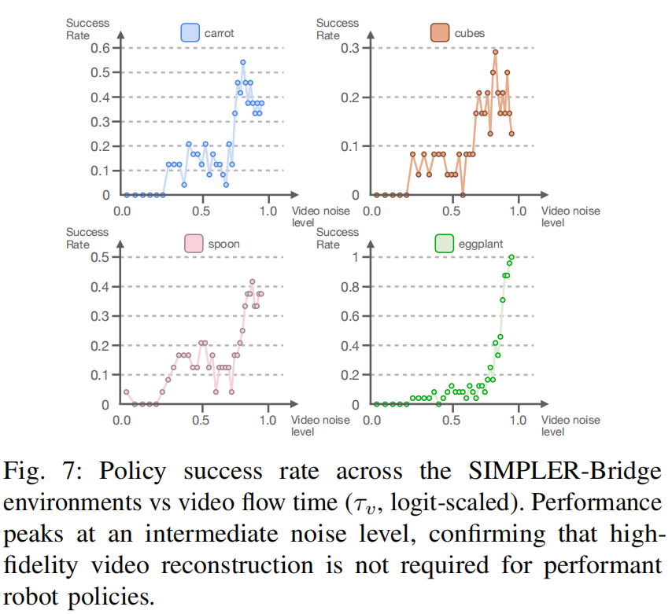

随着 $τ_v$ 从 1 $\longrightarrow$ 0，video latent 从随机噪声逐渐变成真实未来视频，因此它包含的关于未来动作的信息（mutual information）单调增加。虽然信息论上信息在增加，但由于生成误差和分布偏移，**更高信息量的表示反而不一定更适合控制**。因为训练时 action decoder 看到的是 noisy latent, 在 $τ_v$ 从 1 $\longrightarrow$ 0 时，latent 分布逐渐偏移了 action decoder 的输入分布，因此效果下降。

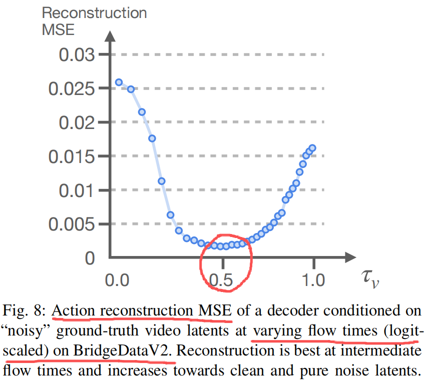

进行额外的 $τ_v$ 扫描实验，其中将动作解码器的条件设置**为 "含噪" 的真实视频潜在变量** $\mathbf{z}_{\mathrm{future}}^{\tau_v}$。

观察发现，最低动作重建误差出现在中间流动时间 $τ_v \approx 0.4$ 时，进一步验证了训练数据分布实际上时 clean latent 在 0.5 $τ_v$ 的加噪程度下表现最好；与训练分布最接近。

> **作者在附录部分解释了 "与允许视频模型完全去噪其预测结果相比，提前终止视频生成过程并将动作解码器置于 '含噪' 视觉计划条件下，可显著提升性能表现" 的原因。**

1. *Distribution Mismatch and Noise as Augmentation*:

   在推理阶段，视频模型生成的未来往往是<u>不完美的，甚至存在错误或偏差</u> $\Longrightarrow$ 与训练时看到的 "真实未来" 之间存在分布差异

   在视觉计划中保留一定噪声，使输入不再是 "完全去噪的未来视频" ，而是一种 "带不确定性的中间表示" $\Longrightarrow$ 在训练和测试阶段都引入数据增强 $\Longrightarrow$ 在不完美甚至有偏差的视觉条件下仍然做出正确动作，从而提升鲁棒性

2. *Information Content of Intermediate Representations*:

   在视频模型的去噪过程中，不同时间步得到的 "隐藏特征" 价值是不一样的。刚开始去噪时，输入还是比较混乱的噪声，模型必须真正去理解场景中发生了什么动作、物体如何运动、以及最终会变成什么样子，因此中间阶段的隐藏特征其实包含了非常丰富的 "动态信息" 和 "未来变化信息" 。

**VI. DISCUSSION AND FUTURE WORK**

- 依赖单一视图视频 backbone 网络，这使得策略仅限于固定单一 workspace 视图
- 尚未应用 VAM 方法来训练**统一的大规模跨具身模型**
- 当前的现实世界实验仅限于特定任务集；扩展至更广泛的操纵行为多样性
